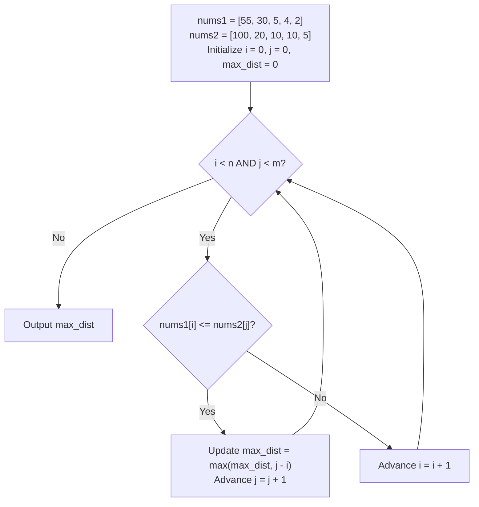

# Guided Example: Maximum Distance Between a Pair of Values

We trace the step-by-step two-pointer forward scan finding the maximum coordinate displacement between qualifying value pairs across two non-increasing arrays:

- **Input:**
  - `nums1 = [55, 30, 5, 4, 2]`
  - `nums2 = [100, 20, 10, 10, 5]`
- **Required Output:** `2`

This instance demonstrates coordinating two pointers over non-increasing arrays, evaluating validity conditions ($i \le j$ and $nums1[i] \le nums2[j]$), greedily expanding index $j$, and advancing index $i$ when values drop below threshold.

---

## 1. Instance & Teaching Goal

We are given two integer arrays `nums1` and `nums2`, both sorted in non-increasing order.
A pair of indices $(i, j)$ is valid if and only if:
1. $i \le j$
2. $\text{nums1}[i] \le \text{nums2}[j]$

The distance of a valid pair is $j - i$. We seek the maximum distance over all valid pairs, returning $0$ if no valid pair exists.
A brute-force search compares all $n \times m$ pairs in $\mathcal{O}(n \cdot m)$ time.

In our instance:
- `nums1 = [55, 30, 5, 4, 2]` of length $n = 5$.
- `nums2 = [100, 20, 10, 10, 5]` of length $m = 5$.
- Pair evaluations:
  - $(i=0, j=0)$: $55 \le 100 \implies$ distance $0 - 0 = 0$.
  - For $i=1$ ($30$): $\text{nums2}[1]=20 < 30$, $\text{nums2}[2]=10 < 30 \implies$ no valid $j \ge 1$.
  - For $i=2$ ($5$):
    - $j=2$: $5 \le 10 \implies$ distance $0$.
    - $j=3$: $5 \le 10 \implies$ distance $1$.
    - $j=4$: $5 \le 5 \implies$ distance $4 - 2 = 2$.
  - For $i=3$ ($4$): $j=4 \implies 4 \le 5 \implies$ distance $4 - 3 = 1$.
  - For $i=4$ ($2$): $j=4 \implies 2 \le 5 \implies$ distance $4 - 4 = 0$.
- Global maximum distance is $2$ (achieved at $i = 2, j = 4$).

The teaching goal is to exploit the **non-increasing sorting invariant**: because both arrays are sorted in non-increasing order, pointers $i$ and $j$ can move strictly forward in a single pass in $\mathcal{O}(n + m)$ time.

---

## 2. Conceptual Foundation & Invariants

### Two-Pointer Monotonic Search Invariant Theorem

> **Non-Increasing Monotonicity & Forward Two-Pointer Traversal Theorem.**
> 1. *Non-Increasing Order Property:*
>    $$\text{nums1}[0] \ge \text{nums1}[1] \ge \dots \ge \text{nums1}[n-1]$$
>    $$\text{nums2}[0] \ge \text{nums2}[1] \ge \dots \ge \text{nums2}[m-1]$$
> 2. *Pruning Invariant:* If $\text{nums1}[i] > \text{nums2}[j]$, then for all $j' \ge j$, $\text{nums2}[j'] \le \text{nums2}[j] < \text{nums1}[i]$. Therefore, no index $j' \ge j$ can ever form a valid pair with index $i$. Pointer $i$ must be incremented ($i \gets i + 1$).
> 3. *Greedy Expansion Invariant:* If $\text{nums1}[i] \le \text{nums2}[j]$, the pair is valid whenever $j \ge i$. To potentially achieve an even larger distance, pointer $j$ is greedily incremented ($j \gets j + 1$).
> 4. *Linear Amortization:* Pointers $i$ and $j$ only advance forward ($i$ up to $n$, $j$ up to $m$). At most $n + m$ pointer increments occur, guaranteeing $\mathcal{O}(n + m)$ execution time and $\mathcal{O}(1)$ auxiliary space.

---

## 3. Step-by-Step Worked Execution

We trace the two pointers $i$ and $j$ on `nums1 = [55, 30, 5, 4, 2]` and `nums2 = [100, 20, 10, 10, 5]`.
Initialize $i = 0, j = 0, \text{max\_dist} = 0$.

---

### Step 1: $i = 0, j = 0$
- Values: $\text{nums1}[0] = 55$, $\text{nums2}[0] = 100$.
- Test: $55 \le 100$ is **True**.
- Current distance: $j - i = 0 - 0 = 0$.
- Update: $\text{max\_dist} = \max(0, 0) = 0$.
- Advance $j \to 1$.

---

### Step 2: $i = 0, j = 1$
- Values: $\text{nums1}[0] = 55$, $\text{nums2}[1] = 20$.
- Test: $55 \le 20$ is **False**.
- Since $\text{nums2}$ is non-increasing, subsequent elements in `nums2` are $\le 20 < 55$.
- Advance $i \to 1$.

---

### Step 3: $i = 1, j = 1$
- Values: $\text{nums1}[1] = 30$, $\text{nums2}[1] = 20$.
- Test: $30 \le 20$ is **False**.
- No larger $j$ can satisfy $30 \le \text{nums2}[j]$.
- Advance $i \to 2$.

---

### Step 4: $i = 2, j = 1$
- Notice $i = 2 > j = 1$. While $i > j$, we cannot form a valid pair ($i \le j$ violated).
- Let us synchronize: since $\text{nums1}[2] = 5 \le \text{nums2}[1] = 20$, the value condition holds, but $j < i$. Advance $j \to 2$.

---

### Step 5: $i = 2, j = 2$
- Values: $\text{nums1}[2] = 5$, $\text{nums2}[2] = 10$.
- Test: $5 \le 10$ is **True**, and $i \le j$.
- Distance: $j - i = 2 - 2 = 0$.
- Update: $\text{max\_dist} = \max(0, 0) = 0$.
- Advance $j \to 3$.

---

### Step 6: $i = 2, j = 3$
- Values: $\text{nums1}[2] = 5$, $\text{nums2}[3] = 10$.
- Test: $5 \le 10$ is **True**, and $i \le j$.
- Distance: $j - i = 3 - 2 = 1$.
- Update: $\text{max\_dist} = \max(0, 1) = 1$.
- Advance $j \to 4$.

---

### Step 7: $i = 2, j = 4$
- Values: $\text{nums1}[2] = 5$, $\text{nums2}[4] = 5$.
- Test: $5 \le 5$ is **True**, and $i \le j$.
- Distance: $j - i = 4 - 2 = 2$.
- Update: $\text{max\_dist} = \max(1, 2) = 2$.
- Advance $j \to 5$.

---

### Step 8: Termination
- Pointer $j = 5 = m$ reaches the end of `nums2`.
- Loop terminates.
- Global maximum distance achieved: **`2`**.

---

## 4. Complete Execution Trace

| Step | Pointer $i$ | $\text{nums1}[i]$ | Pointer $j$ | $\text{nums2}[j]$ | $\text{nums1}[i] \le \text{nums2}[j]$ | $j \ge i$? | Pair Distance | Running $\text{max\_dist}$ | Action Taken |
|:---:|:---:|:---:|:---:|:---:|:---:|:---:|:---:|:---:|:---|
| 1 | 0 | 55 | 0 | 100 | True | Yes | 0 | 0 | $j \gets 1$ |
| 2 | 0 | 55 | 1 | 20 | False | - | - | 0 | $i \gets 1$ |
| 3 | 1 | 30 | 1 | 20 | False | - | - | 0 | $i \gets 2$ |
| 4 | 2 | 5 | 1 | 20 | True | No ($1 < 2$) | - | 0 | $j \gets 2$ |
| 5 | 2 | 5 | 2 | 10 | True | Yes | 0 | 0 | $j \gets 3$ |
| 6 | 2 | 5 | 3 | 10 | True | Yes | 1 | 1 | $j \gets 4$ |
| 7 | 2 | 5 | 4 | 5 | True | Yes | 2 | **2** | $j \gets 5$ |
| 8 | 2 | 5 | 5 | End | - | - | - | **2** | Terminate |

---

## 5. Algorithmic Correctness

**Soundness.** Any pair contributing to $\text{max\_dist}$ satisfies both $i \le j$ and $\text{nums1}[i] \le \text{nums2}[j]$, directly matching the problem definition of a valid pair.

**Completeness.** When $\text{nums1}[i] > \text{nums2}[j]$, because $\text{nums2}$ is non-increasing, no index $k \ge j$ can satisfy $\text{nums1}[i] \le \text{nums2}[k]$. Thus, discarding index $i$ cannot miss any valid pair with greater distance. Advancing $j$ whenever a pair is valid explores larger distances for the current $i$, guaranteeing the global maximum is captured.

---

## 6. Traps This Instance Exposes

- **Enforcing $i \le j$:** If $j$ falls behind $i$ (e.g. after multiple $i$ increments), calculating $j - i$ without ensuring $j \ge i$ would produce negative distance values.
- **Direction of Sorting:** Both arrays are sorted *non-increasingly* (descending), which reverses standard ascending two-pointer logic.
- **Binary Search Alternative:** While binary search on `nums2` for each $i$ achieves $\mathcal{O}(n \log m)$, the two-pointer approach is strictly superior with $\mathcal{O}(n + m)$ runtime and zero logarithmic overhead.

---

## 7. Complexity Derivation

- **Time Complexity:** $\mathcal{O}(n + m)$, where $n = |\text{nums1}|$ and $m = |\text{nums2}|$. In each iteration, either $i$ or $j$ is strictly incremented. Thus, at most $n + m$ comparisons are made.
- **Auxiliary Space Complexity:** $\mathcal{O}(1)$, requiring only scalar index and maximum distance variables.
