[TOC]

## Solution

---

### Overview

---

### Approach 1: Binary Search

#### Intuition

The problem says that both arrays are sorted in descending order, which suggests that binary search might be a workable method. We can iteration over the first array `nums1`, for each element $\text{nums1}[i]$, we look for the last element $\text{nums2}[j]$ which is larger than or equal to $\text{nums1}[i]$. This actually equals finding the insertion position of $\text{nums1}[i]$ to `nums2`.

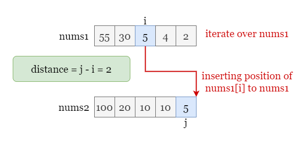

If the insertion position is smaller than `i`, it means all the numbers in `nums2` that are larger than $\text{nums1}[i]$ have indexes smaller than `i`. We cannot find any valid pair that satisfies `j > i` and we will move on and try the next `i`.

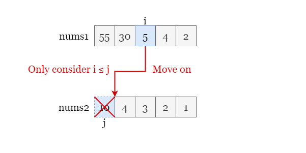

We are used to perform binary searches on ascending arrays, while the target arrays in this problem is in descending order. Therefore, we can either:

- Implement binary search manually.
- Custom comparator to binary search over the descending array.
- Reverse the array to make it ascending and perform the normal binary search.

Each of these methods is workable and has advantages and disadvantages, its uniqueness is trivial to this problem so you use them as a practise. Regardless of the specific method, the overally key part is that we need to be clear about the judgment statement and boundary conditions of the binary search, especially when we search in an array with descending order. For example, suppose we binary search over an array of ascending order, if the middle value is smaller than target value, we shall discard the left half since every element in the left half is also smaller than the target value. For the array of descending order, however, we need to discard the right half.

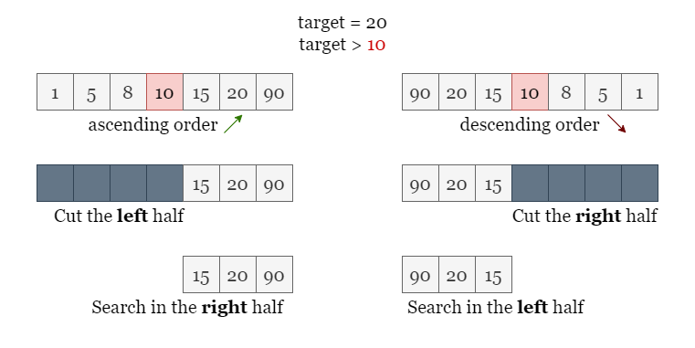

<br>

#### Algorithm

1) Initialize $answer = 0$.
2) Iterate over one array (let's say `nums1`), for each number $\text{nums1}[i]$, we use binary search to find the insertion position `j` of $\text{nums1}[i]$ to `nums2`.
- If `j < i`, we move on to the next `i` by repeating the step 2.
- Otherwise, we find one valid pair, update `answer` as $answer = max(answer, j - i)$.

#### Implementation

```python
class Solution:
    def maxDistance(self, nums1: List[int], nums2: List[int]) -> int:
        m, n = len(nums1), len(nums2)
        ans = 0

        # Iterate over nums1 and find insertion position to nums2.
        nums2.reverse()
        for i in range(m):
            k = bisect.bisect_left(nums2, nums1[i])
            ans = max(ans, n - k - 1 - i)
        return ans
```

#### Complexity Analysis

Let $m, n$ be the size of the input arrays `nums1` and `nums2`.

* Time complexity: $O(m \cdot\log n)$
- We iterate over `nums1` and perform the binary search for each of its elements, each binary search over `nums2` takes $O(\log n)$ time. Thus the overall time complexity is $O(m \cdot\log n)$.

- If the question gives clear sizes, for example, the size `nums1` is much larger than that of `nums2`, then we should traverse over `nums2` and binary search over `nums1` instead.

* Space complexity: $O(1)$
    During the iteration, we only need to maintain the positions of two pointers. Note that in the Python solution, the array is reversed in place so it also takes $O(1)$ space.

<br/>

---

### Approach 2: Two Pointers

#### Intuition

In the first approach, we iterate over array `nums1` and find the insertion position of each element to the other array `nums2`. While both arrays are in the descending order, we only took advantage of this feature of `nums1`. Let's see if the feature of `nums1` can further improve the efficiency.

Focus on two adjacent elements $\text{nums1}[i]$ and `nums1[i']`, and assume that we have found the insertion position of them as `j` and `j'`. Since `i < i'` and `nums1` is in the descending order, therefore $\text{nums1}[i] \ge nums1[i']$, it leads to $\text{nums2}[j] \ge nums2[j']$.

What does this information imply?

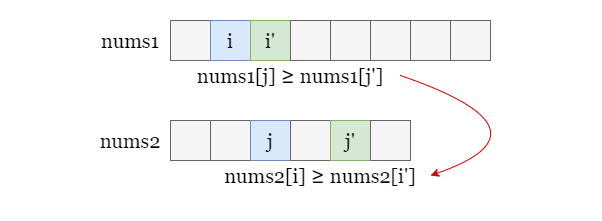

It implies that as we traverse over `nums1`, the insertion position `j` found each time is in ascending order! Therefore, we don't need to use binary search to find every insertion position. Instead, we can use another pointer referring to the insertion position to `nums2`, during the iteration over `nums1`, the pointer to `nums2` will only move to the right. Thus we no longer need repeatedly binary search over `nums2`!

Please refer to the following slides as an example!

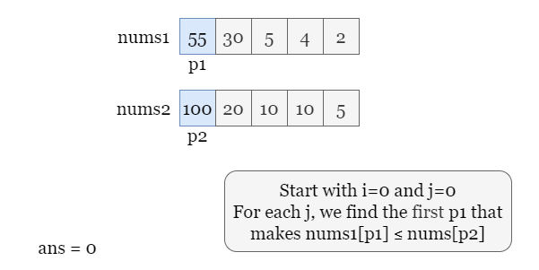

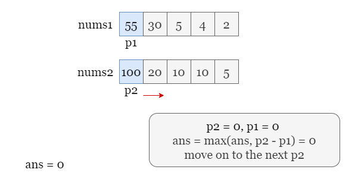

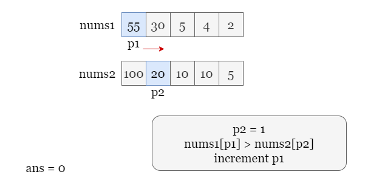

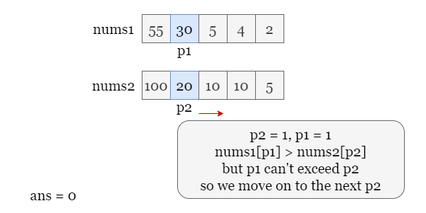

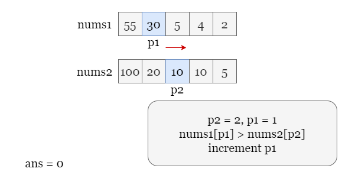

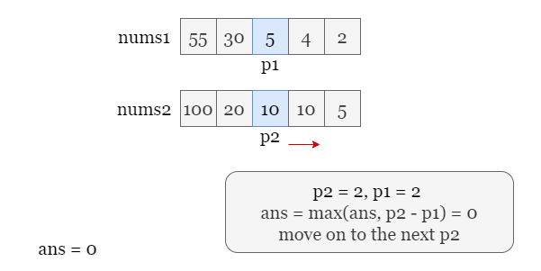

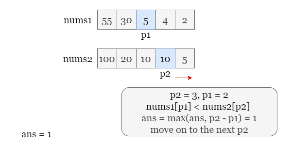

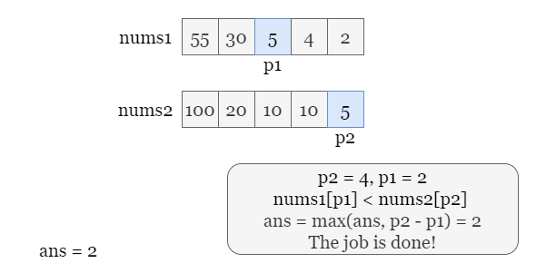

<br>

#### Algorithm

1) Set two pointers $p1 = 0$ and $p2 = 0$ refer to the first elements of two arrays `nums1` and `nums2`. Initialize $answer = 0$.
2) While both `p1` and `p2` are in the range:
- If $\text{nums1}[p1] > \text{nums2}[p2]$, increment `p1` by 1.
- Otherwise, if $p2 - p1 > ans$, update $ans = p2 - p1$ and increment `p2` by 1.

#### Implementation

```python
class Solution:
    def maxDistance(self, nums1: List[int], nums2: List[int]) -> int:
        ans = 0
        p1, p2 = 0, 0

        while p1 < len(nums1) and p2 < len(nums2):
            # If p1 is larger, we should move on to a smaller p1.
            if nums1[p1] > nums2[p2]:
                p1 += 1

            # Otherwise, get their distance and move on to a smaller p2.
            else:
                ans = max(ans, p2 - p1)
                p2 += 1

        return ans
```

#### Complexity Analysis

Let $m, n$ be the size of the input arrays `nums1` and `nums2`.

* Time complexity: $O(m + n)$
- We use two pointers referring to two arrays. Both pointers only move to the right only during the iteration, thus there will be at most $(m + n)$ steps! In each step, we might update `answer` which takes constant time.
- Therefore, the total time complexity is $O(m + n)$.

* Space complexity: $O(1)$
    We only need to maintain two pointers `i` and `j`, and update the answer by the maximum distance we have met so far. These only take constant space.

<br/>