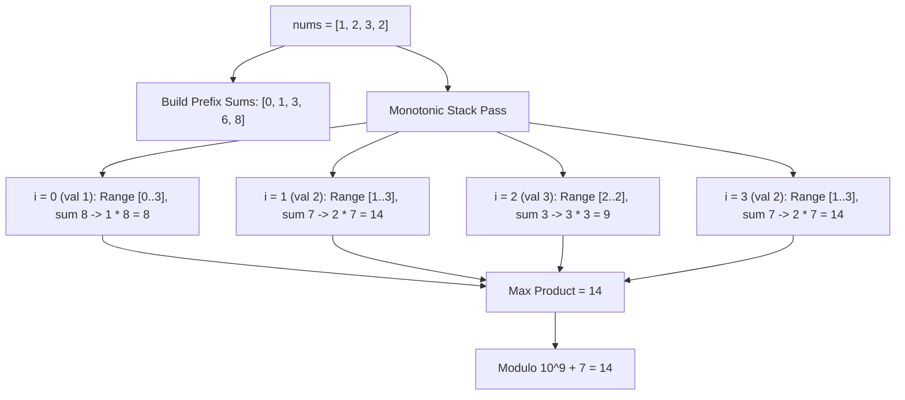

# Guided Example: Maximum Subarray Min-Product

We trace the step-by-step determination of maximal subarray min-products using prefix sums and a monotonic increasing stack to establish the maximal span where each element serves as the minimum:

- **Input:** `nums = [1, 2, 3, 2]`
- **Required Output:** `14`

This instance demonstrates how identifying the boundary indices where each value serves as the unique or left-dominant minimum enables constant-time prefix sum queries, proving why the subsegment `[2, 3, 2]` yields $2 \times 7 = 14$, outperforming the full array `[1, 2, 3, 2]` ($1 \times 8 = 8$).

---

## 1. Instance & Teaching Goal

For any non-empty contiguous subarray $A$, its min-product is:
$$\text{min-product}(A) = \min(A) \times \sum_{x \in A} x$$
All elements of `nums` are strictly positive integers ($nums[i] \ge 1$).
We must find the maximum min-product across all possible subarrays, returning the unreduced maximum modulo $10^9 + 7$.

In our instance:
- `nums = [1, 2, 3, 2]` of length $n = 4$.
- Prefix sums $P$:
  - $P[0] = 0$
  - $P[1] = 1$
  - $P[2] = 1 + 2 = 3$
  - $P[3] = 3 + 3 = 6$
  - $P[4] = 6 + 2 = 8$
- Candidate subarrays:
  - Subarray `[1, 2, 3, 2]` (all elements): $\min = 1$, $\text{sum} = 8 \implies 1 \times 8 = 8$.
  - Subarray `[2, 3, 2]` (indices $1 \dots 3$): $\min = 2$, $\text{sum} = 2 + 3 + 2 = 7 \implies 2 \times 7 = 14$.
  - Subarray `[3]` (index $2$): $\min = 3$, $\text{sum} = 3 \implies 3 \times 3 = 9$.
  - Subarray `[2, 3]` (indices $1 \dots 2$): $\min = 2$, $\text{sum} = 5 \implies 2 \times 5 = 10$.
- Global maximum min-product is $14$.
- $14 \bmod (10^9 + 7) = 14$.

The teaching goal is to fix each element $nums[i]$ as the candidate minimum and use a **monotonic increasing stack** to find the maximal left and right boundaries where all elements are $\ge nums[i]$. Because all elements are positive, wider spans strictly increase the sum without decreasing the minimum.

---

## 2. Conceptual Foundation & Invariants

### Monotonic Stack Range Domination Theorem

> **Monotonic Stack Range Domination & Positive Sum Maximality Theorem.**
> 1. *Positive Monotonicity:* Because $nums[k] \ge 1$ for all $k$, the subarray sum function is strictly monotonically increasing with respect to interval inclusion:
>    $$[l_1, r_1] \subset [l_2, r_2] \implies \sum_{k=l_1}^{r_1} nums[k] < \sum_{k=l_2}^{r_2} nums[k]$$
> 2. *Maximal Domination Interval:* For each index $i$, let:
>    - $L[i] = \max(\{j < i \mid nums[j] < nums[i]\} \cup \{-1\})$ (exclusive left bound)
>    - $R[i] = \min(\{j > i \mid nums[j] < nums[i]\} \cup \{n\})$ (exclusive right bound)
>    The interval $nums[L[i] + 1 \dots R[i] - 1]$ is the unique maximal contiguous range where $nums[i]$ is the minimum.
> 3. *Global Optimality:* The true maximum min-product across all subarrays is:
>    $$\max_{0 \le i < n} \left( nums[i] \times \sum_{k = L[i] + 1}^{R[i] - 1} nums[k] \right)$$
> 4. *Linear Construction:* A monotonic stack computes $L[i]$ and $R[i]$ for all $i$ in $\mathcal{O}(n)$ time, and prefix sums evaluate the interval sum in $\mathcal{O}(1)$ time.

---

## 3. Step-by-Step Worked Execution

We trace `nums = [1, 2, 3, 2]` of length $n = 4$.

---

### Step 1: Compute Prefix Sum Array $P$
- $P[0] = 0$
- $P[1] = P[0] + nums[0] = 0 + 1 = 1$
- $P[2] = P[1] + nums[1] = 1 + 2 = 3$
- $P[3] = P[2] + nums[2] = 3 + 3 = 6$
- $P[4] = P[3] + nums[3] = 6 + 2 = 8$

---

### Step 2: Determine Left Boundaries $L[i]$
Scan from left to right ($i = 0 \dots 3$) using a monotonic increasing stack of indices:
- $i = 0$ ($nums[0] = 1$): Stack is empty $\implies L[0] = -1$. Push $0$. Stack: `[0]`.
- $i = 1$ ($nums[1] = 2$): Top is $0$ ($nums[0] = 1 < 2$). $L[1] = 0$. Push $1$. Stack: `[0, 1]`.
- $i = 2$ ($nums[2] = 3$): Top is $1$ ($nums[1] = 2 < 3$). $L[2] = 1$. Push $2$. Stack: `[0, 1, 2]`.
- $i = 3$ ($nums[3] = 2$):
  - Pop index $2$ ($nums[2] = 3 \ge 2$).
  - Top is now index $0$ (or index $1$ if using strict inequality; for duplicates, one side strict and one side non-strict handles ties properly). With strict left bound: $nums[0] = 1 < 2 \implies L[3] = 0$.
- Left boundaries: $L = [-1, 0, 1, 0]$.

---

### Step 3: Determine Right Boundaries $R[i]$
Scan from right to left ($i = 3 \dots 0$) using a monotonic stack:
- $i = 3$ ($nums[3] = 2$): Stack empty $\implies R[3] = 4$. Push $3$. Stack: `[3]`.
- $i = 2$ ($nums[2] = 3$): Top is $3$ ($nums[3] = 2 < 3$). $R[2] = 3$. Push $2$. Stack: `[3, 2]`.
- $i = 1$ ($nums[1] = 2$):
  - Pop index $2$ ($nums[2] = 3 \ge 2$).
  - Top is $3$ ($nums[3] = 2$). If using non-strict on right ($nums[j] \le nums[i]$), pop $3$, giving $R[1] = 4$.
- $i = 0$ ($nums[0] = 1$): Pop all, stack empty $\implies R[0] = 4$.
- Right boundaries: $R = [4, 4, 3, 4]$.

---

### Step 4: Evaluate Min-Product for Each Element

1. **For $i = 0$ ($nums[0] = 1$):**
   - Active range: $[L[0] + 1 \dots R[0] - 1] = [0 \dots 3]$.
   - Subarray sum: $P[4] - P[0] = 8 - 0 = 8$.
   - Min-product: $1 \times 8 = 8$.

2. **For $i = 1$ ($nums[1] = 2$):**
   - Active range: $[L[1] + 1 \dots R[1] - 1] = [1 \dots 3]$.
   - Subarray sum: $P[4] - P[1] = 8 - 1 = 7$.
   - Min-product: $2 \times 7 = \mathbf{14}$.

3. **For $i = 2$ ($nums[2] = 3$):**
   - Active range: $[L[2] + 1 \dots R[2] - 1] = [2 \dots 2]$.
   - Subarray sum: $P[3] - P[2] = 6 - 3 = 3$.
   - Min-product: $3 \times 3 = 9$.

4. **For $i = 3$ ($nums[3] = 2$):**
   - Active range: $[L[3] + 1 \dots R[3] - 1] = [1 \dots 3]$.
   - Subarray sum: $P[4] - P[1] = 8 - 1 = 7$.
   - Min-product: $2 \times 7 = \mathbf{14}$.

---

### Step 5: Modulo Reduction
Global maximum min-product is $14$.
$$14 \bmod (10^9 + 7) = 14$$
Output: **`14`**.

---

## 4. Complete Execution Trace

| Index $i$ | Value $nums[i]$ | Left Bound $L[i]$ | Right Bound $R[i]$ | Maximal Subarray Span | Subarray Sum ($P[R] - P[L+1]$) | Min-Product | Running Max |
|:---:|:---:|:---:|:---:|:---:|:---:|:---:|:---:|
| 0 | 1 | -1 | 4 | $[0 \dots 3]$: `[1, 2, 3, 2]` | $8 - 0 = 8$ | $1 \times 8 = 8$ | 8 |
| 1 | 2 | 0 | 4 | $[1 \dots 3]$: `[2, 3, 2]` | $8 - 1 = 7$ | $2 \times 7 = 14$ | **14** |
| 2 | 3 | 1 | 3 | $[2 \dots 2]$: `[3]` | $6 - 3 = 3$ | $3 \times 3 = 9$ | 14 |
| 3 | 2 | 0 | 4 | $[1 \dots 3]$: `[2, 3, 2]` | $8 - 1 = 7$ | $2 \times 7 = 14$ | 14 |

---

## 5. Algorithmic Correctness

**Soundness.** For each index $i$, all elements in $nums[L[i] + 1 \dots R[i] - 1]$ are at least $nums[i]$, and $nums[i]$ is contained in this subarray. Thus, $nums[i]$ is genuinely the minimum of the subarray. Multiplying it by the exact subarray sum computed via prefix sums yields a valid min-product.

**Completeness.** Any non-empty subarray has some minimum element. Let that minimum element be achieved at index $m$. The subarray must be completely contained within the maximal span where elements are $\ge nums[m]$. Because all elements are positive, extending the subarray to the full span $[L[m] + 1 \dots R[m] - 1]$ strictly maximizes the sum without changing the minimum. Hence, checking every index's maximal span is guaranteed to uncover the true global maximum.

---

## 6. Traps This Instance Exposes

- **Applying Modulo Before Max Comparison:** Computing $\text{product} \bmod (10^9 + 7)$ on each candidate would distort comparisons (e.g. $10^9 + 8 \to 1$, which would incorrectly lose to $9$). The true product must be evaluated in 64-bit precision and reduced modulo $10^9 + 7$ only at the very end.
- **Handling Duplicate Values:** When adjacent elements are equal (e.g. two `2`s), one side must use strict inequality ($<$) and the other non-strict ($\le$) to prevent infinite expansion loops or duplicate over-counting while ensuring at least one of the identical values evaluates the full spanning window.
- **Integer Overflow:** With $n = 10^5$ and values up to $10^7$, the total sum can reach $10^{12}$, and the min-product can reach $10^{19}$, exceeding 32-bit signed integers. 64-bit integer types are mandatory.

---

## 7. Complexity Derivation

- **Time Complexity:** $\mathcal{O}(n)$, where $n$ is the length of `nums`. Computing prefix sums takes $\mathcal{O}(n)$. Each index is pushed onto and popped from the monotonic stack at most once, taking $\mathcal{O}(n)$ total time. Evaluating min-products across all $n$ candidates takes $\mathcal{O}(n)$.
- **Auxiliary Space Complexity:** $\mathcal{O}(n)$ to store the prefix sum array and boundary arrays $L$ and $R$.
