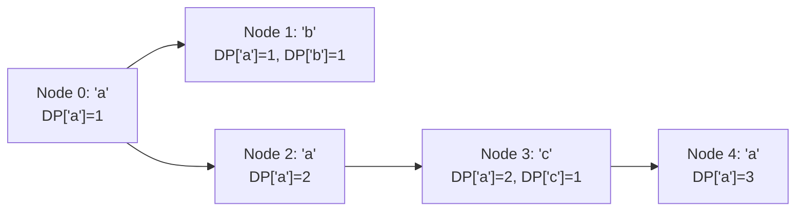

# Guided Example: Largest Color Value in a Directed Graph

We trace the step-by-step evaluation of maximal color frequencies on directed paths using Kahn's topological sort algorithm combined with 26-color dynamic programming:

- **Input:**
  - `colors = "abaca"`
  - `edges = [[0, 1], [0, 2], [2, 3], [3, 4]]`
- **Required Output:** `3`

This instance demonstrates path propagation on a directed acyclic graph (DAG), tracking color frequency state across multiple branches, updating downstream DP states along topological order, and detecting that path $0 \to 2 \to 3 \to 4$ accumulates three nodes of color `'a'`.

---

## 1. Instance & Teaching Goal

We are given a directed graph with $n$ nodes ($0$ to $n - 1$) and $m$ edges.
Each node $u$ is assigned a character color $colors[u] \in [\text{'a'}, \text{'z'}]$.
A valid path follows directed edges. Its color value is the maximum occurrence count of any single color along the path.
We must:
1. Detect whether the graph contains any directed cycle (if so, return $-1$).
2. In the absence of cycles, return the maximum color value across all valid paths in the graph.

In our instance:
- `colors = "abaca"` with $n = 5$ nodes:
  - Node $0$: `'a'`
  - Node $1$: `'b'`
  - Node $2$: `'a'`
  - Node $3$: `'c'`
  - Node $4$: `'a'`
- Edges: $0 \to 1$, $0 \to 2$, $2 \to 3$, $3 \to 4$.
- Paths from node $0$:
  - Path $0 \to 1$: colors `['a', 'b']` $\implies \text{max frequency } 1$.
  - Path $0 \to 2 \to 3 \to 4$: colors `['a', 'a', 'c', 'a']` $\implies$ color `'a'` occurs $3$ times.
- No cycles exist; all $5$ nodes are topologically processable.
- Maximal color value is $3$.

The teaching goal is to integrate **topological sorting (Kahn's algorithm) with a DP table $DP[u][c]$**: computing the maximum count of color $c$ on any path ending at node $u$ by pushing values forward to successors along topological order, simultaneously detecting cycles if the count of visited nodes is strictly less than $n$.

---

## 2. Conceptual Foundation & Invariants

### Topological Color Frequency DP Theorem

> **Kahn's Topological Sort & Color Frequency DP Theorem.**
> 1. *Topological Order Guarantee:* In a directed acyclic graph (DAG), there exists a linear ordering of vertices such that for every directed edge $(u, v)$, node $u$ appears before node $v$. Processing nodes in this order ensures all incoming paths to $v$ have been fully evaluated before $v$ updates its successors.
> 2. *Cycle Detection (Kahn's Invariant):* Let $V_{\text{processed}}$ be the number of nodes dequeued with in-degree zero. If $V_{\text{processed}} < n$, at least one directed cycle exists, and the algorithm must return $-1$.
> 3. *Optimal Substructure Recurrence:* Let $DP[u][c]$ be the maximum count of color $c \in [0, 25]$ on any path ending at node $u$. For each node $u$ with color $c_u$:
>    $$DP[u][c_u] \gets DP[u][c_u] + 1$$
>    For every directed edge $(u, v)$:
>    $$DP[v][c] \gets \max(DP[v][c], DP[u][c]) \quad \text{for all } c \in [0, 25]$$
> 4. *Complexity:* With $n$ nodes, $m$ edges, and $|\Sigma| = 26$ alphabet size, processing in-degrees and propagating 26 integers across each edge takes $\mathcal{O}((n + m) \cdot 26) = \mathcal{O}(n + m)$ time.

---

## 3. Step-by-Step Worked Execution

We trace the algorithm on `colors = "abaca"` with edges $0 \to 1$, $0 \to 2$, $2 \to 3$, $3 \to 4$.

---

### Step 1: Compute In-Degrees & Initialize DP Table
- Adjacency list:
  - $0 \to [1, 2]$
  - $1 \to []$
  - $2 \to [3]$
  - $3 \to [4]$
  - $4 \to []$
- In-degrees:
  - Node $0$: $0$
  - Node $1$: $1$ (from $0$)
  - Node $2$: $1$ (from $0$)
  - Node $3$: $1$ (from $2$)
  - Node $4$: $1$ (from $3$)
- Initialize $DP[5][26]$ table with all zeros.
- Queue of zero in-degree nodes: $\text{Queue} = [0]$.
- Processed count: $V_{\text{count}} = 0$.
- Running maximum color value: $\text{ans} = 0$.

---

### Step 2: Process Node $0$ (Color `'a'`)
- Dequeue node $0$. Increment $V_{\text{count}} \gets 1$.
- Account for node $0$'s own color:
  $$DP[0][\text{'a'}] \gets DP[0][\text{'a'}] + 1 = 0 + 1 = 1$$
- Update global max: $\text{ans} = \max(0, 1) = 1$.
- Propagate to successors:
  - **Successor $1$:**
    - For all colors: $DP[1][c] \gets \max(DP[1][c], DP[0][c])$. Thus $DP[1][\text{'a'}] \gets 1$.
    - Decrement in-degree of $1$: $1 - 1 = 0 \implies$ Enqueue node $1$.
  - **Successor $2$:**
    - $DP[2][c] \gets \max(DP[2][c], DP[0][c])$. Thus $DP[2][\text{'a'}] \gets 1$.
    - Decrement in-degree of $2$: $1 - 1 = 0 \implies$ Enqueue node $2$.
- Current Queue: `[1, 2]`.

---

### Step 3: Process Node $1$ (Color `'b'`)
- Dequeue node $1$. Increment $V_{\text{count}} \gets 2$.
- Account for node $1$'s own color:
  $$DP[1][\text{'b'}] \gets DP[1][\text{'b'}] + 1 = 0 + 1 = 1$$
- Update global max: $\text{ans} = \max(1, DP[1][\text{'a'}], DP[1][\text{'b'}]) = \max(1, 1, 1) = 1$.
- Successors: none.
- Current Queue: `[2]`.

---

### Step 4: Process Node $2$ (Color `'a'`)
- Dequeue node $2$. Increment $V_{\text{count}} \gets 3$.
- Account for node $2$'s own color:
  $$DP[2][\text{'a'}] \gets DP[2][\text{'a'}] + 1 = 1 + 1 = 2$$
- Update global max: $\text{ans} = \max(1, 2) = 2$.
- Propagate to successor $3$:
  - $DP[3][\text{'a'}] \gets \max(DP[3][\text{'a'}], DP[2][\text{'a'}]) = \max(0, 2) = 2$.
  - Decrement in-degree of $3$: $1 - 1 = 0 \implies$ Enqueue node $3$.
- Current Queue: `[3]`.

---

### Step 5: Process Node $3$ (Color `'c'`)
- Dequeue node $3$. Increment $V_{\text{count}} \gets 4$.
- Account for node $3$'s own color:
  $$DP[3][\text{'c'}] \gets DP[3][\text{'c'}] + 1 = 0 + 1 = 1$$
- Update global max: $\text{ans} = \max(2, DP[3][\text{'a'}], DP[3][\text{'c'}]) = \max(2, 2, 1) = 2$.
- Propagate to successor $4$:
  - $DP[4][\text{'a'}] \gets \max(DP[4][\text{'a'}], DP[3][\text{'a'}]) = \max(0, 2) = 2$.
  - $DP[4][\text{'c'}] \gets \max(DP[4][\text{'c'}], DP[3][\text{'c'}]) = \max(0, 1) = 1$.
  - Decrement in-degree of $4$: $1 - 1 = 0 \implies$ Enqueue node $4$.
- Current Queue: `[4]`.

---

### Step 6: Process Node $4$ (Color `'a'`)
- Dequeue node $4$. Increment $V_{\text{count}} \gets 5$.
- Account for node $4$'s own color:
  $$DP[4][\text{'a'}] \gets DP[4][\text{'a'}] + 1 = 2 + 1 = 3$$
- Update global max: $\text{ans} = \max(2, 3) = \mathbf{3}$.
- Successors: none.
- Queue becomes empty.

---

### Step 7: Cycle Check & Termination
- Total processed nodes: $V_{\text{count}} = 5 == n$.
- No cycles exist!
- Emit maximal color value: **`3`**.

---

## 4. Complete Execution Trace

| Step | Dequeued Node $u$ | Node Color | Local DP After Node Addition | Updated Successors | Successor In-Degrees | Queue State | Running $\text{ans}$ |
|:---:|:---:|:---:|:---|:---|:---:|:---:|:---:|
| Init | - | - | All zeros | - | $[0, 1, 1, 1, 1]$ | `[0]` | 0 |
| 1 | 0 | `'a'` | $DP[0][\text{'a'}]=1$ | $1, 2$ receive $DP[0]$ | Node 1: 0, Node 2: 0 | `[1, 2]` | 1 |
| 2 | 1 | `'b'` | $DP[1][\text{'a'}]=1, DP[1][\text{'b'}]=1$ | None | - | `[2]` | 1 |
| 3 | 2 | `'a'` | $DP[2][\text{'a'}]=2$ | $3$ receives $DP[2]$ | Node 3: 0 | `[3]` | 2 |
| 4 | 3 | `'c'` | $DP[3][\text{'a'}]=2, DP[3][\text{'c'}]=1$ | $4$ receives $DP[3]$ | Node 4: 0 | `[4]` | 2 |
| 5 | 4 | `'a'` | $DP[4][\text{'a'}]=3, DP[4][\text{'c'}]=1$ | None | - | $\emptyset$ | **3** |

---

## 5. Algorithmic Correctness

**Soundness.** Because a node $v$ is only dequeued after all its incoming edges have been traversed (in-degree reaches zero), $DP[v]$ captures the true maximum count of every color across all possible directed paths terminating at $v$. Adding $v$'s own color accurately reflects extending those paths by $v$.

**Completeness.** Kahn's algorithm is proven to visit all $n$ vertices if and only if the directed graph has no cycles. If a cycle exists, vertices in the cycle (and any descendants) never reach in-degree zero, causing $V_{\text{count}} < n$ and triggering the immediate $-1$ cycle return.

---

## 6. Traps This Instance Exposes

- **Cycle in Disconnected Components:** A graph may contain an acyclic component with valid paths alongside a disjoint component containing a cycle. Topological sorting tracks global processed count: any cycle in any component keeps $V_{\text{count}} < n$, correctly returning $-1$.
- **Self-Loops:** An edge from $u$ to $u$ gives node $u$ an in-degree that can never drop to zero, correctly trapped as a cycle.
- **Alphabet Size Overhead:** Because there are only 26 lowercase English letters, maintaining 26 integers per node is constant-factor $\mathcal{O}(26)$, avoiding the exponential paths of naive DFS.

---

## 7. Complexity Derivation

- **Time Complexity:** $\mathcal{O}(26 \cdot (n + m)) = \mathcal{O}(n + m)$, where $n$ is the number of nodes and $m$ is the number of directed edges. Initializing in-degrees takes $\mathcal{O}(n + m)$, and each edge transfers $26$ color counts once when its source is processed.
- **Auxiliary Space Complexity:** $\mathcal{O}(26 \cdot n + m) = \mathcal{O}(n + m)$ to store the DP table of size $n \times 26$, the adjacency list, and the BFS queue.
