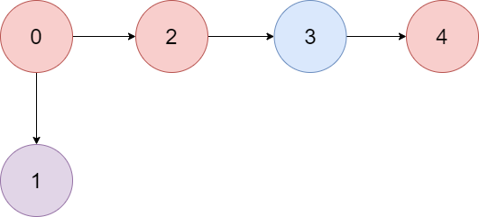
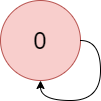

### 1. Description

There is a **directed graph** of `n` colored nodes and `m` edges. The nodes are numbered from `0` to $n - 1$.

You are given a string `colors` where $\text{colors}[i]$ is a lowercase English letter representing the **color** of the $$i^{\text{th}}$$ node in this graph (**0-indexed**). You are also given a 2D array `edges` where $\text{edges}[j] = [a_{j}, b_{j}]$ indicates that there is a **directed edge** from node $a_{j}$ to node $b_{j}$.

A valid **path** in the graph is a sequence of nodes $x_{1} -> x_{2} -> x_{3} -> ... -> x_{k}$ such that there is a directed edge from $x_{i}$ to $x_{i}+1$ for every $1 \le i < k$. The **color value** of the path is the number of nodes that are colored the **most frequently** occurring color along that path.

Return *the **largest color value** of any valid path in the given graph, or *`-1`* if the graph contains a cycle*.

### 2. Function Contract

**Inputs**

- `colors`: Input parameter (`str`).
- `edges`: Input parameter (`List[List[int]]`).

**Return value**

- Returns `int`.

### 3. Examples

#### Example 1

- **Input:** $colors = "abaca", edges = [[0,1],[0,2],[2,3],[3,4]]$
- **Output:** `3`
- **Explanation:** The path 0 -> 2 -> 3 -> 4 contains 3 nodes that are colored "a" (red in the above image).

#### Example 2

- **Input:** $colors = "a", edges = [[0,0]]$
- **Output:** `-1`
- **Explanation:** There is a cycle from 0 to 0.

### 4. Constraints

- $n = \text{colors.length}$

- $m = \text{edges.length}$

- $1 \le n \le 10^{5}$

- $0 \le m \le 10^{5}$

- `colors` consists of lowercase English letters.

- $0 \le a_{j}, b_{j} < n$
