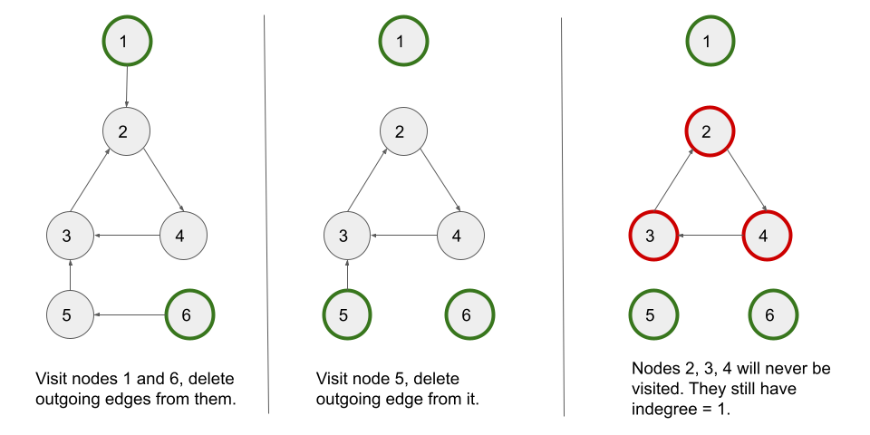

[TOC]

## Solution

---

### Overview

We are given a directed graph with `n` nodes and `m` edges. We are also given a string `colors` where $\text{colors}[i]$ is a lowercase English letter representing the color of the $i^{th}$ node in this graph (0-indexed).

Our task is to return the maximum frequency of any color that occurs in any path in the given graph.

---

### Approach 1: Topological Sort Using Kahn's Algorithm

#### Intuition

To find the maximum frequency of a color in a directed graph, we must iterate over all of its paths in an optimal manner. If we know the maximum frequency of all the colors for paths ending at `u`, we can use it to calculate the frequency of all colors for paths that use the outgoing edges from `u`.

If there is an edge from `u -> v`, the path ending at `v` will have the same color frequencies as the path ending at `u`, except that the color of `v` will be incremented by one.

Now, if we do this for all the nodes that have an incoming edge to `v` and take the maximum frequency of each color across these edges, we will have the maximum frequency of all the colors for paths ending at `v`. After covering all the edges going into `v`, we can use the maximum frequency of all the colors stored in `v` for edges going out of `v`.

We notice that for each edge `u -> v`, we must first obtain the maximum frequency of all the colours for paths ending until `u`, and only then can we form the answers for paths ending until `v`. This leads us to consider using topological sort to solve the problem.

A topological sort or topological ordering of a directed graph is a linear ordering of its vertices such that for every directed edge `u -> v` from vertex `u` to vertex `v`, `u` comes before `v` in the ordering.

In a directed acyclic graph, we can use Kahn's algorithm to get the topological ordering. Kahn’s algorithm works by keeping track of the number of incoming edges into each node (indegree). It works by repeatedly visiting the nodes with an indegree of zero and deleting all the edges associated with it leading to a decrement of indegree for the nodes whose incoming edges are deleted. This process continues until no elements with zero indegree can be found.

> If you are not familiar with Kahn's algorithm, we suggest you read our [Leetcode Explore Card](https://leetcode.com/explore/learn/card/graph/623/kahns-algorithm-for-topological-sorting/3886/).

We also need to detect if a cycle is in the graph and return `-1` if so. The advantage of using Kahn's algorithm is that it also aids in the detection of graph cycles.

Let's perform Kahn's algorithm on directed graph having a cycle. Here's a visual step-by-step represenntation of how it would work:



We can see that if there is a cycle, the indegree of nodes in the cycle cannot be set to `0` due to cyclic dependency. We are unable to visit the cycle's nodes. So, if the number of visited nodes is less than the total number of nodes in the graph, we have a cycle.

To solve the problem, we create a 2D-array `count` with `n` rows and `26` columns, where `n` is the number of graph nodes. We have an array of size `26` for each node to store the maximum frequency of each colour across the paths that end at the node.

We use Kahn's algorithm to perform the topological sort. A popped-out `node` indicates that all of its incoming edges have been processed, and it can now be used to iterate over all of its outgoing edges. So for each `node -> neighbor` edge, we use $\text{count}[neighbor][i] = max(\text{count}[neighbor][i], \text{count}[node][i])$ (we use max here instead of just setting it because there could be multiple ways to reach the neighbor) for all colors `i`.

We also need to count the colour of `node`. So when `node` is popped (or pushed) out of the queue, we increase the frequency of the colour of `node` by '1'.

We make an `answer` variable to compute the answer. We update it every time when `node` is popped out of the queue by simply taking `node`'s colour into account. We perform $answer = max(answer, \text{count}[node][\text{colors}[node] - 'a'])$.

You may have noticed that we can update `answer` each time we update the frequencies of the colours using the outgoing edges of `nodes`, but only the `node` colour is sufficient. This is because on any path with the highest frequency of a particular colour, we can shorten it by starting from the first node with that colour and keeping the same count of the colour on this path. As a result, simply using the colour of the node itself suffices for the answer computations.

#### Algorithm

1. Create an integer variable $n = \text{colors.length}()$ which stores the number of nodes in the graph.
2. Create an adjacency list `adj` in which $\text{adj}[x]$ contains all nodes with an incoming edge from node `x`.
3. Create an array `indegree` of length `n` where $\text{indegree}[x]$ stores the number of edges entering node `x`.
4. Create a 2D-array `count` with `n` rows and `26` columns where $\text{count}[x]$ keeps track of the maximum frequencies of all the colors for paths that end at node `x`. Note that color `a` corresponds to column `0`, `b` corresponds to column `1`, and so on.
5. Initialize a queue of integers `q` and start a BFS algorithm moving from the leaf nodes to the parent nodes.
6. Begin the BFS traversal by pushing all of the leaf nodes (`indegree` equal to `0`) in the queue.
7. Create two integer variables $answer = 0$ to store the answer to the problem and $nodesSeen = 0$ to count number of visited nodes.
8. While the queue is not empty;
- Dequeue the first `node` from the queue.
- Increment the frequency of the color of `node` by `1` and also update `answer`. We perform $answer = max(answer, ++\text{count}[node][\text{colors}[node] - 'a'])$.
- Increment `nodesSeen` by `1`.
- For each `neighbor` (nodes that have an incoming edge from `node`) of `node`, we try to update the frequencies of all colors stored for `neighbor` to cover all the paths that use `node -> neighbor` edge. We perform $\text{count}[neighbor][i] = max(\text{count}[neighbor][i], \text{count}[node][i])$ for every color `i` where color `a` corresponds to `0`, `b` corresponds to `1`, and so on.
- We further decrement $\text{indegree}[neighbor]$by `1` to delete the `node -> neighbor` edge.
- If $\text{indegree}[neighbor] = 0$, it means that `neighbor` behaves as a leaf node, so we push `neighbor` in the queue.
9. If number of nodes visited is less than total number of nodes, i.e., `nodesSeen < n` we return `-1` as there must be a cycle. Otherwise, we return `answer`.

#### Implementation

```python
class Solution:
    def largestPathValue(self, colors: str, edges: List[List[int]]) -> int:
        n = len(colors)
        adj = [[] for _ in range(n)]
        indegree = [0] * n

        for edge in edges:
            adj[edge[0]].append(edge[1])
            indegree[edge[1]] += 1

        count = [[0] * 26 for _ in range(n)]
        q = []

        # Push all the nodes with indegree zero in the queue.
        for i in range(n):
            if indegree[i] == 0:
                q.append(i)

        answer = 0
        nodesSeen = 0
        while q:
            node = q.pop(0)
            answer = max(answer, count[node][ord(colors[node]) - ord("a")] + 1)
            count[node][ord(colors[node]) - ord("a")] += 1
            nodesSeen += 1

            for neighbor in adj[node]:
                for i in range(26):
                    # Try to update the frequency of colors for the neighbor to include paths
                    # that use node->neighbor edge.
                    count[neighbor][i] = max(count[neighbor][i], count[node][i])

                indegree[neighbor] -= 1
                if indegree[neighbor] == 0:
                    q.append(neighbor)

        return answer if nodesSeen == n else -1
```

#### Complexity Analysis

Here, $n$ be the number of nodes and $m$ be the number of edges in the graph.

* Time complexity: $O(26 \cdot m + 26 \cdot n) = O(m + n)$.
- Initializing the `adj` takes $O(m)$ time as we go through all the edges. The `indegree` array take $O(n)$ time and the `count` array takes $O(26 \cdot n)$ time.
- Each queue operation takes $O(1)$ time, and a single node will be pushed once, leading to $O(n)$ operations for $n$ nodes. We iterate over the neighbor of each node that is popped out of the queue iterating over all the edges once. Since there are `m` edges at most and while iterating over each edge we try to update the frequencies of all the $26$ colors, it would take $O(26 \cdot m)$ time.

* Space complexity: $O(m + 26 \cdot n) = O(m + n)$.
- The adjacency list `adj` is a map, which stores up to $n$ keys and $m$ total edges, resulting in $O(n + m)$ space. The `count` array takes $O(26 \cdot n)$ space.
- The queue can have no more than $n$ elements in the worst-case scenario. It would take up $O(n)$ space in that case.

---

### Approach 2: Depth First Search

#### Intuition

In the previous approach, we obtained the maximum frequencies of the colours for the paths ending at `u` first and then moved to `v` for an edge `u -> v`. We can also consider going in the opposite direction. We can use the maximum frequencies of colours across all paths that begin with `v` to form the maximum frequencies of colours for paths that begin with `u`. We can update the frequency of colours similar to the previous approach.

Using depth first search, we can also detect a cycle. To detect a cycle, we must keep track of the vertices that are currently in the function's recursion stack for DFS traversal. If a vertex is reached that is already in the recursion stack then there is a cycle in the graph.

#### Algorithm

1. Create an integer variable $n = \text{colors.length}()$ which stores the number of nodes in the graph.
2. Create an adjacency list `adj` in which $\text{adj}[x]$ contains all nodes with an incoming edge from node `x`.
3. Create a 2D-array `count` with `n` rows and `26` columns where $\text{count}[x]$ keeps track of the maximum frequencies of all the colors among all the paths that begin at node `x`. Note, the definition of `count` is opposite in this case. The color `a` corresponds to column `0`, `b` corresponds to column `1`, and so on.
4. Create two boolean arrays, `visit` and `inStack`, each of size `n`. The `visit` array keeps track of visited nodes and `inStack` keeps track of nodes that are currently in the ongoing DFS stack. It will help us to detect cycle in the graph.
5. Create an integer variable $answer = 0$ to store the answer to the problem.
6. For each node we begin the DFS traveral. We implement the `dfs` method which takes six parameters: an integer `node` from which the current traversal begins, `colors`, `adj`, `count`, `visit` and `inStack`. It returns the maximum frequency of the color of `node` that we can get across all the paths starting from `node`. We return infinity if there is a cycle, which we can detect by checking `inStack`. For each node `i`, we update `answer` whenever we can using $answer = max(answer, dfs(i, colors, adj, count, visit, inStack))$:
- If `node` is already present in `inStack`, we have a cycle. We return infinity.
- If `node` is already visited, we return the frequency of `node`'s color, i.e., $\text{count}[node][\text{colors}[node] - 'a']$.
- We mark `node` as visited and also set $\text{inStack}[node] = true$.
- We iterate over all the outgoing edges of `node` and for each `neighbor`, we recursively call `dfs(neighbor, colors, adj, count, visit, inStack)`. If we get a cycle from `neighbor`, we return infinity. Otherwise, we try to update the frequencies of all colors stored for `node` by including the paths that use the `node -> neighbor` edge. We perform $\text{count}[node][i] = max(\text{count}[neighbor][i], \text{count}[node][i])$ for every color `i` where `a` corresponds to `0`, `b` corresponds to `1`, and so on.
- After we have processed all the outgoing edges of `node`, we increment the frequency of `node`'s color by `1` to count `node` itself.
- Mark $\text{inStack}[node] = false$ to mark `node` as out of stack.
- Similar to the previous approach, it is sufficient to just use the frequency of `node`'s color. We return $\text{count}[node][\text{colors}[node] - 'a']$.
7. If `answer` is equal to infinity, we return `-1`, else we return `answer`.

#### Implementation

```python
class Solution:
    def dfs(self, node, colors, adj, count, visit, inStack):
        # If the node is already in the stack, we have a cycle.
        if inStack[node]:
            return float("inf")
        if visit[node]:
            return count[node][ord(colors[node]) - ord("a")]
        # Mark the current node as visited and part of current recursion stack.
        visit[node] = True
        inStack[node] = True

        if node in adj:
            for neighbor in adj[node]:
                if self.dfs(
                    neighbor, colors, adj, count, visit, inStack
                ) == float("inf"):
                    return float("inf")
                for i in range(26):
                    count[node][i] = max(count[node][i], count[neighbor][i])

        # After all the incoming edges to the node are processed,
        # we count the color on the node itself.
        count[node][ord(colors[node]) - ord("a")] += 1
        # Remove the node from the stack.
        inStack[node] = False
        return count[node][ord(colors[node]) - ord("a")]

    def largestPathValue(self, colors, edges):
        n = len(colors)
        adj = {}
        for edge in edges:
            if edge[0] not in adj:
                adj[edge[0]] = []
            adj[edge[0]].append(edge[1])

        count = [[0] * 26 for _ in range(n)]
        visit = [False] * n
        inStack = [False] * n
        answer = 0
        for i in range(n):
            answer = max(
                answer, self.dfs(i, colors, adj, count, visit, inStack)
            )

        return -1 if answer == float("inf") else answer
```

#### Complexity Analysis

Here, $n$ be the number of nodes and $m$ be the number of edges in the graph.

* Time complexity: $O(26 \cdot m + 26 \cdot n) = O(m + n)$.
- Initializing the `adj` takes $O(m)$ time as we go through all the edges. The `count` array takes $O(26 \cdot n)$ time.
- The `dfs` function visits each node once, which takes $O(n)$ time in total. Since there are `m` edges at most and while iterating over each edge we try to update the frequencies of all the $26$ colors, it would take $O(26 \cdot m)$ time.

* Space complexity: $O(m + 26 \cdot n) = O(m + n)$.
- The adjacency list `adj` is a map, which stores up to $n$ keys and $m$ total edges, resulting in $O(n + m)$ space. The `count` array takes $O(26 \cdot n)$ space.
- The recursion call stack used by `dfs` can have no more than $n$ elements in the worst-case scenario. It would take up $O(n)$ space in that case.