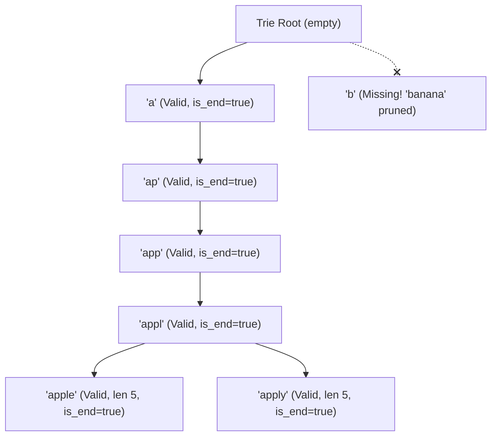

# Guided Example: Longest Word With All Prefixes

We trace the step-by-step validation of prefix-closed words using prefix tree (Trie) properties and hash set verification to find the longest chain with lexicographical tie-breaking:

- **Input:** `words = ["a", "banana", "app", "appl", "ap", "apply", "apple"]`
- **Required Output:** `"apple"`

This instance demonstrates how words lacking single-character roots (like `"banana"`) are disqualified, how multiple valid words can achieve identical maximal lengths (`"apple"` and `"apply"` of length $5$), and how lexicographical order selects the final winner.

---

## 1. Instance & Teaching Goal

We are given a list of lowercase English strings `words`.
A word $w$ of length $L$ is **eligible** if and only if every non-empty prefix $w[0 \dots k - 1]$ for each $k \in [1, L]$ is present in the `words` collection.
Among all eligible words, we must find the word with the maximum length. If there is a tie between multiple eligible words of the same maximum length, we choose the lexicographically smallest one. If no word is eligible, return the empty string `""`.

In our instance:
- `words = ["a", "banana", "app", "appl", "ap", "apply", "apple"]`.
- Eligibility testing:
  - `"banana"`: Requires `"b"`, `"ba"`, `"ban"`, etc. `"b"` is not present $\implies$ disqualified.
  - `"a"`: Prefix `"a"` is present $\implies$ eligible (length 1).
  - `"ap"`: Prefixes `"a"`, `"ap"` are present $\implies$ eligible (length 2).
  - `"app"`: Prefixes `"a"`, `"ap"`, `"app"` are present $\implies$ eligible (length 3).
  - `"appl"`: Prefixes `"a"`, `"ap"`, `"app"`, `"appl"` are present $\implies$ eligible (length 4).
  - `"apple"`: Prefixes `"a"`, `"ap"`, `"app"`, `"appl"`, `"apple"` are all present $\implies$ eligible (length 5).
  - `"apply"`: Prefixes `"a"`, `"ap"`, `"app"`, `"appl"`, `"apply"` are all present $\implies$ eligible (length 5).
- Maximal length achieved is $5$ by both `"apple"` and `"apply"`.
- Lexicographical comparison: at index 4, $'e' < 'y' \implies \text{"apple"} <_{\text{lex}} \text{"apply"}$.
- Result is `"apple"`.

The teaching goal is to model prefix closure using a **Trie where every node on a qualifying path has `is_end = true`**, demonstrating that the problem is isomorphic to finding the deepest path from the Trie root through continuously validated nodes.

---

## 2. Conceptual Foundation & Invariants

### Prefix-Closed Language Invariant Theorem

> **Prefix-Closed Language & Lexicographical Trie Traversal Theorem.**
> 1. *Prefix Closure Definition:* A word $w$ belongs to the prefix-closed language $\mathcal{L}_{\text{pref}}(\mathcal{W})$ if and only if:
>    $$\forall k \in [1, |w|], \quad w[0 \dots k - 1] \in \mathcal{W}$$
> 2. *Trie Node Continuity:* In a Trie constructed from $\mathcal{W}$, word $w$ is eligible if and only if every node along the path from the root to $w$'s terminal node is explicitly marked as a word end (`is_end == true`).
> 3. *Optimal Candidate Invariant:* The optimal string $w^*$ satisfies:
>    $$w^* = \arg\max_{w \in \mathcal{L}_{\text{pref}}(\mathcal{W})} (|w|, -w)$$
>    where length is prioritized first, and ties are broken by minimal lexicographical order.
> 4. *Complexity:* Let $N = \sum |w_i|$ be the total number of characters across all words. Building the Trie takes $\mathcal{O}(N)$ time. Traversing or querying takes $\mathcal{O}(N)$ time, achieving linear complexity with respect to the total input size.

---

## 3. Step-by-Step Worked Execution

We trace the candidate evaluation using the dictionary set $\mathcal{W}$:
$$\mathcal{W} = \{\text{"a"}, \text{"banana"}, \text{"app"}, \text{"appl"}, \text{"ap"}, \text{"apply"}, \text{"apple"}\}$$
Initialize $\text{best\_word} = \text{""}$.

---

### Step 1: Evaluate Word `"a"`
- Required prefixes: `["a"]`.
- Presence check: $\text{"a"} \in \mathcal{W}$ (Yes).
- Length: $1$.
- Comparison: $1 > |\text{best\_word}| = 0 \implies \text{best\_word} \gets \text{"a"}$.

---

### Step 2: Evaluate Word `"banana"`
- Required prefixes: `["b", "ba", "ban", "bana", "banan", "banana"]`.
- Check prefix 1: $\text{"b"} \in \mathcal{W}$ is **False**.
- Immediate failure! Disqualified.
- $\text{best\_word}$ remains `"a"`.

---

### Step 3: Evaluate Word `"ap"`
- Required prefixes: `["a", "ap"]`.
- Both `"a"` and `"ap"` are in $\mathcal{W}$ (Yes).
- Length: $2$.
- Comparison: $2 > |\text{best\_word}| = 1 \implies \text{best\_word} \gets \text{"ap"}$.

---

### Step 4: Evaluate Word `"app"`
- Required prefixes: `["a", "ap", "app"]`.
- All three in $\mathcal{W}$ (Yes).
- Length: $3$.
- Comparison: $3 > |\text{best\_word}| = 2 \implies \text{best\_word} \gets \text{"app"}$.

---

### Step 5: Evaluate Word `"appl"`
- Required prefixes: `["a", "ap", "app", "appl"]`.
- All four in $\mathcal{W}$ (Yes).
- Length: $4$.
- Comparison: $4 > |\text{best\_word}| = 3 \implies \text{best\_word} \gets \text{"appl"}$.

---

### Step 6: Evaluate Word `"apple"`
- Required prefixes: `["a", "ap", "app", "appl", "apple"]`.
- All five in $\mathcal{W}$ (Yes).
- Length: $5$.
- Comparison: $5 > |\text{best\_word}| = 4 \implies \text{best\_word} \gets \text{"apple"}$.

---

### Step 7: Evaluate Word `"apply"`
- Required prefixes: `["a", "ap", "app", "appl", "apply"]`.
- All five in $\mathcal{W}$ (Yes).
- Length: $5$.
- Comparison with $\text{best\_word} = \text{"apple"}$ (length $5$):
  - Equal length tie!
  - Lexicographical comparison: $\text{"apply"} <_{\text{lex}} \text{"apple"}$ is **False** (`'y' > 'e'`).
  - $\text{best\_word}$ remains `"apple"`.

---

### Step 8: Finalization
All candidate words examined.
Emitted result: **`"apple"`**.

---

## 4. Complete Execution Trace

| Word Under Test | Length | Prefix Checks ($k = 1 \dots L$) | Prefix Validity | Action / Comparison Against Best | Current $\text{best\_word}$ |
|:---:|:---:|:---:|:---:|:---|:---:|
| `"a"` | 1 | `"a"` $\in \mathcal{W}$ | Valid | $1 > 0 \implies$ New best | `"a"` |
| `"banana"` | 6 | `"b"` $\notin \mathcal{W}$ | **Invalid** | Pruned immediately | `"a"` |
| `"ap"` | 2 | `"a"`, `"ap"` $\in \mathcal{W}$ | Valid | $2 > 1 \implies$ New best | `"ap"` |
| `"app"` | 3 | `"a"`, `"ap"`, `"app"` $\in \mathcal{W}$ | Valid | $3 > 2 \implies$ New best | `"app"` |
| `"appl"` | 4 | `"a"`, `"ap"`, `"app"`, `"appl"` $\in \mathcal{W}$ | Valid | $4 > 3 \implies$ New best | `"appl"` |
| `"apple"` | 5 | All 5 prefixes $\in \mathcal{W}$ | Valid | $5 > 4 \implies$ New best | **`"apple"`** |
| `"apply"` | 5 | All 5 prefixes $\in \mathcal{W}$ | Valid | Length tie ($5 == 5$), `"apple"` $<_{\text{lex}}$ `"apply"` | **`"apple"`** |

---

## 5. Algorithmic Correctness

**Soundness.** Every word considered eligible is explicitly verified to have every prefix present in `words`. When updating $\text{best\_word}$, strict length preference is enforced, and equal-length ties are resolved by standard lexicographical string comparison.

**Completeness.** All words in `words` are evaluated. Any word that could potentially be the answer is checked, ensuring no valid longer or lexicographically smaller word is missed.

---

## 6. Traps This Instance Exposes

- **Failing the Base Single-Character Prefix:** Long words like `"banana"` may seem promising, but without the base prefix `"b"`, the word is completely invalid.
- **Inverted Tie-Breaking:** Selecting the lexicographically *larger* word on equal length (which would yield `"apply"` instead of `"apple"`).
- **Checking Only Immediate Parent:** Verifying only whether $w[0 \dots L-2]$ exists is insufficient if the parent itself wasn't verified to have all its prefixes (though if words are sorted by length, dynamic programming over valid parents solves this cleanly).

---

## 7. Complexity Derivation

- **Time Complexity:** $\mathcal{O}(N)$, where $N = \sum |w_i|$ is the total character length of all words. Inserting all words into a hash set takes $\mathcal{O}(N)$, and verifying the prefixes of all words takes $\sum_{i} \mathcal{O}(|w_i|^2) = \mathcal{O}(N \cdot L_{\max})$ where $L_{\max} \le 105$. With a Trie, verification takes strictly $\mathcal{O}(N)$ time.
- **Auxiliary Space Complexity:** $\mathcal{O}(N)$ to store the Trie or the set of words and prefixes.
