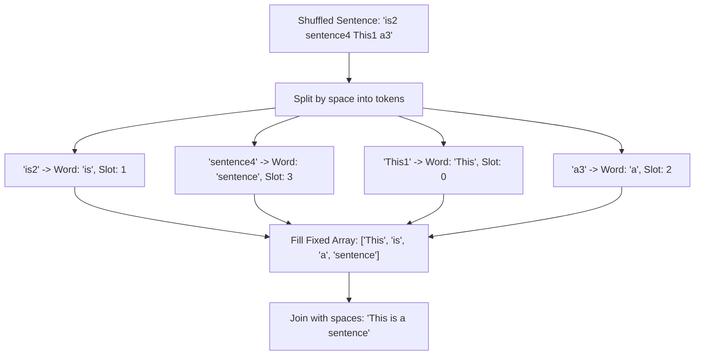

# Guided Example: Sorting the Sentence

We trace the step-by-step tokenization, suffix rank extraction, direct index placement, and sentence reconstruction for the scrambled sentence problem:

- **Input:** `s = "is2 sentence4 This1 a3"`
- **Required Output:** `"This is a sentence"`

This instance demonstrates space-delimited string tokenization, isolating trailing 1-indexed position digits, routing tokens to their designated 0-indexed destination slots in $\mathcal{O}(1)$ time, and joining restored words with single spaces.

---

## 1. Instance & Teaching Goal

We are given a string `s` representing a sentence of up to 9 words separated by single spaces.
Each token in `s` consists of English letters followed by an appended decimal digit in $[1, 9]$ specifying the token's original 1-indexed position in the sentence.
The tokens appear in arbitrary shuffled order.
We must reconstruct the original sentence by ordering the words according to their appended digits, stripping the digits, and joining the cleaned words with single spaces.

In our instance:
- `s = "is2 sentence4 This1 a3"` contains 4 space-separated tokens:
  1. `"is2"`: word `"is"`, position digit `2` $\to$ slot $2 - 1 = 1$.
  2. `"sentence4"`: word `"sentence"`, position digit `4` $\to$ slot $4 - 1 = 3$.
  3. `"This1"`: word `"This"`, position digit `1` $\to$ slot $1 - 1 = 0$.
  4. `"a3"`: word `"a"`, position digit `3` $\to$ slot $3 - 1 = 2$.
- Destination array of length $4$:
  - Slot $0$: `"This"`
  - Slot $1$: `"is"`
  - Slot $2$: `"a"`
  - Slot $3$: `"sentence"`
- Rejoined with spaces: `"This is a sentence"`.

The teaching goal is to recognize **direct bucket placement (pigeonhole sort)**: because each token contains its exact 1-indexed destination slot, we can place every word directly into an array in $\mathcal{O}(n)$ time without performing an $\mathcal{O}(m \log m)$ comparison sort.

---

## 2. Conceptual Foundation & Invariants

### Direct Index Routing Invariant Theorem

> **Direct Index Projection & Suffix Rank Permutation Theorem.**
> 1. *Token Splitting & Bijective Decomposition:* Each token $T_k$ can be uniquely partitioned into:
>    $$T_k = W_k \mathbin{\Vert} d_k$$
>    where $d_k \in \{1, 2, \dots, m\}$ is the final digit character representing the 1-indexed position, and $W_k$ is the preceding alphabetic content.
> 2. *Permutation Soundness:* Because the positions form a valid permutation of $\{1, 2, \dots, m\}$, mapping each $W_k$ to destination slot $d_k - 1$ is a bijection, filling every slot in $[0, m - 1]$ exactly once.
> 3. *Linear Sorting Invariant:* Direct indexing achieves complete permutation sorting in $\mathcal{O}(m)$ time and $\mathcal{O}(n)$ space where $n = |s|$, avoiding comparison sorting overhead.

---

## 3. Step-by-Step Worked Execution

We trace the algorithm on `s = "is2 sentence4 This1 a3"`.

---

### Step 1: Tokenize Input by Spaces
Split $s$ on whitespace `' '`:
$$\text{tokens} = [\text{"is2"}, \text{"sentence4"}, \text{"This1"}, \text{"a3"}]$$
Total word count: $m = 4$.
Allocate output bucket array of size $4$:
$$\text{ordered\_words} = [\text{null}, \text{null}, \text{null}, \text{null}]$$

---

### Step 2: Process Token `"is2"`
- Extract final character: $d = \text{'2'}$.
- Parsed 0-indexed destination: $2 - 1 = 1$.
- Extract word prefix: $W = \text{"is"}$.
- Assign to bucket:
  $$\text{ordered\_words}[1] \gets \text{"is"}$$
- State: `[null, "is", null, null]`.

---

### Step 3: Process Token `"sentence4"`
- Extract final character: $d = \text{'4'}$.
- Parsed 0-indexed destination: $4 - 1 = 3$.
- Extract word prefix: $W = \text{"sentence"}$.
- Assign to bucket:
  $$\text{ordered\_words}[3] \gets \text{"sentence"}$$
- State: `[null, "is", null, "sentence"]`.

---

### Step 4: Process Token `"This1"`
- Extract final character: $d = \text{'1'}$.
- Parsed 0-indexed destination: $1 - 1 = 0$.
- Extract word prefix: $W = \text{"This"}$.
- Assign to bucket:
  $$\text{ordered\_words}[0] \gets \text{"This"}$$
- State: `["This", "is", null, "sentence"]`.

---

### Step 5: Process Token `"a3"`
- Extract final character: $d = \text{'3'}$.
- Parsed 0-indexed destination: $3 - 1 = 2$.
- Extract word prefix: $W = \text{"a"}$.
- Assign to bucket:
  $$\text{ordered\_words}[2] \gets \text{"a"}$$
- State: `["This", "is", "a", "sentence"]`.

---

### Step 6: Join Restored Words
Concatenate the elements of $\text{ordered\_words}$ with single spaces:
$$\text{"This"} + \text{" "} + \text{"is"} + \text{" "} + \text{"a"} + \text{" "} + \text{"sentence"} = \text{"This is a sentence"}$$
Output: **`"This is a sentence"`**.

---

## 4. Complete Execution Trace

| Token | Suffix Digit | 0-Indexed Destination | Extracted Word | Destination Array After Insertion |
|:---:|:---:|:---:|:---:|:---|
| `"is2"` | `2` | 1 | `"is"` | `[null, "is", null, null]` |
| `"sentence4"` | `4` | 3 | `"sentence"` | `[null, "is", null, "sentence"]` |
| `"This1"` | `1` | 0 | `"This"` | `["This", "is", null, "sentence"]` |
| `"a3"` | `3` | 2 | `"a"` | `["This", "is", "a", "sentence"]` |

---

## 5. Algorithmic Correctness

**Soundness.** Every output word receives its exact original textual content with its position suffix stripped. Because each word is placed into slot $\text{digit} - 1$, the words appear in strictly increasing numerical order ($1, 2, \dots, m$), faithfully restoring the original sentence.

**Completeness.** Since the digits $1 \dots m$ form a complete permutation and all $m$ tokens are processed, every slot from $0$ to $m - 1$ is populated with exactly one word, leaving no empty gaps or collisions.

---

## 6. Traps This Instance Exposes

- **Preserving Original Capitalization:** `"This"` has a capitalized initial letter while other words do not; casing must remain strictly untouched during extraction.
- **1-Indexed vs 0-Indexed Offsets:** The appended digits are 1-indexed ($1 \dots 9$), so placing directly at index $d$ without subtracting $1$ causes off-by-one errors or out-of-bounds indexing.
- **Multi-Digit Numbers:** The problem guarantees at most 9 words, ensuring the position is always a single digit at the final index of each token.

---

## 7. Complexity Derivation

- **Time Complexity:** $\mathcal{O}(n)$, where $n$ is the total string length of $s$. Splitting the string takes $\mathcal{O}(n)$, slicing prefixes and placing into buckets takes $\mathcal{O}(n)$, and joining the words takes $\mathcal{O}(n)$.
- **Auxiliary Space Complexity:** $\mathcal{O}(n)$ to store the array of tokens and the reconstructed sentence string.
