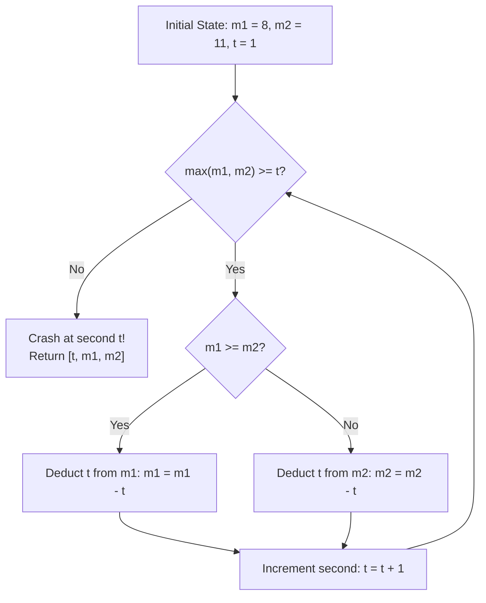

# Guided Example: Incremental Memory Leak

We trace the step-by-step simulation of quadratic triangular memory allocation across two memory sticks under greedy selection and tie-breaking:

- **Input:** `memory1 = 8, memory2 = 11`
- **Required Output:** `[6, 0, 4]`

This instance demonstrates dynamic stick selection based on instantaneous capacity, strict tie-breaking favoring the first stick when capacities equalize, and detecting the precise crash second when the incremental requirement exceeds both remaining capacities.

---

## 1. Instance & Teaching Goal

Two memory sticks start with capacities $m_1$ and $m_2$.
At each second $t = 1, 2, 3, \dots$, the system requires an allocation of exactly $t$ bits of memory.
Allocation rules:
1. If $m_1 \ge m_2$, the bits are deducted from stick 1 (this includes the tie-breaking case where $m_1 == m_2$).
2. If $m_2 > m_1$, the bits are deducted from stick 2.
3. If neither stick has at least $t$ bits ($\max(m_1, m_2) < t$), the program crashes at second $t$.

We must return the 3-tuple:
$$[\text{crash\_time}, \text{remaining\_memory1}, \text{remaining\_memory2}]$$

In our instance:
- Initially: $m_1 = 8, m_2 = 11$.
- At $t = 1$: $m_2 = 11 > 8 \implies m_2 \gets 11 - 1 = 10$. ($m_1 = 8, m_2 = 10$).
- At $t = 2$: $m_2 = 10 > 8 \implies m_2 \gets 10 - 2 = 8$. ($m_1 = 8, m_2 = 8$).
- At $t = 3$: $m_1 = 8 == m_2 = 8 \implies$ Tie goes to stick 1: $m_1 \gets 8 - 3 = 5$. ($m_1 = 5, m_2 = 8$).
- At $t = 4$: $m_2 = 8 > 5 \implies m_2 \gets 8 - 4 = 4$. ($m_1 = 5, m_2 = 4$).
- At $t = 5$: $m_1 = 5 > 4 \implies m_1 \gets 5 - 5 = 0$. ($m_1 = 0, m_2 = 4$).
- At $t = 6$: Requirement is $6$ bits. Highest available is $\max(0, 4) = 4 < 6$. Crash!
- Crash time is $6$, with remaining capacities $0$ and $4$.
- Result: `[6, 0, 4]`.

The teaching goal is to model sequential resource depletion where cumulative consumption grows quadratically ($T(t) = t(t+1)/2$), proving that total simulation steps are bounded by $\mathcal{O}(\sqrt{m_1 + m_2}) \le \mathcal{O}(\sqrt{2 \cdot 2^{31}}) \approx 6.5 \times 10^4$ steps, executing in milliseconds.

---

## 2. Conceptual Foundation & Invariants

### Triangular Depletion & Balancing Invariant Theorem

> **Triangular Memory Depletion & Greedy Balancing Theorem.**
> 1. *Quadratic Cumulative Consumption:* The total memory allocated across both sticks up to second $t - 1$ is the triangular number:
>    $$\sum_{i=1}^{t-1} i = \frac{(t-1)t}{2} \le m_1 + m_2$$
>    Therefore, the maximum possible crash second $t_{\text{crash}}$ satisfies:
>    $$t_{\text{crash}} \le \lceil \sqrt{2(m_1 + m_2)} \rceil + 1$$
>    For $32$-bit integers ($m_1, m_2 \le 2^{31} - 1$), $t_{\text{crash}} \le 65,536$.
> 2. *Greedy Capacity Balancing:* Deducting from the strictly larger stick minimizes the absolute difference $|m_1 - m_2|$ until the capacities equalize.
> 3. *Deterministic Tie-Breaking:* Whenever $m_1 == m_2$, the specification mandates deducting from $m_1$.
> 4. *Simulation Feasibility:* Because the loop executes at most $\approx 6.5 \times 10^4$ iterations, direct second-by-second simulation is computationally optimal and operates in $\mathcal{O}(\sqrt{m_1 + m_2})$ time and $\mathcal{O}(1)$ space.

---

## 3. Step-by-Step Worked Execution

We trace $m_1 = 8, m_2 = 11$ starting at second $t = 1$.

---

### Step 1: Second $t = 1$ (Request: $1$ bit)
- State: $m_1 = 8, m_2 = 11$.
- Check feasibility: $\max(8, 11) = 11 \ge 1$ (Feasible).
- Select stick: $m_2 = 11 > m_1 = 8 \implies$ Deduct from stick 2.
- Allocation: $m_2 \gets 11 - 1 = 10$.
- Post-state: $m_1 = 8, m_2 = 10$.

---

### Step 2: Second $t = 2$ (Request: $2$ bits)
- State: $m_1 = 8, m_2 = 10$.
- Check feasibility: $\max(8, 10) = 10 \ge 2$ (Feasible).
- Select stick: $m_2 = 10 > m_1 = 8 \implies$ Deduct from stick 2.
- Allocation: $m_2 \gets 10 - 2 = 8$.
- Post-state: $m_1 = 8, m_2 = 8$.

---

### Step 3: Second $t = 3$ (Request: $3$ bits)
- State: $m_1 = 8, m_2 = 8$.
- Check feasibility: $\max(8, 8) = 8 \ge 3$ (Feasible).
- Select stick: $m_1 = 8 == m_2 = 8 \implies$ Tie! Rule specifies choosing stick 1.
- Allocation: $m_1 \gets 8 - 3 = 5$.
- Post-state: $m_1 = 5, m_2 = 8$.

---

### Step 4: Second $t = 4$ (Request: $4$ bits)
- State: $m_1 = 5, m_2 = 8$.
- Check feasibility: $\max(5, 8) = 8 \ge 4$ (Feasible).
- Select stick: $m_2 = 8 > m_1 = 5 \implies$ Deduct from stick 2.
- Allocation: $m_2 \gets 8 - 4 = 4$.
- Post-state: $m_1 = 5, m_2 = 4$.

---

### Step 5: Second $t = 5$ (Request: $5$ bits)
- State: $m_1 = 5, m_2 = 4$.
- Check feasibility: $\max(5, 4) = 5 \ge 5$ (Feasible).
- Select stick: $m_1 = 5 > m_2 = 4 \implies$ Deduct from stick 1.
- Allocation: $m_1 \gets 5 - 5 = 0$.
- Post-state: $m_1 = 0, m_2 = 4$.

---

### Step 6: Second $t = 6$ (Request: $6$ bits)
- State: $m_1 = 0, m_2 = 4$.
- Check feasibility: $\max(0, 4) = 4 < 6$ (Infeasible!).
- Neither stick possesses at least $6$ available bits.
- System crashes at second $6$.
- Unused memory: $m_1 = 0, m_2 = 4$.

Output: **`[6, 0, 4]`**.

---

## 4. Complete Execution Trace

| Second $t$ | Required Bits | $m_1$ Before | $m_2$ Before | Selected Stick | Deduction Applied | $m_1$ After | $m_2$ After | Feasibility Status |
|:---:|:---:|:---:|:---:|:---:|:---|:---:|:---:|:---:|
| 1 | 1 | 8 | 11 | Stick 2 ($11 > 8$) | $m_2 \gets 11 - 1$ | 8 | 10 | Allocated |
| 2 | 2 | 8 | 10 | Stick 2 ($10 > 8$) | $m_2 \gets 10 - 2$ | 8 | 8 | Allocated |
| 3 | 3 | 8 | 8 | **Stick 1** (Tie: $8 == 8$) | $m_1 \gets 8 - 3$ | 5 | 8 | Allocated |
| 4 | 4 | 5 | 8 | Stick 2 ($8 > 5$) | $m_2 \gets 8 - 4$ | 5 | 4 | Allocated |
| 5 | 5 | 5 | 4 | Stick 1 ($5 > 4$) | $m_1 \gets 5 - 5$ | 0 | 4 | Allocated |
| 6 | 6 | 0 | 4 | None | - | **0** | **4** | **CRASH** at $t = \mathbf{6}$ |

---

## 5. Algorithmic Correctness

**Soundness.** Every deduction strictly follows the exact priority rules: taking from the larger capacity stick, choosing stick 1 when equal, and deducting precisely $t$ bits. Halting occurs at the earliest second when $\max(m_1, m_2) < t$, satisfying the exact definition of a crash.

**Completeness.** Since $t$ increases by $1$ at each step, the total bits required grows monotonically. Because total available memory is finite, termination is guaranteed in finite time, capturing the unique deterministic outcome.

---

## 6. Traps This Instance Exposes

- **Inverting the Tie-Break Rule:** Deducting from stick 2 on equal capacities ($m_1 == m_2$) would incorrectly deduct $3$ from $m_2$ at $t = 3$, leading to a completely diverged trajectory.
- **Reporting Total Elapsed vs Crash Second:** The crash time is the second during which allocation *fails* ($t = 6$), not the last successful second ($5$).
- **Unnecessary Mathematical Complexity:** Trying to solve the alternating arithmetic progressions analytically across both sticks invites edge-case errors, whereas direct simulation requires fewer than $7 \times 10^4$ loop iterations.

---

## 7. Complexity Derivation

- **Time Complexity:** $\mathcal{O}(\sqrt{m_1 + m_2})$, because at second $t$, total memory consumed is $\approx t^2 / 2$. With $m_1, m_2 \le 2^{31} - 1$, the maximum number of iterations is $\le \sqrt{2 \cdot 2^{32}} \approx 65,536$.
- **Auxiliary Space Complexity:** $\mathcal{O}(1)$, requiring only integer registers for $m_1, m_2$, and the second counter $t$.
