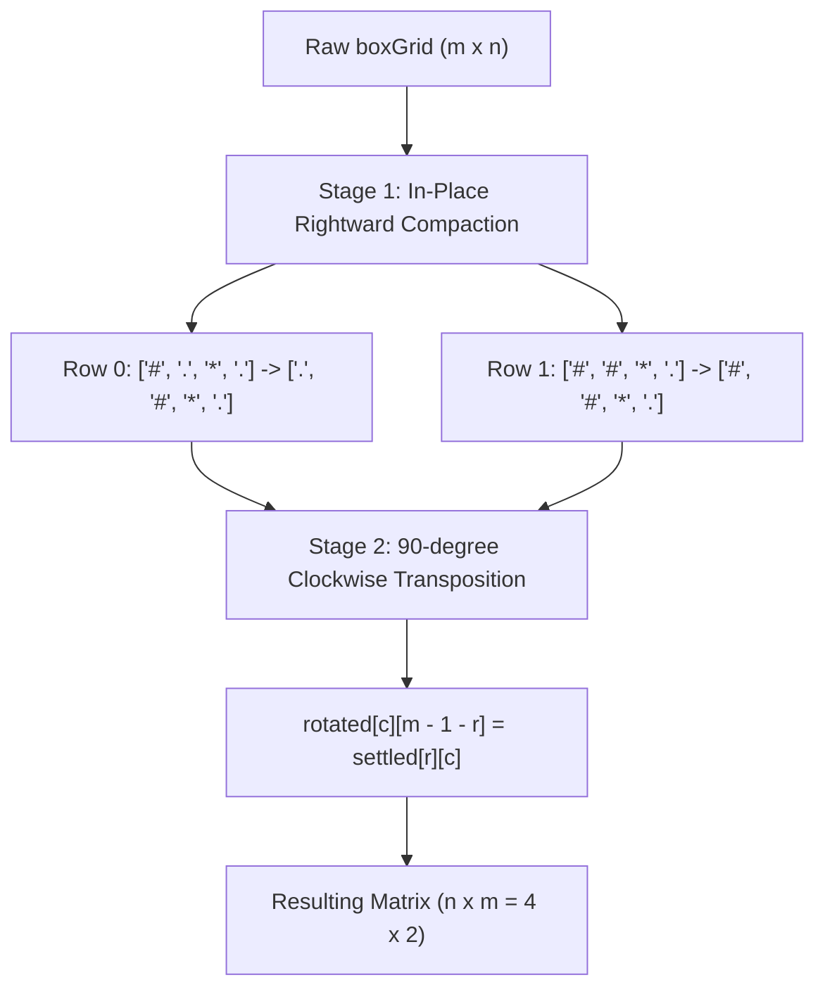

# Guided Example: Rotating the Box

We trace the step-by-step physical simulation of obstacle-bounded gravity settlement followed by a $90^\circ$ clockwise orthogonal matrix rotation:

- **Input:**
  ```text
  boxGrid = [
    ["#", ".", "*", "."],
    ["#", "#", "*", "."]
  ]
  ```
- **Required Output:**
  ```text
  [
    ["#", "."],
    ["#", "#"],
    ["*", "*"],
    [".", "."]
  ]
  ```

This instance demonstrates segmenting rows between stationary obstacles (`*`), shifting loose stones (`#`) toward the rightmost available resting positions via two pointers, and mapping coordinates $(r, c) \mapsto (c, m - 1 - r)$ to complete the clockwise rotation.

---

## 1. Instance & Teaching Goal

We are given an $m \times n$ character matrix `boxGrid` containing three types of elements:
- `'#'`: A stone that falls downward due to gravity until obstructed.
- `'*'`: A stationary obstacle that never moves and blocks falling stones.
- `'.'`: An empty cell.

The box is rotated $90^\circ$ clockwise. Gravity pulls stones downward toward the bottom of the newly oriented box.
Rather than simulating 2D gravity after rotation, notice that downward movement in the rotated grid corresponds to **rightward movement along each row in the original grid** before rotation. Each row is partitioned into independent segments separated by obstacles `'*'`.

In our instance:
- `boxGrid` has dimensions $m = 2$ rows and $n = 4$ columns.
- **Row 0:** `["#", ".", "*", "."]`
  - Obstacle at column 2 partitions the row into segment $0 \dots 1$ and segment $3$.
  - Segment $0 \dots 1$ has one stone (`#`) and one empty space (`.`). Gravity pulls the stone right against the obstacle: `[".", "#"]`.
  - Segment $3$ is empty: `["."]`.
  - Settled Row 0: `[".", "#", "*", "."]`.
- **Row 1:** `["#", "#", "*", "."]`
  - Segment $0 \dots 1$ has two stones: `["#", "#"]`.
  - Segment $3$ is empty: `["."]`.
  - Settled Row 1: `["#", "#", "*", "."]`.
- **$90^\circ$ Clockwise Rotation:**
  - An $m \times n$ grid becomes an $n \times m$ grid ($4 \times 2$).
  - Coordinate mapping: $\text{rotated}[c][m - 1 - r] = \text{settled}[r][c]$.
  - Assembled columns become rows, producing the $4 \times 2$ matrix.

The teaching goal is to decouple the simulation into two orthogonal, linear-time phases:
1. One-dimensional rightward compaction per row using a write-pointer.
2. Coordinate transposition and column inversion mapping $(r, c) \to (c, m - 1 - r)$.

---

## 2. Conceptual Foundation & Invariants

### Segmented Gravity & Orthogonal Rotation Invariant Theorem

> **Segmented Rightward Compaction & Orthogonal Rotation Theorem.**
> 1. *Row Independence:* Prior to rotation, gravity acts along rows towards the right (the eventual bottom). Stones cannot cross row boundaries or obstacles (`'*'`). Therefore, each row $r \in [0, m - 1]$ can be solved completely independently.
> 2. *Rightward Compaction Invariant:* For each row, scan columns from right to left ($c = n - 1 \dots 0$) maintaining write pointer $w$:
>    - If cell is `'*'`: write pointer resets to $w \gets c - 1$.
>    - If cell is `'#'`: swap stone into position $w$, set $cell[r][c] \gets '.'$ (if $w \neq c$), and decrement $w \gets w - 1$.
>    - If cell is `'.'`: continue without decrementing $w$.
> 3. *Isometric Matrix Rotation:* The clockwise $90^\circ$ rotation is a linear bijection mapping $(r, c) \mapsto (c, m - 1 - r)$.
> 4. *Complexity:* Compaction visits each cell $\mathcal{O}(1)$ times. Transposition copies $m \times n$ elements once, achieving optimal $\mathcal{O}(m \cdot n)$ time and $\mathcal{O}(m \cdot n)$ space.



---

## 3. Step-by-Step Worked Execution

We trace the two stages on $m = 2, n = 4$.

---

### Stage 1: Rightward Gravity Compaction per Row

#### Processing Row 0: `["#", ".", "*", "."]`
Initialize write target pointer $w = n - 1 = 3$.
- $c = 3$: Content is `'.'`. Space available. $w$ remains $3$.
- $c = 2$: Content is `'*'`. Obstacle blocks further rightward movement. Reset $w \gets c - 1 = 1$.
- $c = 1$: Content is `'.'`. Space available. $w$ remains $1$.
- $c = 0$: Content is `'#'`. Stone found!
  - Move stone from $c = 0$ to resting position $w = 1$:
    Row 0 at index 0 becomes `.` and index 1 becomes `#`.
  - Decrement write pointer: $w \gets 1 - 1 = 0$.
- Settled Row 0: `[".", "#", "*", "."]`.

#### Processing Row 1: `["#", "#", "*", "."]`
Initialize write target pointer $w = n - 1 = 3$.
- $c = 3$: Content is `'.'`. $w$ remains $3$.
- $c = 2$: Content is `'*'`. Obstacle encountered. Reset $w \gets c - 1 = 1$.
- $c = 1$: Content is `'#'`. Stone found!
  - Resting position is $w = 1$ (already here, $w == c$).
  - Decrement $w \gets 1 - 1 = 0$.
- $c = 0$: Content is `'#'`. Stone found!
  - Move to $w = 0$ ($w == c$).
  - Decrement $w \gets 0 - 1 = -1$.
- Settled Row 1: `["#", "#", "*", "."]`.

---

### Stage 2: $90^\circ$ Clockwise Rotation
Allocate empty matrix $R$ of dimensions $n \times m = 4 \times 2$.
Mapping rule: $R[c][m - 1 - r] = \text{settled}[r][c]$ where $m = 2$, so destination column is $2 - 1 - r = 1 - r$.

- For $r = 0$ (settled row `[".", "#", "*", "."]`, maps to column $1 - 0 = 1$):
  - $c = 0$: $R[0][1]$ receives `'.'`.
  - $c = 1$: $R[1][1]$ receives `'#'`.
  - $c = 2$: $R[2][1]$ receives `'*'`.
  - $c = 3$: $R[3][1]$ receives `'.'`.

- For $r = 1$ (settled row `["#", "#", "*", "."]`, maps to column $1 - 1 = 0$):
  - $c = 0$: $R[0][0]$ receives `'#'`.
  - $c = 1$: $R[1][0]$ receives `'#'`.
  - $c = 2$: $R[2][0]$ receives `'*'`.
  - $c = 3$: $R[3][0]$ receives `'.'`.

---

### Stage 3: Assembled Matrix
Read out rows of $R$ of size $4 \times 2$:
- Row 0: `["#", "."]`
- Row 1: `["#", "#"]`
- Row 2: `["*", "*"]`
- Row 3: `[".", "."]`

Output matches expected state.

---

## 4. Complete Execution Trace

| Row Index | Scan Column $c$ | Cell Value | Action / Write Pointer $w$ | Row Configuration After Step |
|:---:|:---:|:---:|:---|:---|
| 0 | 3 | `'.'` | Empty space; $w = 3$ | `["#", ".", "*", "."]` |
| 0 | 2 | `'*'` | Obstacle; reset $w \gets 1$ | `["#", ".", "*", "."]` |
| 0 | 1 | `'.'` | Empty space; $w = 1$ | `["#", ".", "*", "."]` |
| 0 | 0 | `'#'` | Stone falls to $w = 1$; $w \gets 0$ | `[".", "#", "*", "."]` |
| 1 | 3 | `'.'` | Empty space; $w = 3$ | `["#", "#", "*", "."]` |
| 1 | 2 | `'*'` | Obstacle; reset $w \gets 1$ | `["#", "#", "*", "."]` |
| 1 | 1 | `'#'` | Stone already at $w = 1$; $w \gets 0$ | `["#", "#", "*", "."]` |
| 1 | 0 | `'#'` | Stone already at $w = 0$; $w \gets -1$ | `["#", "#", "*", "."]` |

---

## 5. Algorithmic Correctness

**Soundness.** Rightward compaction ensures that every stone within a segment between obstacles rests as far right as possible, which after clockwise rotation places them at the lowest possible row indices in their column. Obstacles are never moved.

**Completeness.** Every cell in every row is processed by the two-pointer compaction. The rotation formula $(r, c) \mapsto (c, m - 1 - r)$ is an exact isometry preserving relative neighborhood structures, guaranteeing the rotated matrix is identical to physical 2D gravity simulation.

---

## 6. Traps This Instance Exposes

- **Simulating Gravity After Rotation:** Rotating first and then dropping stones vertically down columns requires tracking variable column heights with nested loops, whereas falling rightward along rows before rotation is a simple 1D array compaction.
- **Stones Jumping Over Obstacles:** Failing to reset the write pointer to $c - 1$ upon hitting `'*'` would allow stones to pass through obstacles.
- **Transposition Index Inversion:** Clockwise rotation maps $(r, c) \to (c, m - 1 - r)$. Using $(c, r)$ produces a reflection across the main diagonal (counter-clockwise transpose), failing test assertions.

---

## 7. Complexity Derivation

- **Time Complexity:** $\mathcal{O}(m \cdot n)$, where $m$ and $n$ are the matrix dimensions. The right-to-left scan examines each cell once, performing $\mathcal{O}(1)$ pointer updates and swaps. Matrix rotation transfers each of the $m \times n$ cells once.
- **Auxiliary Space Complexity:** $\mathcal{O}(m \cdot n)$ to allocate the rotated result matrix of size $n \times m$.
