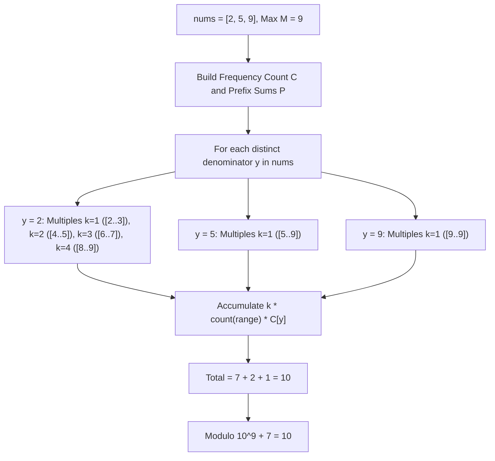

# Guided Example: Sum of Floored Pairs

We trace the step-by-step evaluation of floored integer quotients over all ordered pairs using frequency histograms, prefix counting, and harmonic block summation:

- **Input:** `nums = [2, 5, 9]`
- **Required Output:** `10`

This instance demonstrates how grouping identical denominators and partitioning the numerator domain into contiguous multiple ranges $[k \cdot y, (k+1) \cdot y - 1]$ replaces quadratic $\mathcal{O}(n^2)$ pair iteration with harmonic $\mathcal{O}(M \log M)$ block queries.

---

## 1. Instance & Teaching Goal

We are given an array of positive integers `nums` of length $n$.
We must compute the sum of integer floor divisions over all $n^2$ ordered pairs:
$$\text{Total} = \sum_{i=0}^{n-1} \sum_{j=0}^{n-1} \left\lfloor \frac{nums[i]}{nums[j]} \right\rfloor \pmod{10^9 + 7}$$
A naive double loop evaluates all $n^2$ pairs, which takes $\mathcal{O}(n^2) = 10^{10}$ operations when $n = 10^5$, causing Time Limit Exceeded.

In our instance:
- `nums = [2, 5, 9]`, with maximum value $M = 9$.
- Pairwise evaluation:
  - Denominator $y = 2$:
    - $\lfloor 2 / 2 \rfloor = 1$
    - $\lfloor 5 / 2 \rfloor = 2$
    - $\lfloor 9 / 2 \rfloor = 4$
    - Subtotal for $y = 2$ is $1 + 2 + 4 = 7$.
  - Denominator $y = 5$:
    - $\lfloor 2 / 5 \rfloor = 0$
    - $\lfloor 5 / 5 \rfloor = 1$
    - $\lfloor 9 / 5 \rfloor = 1$
    - Subtotal for $y = 5$ is $0 + 1 + 1 = 2$.
  - Denominator $y = 9$:
    - $\lfloor 2 / 9 \rfloor = 0$
    - $\lfloor 5 / 9 \rfloor = 0$
    - $\lfloor 9 / 9 \rfloor = 1$
    - Subtotal for $y = 9$ is $0 + 0 + 1 = 1$.
- Total sum: $7 + 2 + 1 = 10$.
- $10 \bmod (10^9 + 7) = 10$.

The teaching goal is to fix each distinct denominator $y$ and iterate over its multiples $k = 1, 2, \dots$: all numerators $x \in [k \cdot y, (k + 1) \cdot y - 1]$ have identical quotient $\lfloor x / y \rfloor = k$. Counting the number of elements in this range via a prefix count array takes $\mathcal{O}(1)$ per block.

---

## 2. Conceptual Foundation & Invariants

### Harmonic Multiples Partitioning Invariant Theorem

> **Harmonic Block Partitioning & Prefix Count Sieve Theorem.**
> 1. *Quotient Equivalence Classes:* For any fixed denominator $y > 0$, the floor quotient $\lfloor x / y \rfloor = k$ is constant over the half-open interval $x \in [k \cdot y, (k + 1) \cdot y)$.
> 2. *Prefix Range Counting:* Let $P[v]$ denote the number of elements in `nums` less than or equal to $v$. The number of array elements falling in the range $[L, R]$ is:
>    $$\text{count}(L, R) = P[R] - P[L - 1]$$
> 3. *Denominator Aggregation:* If value $y$ appears $C[y]$ times in `nums`, its total contribution to the answer across all numerators is:
>    $$S(y) = C[y] \times \sum_{k=1}^{\lfloor M / y \rfloor} k \cdot \left( P[\min(M, (k+1)y - 1)] - P[ky - 1] \right)$$
> 4. *Harmonic Complexity Bound:* Summing the number of multiples across all $y \in [1, M]$ yields the harmonic series:
>    $$\sum_{y=1}^M \frac{M}{y} = M \sum_{y=1}^M \frac{1}{y} \approx M \ln M$$
>    For $M = 10^5$, $M \ln M \approx 1.15 \times 10^6$ operations, executing in under 30 milliseconds.

---

## 3. Step-by-Step Worked Execution

We trace `nums = [2, 5, 9]` with $M = 9$.

---

### Step 1: Frequency Histogram & Prefix Count Array
- Distinct values present: $2, 5, 9$.
- Frequency array $C$ up to $M = 9$:
  - $C[2] = 1, C[5] = 1, C[9] = 1$.
  - All other $C[v] = 0$.
- Prefix count array $P[v] = \sum_{j=0}^v C[j]$:
  - $P[0] = 0, P[1] = 0$
  - $P[2] = 1, P[3] = 1, P[4] = 1$
  - $P[5] = 2, P[6] = 2, P[7] = 2, P[8] = 2$
  - $P[9] = 3$

---

### Step 2: Compute Contribution for Denominator $y = 2$
$C[2] = 1$. Multiples $k \cdot y \le 9$:

1. **Multiple $k = 1$:**
   - Interval: $[1 \cdot 2, \min(9, 2 \cdot 2 - 1)] = [2, 3]$.
   - Elements in $[2, 3]$: $P[3] - P[1] = 1 - 0 = 1$ (value $2$).
   - Contribution: $1 \times (k \times \text{count}) = 1 \times (1 \times 1) = 1$.

2. **Multiple $k = 2$:**
   - Interval: $[2 \cdot 2, \min(9, 3 \cdot 2 - 1)] = [4, 5]$.
   - Elements in $[4, 5]$: $P[5] - P[3] = 2 - 1 = 1$ (value $5$).
   - Contribution: $1 \times (2 \times 1) = 2$.

3. **Multiple $k = 3$:**
   - Interval: $[3 \cdot 2, \min(9, 4 \cdot 2 - 1)] = [6, 7]$.
   - Elements in $[6, 7]$: $P[7] - P[5] = 2 - 2 = 0$.
   - Contribution: $0$.

4. **Multiple $k = 4$:**
   - Interval: $[4 \cdot 2, \min(9, 5 \cdot 2 - 1)] = [8, 9]$.
   - Elements in $[8, 9]$: $P[9] - P[7] = 3 - 2 = 1$ (value $9$).
   - Contribution: $1 \times (4 \times 1) = 4$.

Total for $y = 2$: $1 + 2 + 0 + 4 = \mathbf{7}$.

---

### Step 3: Compute Contribution for Denominator $y = 5$
$C[5] = 1$. Multiples $k \cdot y \le 9$:

1. **Multiple $k = 1$:**
   - Interval: $[1 \cdot 5, \min(9, 2 \cdot 5 - 1)] = [5, 9]$.
   - Elements in $[5, 9]$: $P[9] - P[4] = 3 - 1 = 2$ (values $5$ and $9$).
   - Contribution: $1 \times (1 \times 2) = 2$.

Total for $y = 5$: $\mathbf{2}$.

---

### Step 4: Compute Contribution for Denominator $y = 9$
$C[9] = 1$. Multiples $k \cdot y \le 9$:

1. **Multiple $k = 1$:**
   - Interval: $[1 \cdot 9, \min(9, 2 \cdot 9 - 1)] = [9, 9]$.
   - Elements in $[9, 9]$: $P[9] - P[8] = 3 - 2 = 1$ (value $9$).
   - Contribution: $1 \times (1 \times 1) = 1$.

Total for $y = 9$: $\mathbf{1}$.

---

### Step 5: Global Sum & Modulo
$$\text{Total Sum} = 7 + 2 + 1 = 10$$
$$10 \bmod (10^9 + 7) = 10$$
Output: **`10`**.

---

## 4. Complete Execution Trace

| Denominator $y$ | Quotient Multiplier $k$ | Numerator Range $[ky, (k+1)y - 1]$ | Elements Counted ($P[R] - P[L-1]$) | Range Contribution ($k \times \text{count}$) | Denominator Subtotal ($C[y] \times \sum$) | Running Total |
|:---:|:---:|:---:|:---:|:---:|:---:|:---:|
| 2 | 1 | $[2, 3]$ | $P[3] - P[1] = 1$ | $1 \times 1 = 1$ | - | 1 |
| 2 | 2 | $[4, 5]$ | $P[5] - P[3] = 1$ | $2 \times 1 = 2$ | - | 3 |
| 2 | 3 | $[6, 7]$ | $P[7] - P[5] = 0$ | $3 \times 0 = 0$ | - | 3 |
| 2 | 4 | $[8, 9]$ | $P[9] - P[7] = 1$ | $4 \times 1 = 4$ | $1 \times 7 = 7$ | 7 |
| 5 | 1 | $[5, 9]$ | $P[9] - P[4] = 2$ | $1 \times 2 = 2$ | $1 \times 2 = 2$ | 9 |
| 9 | 1 | $[9, 9]$ | $P[9] - P[8] = 1$ | $1 \times 1 = 1$ | $1 \times 1 = 1$ | **10** |

---

## 5. Algorithmic Correctness

**Soundness.** For every numerator $x$ and denominator $y$, $x$ belongs to exactly one interval $[k \cdot y, (k + 1) \cdot y - 1]$ where $k = \lfloor x / y \rfloor$. Prefix sum subtraction counts exactly the number of array elements within this interval, and multiplying by $k$ adds the precise mathematical contribution of each such pair.

**Completeness.** Every distinct value appearing in `nums` is evaluated as a denominator. The multiples $k$ cover all ranges up to $M = \max(nums)$. Any numerator $x < y$ has quotient $0$, correctly contributing zero to the sum. Thus, all $n^2$ pairs are accurately accounted for.

---

## 6. Traps This Instance Exposes

- **Evaluating Zero-Frequency Denominators:** Iterating $y$ through all integers $1 \dots M$ regardless of whether $y$ exists in `nums` would waste computation; checking only distinct values present in `nums` ($C[y] > 0$) optimizes execution.
- **Off-By-One at the Upper Bound:** The final multiple interval $[k \cdot y, (k + 1) \cdot y - 1]$ can exceed $M$. Capping the right boundary at $\min(M, (k + 1) \cdot y - 1)$ prevents array out-of-bounds queries.
- **Repeated Values:** When `nums` has duplicate elements (e.g. $[7, 7, 7]$), calculating the contribution once for $y = 7$ and multiplying by $C[7] = 3$ avoids redundant harmonic traversals.

---

## 7. Complexity Derivation

- **Time Complexity:** $\mathcal{O}(n + M \log M)$, where $n = |nums|$ and $M = \max(nums) \le 10^5$. Constructing frequency and prefix sum arrays takes $\mathcal{O}(n + M)$. Summing harmonic intervals takes at most $\sum_{y=1}^M \frac{M}{y} = \mathcal{O}(M \log M)$ steps.
- **Auxiliary Space Complexity:** $\mathcal{O}(M)$ to store the frequency and prefix sum arrays of size $M + 1$.