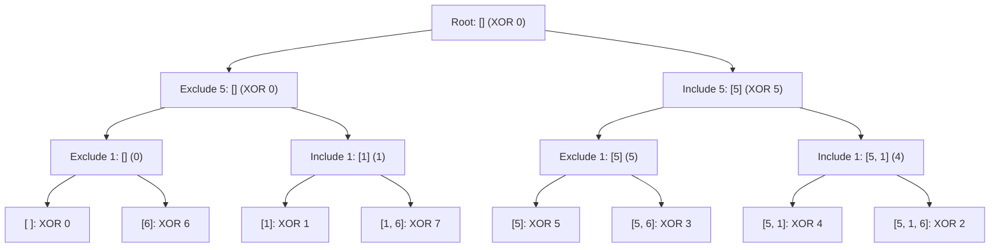

# Guided Example: Sum of All Subset XOR Totals

We trace the step-by-step evaluation of subset XOR totals using both combinatorial subset tree recursion and the bitwise parity projection identity:

- **Input:** `nums = [5, 1, 6]`
- **Required Output:** `28`

This instance demonstrates generating all $2^n = 8$ subsets, evaluating their individual XOR totals, and proving why the bitwise OR identity $(\bigvee nums[i]) \times 2^{n-1}$ computes the exact sum in linear $\mathcal{O}(n)$ time.

---

## 1. Instance & Teaching Goal

For any subset $S \subseteq nums$, its XOR total is the bitwise exclusive-OR sum of its elements ($\bigoplus_{x \in S} x$), with the empty set contributing $0$.
We must compute the sum of the XOR totals over all $2^n$ subsets of `nums`.

In our instance:
- `nums = [5, 1, 6]` has $n = 3$ elements.
- There are $2^3 = 8$ subsets:
  1. $\emptyset \implies \text{XOR} = 0$
  2. $\{5\} \implies \text{XOR} = 5$
  3. $\{1\} \implies \text{XOR} = 1$
  4. $\{6\} \implies \text{XOR} = 6$
  5. $\{5, 1\} \implies \text{XOR} = 5 \oplus 1 = 4$
  6. $\{5, 6\} \implies \text{XOR} = 5 \oplus 6 = 3$
  7. $\{1, 6\} \implies \text{XOR} = 1 \oplus 6 = 7$
  8. $\{5, 1, 6\} \implies \text{XOR} = 5 \oplus 1 \oplus 6 = 2$
- Summing all 8 values:
  $$\text{Total} = 0 + 5 + 1 + 6 + 4 + 3 + 7 + 2 = 28$$

The teaching goal is to reveal the deep algebraic structure of bitwise XOR: each bit position acts independently as a field of characteristic 2 ($\mathbb{F}_2$). If any number has bit $b$ set to $1$, exactly half of all subsets ($2^{n-1}$) have an odd count of $1$s at bit $b$, contributing $2^b \times 2^{n-1}$ to the total.

---

## 2. Conceptual Foundation & Invariants

### Bitwise Parity Projection Invariant Theorem

> **Bitwise Independence & Subspace Parity Projection Theorem.**
> 1. *Bitwise Linearity:* The integer value of an XOR sum satisfies:
>    $$\bigoplus_{x \in S} x = \sum_{b=0}^{B-1} 2^b \left( \left( \sum_{x \in S} \text{bit}_b(x) \right) \bmod 2 \right)$$
> 2. *Equipartition of Parity:* For any bit position $b$:
>    - If no element in `nums` has bit $b = 1$, then $\text{bit}_b(\bigoplus_{x \in S} x) = 0$ for all $2^n$ subsets.
>    - If at least one element in `nums` has bit $b = 1$, then by the binomial parity identity, exactly $2^{n-1}$ subsets have an odd number of elements with bit $b = 1$, and exactly $2^{n-1}$ subsets have an even number.
> 3. *Closed-Form Bitwise OR Reduction:* Therefore, every bit position present in the bitwise OR of all elements contributes $2^b \times 2^{n-1}$. Summing across all bit positions yields the closed-form theorem:
>    $$\sum_{S \subseteq nums} \left( \bigoplus_{x \in S} x \right) = \left( \bigvee_{i=0}^{n-1} nums[i] \right) \times 2^{n-1}$$
> 4. *Complexity:* The recursive tree evaluates all $2^n$ subsets in $\mathcal{O}(2^n)$ time, while the bitwise OR reduction computes the identical result in $\mathcal{O}(n)$ time and $\mathcal{O}(1)$ space.

---

## 3. Step-by-Step Worked Execution

We trace both the combinatorial traversal and the closed-form reduction on `nums = [5, 1, 6]`.

---

### Method A: Exhaustive Subset Trace

1. **Level 0 (Empty prefix):** Running XOR $= 0$.
2. **Level 1 (Consider $nums[0] = 5$):**
   - Branch Exclude: subset $\emptyset$, XOR $= 0$.
   - Branch Include: subset $\{5\}$, XOR $= 0 \oplus 5 = 5$.
3. **Level 2 (Consider $nums[1] = 1$):**
   - From $\emptyset$:
     - Exclude: $\emptyset$, XOR $= 0$.
     - Include: $\{1\}$, XOR $= 0 \oplus 1 = 1$.
   - From $\{5\}$:
     - Exclude: $\{5\}$, XOR $= 5$.
     - Include: $\{5, 1\}$, XOR $= 5 \oplus 1 = 4$.
4. **Level 3 (Consider $nums[2] = 6$):**
   - From $\emptyset$:
     - Exclude: $\emptyset \implies \text{XOR} = \mathbf{0}$.
     - Include: $\{6\} \implies \text{XOR} = 0 \oplus 6 = \mathbf{6}$.
   - From $\{1\}$:
     - Exclude: $\{1\} \implies \text{XOR} = \mathbf{1}$.
     - Include: $\{1, 6\} \implies \text{XOR} = 1 \oplus 6 = \mathbf{7}$.
   - From $\{5\}$:
     - Exclude: $\{5\} \implies \text{XOR} = \mathbf{5}$.
     - Include: $\{5, 6\} \implies \text{XOR} = 5 \oplus 6 = \mathbf{3}$.
   - From $\{5, 1\}$:
     - Exclude: $\{5, 1\} \implies \text{XOR} = \mathbf{4}$.
     - Include: $\{5, 1, 6\} \implies \text{XOR} = 4 \oplus 6 = \mathbf{2}$.

Sum of all 8 leaf XORs:
$$\text{Sum} = 0 + 6 + 1 + 7 + 5 + 3 + 4 + 2 = \mathbf{28}$$

---

### Method B: Closed-Form Bitwise OR Reduction

1. **Compute Cumulative Bitwise OR:**
   - Binary representations:
     - $5 = 101_2$
     - $1 = 001_2$
     - $6 = 110_2$
   - Bitwise OR:
     $$\text{OR}_{\text{total}} = 101_2 \mid 001_2 \mid 110_2 = 111_2 = 7$$
2. **Apply Multiplier $2^{n-1}$:**
   - Here $n = 3$, so $2^{n-1} = 2^{3-1} = 2^2 = 4$.
3. **Compute Product:**
   $$\text{Total} = \text{OR}_{\text{total}} \times 2^{n-1} = 7 \times 4 = \mathbf{28}$$

Both methods arrive at the identical result $28$.

---

## 4. Complete Execution Trace

| Subset Index | Selection Mask | Elements Included | Binary Operations | Decimal XOR Total | Running Accumulator |
|:---:|:---:|:---:|:---:|:---:|:---:|
| 0 | `000` | $\emptyset$ | $0$ | 0 | 0 |
| 1 | `100` | $\{5\}$ | $5$ | 5 | 5 |
| 2 | `010` | $\{1\}$ | $1$ | 1 | 6 |
| 3 | `001` | $\{6\}$ | $6$ | 6 | 12 |
| 4 | `110` | $\{5, 1\}$ | $5 \oplus 1$ | 4 | 16 |
| 5 | `101` | $\{5, 6\}$ | $5 \oplus 6$ | 3 | 19 |
| 6 | `011` | $\{1, 6\}$ | $1 \oplus 6$ | 7 | 26 |
| 7 | `111` | $\{5, 1, 6\}$ | $5 \oplus 1 \oplus 6$ | 2 | **28** |

---

## 5. Algorithmic Correctness

**Soundness.** The recursive decision tree partitions the subset space into $2^n$ mutually exclusive and exhaustive selections, accumulating the exact XOR sum defined by the problem. The bitwise equivalence is mathematically verified by noting that if a set has at least one element with bit $b = 1$, the linear projection onto coordinate $b$ is surjective over $\mathbb{F}_2$, meaning the fiber over $1$ and the fiber over $0$ each have size $2^{n-1}$.

**Completeness.** Every subset from the null set to the entire array is visited exactly once, ensuring zero omissions and zero duplicates.

---

## 6. Traps This Instance Exposes

- **Empty Subset Inclusion:** The empty subset has XOR total 0, which does not alter the sum, but must be counted in the $2^n$ total subset count.
- **Identical Numbers at Different Positions:** Subsets are defined by index selections. If `nums = [1, 1]`, the subsets are four: $\emptyset$, $\{nums[0]\}$, $\{nums[1]\}$, and $\{nums[0], nums[1]\}$. Deduplicating values would distort the sum.
- **Exponential vs Linear Growth:** For $n \le 12$, $2^{12} = 4096$ is trivial for recursive exploration; however, recognizing the bitwise OR identity allows solving the problem in $\mathcal{O}(n)$ time for $n = 10^5$ as well.

---

## 7. Complexity Derivation

- **Recursive Tree Approach:**
  - **Time Complexity:** $\mathcal{O}(2^n)$, generating each of the $2^n$ subsets in $\mathcal{O}(1)$ amortized steps.
  - **Auxiliary Space Complexity:** $\mathcal{O}(n)$ call stack depth.
- **Bitwise OR Reduction Approach:**
  - **Time Complexity:** $\mathcal{O}(n)$, making a single pass to compute the bitwise OR of the $n$ elements.
  - **Auxiliary Space Complexity:** $\mathcal{O}(1)$ scalar space.
