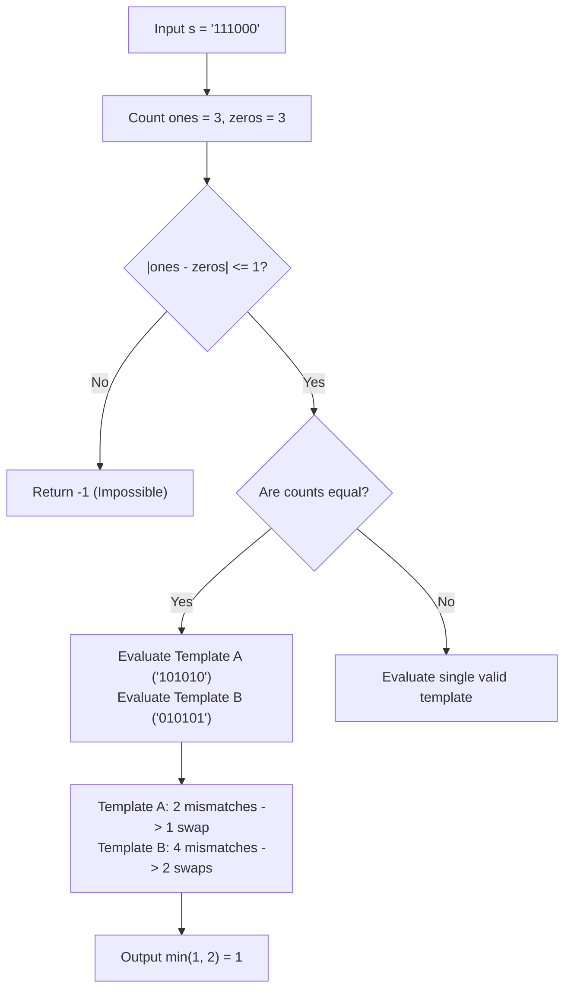

# Guided Example: Minimum Number of Swaps to Make the Binary String Alternating

We trace the step-by-step feasibility validation, alternating template construction, Hamming distance mismatch counting, and swap minimization for binary strings:

- **Input:** `s = "111000"`
- **Required Output:** `1`

This instance demonstrates verifying the necessary balance condition ($|n_1 - n_0| \le 1$), testing both valid alternating target templates (`"101010"` and `"010101"`), counting displaced characters, and dividing by 2 to compute the minimal arbitrary swap count.

---

## 1. Instance & Teaching Goal

We are given a binary string `s` of length $n$.
A string is alternating if no two adjacent characters are identical (i.e. $s[i] \neq s[i+1]$).
In one operation, we may swap any two characters in the string (arbitrary, non-adjacent swaps are permitted).
We must determine the minimum number of swaps to make `s` alternating, or return $-1$ if impossible.

In our instance:
- `s = "111000"` of length $n = 6$.
- Frequency count: three `'1'`s and three `'0'`s ($n_1 = 3, n_0 = 3$).
- Because $n_1 == n_0$, two alternating target patterns of length 6 are feasible:
  - Target A (starts with `'1'`): `"101010"`.
  - Target B (starts with `'0'`): `"010101"`.
- Comparing `s = "111000"` against Target A (`"101010"`):
  - Index 1: `s[1] = '1'`, target expects `'0'`.
  - Index 4: `s[4] = '0'`, target expects `'1'`.
  - Exactly 2 positions are mismatched.
  - A single swap between index 1 and index 4 corrects both errors simultaneously:
    $$\text{"111000"} \to \text{"101010"}$$
  - Cost is $2 / 2 = 1$ swap.
- Comparing `s = "111000"` against Target B (`"010101"`):
  - 4 positions are mismatched $\implies 4 / 2 = 2$ swaps.
- Minimal swaps needed: $\min(1, 2) = 1$.

The teaching goal is to model the problem via **Hamming distance to ideal alternating templates**:
1. Check cardinality balance $|n_1 - n_0| \le 1$.
2. Select legal template(s) based on character counts.
3. Compute the number of misplaced `'1'`s; because each swap moves one `'1'` to a `'0'` slot and one `'0'` to a `'1'` slot, the minimum swap count is exactly the number of misplaced `'1'`s (half the total Hamming distance).

---

## 2. Conceptual Foundation & Invariants

### Alternating Template & Swap Equivalence Theorem

> **Hamming Distance Parity & Dual Alternating Template Theorem.**
> 1. *Cardinality Feasibility Condition:* An alternating string of length $n$ must satisfy:
>    $$|n_1 - n_0| \le 1$$
>    If $|n_1 - n_0| > 1$, no rearrangement can produce an alternating string, and the algorithm must return $-1$.
> 2. *Template Uniqueness by Parity:*
>    - If $n_1 > n_0$, the target must start with `'1'` (`"1010..."`).
>    - If $n_0 > n_1$, the target must start with `'0'` (`"0101..."`).
>    - If $n_1 == n_0$, both templates are valid, and the answer is the minimum swaps over both candidates.
> 3. *Swap Equivalence Identity:* For any valid template $T$, let $H(s, T)$ be the number of mismatched indices. Because swapping exchanges one `'1'` with one `'0'`, every swap simultaneously corrects exactly one misplaced `'1'` and one misplaced `'0'`:
>    $$\text{Swaps}(s, T) = \frac{H(s, T)}{2} = |\{i \mid s[i] == \text{'1'} \land T[i] == \text{'0'}\}|$$
> 4. *Complexity:* Checking counts and calculating the Hamming distance requires scanning $s$ once or twice, operating in $\mathcal{O}(n)$ time and $\mathcal{O}(1)$ auxiliary space.

---

## 3. Step-by-Step Worked Execution

We trace the algorithm on `s = "111000"`.

---

### Step 1: Character Counting & Feasibility
- Count of `'1'`s: $n_1 = 3$.
- Count of `'0'`s: $n_0 = 3$.
- Check absolute difference: $|3 - 3| = 0 \le 1$.
- Feasibility confirmed.
- Because $n_1 == n_0$, both alternating templates of length $6$ must be tested.

---

### Step 2: Test Template A (Starts with `'1'`: `"101010"`)
Compare `s = "111000"` with $T_A = \text{"101010"}$:
- Index 0: $s[0] = \text{'1'}, T_A[0] = \text{'1'} \implies$ Match.
- Index 1: $s[1] = \text{'1'}, T_A[1] = \text{'0'} \implies$ **Mismatch** (misplaced `'1'`).
- Index 2: $s[2] = \text{'1'}, T_A[2] = \text{'1'} \implies$ Match.
- Index 3: $s[3] = \text{'0'}, T_A[3] = \text{'0'} \implies$ Match.
- Index 4: $s[4] = \text{'0'}, T_A[4] = \text{'1'} \implies$ **Mismatch** (misplaced `'0'`).
- Index 5: $s[5] = \text{'0'}, T_A[5] = \text{'0'} \implies$ Match.

Total mismatches: $H(s, T_A) = 2$.
Required swaps for Template A:
$$\text{Cost}_A = \frac{2}{2} = 1$$

---

### Step 3: Test Template B (Starts with `'0'`: `"010101"`)
Compare `s = "111000"` with $T_B = \text{"010101"}$:
- Index 0: $s[0] = \text{'1'}, T_B[0] = \text{'0'} \implies$ **Mismatch** (misplaced `'1'`).
- Index 1: $s[1] = \text{'1'}, T_B[1] = \text{'1'} \implies$ Match.
- Index 2: $s[2] = \text{'1'}, T_B[2] = \text{'0'} \implies$ **Mismatch** (misplaced `'1'`).
- Index 3: $s[3] = \text{'0'}, T_B[3] = \text{'1'} \implies$ **Mismatch** (misplaced `'0'`).
- Index 4: $s[4] = \text{'0'}, T_B[4] = \text{'0'} \implies$ Match.
- Index 5: $s[5] = \text{'0'}, T_B[5] = \text{'1'} \implies$ **Mismatch** (misplaced `'0'`).

Total mismatches: $H(s, T_B) = 4$.
Required swaps for Template B:
$$\text{Cost}_B = \frac{4}{2} = 2$$

---

### Step 4: Minimum Selection
$$\text{Result} = \min(\text{Cost}_A, \text{Cost}_B) = \min(1, 2) = 1$$
Output: **`1`**.

---

## 4. Complete Execution Trace

| Index $i$ | Source $s[i]$ | Template A $T_A[i]$ | Matches $T_A$? | Template B $T_B[i]$ | Matches $T_B$? |
|:---:|:---:|:---:|:---:|:---:|:---:|
| 0 | `'1'` | `'1'` | Yes | `'0'` | **No** |
| 1 | `'1'` | `'0'` | **No** | `'1'` | Yes |
| 2 | `'1'` | `'1'` | Yes | `'0'` | **No** |
| 3 | `'0'` | `'0'` | Yes | `'1'` | **No** |
| 4 | `'0'` | `'1'` | **No** | `'0'` | Yes |
| 5 | `'0'` | `'0'` | Yes | `'1'` | **No** |
| **Total** | - | - | **2 Mismatches** | - | **4 Mismatches** |
| **Swaps** | - | - | **1 Swap** | - | **2 Swaps** |

---

## 5. Algorithmic Correctness

**Soundness.** Swapping character $s[i]$ with $s[j]$ exchanges their positions. When $s[i] == \text{'1'}$ and $s[j] == \text{'0'}$, placing them into slots where $T[i] == \text{'0'}$ and $T[j] == \text{'1'}$ corrects both locations in a single operation. Since each swap fixes at most 2 misplaced characters, at least $H(s, T) / 2$ swaps are strictly necessary.

**Completeness.** There are only two possible alternating patterns for any given length $n$. Testing all valid templates conforming to the available counts of zeros and ones guarantees that the global minimum swap count is selected.

---

## 6. Traps This Instance Exposes

- **Failing Feasibility on Unequal Counts:** If $n_1 - n_0 = 2$ (e.g. `"1110"`), returning a swap count based on naive template difference would fail because no alternating string can accommodate three 1s and one 0.
- **Testing the Wrong Template on Odd Lengths:** When length is odd (e.g. $n = 5$ with three 1s and two 0s), the template *must* start with `'1'`. Testing the `'0'`-start template would attempt to match against an impossible multiset.
- **Adjacent vs Arbitrary Swaps:** Because swaps can be between any two arbitrary indices, the cost is half the Hamming distance, unlike adjacent bubble swaps which depend on distance between indices.

---

## 7. Complexity Derivation

- **Time Complexity:** $\mathcal{O}(n)$, where $n$ is the length of string `s`. Counting zeros and ones takes $\mathcal{O}(n)$, and comparing characters against at most two templates takes $2 \times \mathcal{O}(n) = \mathcal{O}(n)$ time.
- **Auxiliary Space Complexity:** $\mathcal{O}(1)$, requiring only scalar integer counters.
