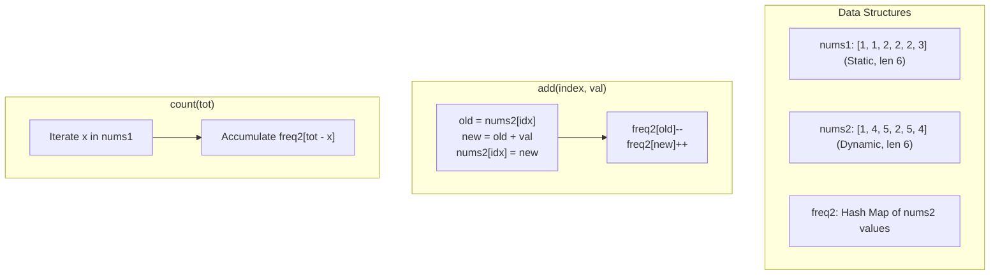

# Guided Example: Finding Pairs With a Certain Sum

We trace the step-by-step state evolution of an asymmetric cross-array complement search system under dynamic updates and targeted pair-sum queries:

- **Input:**
  - `nums1 = [1, 1, 2, 2, 2, 3]`
  - `nums2 = [1, 4, 5, 2, 5, 4]`
  - Operations: `["FindSumPairs", "count", "add", "count", "count"]`
  - Arguments: `[[...], [7], [3, 2], [8], [4]]`
- **Required Output:** `[null, 8, null, 2, 1]`

This instance demonstrates exploiting problem asymmetry ($|nums1| \le 1000$ is small and static, while $|nums2| \le 10^5$ is dynamic), maintaining a frequency hash map for `nums2` in $\mathcal{O}(1)$ per update, and evaluating `count` by scanning `nums1` in $\mathcal{O}(|nums1|)$ time.

---

## 1. Instance & Teaching Goal

We are given two integer arrays `nums1` and `nums2`.
The system supports two operations:
1. `add(index, val)`: Increments `nums2[index]` by positive amount `val`.
2. `count(tot)`: Returns the number of index pairs $(i, j)$ such that $\text{nums1}[i] + \text{nums2}[j] == \text{tot}$.

A naive approach pairs all elements, requiring $\mathcal{O}(|nums1| \times |nums2|)$ time per `count` call (up to $1000 \times 10^5 = 10^8$ operations), which times out over multiple queries.

In our instance:
- `nums1 = [1, 1, 2, 2, 2, 3]` (size 6, static).
- Initial `nums2 = [1, 4, 5, 2, 5, 4]` (size 6, frequencies: $\{1: 1, 2: 1, 4: 2, 5: 2\}$).
- **Operation 1: `count(7)`:**
  - For each $x \in nums1$, we query the frequency of complement $7 - x$ in `nums2`:
    - For $x = 1$ (occurs twice): need $7 - 1 = 6 \implies \text{freq}(6) = 0$.
    - For $x = 2$ (occurs three times): need $7 - 2 = 5 \implies \text{freq}(5) = 2$. Contribution: $3 \times 2 = 6$.
    - For $x = 3$ (occurs once): need $7 - 3 = 4 \implies \text{freq}(4) = 2$. Contribution: $1 \times 2 = 2$.
  - Total pairs: $6 + 2 = 8$.
- **Operation 2: `add(3, 2)`:**
  - At index 3, `nums2[3]` changes from $2$ to $2 + 2 = 4$.
  - Frequency of $2$ decreases: $1 \to 0$.
  - Frequency of $4$ increases: $2 \to 3$.
- **Operation 3: `count(8)`:**
  - For $x = 1$: need $7 \implies \text{freq}(7) = 0$.
  - For $x = 2$: need $6 \implies \text{freq}(6) = 0$.
  - For $x = 3$: need $5 \implies \text{freq}(5) = 2$. Contribution: $1 \times 2 = 2$.
  - Total pairs: $2$.
- **Operation 4: `count(4)`:**
  - For $x = 1$: need $3 \implies \text{freq}(3) = 0$.
  - For $x = 2$: need $2 \implies \text{freq}(2) = 0$ (value 2 was incremented to 4!).
  - For $x = 3$: need $1 \implies \text{freq}(1) = 1$. Contribution: $1 \times 1 = 1$.
  - Total pairs: $1$.

The teaching goal is to recognize **structural asymmetry**: since only `nums2` undergoes mutation and `nums1` is small ($|nums1| \le 1000$), storing `nums2` in a hash map gives $\mathcal{O}(1)$ updates and $\mathcal{O}(|nums1|)$ query time.

---

## 2. Conceptual Foundation & Invariants

### Cross-Array Complement Invariant Theorem

> **Asymmetric Hash Table Frequency & Cross-Array Complement Theorem.**
> 1. *Algebraic Complement Equivalence:* An ordered pair $(i, j)$ satisfies $\text{nums1}[i] + \text{nums2}[j] == tot$ if and only if:
>    $$\text{nums2}[j] = tot - \text{nums1}[i]$$
> 2. *Hash Map Frequency Maintenance:* Let $\text{freq}[v]$ record the count of indices $j$ such that $\text{nums2}[j] == v$.
>    - For `add(idx, val)`:
>      Let $v_{\text{old}} = \text{nums2}[idx]$ and $v_{\text{new}} = v_{\text{old}} + val$.
>      Update $\text{nums2}[idx] \gets v_{\text{new}}$, $\text{freq}[v_{\text{old}}] \gets \text{freq}[v_{\text{old}}] - 1$, and $\text{freq}[v_{\text{new}}] \gets \text{freq}[v_{\text{new}}] + 1$ in $\mathcal{O}(1)$ time.
> 3. *Query Evaluation:* For `count(tot)`, summing the frequencies of complements over all elements of `nums1`:
>    $$\text{count}(tot) = \sum_{i=0}^{|nums1|-1} \text{freq}[tot - \text{nums1}[i]]$$
> 4. *Complexity:* `add` runs in $\mathcal{O}(1)$ time. `count` runs in $\mathcal{O}(|nums1|)$ time. With $|nums1| \le 1000$, each query takes at most 1,000 hash map lookups.

---

## 3. Step-by-Step Worked Execution

We trace the operational sequence:

---

### Step 1: Construction `FindSumPairs`
- `nums1 = [1, 1, 2, 2, 2, 3]`.
- `nums2 = [1, 4, 5, 2, 5, 4]`.
- Build frequency map for `nums2`:
  - Value $1$: appears at index $0 \implies \text{freq}[1] = 1$.
  - Value $4$: appears at indices $1, 5 \implies \text{freq}[4] = 2$.
  - Value $5$: appears at indices $2, 4 \implies \text{freq}[5] = 2$.
  - Value $2$: appears at index $3 \implies \text{freq}[2] = 1$.
- Frequency state: $\{1: 1, 2: 1, 4: 2, 5: 2\}$.
- Result: `null`.

---

### Step 2: `count(7)`
Target $tot = 7$. Iterate through `nums1`:
- $x = 1$ (index 0): complement $7 - 1 = 6 \implies \text{freq}[6] = 0$.
- $x = 1$ (index 1): complement $7 - 1 = 6 \implies \text{freq}[6] = 0$.
- $x = 2$ (index 2): complement $7 - 2 = 5 \implies \text{freq}[5] = 2$.
- $x = 2$ (index 3): complement $7 - 2 = 5 \implies \text{freq}[5] = 2$.
- $x = 2$ (index 4): complement $7 - 2 = 5 \implies \text{freq}[5] = 2$.
- $x = 3$ (index 5): complement $7 - 3 = 4 \implies \text{freq}[4] = 2$.

Total: $0 + 0 + 2 + 2 + 2 + 2 = \mathbf{8}$.
Result: **`8`**.

---

### Step 3: `add(3, 2)`
- Target index in `nums2`: $idx = 3$.
- Current value: $v_{\text{old}} = \text{nums2}[3] = 2$.
- Added value: $val = 2$.
- New value: $v_{\text{new}} = 2 + 2 = 4$.
- Update array: $\text{nums2}[3] \gets 4$.
- Update frequency map:
  - $\text{freq}[2] \gets \text{freq}[2] - 1 = 1 - 1 = 0$.
  - $\text{freq}[4] \gets \text{freq}[4] + 1 = 2 + 1 = 3$.
- Updated frequencies: $\{1: 1, 2: 0, 4: 3, 5: 2\}$.
- Result: `null`.

---

### Step 4: `count(8)`
Target $tot = 8$. Iterate through `nums1`:
- $x = 1$ (indices 0, 1): complement $8 - 1 = 7 \implies \text{freq}[7] = 0$.
- $x = 2$ (indices 2, 3, 4): complement $8 - 2 = 6 \implies \text{freq}[6] = 0$.
- $x = 3$ (index 5): complement $8 - 3 = 5 \implies \text{freq}[5] = 2$.

Total: $0 + 0 + 2 = \mathbf{2}$.
Result: **`2`**.

---

### Step 5: `count(4)`
Target $tot = 4$. Iterate through `nums1`:
- $x = 1$ (indices 0, 1): complement $4 - 1 = 3 \implies \text{freq}[3] = 0$.
- $x = 2$ (indices 2, 3, 4): complement $4 - 2 = 2 \implies \text{freq}[2] = 0$ (note that the old 2 became 4).
- $x = 3$ (index 5): complement $4 - 3 = 1 \implies \text{freq}[1] = 1$.

Total: $0 + 0 + 1 = \mathbf{1}$.
Result: **`1`**.

---

## 4. Complete Execution Trace

| Operation | Arguments | Mutated State in `nums2` | Updated Frequency Map | Target Complement Sum | Return Value |
|:---:|:---:|:---|:---|:---|:---:|
| `Init` | - | `nums2 = [1, 4, 5, 2, 5, 4]` | $\{1:1, 2:1, 4:2, 5:2\}$ | - | `null` |
| `count` | `7` | Unchanged | $\{1:1, 2:1, 4:2, 5:2\}$ | $2 \times \text{f}(6) + 3 \times \text{f}(5) + 1 \times \text{f}(4) = 8$ | **`8`** |
| `add` | `[3, 2]` | $\text{nums2}[3]: 2 \to 4$ | $\{1:1, 2:0, 4:3, 5:2\}$ | - | `null` |
| `count` | `8` | Unchanged | $\{1:1, 2:0, 4:3, 5:2\}$ | $2 \times \text{f}(7) + 3 \times \text{f}(6) + 1 \times \text{f}(5) = 2$ | **`2`** |
| `count` | `4` | Unchanged | $\{1:1, 2:0, 4:3, 5:2\}$ | $2 \times \text{f}(3) + 3 \times \text{f}(2) + 1 \times \text{f}(1) = 1$ | **`1`** |

---

## 5. Algorithmic Correctness

**Soundness.** For each $x \in nums1$, $\text{freq}[tot - x]$ counts exactly the number of indices $j$ in `nums2` where $\text{nums2}[j] == tot - x$. Summing over all $i$ yields the exact number of pairs $(i, j)$ satisfying $nums1[i] + nums2[j] == tot$.

**Completeness.** Every element of `nums1` is queried against the live frequency table of `nums2`. Because `add` accurately adjusts both the underlying array slot and the associated frequency buckets, the state is strictly synchronized at all times.

---

## 6. Traps This Instance Exposes

- **Inverting the Data Structure Role:** Hashing `nums1` and looping over `nums2` would require $\mathcal{O}(|nums2|) = 10^5$ operations per count query, causing Time Limit Exceeded. Hashing `nums2` and iterating over `nums1` requires at most $1000$ operations per query.
- **Forgetting to Update the Array Slot:** Updating only the frequency map without updating `nums2[index]` prevents correctly identifying $v_{\text{old}}$ on a subsequent `add` at the same index.
- **Zero-Frequency Keys:** When a value's count reaches zero, it must contribute zero (or be deleted from the hash map) so that later queries do not receive phantom matches.

---

## 7. Complexity Derivation

- **Initialization Time:** $\mathcal{O}(|nums1| + |nums2|)$ to store arrays and build the frequency map of `nums2`.
- **`add(index, val)` Time:** $\mathcal{O}(1)$ average time to update `nums2[index]` and adjust hash map frequencies.
- **`count(tot)` Time:** $\mathcal{O}(|nums1|)$ time (at most 1,000 hash map lookups per query).
- **Auxiliary Space Complexity:** $\mathcal{O}(|nums2|)$ to maintain `nums2` and its frequency hash table.
