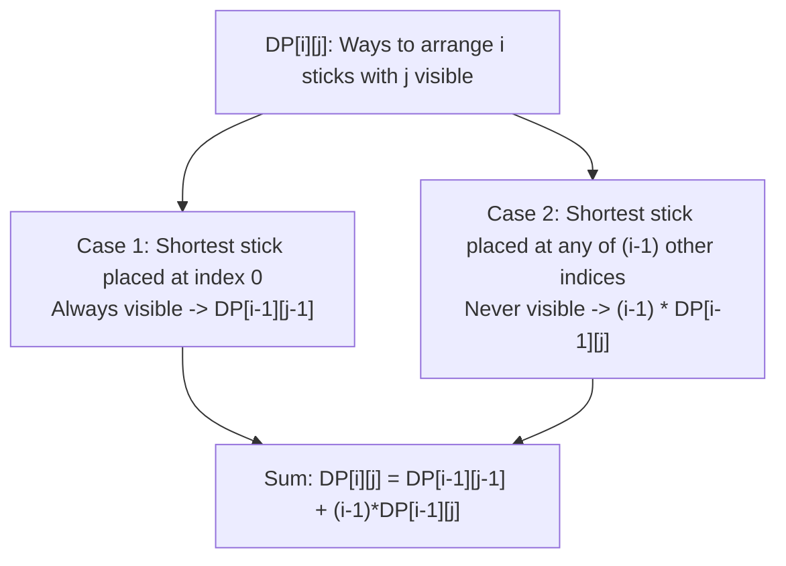

# Guided Example: Number of Ways to Rearrange Sticks With K Sticks Visible

We trace the step-by-step combinatorial derivation and dynamic programming recurrence for permutations with exactly $k$ left-to-right prefix maxima (unsigned Stirling numbers of the first kind):

- **Input:** `n = 3, k = 2`
- **Required Output:** `3`

This instance demonstrates how conditioning on the position of the shortest stick establishes an exact two-branch recurrence, showing why the 6 permutations of $[1, 2, 3]$ partition into subsets having 1, 2, or 3 visible elements.

---

## 1. Instance & Teaching Goal

We are given $n$ sticks of distinct lengths $1, 2, \dots, n$.
When arranged in a permutation, a stick is **visible from the left** if and only if every stick appearing before it is strictly shorter (i.e. it forms a new running maximum from the left).
We must count the number of permutations of $\{1, \dots, n\}$ that have exactly $k$ visible sticks, returning the count modulo $10^9 + 7$.

In our instance with $n = 3, k = 2$:
- All $3! = 6$ permutations of $[1, 2, 3]$:
  1. `[1, 2, 3]`: Running maxima are $1, 2, 3 \implies 3$ visible sticks.
  2. `[1, 3, 2]`: Running maxima are $1, 3$ (stick 2 is hidden behind 3) $\implies 2$ visible sticks.
  3. `[2, 1, 3]`: Running maxima are $2, 3$ (stick 1 is hidden behind 2) $\implies 2$ visible sticks.
  4. `[2, 3, 1]`: Running maxima are $2, 3$ (stick 1 is hidden behind 2) $\implies 2$ visible sticks.
  5. `[3, 1, 2]`: Running maximum is $3$ (all other sticks are shorter) $\implies 1$ visible stick.
  6. `[3, 2, 1]`: Running maximum is $3$ $\implies 1$ visible stick.
- The qualifying permutations with exactly $2$ visible sticks are `[1, 3, 2]`, `[2, 1, 3]`, and `[2, 3, 1]`.
- Total count: $3$.

The teaching goal is to recognize that left-to-right records in a permutation are isomorphic to **cycles in a permutation**, counted by the unsigned Stirling numbers of the first kind:
$$\left[ \begin{matrix} n \\ k \end{matrix} \right]$$
Conditioning on whether the shortest stick (length 1) is placed at the front or elsewhere yields the optimal $\mathcal{O}(n \cdot k)$ dynamic programming recurrence.

---

## 2. Conceptual Foundation & Invariants

### Prefix Maxima & Stirling Number Invariant Theorem

> **Prefix Maxima Decomposition & Stirling Number Recurrence Theorem.**
> 1. *Shortest Element Conditioning:* Consider placing the smallest element (length $1$) among $i$ elements:
>    - **Case 1 (First Position):** If length $1$ is placed at the first position, it is guaranteed to be visible (no elements precede it). The remaining $i - 1$ elements must contribute exactly $j - 1$ visible sticks among themselves. This contributes $DP[i - 1][j - 1]$ ways.
>    - **Case 2 (Any of the Other $i - 1$ Positions):** If length $1$ is placed in any of the remaining $i - 1$ slots, it can *never* be visible because at least one preceding stick has length $\ge 2 > 1$. The remaining $i - 1$ elements must still contribute all $j$ visible sticks. There are $i - 1$ valid positions for stick $1$, contributing $(i - 1) \times DP[i - 1][j]$ ways.
> 2. *Fundamental Recurrence:*
>    $$DP[i][j] = \left( DP[i - 1][j - 1] + (i - 1) \cdot DP[i - 1][j] \right) \bmod (10^9 + 7)$$
> 3. *Boundary Conditions:*
>    - $DP[0][0] = 1$
>    - $DP[i][0] = 0$ for $i \ge 1$
>    - $DP[i][j] = 0$ whenever $j > i$
> 4. *Complexity:* The $n \times k$ state space requires $\mathcal{O}(n \cdot k)$ transitions, each executing in $\mathcal{O}(1)$ time.

---

## 3. Step-by-Step Worked Execution

We construct the DP table for $n = 3, k = 2$.

---

### Step 1: Base Case Initialization ($i = 0, 1$)
- Row $i = 0$: $DP[0][0] = 1$.
- Row $i = 1$:
  - $j = 1$: $DP[1][1] = DP[0][0] + 0 \times DP[0][1] = 1 + 0 = 1$.
  - Single stick `[1]` has $1$ visible stick.

---

### Step 2: Compute Row $i = 2$
Available sticks $\{1, 2\}$.

1. **For $j = 1$:**
   $$DP[2][1] = DP[1][0] + (2 - 1) \cdot DP[1][1] = 0 + 1 \cdot 1 = 1$$
   (Corresponds to `[2, 1]`).

2. **For $j = 2$:**
   $$DP[2][2] = DP[1][1] + (2 - 1) \cdot DP[1][2] = 1 + 1 \cdot 0 = 1$$
   (Corresponds to `[1, 2]`).

Row $2$ state: $DP[2] = [0, 1, 1]$.

---

### Step 3: Compute Row $i = 3$ (Target $n = 3$)
Available sticks $\{1, 2, 3\}$.

1. **For $j = 1$:**
   $$DP[3][1] = DP[2][0] + (3 - 1) \cdot DP[2][1] = 0 + 2 \cdot 1 = 2$$
   (Corresponds to `[3, 1, 2]` and `[3, 2, 1]`).

2. **For $j = 2$ (Target State!):**
   - Place stick $1$ at index $0$: requires $j - 1 = 1$ visible from remaining $\{2, 3\} \implies DP[2][1] = 1$.
   - Place stick $1$ at other $2$ positions: requires $j = 2$ visible from remaining $\{2, 3\} \implies 2 \times DP[2][2] = 2 \times 1 = 2$.
   - Combine branches:
     $$DP[3][2] = DP[2][1] + 2 \cdot DP[2][2] = 1 + 2 = \mathbf{3}$$

3. **For $j = 3$:**
   $$DP[3][3] = DP[2][2] + 2 \cdot DP[2][3] = 1 + 2 \cdot 0 = 1$$
   (Corresponds to `[1, 2, 3]`).

Target result $DP[3][2] = 3$.

---

### Step 4: Final Output
Result: **`3`**.

---

## 4. Complete Execution Trace

| Stick Count $i$ | Visible Count $j$ | $DP[i-1][j-1]$ (Front) | $(i-1) \cdot DP[i-1][j]$ (Interior) | Recurrence Calculation | Resulting $DP[i][j]$ |
|:---:|:---:|:---:|:---:|:---:|:---:|
| 1 | 1 | $DP[0][0] = 1$ | $0 \times DP[0][1] = 0$ | $1 + 0$ | 1 |
| 2 | 1 | $DP[1][0] = 0$ | $1 \times DP[1][1] = 1$ | $0 + 1$ | 1 |
| 2 | 2 | $DP[1][1] = 1$ | $1 \times DP[1][2] = 0$ | $1 + 0$ | 1 |
| 3 | 1 | $DP[2][0] = 0$ | $2 \times DP[2][1] = 2$ | $0 + 2$ | 2 |
| 3 | 2 | $DP[2][1] = 1$ | $2 \times DP[2][2] = 2$ | $1 + 2$ | **3** |
| 3 | 3 | $DP[2][2] = 1$ | $2 \times DP[2][3] = 0$ | $1 + 0$ | 1 |

---

## 5. Algorithmic Correctness

**Soundness.** In any permutation of length $i$, the smallest element (1) is either at the first position (guaranteed to establish a record) or not at the first position (guaranteed to never establish a record). These two events are mutually exclusive and completely partition the permutation space of size $i!$. Multiplying the non-first placements by $(i - 1)$ accounts for each available index.

**Completeness.** Computing rows in ascending order $i = 1 \dots n$ ensures that all subproblems $DP[i-1][\dots]$ are fully resolved before computing $DP[i][\dots]$, capturing the complete distribution of visible counts without omission.

---

## 6. Traps This Instance Exposes

- **Conditioning on the Tallest Stick Instead of the Shortest:** If one conditions on the tallest stick (length $n$), placing it at index $p$ hides all sticks to its right, requiring a convolution sum $\sum \binom{n-1}{p} DP[p][j-1] (n-1-p)!$, which is quadratic per state and takes $\mathcal{O}(n^2 k)$ time. Conditioning on the *shortest* stick avoids the convolution entirely, reducing transitions to $\mathcal{O}(1)$.
- **Modulo Operations on Multiplication:** When computing $(i - 1) \cdot DP[i-1][j]$, integer overflow can occur in 32-bit arithmetic before modulo reduction. 64-bit integer multiplication is required.
- **Off-By-One Visibility:** When $k > n$, it is mathematically impossible to have more visible sticks than total sticks; $DP[n][k]$ is strictly $0$.

---

## 7. Complexity Derivation

- **Time Complexity:** $\mathcal{O}(n \cdot k)$, where $n \le 1000$ and $k \le n$. There are $n \times k$ table entries, each computed in $\mathcal{O}(1)$ time via addition and multiplication.
- **Auxiliary Space Complexity:** $\mathcal{O}(k)$ by using rolling arrays (keeping only the previous row $DP[i-1]$), or $\mathcal{O}(n \cdot k)$ to store the complete DP matrix.
