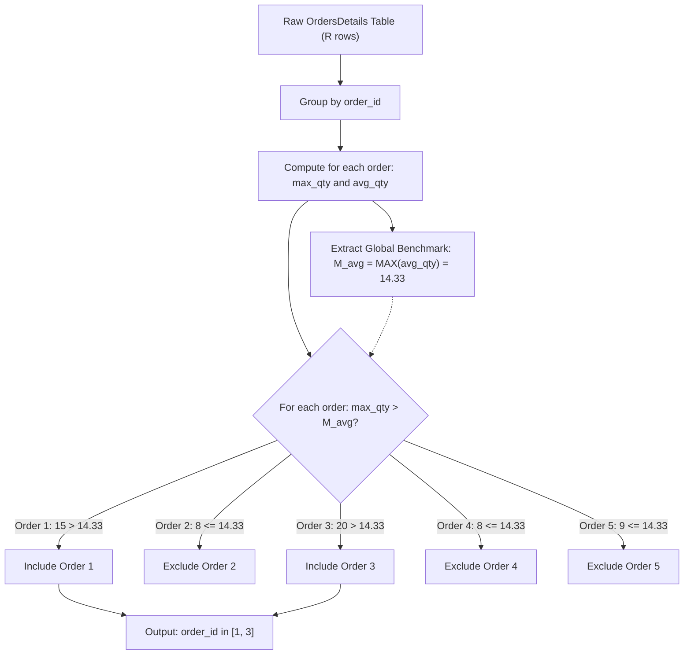

# Guided Example: Orders With Maximum Quantity Above Average

We trace the step-by-step group aggregation, order-level average calculation, global average supremum extraction, and strict maximum quantity filtering:

- **Input:**
  - `OrdersDetails` table:
    - Order 1: Product 1 (qty 12), Product 2 (qty 10), Product 3 (qty 15)
    - Order 2: Product 1 (qty 8), Product 4 (qty 4), Product 5 (qty 6), Product 9 (qty 4)
    - Order 3: Product 3 (qty 5), Product 4 (qty 18), Product 9 (qty 20)
    - Order 4: Product 5 (qty 2), Product 6 (qty 8)
    - Order 5: Product 7 (qty 9), Product 8 (qty 9)
- **Required Output:**

| order_id |
|:---:|
| 1 |
| 3 |

This instance demonstrates calculating order-level summary statistics (`AVG` and `MAX` quantity), determining the maximum among all order averages across the entire dataset ($14.33$), and selecting orders whose individual peak quantity strictly exceeds this global benchmark.

---

## 1. Instance & Teaching Goal

For each customer order in `OrdersDetails`, we consider:
1. Its **average product quantity**: $\text{avg}(O) = \frac{\sum q}{|O|}$.
2. Its **maximum product quantity**: $\text{max}(O) = \max_{q \in O} q$.

An order $O_i$ is reported if and only if its maximum quantity is strictly greater than the average quantity of **every** order in the table:
$$\text{max}(O_i) > \text{avg}(O_j) \quad \text{for all } j$$
Equivalently, $\text{max}(O_i) > \max_{j} \text{avg}(O_j)$.

In our instance:
- **Order 1:** Quantities $[12, 10, 15]$. Sum $= 37$, count $= 3$.
  - $\text{avg}(O_1) = 37 / 3 \approx 12.33$
  - $\text{max}(O_1) = 15$
- **Order 2:** Quantities $[8, 4, 6, 4]$. Sum $= 22$, count $= 4$.
  - $\text{avg}(O_2) = 22 / 4 = 5.50$
  - $\text{max}(O_2) = 8$
- **Order 3:** Quantities $[5, 18, 20]$. Sum $= 43$, count $= 3$.
  - $\text{avg}(O_3) = 43 / 3 \approx 14.33$
  - $\text{max}(O_3) = 20$
- **Order 4:** Quantities $[2, 8]$. Sum $= 10$, count $= 2$.
  - $\text{avg}(O_4) = 10 / 2 = 5.00$
  - $\text{max}(O_4) = 8$
- **Order 5:** Quantities $[9, 9]$. Sum $= 18$, count $= 2$.
  - $\text{avg}(O_5) = 18 / 2 = 9.00$
  - $\text{max}(O_5) = 9$
- Per-order averages: $[12.33, 5.50, 14.33, 5.00, 9.00]$.
- Global maximum average: $\max_j \text{avg}(O_j) = 14.33$ (from Order 3).
- Checking $\text{max}(O_i) > 14.33$:
  - Order 1: $15 > 14.33$ (Qualifies!)
  - Order 2: $8 \le 14.33$ (Fails)
  - Order 3: $20 > 14.33$ (Qualifies!)
  - Order 4: $8 \le 14.33$ (Fails)
  - Order 5: $9 \le 14.33$ (Fails)
- Qualifying order IDs: `1` and `3`.

The teaching goal is to structure two-stage relational aggregation: grouping by `order_id` to obtain local metrics, extracting the scalar maximum of averages, and filtering groups whose `MAX(quantity)` strictly surpasses that scalar.

---

## 2. Conceptual Foundation & Invariants

### Global Average Supremum Invariant Theorem

> **Order-Level Aggregation & Global Average Supremum Filter Theorem.**
> 1. *Universal Quantification Equivalence:* The condition $\forall j, \text{max}(O_i) > \text{avg}(O_j)$ is mathematically equivalent to:
>    $$\text{max}(O_i) > \sup_{j} \text{avg}(O_j)$$
> 2. *Strict Inequality Requirement:* The threshold comparison must be strictly greater ($>$). Equality $\text{max}(O_i) = \sup_j \text{avg}(O_j)$ fails the condition.
> 3. *Two-Stage Aggregation Pipeline:*
>    - Stage 1: Group by `order_id`, computing $\text{MAX}(quantity)$ and $\text{AVG}(quantity)$ for each order.
>    - Stage 2: Filter orders satisfying $\text{MAX}(quantity) > (\text{SELECT MAX}(avg\_qty) \text{ FROM Stage 1})$.
> 4. *Complexity:* Grouping $R$ rows takes $\mathcal{O}(R \log R)$ or $\mathcal{O}(R)$ via hash aggregation. Extracting the scalar maximum and filtering $G$ distinct orders takes $\mathcal{O}(G)$ time.

---

## 3. Step-by-Step Worked Execution

We trace the dataset through each relational step:

---

### Step 1: Group Aggregation by `order_id`
Compute summary statistics for each distinct order:

1. **Order 1:**
   - Quantities: $\{12, 10, 15\}$.
   - Count $= 3$, Sum $= 12 + 10 + 15 = 37$.
   - Average: $\text{avg}_1 = 37 / 3 \approx 12.333$.
   - Maximum: $\text{max}_1 = 15$.

2. **Order 2:**
   - Quantities: $\{8, 4, 6, 4\}$.
   - Count $= 4$, Sum $= 8 + 4 + 6 + 4 = 22$.
   - Average: $\text{avg}_2 = 22 / 4 = 5.5$.
   - Maximum: $\text{max}_2 = 8$.

3. **Order 3:**
   - Quantities: $\{5, 18, 20\}$.
   - Count $= 3$, Sum $= 5 + 18 + 20 = 43$.
   - Average: $\text{avg}_3 = 43 / 3 \approx 14.333$.
   - Maximum: $\text{max}_3 = 20$.

4. **Order 4:**
   - Quantities: $\{2, 8\}$.
   - Count $= 2$, Sum $= 2 + 8 = 10$.
   - Average: $\text{avg}_4 = 10 / 2 = 5.0$.
   - Maximum: $\text{max}_4 = 8$.

5. **Order 5:**
   - Quantities: $\{9, 9\}$.
   - Count $= 2$, Sum $= 9 + 9 = 18$.
   - Average: $\text{avg}_5 = 18 / 2 = 9.0$.
   - Maximum: $\text{max}_5 = 9$.

---

### Step 2: Extract Global Benchmark
Evaluate the highest average among all 5 orders:
$$M_{\text{avg}} = \max(\{12.333, 5.5, 14.333, 5.0, 9.0\}) = 14.333$$
(Achieved by Order 3).

---

### Step 3: Apply Selection Predicate $\text{max}_i > M_{\text{avg}}$
Compare each order's maximum against $M_{\text{avg}} \approx 14.333$:

- **Order 1:** $\text{max}_1 = 15$. Check: $15 > 14.333 \implies$ **True**. (Order 1 qualifies).
- **Order 2:** $\text{max}_2 = 8$. Check: $8 > 14.333 \implies$ False.
- **Order 3:** $\text{max}_3 = 20$. Check: $20 > 14.333 \implies$ **True**. (Order 3 qualifies).
- **Order 4:** $\text{max}_4 = 8$. Check: $8 > 14.333 \implies$ False.
- **Order 5:** $\text{max}_5 = 9$. Check: $9 > 14.333 \implies$ False.

---

### Step 4: Final Projection
The selected `order_id` values are:

| order_id |
|:---:|
| 1 |
| 3 |

---

## 4. Complete Execution Trace

| `order_id` | Product Quantities | Total Sum | Item Count | Order Average ($\text{avg}$) | Order Peak ($\text{max}$) | Compared to Global Benchmark ($14.333$) | Status |
|:---:|:---:|:---:|:---:|:---:|:---:|:---:|:---:|
| 1 | $12, 10, 15$ | 37 | 3 | $12.333$ | 15 | $15 > 14.333$ | **Selected** |
| 2 | $8, 4, 6, 4$ | 22 | 4 | $5.500$ | 8 | $8 \le 14.333$ | Rejected |
| 3 | $5, 18, 20$ | 43 | 3 | $14.333$ (Peak Avg) | 20 | $20 > 14.333$ | **Selected** |
| 4 | $2, 8$ | 10 | 2 | $5.000$ | 8 | $8 \le 14.333$ | Rejected |
| 5 | $9, 9$ | 18 | 2 | $9.000$ | 9 | $9 \le 14.333$ | Rejected |

---

## 5. Algorithmic Correctness

**Soundness.** Any order emitted has its `max(quantity)` strictly exceeding the maximum of all order averages. By transitivity, its maximum strictly exceeds every individual order's average quantity, satisfying the problem specification.

**Completeness.** Every order in `OrdersDetails` is aggregated into the candidate set. Because the global supremum of averages is exact, testing every order's maximum against this scalar bound guarantees zero false negatives and zero false positives.

---

## 6. Traps This Instance Exposes

- **Comparing to Own Average vs Global Maximum Average:** An order's maximum is almost always greater than its *own* average. The question requires exceeding the average of *every* order, meaning it must exceed the largest among all order averages.
- **Global Table Average Confusion:** Computing the average quantity over all rows in `OrdersDetails` ($\sum q / R$) is different from the average of each order ($\sum_{q \in O} q / |O|$). An order must exceed the *maximum of order averages*, not the flat table average.
- **Floating-Point Division:** In SQL engines where integer division truncates (e.g. $37 / 3 = 12$), dividing integers directly causes truncation errors; using `AVG()` or casting to decimal ensures precise comparisons.

---

## 7. Complexity Derivation

- **Time Complexity:** $\mathcal{O}(R \log G)$, where $R$ is the total number of rows in `OrdersDetails` and $G$ is the number of distinct orders. Grouping and aggregating takes $\mathcal{O}(R)$ time, finding the maximum of $G$ averages takes $\mathcal{O}(G)$, and filtering takes $\mathcal{O}(G)$.
- **Auxiliary Space Complexity:** $\mathcal{O}(G)$ to store the grouped summary metrics for each order.
