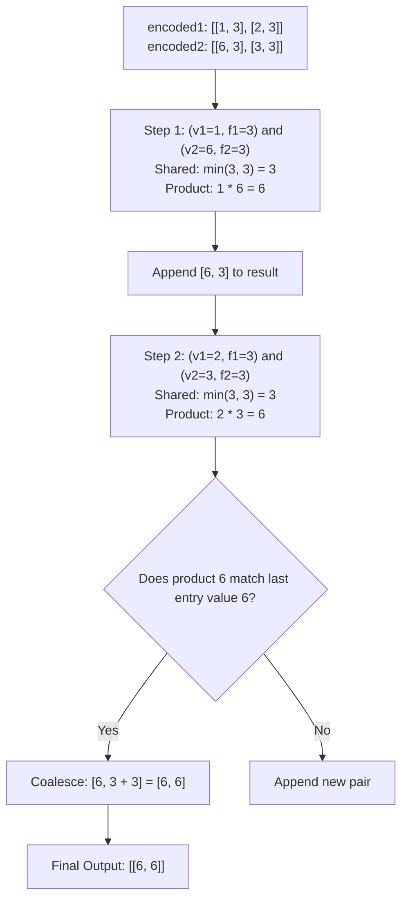

# Guided Example: Product of Two Run-Length Encoded Arrays

We trace the step-by-step elementwise multiplication and compressed segment coalescing of two run-length encoded (RLE) arrays using a two-pointer interval intersection sweep:

- **Input:**
  - `encoded1 = [[1, 3], [2, 3]]`
  - `encoded2 = [[6, 3], [3, 3]]`
- **Required Output:** `[[6, 6]]`

This instance demonstrates advancing two run-length pointers without expanding elements into massive uncompressed arrays, computing step-wise products over shared frequency overlaps, and coalescing adjacent identical product values (`[6, 3]` followed by `[6, 3]` merges into `[6, 6]`).

---

## 1. Instance & Teaching Goal

In Run-Length Encoding (RLE), a sequence of identical values is represented as a pair $[v, f]$, where $v$ is the numeric value and $f$ is its repetition frequency.
We are given two encoded arrays `encoded1` and `encoded2` representing arrays of the same total decoded length.
We must compute their elementwise product and return the compressed RLE representation of the resulting array.
Adjacent entries in the final output must never have the same value; adjacent runs of equal product value must be merged by summing their frequencies.
Decoded lengths can reach $10^9$, making full array expansion impossible in memory ($\mathcal{O}(L)$ Memory Limit Exceeded).

In our instance:
- `encoded1 = [[1, 3], [2, 3]]`:
  - Run 1: three $1$s.
  - Run 2: three $2$s.
  - Decoded: `[1, 1, 1, 2, 2, 2]` (length 6).
- `encoded2 = [[6, 3], [3, 3]]`:
  - Run 1: three $6$s.
  - Run 2: three $3$s.
  - Decoded: `[6, 6, 6, 3, 3, 3]` (length 6).
- Elementwise multiplication:
  - First 3 positions: $1 \times 6 = 6$ (frequency 3).
  - Next 3 positions: $2 \times 3 = 6$ (frequency 3).
- Notice that both intervals produce the same product value $6$.
- RLE compression requirement: because the second run also has value $6$, it must coalesce with the previous run:
  $$[6, 3] + [6, 3] \implies [6, 3 + 3] = [6, 6]$$
- Output: `[[6, 6]]`.

The teaching goal is to process RLE streams directly using **two-pointer interval intersection**: taking the minimum remaining frequency $\min(f_1, f_2)$ at each step, multiplying values, and appending to an accumulator that merges with the previous run whenever product values match.

---

## 2. Conceptual Foundation & Invariants

### RLE Interval Intersection Invariant Theorem

> **Run-Length Interval Intersection & Coalescing Stream Theorem.**
> 1. *Overlapping Frequency Invariant:* Let current active runs be $(v_1, f_1)$ from `encoded1` and $(v_2, f_2)$ from `encoded2`. The maximum shared length of consecutive elements pairing $v_1$ with $v_2$ is:
>    $$\Delta f = \min(f_1, f_2)$$
> 2. *Differential Decrement:* Each step consumes $\Delta f$ elements from both active runs:
>    $$f_1 \gets f_1 - \Delta f, \quad f_2 \gets f_2 - \Delta f$$
>    When an active run reaches frequency $0$, its pointer advances to the next RLE pair.
> 3. *Product Value Calculation:* The elementwise product over this span is the scalar $p = v_1 \times v_2$.
> 4. *Coalescence Invariant:* If the result list is non-empty and its last emitted entry $[v_{\text{last}}, f_{\text{last}}]$ satisfies $v_{\text{last}} == p$, then:
>    $$f_{\text{last}} \gets f_{\text{last}} + \Delta f$$
>    Otherwise, append a new run $[p, \Delta f]$.
> 5. *Complexity:* Each step exhausts at least one of the active RLE pairs. With $M = |encoded1|$ and $N = |encoded2|$, the total number of intersection steps is at most $M + N$, running in optimal $\mathcal{O}(M + N)$ time and $\mathcal{O}(M + N)$ space.

---

## 3. Step-by-Step Worked Execution

We trace the two pointers $i$ and $j$ on:
- `encoded1 = [[1, 3], [2, 3]]` (size $M = 2$)
- `encoded2 = [[6, 3], [3, 3]]` (size $N = 2$)

Initialize $i = 0, j = 0$, output list $R = []$.

---

### Step 1: First Segment Intersection ($i = 0, j = 0$)
- From `encoded1[0]`: $v_1 = 1, f_1 = 3$.
- From `encoded2[0]`: $v_2 = 6, f_2 = 3$.
- Shared frequency:
  $$\Delta f = \min(f_1, f_2) = \min(3, 3) = 3$$
- Compute product:
  $$p = v_1 \times v_2 = 1 \times 6 = 6$$
- Output list check: $R$ is currently empty.
- Append new run: $R \gets [[6, 3]]$.
- Update remaining frequencies:
  - $f_1 \gets 3 - 3 = 0 \implies$ advance $i \to 1$.
  - $f_2 \gets 3 - 3 = 0 \implies$ advance $j \to 1$.

---

### Step 2: Second Segment Intersection ($i = 1, j = 1$)
- From `encoded1[1]`: $v_1 = 2, f_1 = 3$.
- From `encoded2[1]`: $v_2 = 3, f_2 = 3$.
- Shared frequency:
  $$\Delta f = \min(f_1, f_2) = \min(3, 3) = 3$$
- Compute product:
  $$p = v_1 \times v_2 = 2 \times 3 = 6$$
- Output list check:
  - Last emitted entry in $R$ is $[6, 3]$ with value $6$.
  - Incoming product $p = 6$ matches the last emitted value!
  - **Coalesce:** Increment the frequency of the last entry:
    $$f_{\text{last}} \gets 3 + 3 = 6$$
  - Updated last entry: $[6, 6]$.
- Update remaining frequencies:
  - $f_1 \gets 3 - 3 = 0 \implies$ advance $i \to 2$.
  - $f_2 \gets 3 - 3 = 0 \implies$ advance $j \to 2$.

---

### Step 3: Termination & Output
- Both pointers reach the end of their respective lists ($i = 2 = M$, $j = 2 = N$).
- Final output: **`[[6, 6]]`**.

---

## 4. Complete Execution Trace

| Step | Active `encoded1` | Active `encoded2` | Shared Length $\Delta f = \min(f_1, f_2)$ | Calculated Product $p$ | Coalesce with Last Entry? | Output State $R$ |
|:---:|:---:|:---:|:---:|:---:|:---:|:---:|
| 1 | `[1, 3]` | `[6, 3]` | $\min(3, 3) = 3$ | $1 \times 6 = 6$ | First entry | `[[6, 3]]` |
| 2 | `[2, 3]` | `[3, 3]` | $\min(3, 3) = 3$ | $2 \times 3 = 6$ | **Yes** ($6 == 6 \implies 3 + 3 = 6$) | **`[[6, 6]]`** |

---

## 5. Algorithmic Correctness

**Soundness.** For each chunk of length $\Delta f$, all elements in `encoded1` have value $v_1$ and all elements in `encoded2` have value $v_2$. Their elementwise product is everywhere $v_1 \times v_2$. Merging adjacent runs of identical product values ensures the final output strictly adheres to the definition of a valid RLE encoding.

**Completeness.** At each iteration, $\Delta f = \min(f_1, f_2) > 0$ elements are fully resolved and decremented. Because total decoded lengths are identical, both pointers exhaust their inputs simultaneously, ensuring every element is multiplied and no tail remains unprocessed.

---

## 6. Traps This Instance Exposes

- **Decoded Array Expansion:** Unpacking `encoded1` and `encoded2` into flat arrays causes Out-Of-Memory / Time Limit Exceeded when frequencies reach $10^9$.
- **Failing to Merge Consecutive Identical Products:** Without checking $R[-1][0] == p$, the algorithm would output `[[6, 3], [6, 3]]`, which is an invalid RLE encoding because adjacent blocks share the same value.
- **Misaligned Frequencies:** When $f_1 \neq f_2$, only $\min(f_1, f_2)$ is consumed. The larger run must retain its residual frequency $f - \min(f_1, f_2)$ for the next loop iteration rather than advancing both pointers prematurely.

---

## 7. Complexity Derivation

- **Time Complexity:** $\mathcal{O}(M + N)$, where $M = |encoded1|$ and $N = |encoded2|$. In each iteration, at least one of the two pointers is advanced. Thus, at most $M + N$ iterations occur.
- **Auxiliary Space Complexity:** $\mathcal{O}(M + N)$ to hold the resulting merged RLE pairs.
