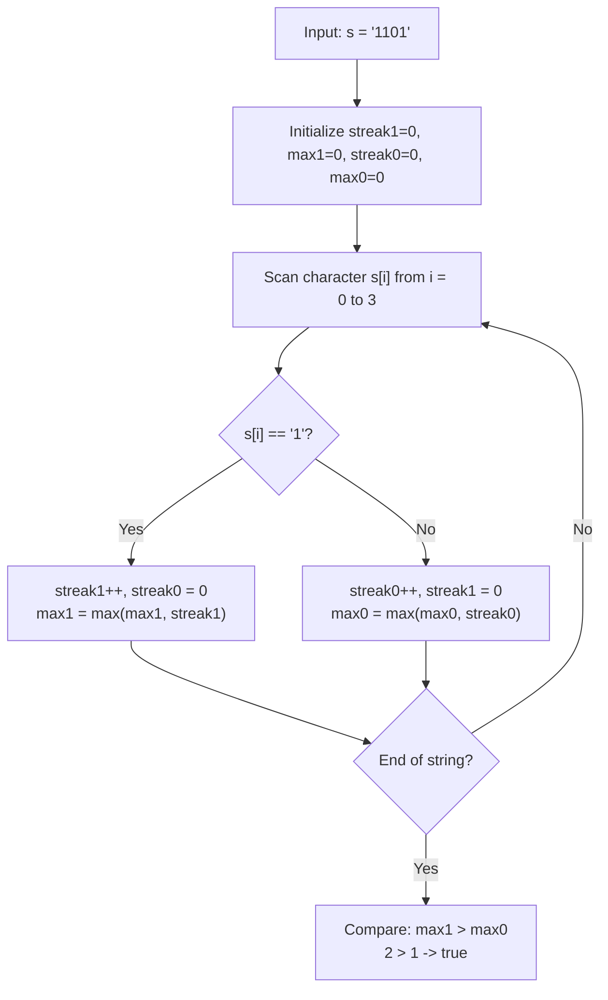

# Guided Example: Longer Contiguous Segments of Ones than Zeros

We trace the step-by-step single-pass contiguous streak tracking and strict maximal segment length comparison on a binary string:

- **Input:** `s = "1101"`
- **Required Output:** `true`

This instance demonstrates tracking active runs of identical characters, resetting alternating counters when characters switch, updating global maximal segment lengths, and enforcing strict inequality ($L_1 > L_0$).

---

## 1. Instance & Teaching Goal

We are given a binary string `s`.
A contiguous segment is an uninterrupted sequence of identical characters.
We must determine whether the maximum length of any contiguous segment of `'1'`s is strictly greater than the maximum length of any contiguous segment of `'0'`s:
$$L_{\max}(1) > L_{\max}(0)$$
Ties ($L_{\max}(1) == L_{\max}(0)$) and cases where zeros dominate ($L_{\max}(1) \le L_{\max}(0)$) both return `false`.

In our instance:
- `s = "1101"` of length $n = 4$.
- Segment decomposition:
  - Substring `s[0..1] = "11"`: Contiguous `'1'` segment of length $2$.
  - Substring `s[2..2] = "0"`: Contiguous `'0'` segment of length $1$.
  - Substring `s[3..3] = "1"`: Contiguous `'1'` segment of length $1$.
- Maximum length of contiguous `'1'`s: $L_{\max}(1) = \max(2, 1) = 2$.
- Maximum length of contiguous `'0'`s: $L_{\max}(0) = 1$.
- Strict comparison: $2 > 1$ is **True**.
- Output: `true`.

The teaching goal is to maintain **active running streaks in a single linear pass**: incrementing the active counter for the current character while resetting the opposite counter to zero, recording peak lengths in $\mathcal{O}(n)$ time and $\mathcal{O}(1)$ auxiliary space.

---

## 2. Conceptual Foundation & Invariants

### Run-Length Streak Invariant Theorem

> **Run-Length Streak Invariant & Strict Segment Maximality Theorem.**
> 1. *Contiguous Streak Invariant:* Let $\text{streak}_1$ and $\text{streak}_0$ be the current consecutive counts of `'1'` and `'0'` ending at the current character $s[i]$:
>    - If $s[i] == \text{'1'}$: $\text{streak}_1 \gets \text{streak}_1 + 1, \quad \text{streak}_0 \gets 0$.
>    - If $s[i] == \text{'0'}$: $\text{streak}_0 \gets \text{streak}_0 + 1, \quad \text{streak}_1 \gets 0$.
> 2. *Peak Tracking:* At each character, the global maximums update as:
>    $$L_{\max}(1) \gets \max(L_{\max}(1), \text{streak}_1), \quad L_{\max}(0) \gets \max(L_{\max}(0), \text{streak}_0)$$
> 3. *Strict Inequality Predicate:* The return value is uniquely:
>    $$B = [L_{\max}(1) > L_{\max}(0)]$$
> 4. *Complexity:* The array is traversed once from index $0$ to $n - 1$. Each character is evaluated in $\mathcal{O}(1)$ time, yielding total time $\mathcal{O}(n)$ and auxiliary space $\mathcal{O}(1)$.

---

## 3. Step-by-Step Worked Execution

We trace `s = "1101"`.
Initialize $\text{streak}_1 = 0, \text{max}_1 = 0, \text{streak}_0 = 0, \text{max}_0 = 0$.

---

### Step 1: Process Index $i = 0$ ($s[0] = \text{'1'}$)
- Incoming character: `'1'`.
- Update streaks:
  $$\text{streak}_1 \gets 0 + 1 = 1, \quad \text{streak}_0 \gets 0$$
- Update peaks:
  $$\text{max}_1 \gets \max(0, 1) = 1, \quad \text{max}_0 \gets \max(0, 0) = 0$$

---

### Step 2: Process Index $i = 1$ ($s[1] = \text{'1'}$)
- Incoming character: `'1'`.
- Update streaks:
  $$\text{streak}_1 \gets 1 + 1 = 2, \quad \text{streak}_0 \gets 0$$
- Update peaks:
  $$\text{max}_1 \gets \max(1, 2) = 2, \quad \text{max}_0 \gets 0$$

---

### Step 3: Process Index $i = 2$ ($s[2] = \text{'0'}$)
- Incoming character: `'0'`. Character switches!
- Update streaks:
  $$\text{streak}_0 \gets 0 + 1 = 1, \quad \text{streak}_1 \gets 0$$
- Update peaks:
  $$\text{max}_0 \gets \max(0, 1) = 1, \quad \text{max}_1 \gets 2$$

---

### Step 4: Process Index $i = 3$ ($s[3] = \text{'1'}$)
- Incoming character: `'1'`. Character switches!
- Update streaks:
  $$\text{streak}_1 \gets 0 + 1 = 1, \quad \text{streak}_0 \gets 0$$
- Update peaks:
  $$\text{max}_1 \gets \max(2, 1) = 2, \quad \text{max}_0 \gets 1$$

---

### Step 5: Final Evaluation
- End of string reached.
- Confirmed peaks: $\text{max}_1 = 2, \text{max}_0 = 1$.
- Evaluate strict predicate:
  $$\text{max}_1 > \text{max}_0 \iff 2 > 1 \implies \mathbf{true}$$
Output: **`true`**.

---

## 4. Complete Execution Trace

| Index $i$ | Character $s[i]$ | Active $\text{streak}_1$ | Active $\text{streak}_0$ | Global $\text{max}_1$ | Global $\text{max}_0$ | Transition Note |
|:---:|:---:|:---:|:---:|:---:|:---:|:---|
| Init | - | 0 | 0 | 0 | 0 | Base initialization |
| 0 | `'1'` | 1 | 0 | 1 | 0 | First 1-streak starts |
| 1 | `'1'` | 2 | 0 | **2** | 0 | 1-streak extends to 2 |
| 2 | `'0'` | 0 | 1 | 2 | **1** | Character switches to 0 |
| 3 | `'1'` | 1 | 0 | 2 | 1 | Character switches to 1 |
| **Final** | - | - | - | **2** | **1** | **$2 > 1 \implies \text{true}$** |

---

## 5. Algorithmic Correctness

**Soundness.** Resetting the active streak to zero whenever the character alternates guarantees that only consecutive identical characters accumulate in each streak counter. Tracking the maximum of each streak across all positions guarantees that $L_{\max}(1)$ and $L_{\max}(0)$ precisely equal the lengths of the longest contiguous subsegments.

**Completeness.** Every character of the string is inspected sequentially. Because maximums are updated monotonically at each position, no contiguous run—including boundary runs at the very beginning or end of the string—can be overlooked.

---

## 6. Traps This Instance Exposes

- **Counting Total Occurrences Instead of Contiguous Run:** If one merely counts the total number of 1s and 0s (for `"111000"`, three 1s and three 0s), one would get the same result; but for `"110100010"`, total 1s is 4 and total 0s is 5, yet contiguous 0s is 3 and contiguous 1s is 2. The problem requires *unbroken contiguous lengths*, not global frequency.
- **Equal Length Failure:** When $\text{max}_1 == \text{max}_0$ (as in `"111000"` where both are 3), the condition requires *strictly* longer ones. Equality must return `false`.
- **Absent Digit Handling:** If a digit never appears (e.g. `"111"`), its maximum length is correctly $0$, and $3 > 0$ yields `true`.

---

## 7. Complexity Derivation

- **Time Complexity:** $\mathcal{O}(n)$, where $n$ is the length of string `s`. A single pass evaluates each character in $\mathcal{O}(1)$ time.
- **Auxiliary Space Complexity:** $\mathcal{O}(1)$, requiring only four scalar integer counters.
