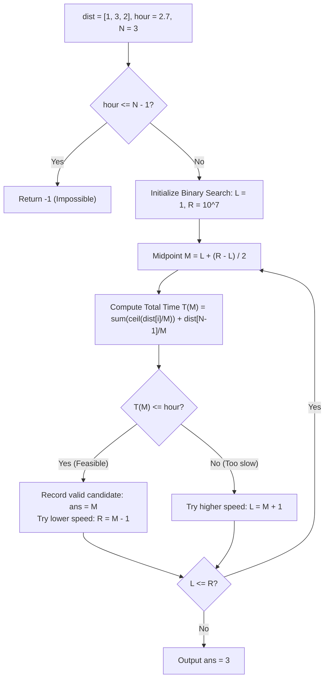

# Guided Example: Minimum Speed to Arrive on Time

We trace the step-by-step feasibility verification, ceiling-rounded intermediate commute time evaluation, and logarithmic binary search for the minimal integer train speed:

- **Input:** `dist = [1, 3, 2], hour = 2.7`
- **Required Output:** `3`

This instance demonstrates handling mandatory integer-hour waiting periods for intermediate legs ($\lceil dist[i] / speed \rceil$), exact fractional elapsed time for the final leg, proving impossibility when $hour \le n - 1$, and converging to the minimal valid speed via bisection.

---

## 1. Instance & Teaching Goal

We must take $N$ consecutive train rides with distances $dist[0 \dots N - 1]$ to arrive at work within `hour` hours.
A single shared positive integer speed $s$ is chosen for all trains.
Commute time mechanics:
1. For every intermediate ride $i \in [0, N - 2]$, the next train departs only at integer hours. If ride $i$ takes fractional time, we must wait until the next integer hour, consuming $\lceil dist[i] / s \rceil$ hours.
2. For the final ride $N - 1$, no subsequent train is boarded; the exact fractional time $dist[N - 1] / s$ is spent.
3. Total commute time is:
   $$T(s) = \sum_{i=0}^{N-2} \left\lceil \frac{dist[i]}{s} \right\rceil + \frac{dist[N-1]}{s}$$

We seek the smallest integer speed $s \ge 1$ such that $T(s) \le hour$, or $-1$ if no speed up to $10^7$ can achieve it.

In our instance:
- `dist = [1, 3, 2]`, $N = 3$, `hour = 2.7`.
- Impossibility check: the first $N - 1 = 2$ rides each take at least $1$ hour. Minimum time as $s \to \infty$ approaches $2.0$. Since $hour = 2.7 > 2.0$, a valid speed exists.
- Evaluating candidate speeds:
  - $s = 1$: Leg 0 takes $\lceil 1/1 \rceil = 1$, Leg 1 takes $\lceil 3/1 \rceil = 3$, Leg 2 takes $2/1 = 2$. Total $= 1 + 3 + 2 = 6.0 > 2.7$ (Too slow).
  - $s = 2$: Leg 0 takes $\lceil 1/2 \rceil = 1$, Leg 1 takes $\lceil 3/2 \rceil = 2$, Leg 2 takes $2/2 = 1.0$. Total $= 1 + 2 + 1 = 4.0 > 2.7$ (Too slow).
  - $s = 3$: Leg 0 takes $\lceil 1/3 \rceil = 1$, Leg 1 takes $\lceil 3/3 \rceil = 1$, Leg 2 takes $2/3 \approx 0.67$. Total $= 1 + 1 + 0.67 = 2.67 \le 2.7$ (Feasible!).
- Smallest integer speed is $3$.

The teaching goal is to recognize that $T(s)$ is a **monotonically decreasing function of speed $s$**, allowing binary search on $s \in [1, 10^7]$ to find the minimal feasible speed in $\mathcal{O}(N \log U)$ time.

---

## 2. Conceptual Foundation & Invariants

### Monotonic Speed Feasibility Invariant Theorem

> **Monotonic Transit Duration & Binary Search Speed Theorem.**
> 1. *Lower Bound Criterion:* Because each of the first $N - 1$ rides incurs at least $\lceil dist[i] / s \rceil \ge 1$ hour, $T(s) > N - 1$ for all finite $s$. If $hour \le N - 1$, reaching the destination on time is impossible, and the algorithm must return $-1$.
> 2. *Monotonicity of Travel Time:* For any two speeds $s_1 < s_2$:
>    $$\left\lceil \frac{dist[i]}{s_1} \right\rceil \ge \left\lceil \frac{dist[i]}{s_2} \right\rceil \quad \text{and} \quad \frac{dist[N-1]}{s_1} > \frac{dist[N-1]}{s_2}$$
>    Therefore, $T(s_1) \ge T(s_2)$. The feasibility predicate $\mathcal{P}(s) = [T(s) \le hour]$ is monotonic ($F, F, \dots, F, T, T, \dots, T$).
> 3. *Bisection Invariant:* Maintaining an inclusive search interval $[L, R] = [1, 10^7]$:
>    - If $\mathcal{P}(M)$ is true, any speed $\ge M$ is also feasible. The minimal valid speed lies in $[L, M]$. Set $R \gets M$.
>    - If $\mathcal{P}(M)$ is false, speed $M$ is too slow. The answer must lie in $[M + 1, R]$. Set $L \gets M + 1$.
> 4. *Complexity:* The binary search performs $\lceil \log_2 10^7 \rceil \approx 24$ iterations, evaluating $T(M)$ in $\mathcal{O}(N)$ time per iteration. Total time is strictly $\mathcal{O}(N \log U)$.

---

## 3. Step-by-Step Worked Execution

We trace the algorithm on `dist = [1, 3, 2]` with `hour = 2.7`.

---

### Step 1: Feasibility Check
- Number of rides: $N = 3$.
- Minimum theoretical time required: $N - 1 = 3 - 1 = 2.0$.
- Available time: $2.7 > 2.0 \implies$ Feasible.
- Initialize search range: $L = 1, R = 10^7$, with $\text{ans} = -1$.

---

### Step 2: Binary Search Progress (Key Probes)

#### Probe A: Speed $s = 1$
- Leg 0: $\lceil 1 / 1 \rceil = 1$
- Leg 1: $\lceil 3 / 1 \rceil = 3$
- Leg 2: $2 / 1 = 2.0$
- Total time: $1 + 3 + 2.0 = 6.0$.
- Comparison: $6.0 \le 2.7$ is **False** (Too slow!).
- Minimum speed must be strictly $> 1$. Set $L \gets 2$.

#### Probe B: Speed $s = 2$
- Leg 0: $\lceil 1 / 2 \rceil = 1$
- Leg 1: $\lceil 3 / 2 \rceil = 2$
- Leg 2: $2 / 2 = 1.0$
- Total time: $1 + 2 + 1.0 = 4.0$.
- Comparison: $4.0 \le 2.7$ is **False** (Too slow!).
- Minimum speed must be strictly $> 2$. Set $L \gets 3$.

#### Probe C: Speed $s = 3$
- Leg 0: $\lceil 1 / 3 \rceil = 1$
- Leg 1: $\lceil 3 / 3 \rceil = 1$
- Leg 2: $2 / 3 \approx 0.6667$
- Total time: $1 + 1 + 0.6667 \approx 2.6667$.
- Comparison: $2.6667 \le 2.7$ is **True** (Feasible!).
- Candidate recorded: $\text{ans} \gets 3$.
- Narrow search to find if an even smaller speed works: $R \gets 3 - 1 = 2$.

---

### Step 3: Convergence
- Search range now has $L = 3, R = 2 \implies L > R$.
- Binary search terminates.
- Minimal feasible speed: $\text{ans} = \mathbf{3}$.
- Output: **`3`**.

---

## 4. Complete Execution Trace

| Speed Probe $s$ | Leg 0 ($\lceil 1/s \rceil$) | Leg 1 ($\lceil 3/s \rceil$) | Leg 2 ($2/s$) | Total Duration $T(s)$ | Target Deadline | Feasibility $\mathcal{P}(s)$ | Binary Search Action |
|:---:|:---:|:---:|:---:|:---:|:---:|:---:|:---|
| 1 | 1 | 3 | 2.0000 | 6.0000 | 2.7 | False | Eliminate $[1 \dots 1]$, $L \gets 2$ |
| 2 | 1 | 2 | 1.0000 | 4.0000 | 2.7 | False | Eliminate $[1 \dots 2]$, $L \gets 3$ |
| 3 | 1 | 1 | 0.6667 | **2.6667** | 2.7 | **True** | Record $\text{ans} = 3$, $R \gets 2$ |

---

## 5. Algorithmic Correctness

**Soundness.** For any speed $s$ that satisfies $\mathcal{P}(s)$, the calculated transit time accounts for all integer-hour waits on intermediate legs and the exact travel time on the final leg. Because $T(3) \approx 2.6667 \le 2.7$, arrival on or before the deadline is guaranteed.

**Completeness.** Since $T(s)$ is monotonic, if speed $2$ cannot achieve the deadline, no speed $s \le 2$ can achieve it. Therefore, eliminating $[1, 2]$ preserves all valid solutions, ensuring the smallest valid integer speed is found.

---

## 6. Traps This Instance Exposes

- **Rounding the Final Leg:** Applying the ceiling function $\lceil dist[N-1] / s \rceil$ to the final leg would add an artificial wait, evaluating $s = 3$ as $1 + 1 + 1 = 3.0 > 2.7$, erroneously reporting that speed 3 fails.
- **Floating-Point Precision:** Floating-point division and addition can introduce rounding error (e.g. `2.6999999999999997 <= 2.7`). Writing the check carefully ensures comparisons are reliable.
- **Impossible Deadline Boundary:** When $hour \le N - 1$ (e.g. $hour = 1.9$ for $N = 3$), the first 2 rides alone take $2.0$ hours, so no infinite speed can ever suffice; checking this upfront prevents infinite binary search or returning an invalid ceiling bound.

---

## 7. Complexity Derivation

- **Time Complexity:** $\mathcal{O}(N \log U)$, where $N$ is the number of rides and $U = 10^7$ is the maximum speed upper bound. Each check iterates through $N$ rides in $\mathcal{O}(N)$ time, and the binary search performs $\log_2(10^7) \approx 24$ probes.
- **Auxiliary Space Complexity:** $\mathcal{O}(1)$ space, as distance values are queried directly without auxiliary arrays.
