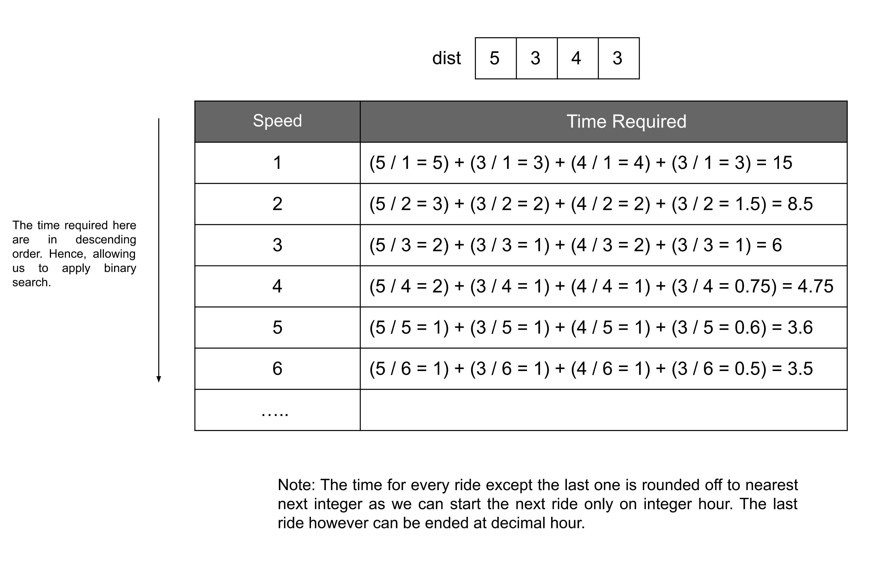

[TOC]

## Solution

### Approach: Binary Search

**Intuition**

There are $N$ trains that we need to take in order; the $i^{th}$ train will ride for $\text{dist}[i]$ distance. We need to complete this journey, i.e. ride all these trains within `hour` time; `hour` is a decimal number representing the amount of time we have. We need to return the minimum positive speed integer that is required. One more constraint we have is that each train will depart at an integer hour, so if we completed our $1^{st}$ ride at, say `2.4` hours, then we can only start riding the next train at $3^{rd}$ hour.

One hint in the problem description is that the answer speed will not exceed $10^7$. The first naive approach we can apply is to do an exhaustive search over all the possible speeds we have. We can iterate from $1$ to $10^7$, and the first number that can lead us to complete the journey within `hour` will be our answer. But how can we find out if some speed can make us complete the journey within the constraint time? We can easily find the time required for individual rides for each train, and then summing them up will give us the total time required. If this total time is less than `hour` then it could be a possible answer; otherwise, not. This approach, as we can observe, is not efficient; we need to iterate over the whole search space and then iterate over every train to find the total time.

Can we somehow reduce our search space? Let's say the time required with speed `s` is `t`; then it can be easily proved that the time required with a speed greater than `s` will always be less than or equal to `t`. In other words, a higher speed will always require less or equal time. This implies that if for a speed `s` the time required is less than the time needed `hour`, then we don't need to look for the speeds greater than `s` as we need the smallest speed possible, in this case, our search space should reduce down to left side of `s`, i.e. speeds less than `s`.



This theory leads us to think of binary search. We will check for the speed in the middle of our search space, and if that is within `hour` time, our search is reduced to the left half of the current space, and if the time is more than `hour`, then the search space will change to the right half of the current space. This way, we will always be able to reduce our search space by half at every iteration.

**Algorithm**

1. Initialize three variables `left`, `right` and `minSpeed`.

   i. `left` is the left end of our initial search space; hence it should be initialized to `1`.

   ii `right` is the right end of our initial search space; hence initialize it to $10^7$.

   iii. `minSpeed` is the minimum speed required; this is the answer to our problem. Initialize it to `-1`.

2. Do the following while $left \le right$:

   i. Find the middle of the current search space as `mid`.

   ii. Find the time required with speed `mid`. Add all the individual time for each train ride; note that for all the rides except the last one, we need to round off the decimal to the next integer as we can start the next train only at an integer hour. The last ride, however, can end at a decimal.

   iii. If the time required is less than or equal to `hour`, it implies the `mid` could be our answer. Hence store it in the variable `minSpeed` and shift the search space to the left of `mid`.

   iv. If the time required is more than `hour`, then `mid` as well as the integers left of it cannot be the answer. Hence shift the search space to the right of `mid`.

3. Return `minSpeed`.

**Implementation**

```cpp
class Solution {
public:
    double timeRequired(vector<int>& dist, int speed) {
        double time = 0.0;
        for (int i = 0 ; i < dist.size(); i++) {
            double t = (double) dist[i] / (double) speed;
            // Round off to the next integer, if not the last ride.
            time += (i == dist.size() - 1 ? t : ceil(t));
        }
        return time;
    }

    int minSpeedOnTime(vector<int>& dist, double hour) {
        int left = 1;
        int right = 1e7;
        int minSpeed = -1;

        while (left <= right) {
            int mid = (left + right) / 2;

            // Move to the left half.
            if (timeRequired(dist, mid) <= hour) {
                minSpeed = mid;
                right = mid - 1;
            } else {
                // Move to the right half.
                left = mid + 1;
            }
        }
        return minSpeed;
    }
};

```

**Complexity Analysis**

Here, $N$ is the number of rides, and $K$ is the size of the search space. For this problem, $K$ is equal to $10^7$.

* Time complexity: $O(N \log K)$

  After each iteration, the search space gets reduced to half; hence the while loop will take $\log K$ operations. For each such operation, we need to call the `timeRequired` function, which takes $O(N)$ time. Therefore, the total time complexity equals $O(N \log K)$.

* Space complexity: $O(1)$

  No extra space is required other than the three variables. Hence the space complexity is constant.
  <br/>

---