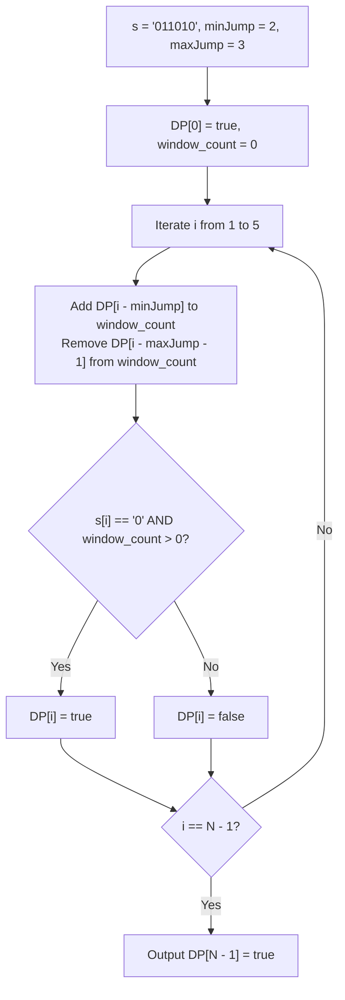

# Guided Example: Jump Game VII

We trace the step-by-step determination of endpoint reachability in a binary string using interval-constrained dynamic programming and a sliding window of reachable source indices:

- **Input:** `s = "011010", minJump = 2, maxJump = 3`
- **Required Output:** `true`

This instance demonstrates verifying that the final character is `'0'`, maintaining a running count of reachable origin indices within the active jump window $[i - \text{maxJump}, i - \text{minJump}]$, and skipping intermediate obstacles (`'1'`) to reach index $5$.

---

## 1. Instance & Teaching Goal

We start at index $0$ of a binary string `s` of length $N$, with $s[0] = \text{'0'}$.
From any reachable index $j$ where $s[j] == \text{'0'}$, we may jump forward to index $i$ if and only if:
1. $j + \text{minJump} \le i \le \min(j + \text{maxJump}, N - 1)$
2. $s[i] == \text{'0'}$

We must determine if the final index $N - 1$ is reachable.
A naive approach checks all $j \in [i - \text{maxJump}, i - \text{minJump}]$ for every index $i$, leading to $\mathcal{O}(N \cdot (\text{maxJump} - \text{minJump}))$ time (up to $10^{10}$ operations for $N = 10^5$).

In our instance:
- `s = "011010"`, $N = 6$, `minJump = 2, maxJump = 3`.
- Target: Reach index $5$ ($s[5] = \text{'0'}$).
- Jumps trace:
  - Start at index $0$. Permitted jump range: $[0 + 2, 0 + 3] = [2, 3]$.
    - Index $2$: $s[2] = \text{'1'}$ (Obstacle, cannot land).
    - Index $3$: $s[3] = \text{'0'}$ (Open ground! Land at index 3).
  - From index $3$, permitted jump range: $[3 + 2, 3 + 3] = [5, 6]$.
    - Restrict to array boundary: index $5$.
    - Index $5$: $s[5] = \text{'0'}$ (Open ground! Land at index 5).
- Destination reached in 2 jumps ($0 \to 3 \to 5$).
- Output: `true`.

The teaching goal is to formulate **sliding window reachability DP**: maintaining a running counter of reachable indices within the active lookback window $[i - \text{maxJump}, i - \text{minJump}]$ in $\mathcal{O}(1)$ time per index, achieving linear $\mathcal{O}(N)$ runtime.

---

## 2. Conceptual Foundation & Invariants

### Sliding Window Reachability Invariant Theorem

> **Interval Reachability & Sliding Window Source Invariant Theorem.**
> 1. *Reachability Predicate:* Let $DP[i] \in \{0, 1\}$ indicate whether index $i$ is reachable from index $0$.
>    $$DP[0] = 1$$
>    For $i \ge 1$:
>    $$DP[i] = [s[i] == \text{'0'}] \land \left( \sum_{j = i - \text{maxJump}}^{i - \text{minJump}} DP[j] > 0 \right)$$
> 2. *Sliding Window Accumulation:* Let $W_i = \sum_{j = \max(0, i - \text{maxJump})}^{i - \text{minJump}} DP[j]$ be the count of reachable sources capable of jumping to $i$. As $i$ advances to $i + 1$:
>    - Add newly eligible source: if $i + 1 - \text{minJump} \ge 0$, add $DP[i + 1 - \text{minJump}]$.
>    - Remove expired source: if $i - \text{maxJump} \ge 0$, subtract $DP[i - \text{maxJump}]$.
> 3. *Obstacle Pruning:* If $s[i] == \text{'1'}$, $DP[i] = 0$ regardless of $W_i$.
> 4. *Target Reachability:* The search succeeds if and only if $s[N - 1] == \text{'0'}$ and $DP[N - 1] == 1$.
> 5. *Complexity:* Each index updates the window sum in $\mathcal{O}(1)$ steps, running in $\mathcal{O}(N)$ time and $\mathcal{O}(N)$ space.

---

## 3. Step-by-Step Worked Execution

We trace $s = \text{"011010"}$ of length $N = 6$ with `minJump = 2` and `maxJump = 3`.
Initialize $DP[0 \dots 5] = [1, 0, 0, 0, 0, 0]$ and running source counter $W = 0$.

---

### Step 1: Evaluate Index $i = 1$ ($s[1] = \text{'1'}$)
- Window incoming source index: $i - \text{minJump} = 1 - 2 = -1 < 0$ (None).
- Window expired source index: $i - \text{maxJump} - 1 = 1 - 3 - 1 = -3 < 0$ (None).
- Running source count: $W = 0$.
- Feasibility: $W == 0 \implies DP[1] = 0$.

---

### Step 2: Evaluate Index $i = 2$ ($s[2] = \text{'1'}$)
- Incoming source index: $i - \text{minJump} = 2 - 2 = 0$.
  - Ingest $DP[0] = 1 \implies W \gets 0 + 1 = 1$.
- Expired source index: $2 - 3 - 1 = -2 < 0$ (None).
- Running source count: $W = 1 > 0$ (a reachable source exists!).
- Obstacle check: $s[2] = \text{'1'}$. Landing prohibited on `'1'`.
- Outcome: $DP[2] = 0$.

---

### Step 3: Evaluate Index $i = 3$ ($s[3] = \text{'0'}$)
- Incoming source index: $i - \text{minJump} = 3 - 2 = 1$.
  - Ingest $DP[1] = 0 \implies W \gets 1 + 0 = 1$.
- Expired source index: $3 - 3 - 1 = -1 < 0$ (None).
- Running source count: $W = 1 > 0$ (source index $0$ is active in window $[3-3, 3-2] = [0, 1]$).
- Character check: $s[3] = \text{'0'}$ (Open ground!).
- Outcome: $DP[3] \gets 1$.

---

### Step 4: Evaluate Index $i = 4$ ($s[4] = \text{'1'}$)
- Incoming source index: $i - \text{minJump} = 4 - 2 = 2$.
  - Ingest $DP[2] = 0 \implies W \gets 1 + 0 = 1$.
- Expired source index: $i - \text{maxJump} - 1 = 4 - 3 - 1 = 0$.
  - Expire $DP[0] = 1 \implies W \gets 1 - 1 = 0$.
- Running source count: $W = 0$.
- Outcome: $DP[4] = 0$.

---

### Step 5: Evaluate Index $i = 5$ ($s[5] = \text{'0'}$, Final Index)
- Incoming source index: $i - \text{minJump} = 5 - 2 = 3$.
  - Ingest $DP[3] = 1 \implies W \gets 0 + 1 = 1$.
- Expired source index: $i - \text{maxJump} - 1 = 5 - 3 - 1 = 1$.
  - Expire $DP[1] = 0 \implies W \gets 1 - 0 = 1$.
- Running source count: $W = 1 > 0$ (source index $3$ is active in window $[5-3, 5-2] = [2, 3]$).
- Character check: $s[5] = \text{'0'}$ (Open ground!).
- Outcome: $DP[5] \gets 1$.

---

### Step 6: Target Resolution
- Index $N - 1 = 5$ has $DP[5] = 1$.
- Output: **`true`**.

---

## 4. Complete Execution Trace

| Index $i$ | Character $s[i]$ | Ingested $DP[i - 2]$ | Expired $DP[i - 4]$ | Window Count $W$ | Landable ($W > 0 \land s[i] == \text{'0'}$)? | $DP[i]$ |
|:---:|:---:|:---:|:---:|:---:|:---:|:---:|
| 0 | `'0'` | Base | - | 0 | Start | **1** |
| 1 | `'1'` | None | None | 0 | No ($W = 0$) | 0 |
| 2 | `'1'` | $DP[0] = 1$ | None | 1 | No ($s[2] == \text{'1'}$) | 0 |
| 3 | `'0'` | $DP[1] = 0$ | None | 1 | **Yes** (jump from 0) | **1** |
| 4 | `'1'` | $DP[2] = 0$ | $DP[0] = 1$ | 0 | No ($W = 0$) | 0 |
| 5 | `'0'` | $DP[3] = 1$ | $DP[1] = 0$ | 1 | **Yes** (jump from 3) | **1** |

---

## 5. Algorithmic Correctness

**Soundness.** A cell $i$ receives $DP[i] = 1$ if and only if $s[i] == \text{'0'}$ and at least one index $j \in [i - \text{maxJump}, i - \text{minJump}]$ has $DP[j] = 1$. Since $DP[0] = 1$ is valid by definition, any cell with $DP[i] = 1$ can be reached via a sequence of legal jumps.

**Completeness.** The sliding window $W$ maintains the exact count of reachable indices within the lookback interval $[i - \text{maxJump}, i - \text{minJump}]$. No reachable ancestor within valid jump distance is ever omitted, ensuring that if any valid sequence of jumps reaches $N - 1$, $DP[N - 1]$ will be set to $1$.

---

## 6. Traps This Instance Exposes

- **Target Ending on `'1'`:** If $s[N - 1] == \text{'1'}$, reaching the end is impossible by definition, allowing an immediate `false` return.
- **Queue Overhead vs Sliding Counter:** Using a BFS queue with unvisited sets works, but an in-place sliding count array provides optimal memory locality and avoids set lookups.
- **Window Off-By-One:** The earliest source capable of reaching $i$ is $i - \text{maxJump}$, meaning $DP[i - \text{maxJump} - 1]$ expires when processing $i$, not $DP[i - \text{maxJump}]$.

---

## 7. Complexity Derivation

- **Time Complexity:** $\mathcal{O}(N)$, where $N$ is the length of `s`. Each index is processed once with $\mathcal{O}(1)$ updates to the window sum and DP array.
- **Auxiliary Space Complexity:** $\mathcal{O}(N)$ to store the binary DP reachability array of size $N$.
