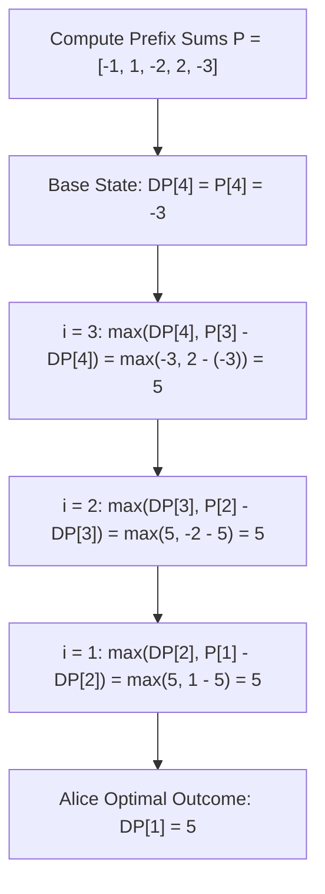

# Guided Example: Stone Game VIII

We trace the step-by-step game-theoretic minimax backward induction and prefix sum invariant for the sequential stone merging game:

- **Input:** `stones = [-1, 2, -3, 4, -5]`
- **Required Output:** `5`

This instance demonstrates why merging prefixes preserves global prefix sums across turns, how to model optimal adversary responses, and why skipping a suboptimal prefix choice enables Alice to force a final net score difference of $+5$.

---

## 1. Instance & Teaching Goal

Alice and Bob play a game with $N$ stones in a row.
On each turn:
1. The current player chooses a prefix of $x \ge 2$ stones.
2. The player removes those $x$ stones and gains their sum as points.
3. A single new stone whose value equals that same sum is placed at the left of the row.
4. The game ends when exactly one stone remains.

Alice seeks to maximize $(\text{Alice score} - \text{Bob score})$, while Bob seeks to minimize it (maximizing $\text{Bob score} - \text{Alice score}$).
A naive game tree explores exponential branching $\mathcal{O}(2^N)$.

In our instance:
- `stones = [-1, 2, -3, 4, -5]` of length $N = 5$.
- Compute prefix sums $P$:
  - $P[0] = -1$
  - $P[1] = -1 + 2 = 1$
  - $P[2] = 1 - 3 = -2$
  - $P[3] = -2 + 4 = 2$
  - $P[4] = 2 - 5 = -3$
- **The Prefix Sum Invariant:**
  Whenever a player takes the first $x$ stones, the new stone placed at the front has value $P[x-1]$. If the next player subsequently takes $y$ stones (where $y > x$ in original terms), the total sum of those stones is *still* the original prefix sum $P[y-1]$.
  Therefore, taking $x$ stones simply claims score $P[x-1]$ and restricts future choices to indices strictly greater than $x-1$.
- Working backward from $N - 1$:
  - At index $4$: Must take all remaining stones $\implies \text{score } P[4] = -3$.
  - At index $3$: Option to take prefix 3 yields $P[3] - (-3) = 2 - (-3) = 5$. Option to skip yields $-3$. Best is $\max(-3, 5) = 5$.
  - At index $2$: Option to take yields $P[2] - 5 = -2 - 5 = -7$. Option to skip yields $5$. Best is $5$.
  - At index $1$: Option to take yields $P[1] - 5 = 1 - 5 = -4$. Option to skip yields $5$. Best is $5$.
- Alice moving first from index $1$ achieves maximal difference $5$.

The teaching goal is to formulate **backward induction dynamic programming on prefix sums**: recognizing that the decision at each index $i$ is binary (take prefix $i$ or pass to $i + 1$), running in linear $\mathcal{O}(N)$ time and $\mathcal{O}(1)$ auxiliary space.

---

## 2. Conceptual Foundation & Invariants

### Prefix Invariance & Minimax Backward Induction Theorem

> **Prefix Sum Invariance & Minimax Backward Induction Theorem.**
> 1. *Prefix Value Invariance:* Let $P[k] = \sum_{j=0}^k stones[j]$. When a player replaces the prefix $0 \dots x-1$ with its sum $P[x-1]$, any future prefix taking up to original index $y-1 > x-1$ sums to:
>    $$P[x-1] + \sum_{j=x}^{y-1} stones[j] = P[y-1]$$
>    The value of taking any prefix $k$ is invariant to prior moves and equals $P[k]$.
> 2. *Minimax Zero-Sum Formulation:* Let $DP[i]$ be the optimal relative score difference achievable by the current player when choosing among prefixes in $[i, N - 1]$:
>    - Base Case: $DP[N - 1] = P[N - 1]$ (forced to take all stones).
>    - Recurrence for $i = N - 2$ down to $1$:
>      $$DP[i] = \max(DP[i + 1], P[i] - DP[i + 1])$$
>    Here $P[i] - DP[i+1]$ is the net gain from stopping at $i$, and $DP[i+1]$ is the net gain from deferring to a larger prefix.
> 3. *Initial Game State:* Alice must take at least 2 stones, corresponding to choosing a prefix index $i \ge 1$. The game value is uniquely $DP[1]$.
> 4. *Complexity:* Prefix sums take $\mathcal{O}(N)$ time. The single backward scan computes $DP[i]$ in $\mathcal{O}(1)$ per step, yielding $\mathcal{O}(N)$ time and $\mathcal{O}(1)$ space.

---

## 3. Step-by-Step Worked Execution

We trace `stones = [-1, 2, -3, 4, -5]` of length $N = 5$.

---

### Step 1: Compute Prefix Sums $P$
- $P[0] = -1$
- $P[1] = -1 + 2 = 1$
- $P[2] = 1 + (-3) = -2$
- $P[3] = -2 + 4 = 2$
- $P[4] = 2 + (-5) = -3$

Prefix array: $P = [-1, 1, -2, 2, -3]$.

---

### Step 2: Initialize Base State at $i = 4$ ($N - 1$)
Only one possible move remains: taking all stones.
$$\text{best\_diff} = P[4] = -3$$
At $i = 4$, $DP[4] = -3$.

---

### Step 3: Backward Induction at $i = 3$
The player can either:
- **Take prefix 3:** Gain $P[3] = 2$, leaving the opponent with optimal difference $DP[4] = -3$:
  $$\text{Gain}_{\text{take}} = P[3] - DP[4] = 2 - (-3) = 5$$
- **Skip prefix 3:** Defer to higher indices, receiving $DP[4] = -3$:
  $$\text{Gain}_{\text{skip}} = DP[4] = -3$$
Choose the maximum:
$$DP[3] = \max(-3, 5) = 5$$
Updated $\text{best\_diff} = 5$.

---

### Step 4: Backward Induction at $i = 2$
The player can either:
- **Take prefix 2:** Gain $P[2] = -2$, leaving opponent with $DP[3] = 5$:
  $$\text{Gain}_{\text{take}} = P[2] - DP[3] = -2 - 5 = -7$$
- **Skip prefix 2:** Defer to index 3 or higher, receiving $DP[3] = 5$:
  $$\text{Gain}_{\text{skip}} = DP[3] = 5$$
Choose the maximum:
$$DP[2] = \max(5, -7) = 5$$
Updated $\text{best\_diff} = 5$.

---

### Step 5: Backward Induction at $i = 1$
The player can either:
- **Take prefix 1:** Gain $P[1] = 1$, leaving opponent with $DP[2] = 5$:
  $$\text{Gain}_{\text{take}} = P[1] - DP[2] = 1 - 5 = -4$$
- **Skip prefix 1:** Defer to index 2 or higher, receiving $DP[2] = 5$:
  $$\text{Gain}_{\text{skip}} = DP[2] = 5$$
Choose the maximum:
$$DP[1] = \max(5, -4) = 5$$
Updated $\text{best\_diff} = 5$.

---

### Step 6: Final Result
Alice must make the first move, choosing any prefix from $i = 1$ to $N - 1$.
Her optimal net score difference is $DP[1] = \mathbf{5}$.
Output: **`5`**.

---

## 4. Complete Execution Trace

| Backward Step $i$ | Prefix Sum $P[i]$ | Next State Difference $DP[i+1]$ | Value if Taking Prefix $i$ ($P[i] - DP[i+1]$) | Value if Deferring ($DP[i+1]$) | Optimal Choice $DP[i]$ |
|:---:|:---:|:---:|:---:|:---:|:---:|
| 4 ($N-1$) | -3 | Forced | -3 | - | **-3** |
| 3 | 2 | -3 | $2 - (-3) = \mathbf{5}$ | -3 | **5** (Take at 3) |
| 2 | -2 | 5 | $-2 - 5 = -7$ | **5** | **5** (Skip 2) |
| 1 | 1 | 5 | $1 - 5 = -4$ | **5** | **5** (Skip 1) |
| **Alice (Start)** | - | - | - | - | **`5`** |

---

## 5. Algorithmic Correctness

**Soundness.** Because game theory minimax states that each player seeks to maximize their own net advantage, a player facing choices in $[i, N-1]$ can either lock in score $P[i]$ (yielding $P[i] - DP[i+1]$) or make the best choice among $[i+1, N-1]$ (yielding $DP[i+1]$). The $\max$ operation strictly captures the optimal decision under rational adversary play.

**Completeness.** Working right-to-left from $N - 1$ down to $1$ covers all legal prefix choices available to Alice on her opening turn. No valid move sequence is omitted.

---

## 6. Traps This Instance Exposes

- **Simulating Array Restructuring:** Actually deleting stones and inserting sums into a dynamic list incurs $\mathcal{O}(N^2)$ array shifts and fails to recognize that prefix sums never change.
- **Allowing $x = 1$ on the First Turn:** Alice must take at least 2 stones on her turn. Evaluating $i = 0$ is invalid because a move must consume at least two stones ($i \ge 1$).
- **Sign Confusion in Minimax:** Subtracting $DP[i+1]$ from $P[i]$ correctly models zero-sum turn alternation: the points Alice concedes to Bob's future optimal moves reduce her net difference.

---

## 7. Complexity Derivation

- **Time Complexity:** $\mathcal{O}(N)$, where $N$ is the number of stones. Computing prefix sums takes $\mathcal{O}(N)$, and the backward loop runs $N - 1$ iterations in $\mathcal{O}(1)$ time each.
- **Auxiliary Space Complexity:** $\mathcal{O}(1)$ space if maintaining a running scalar for $\text{best\_diff}$, or $\mathcal{O}(N)$ to store the prefix sums.
