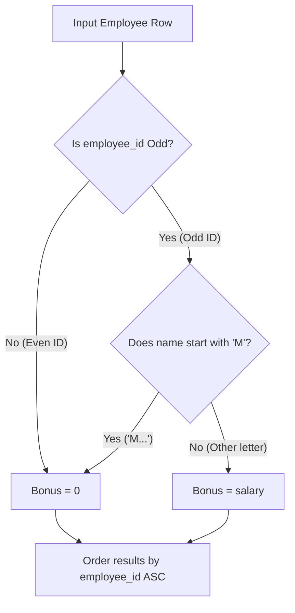

# Guided Example: Calculate Special Bonus

We trace the step-by-step row-level conditional evaluation of employee bonus eligibility based on integer identifier parity and initial letter prefix matching:

- **Input:**
  - `Employees` table:
    - ID 2: `"Meir"`, salary 3000
    - ID 3: `"Michael"`, salary 3800
    - ID 7: `"Addilyn"`, salary 7400
    - ID 8: `"Juan"`, salary 6100
    - ID 9: `"Kannon"`, salary 7700
- **Required Output:**

| employee_id | bonus |
|:---:|:---:|
| 2 | 0 |
| 3 | 0 |
| 7 | 7400 |
| 8 | 0 |
| 9 | 7700 |

This instance demonstrates combining an arithmetic parity predicate (`employee_id % 2 == 1`) with a string prefix negation (`name NOT LIKE 'M%'`), computing conditional bonus values (`CASE WHEN`), and ordering the final relation by employee ID.

---

## 1. Instance & Teaching Goal

Each employee record contains `employee_id`, `name`, and `salary`.
An employee receives a bonus equal to $100\%$ of their salary if and only if:
1. Their `employee_id` is an odd integer: $\text{employee\_id} \bmod 2 = 1$.
2. Their `name` does **not** start with the character `'M'`: $\text{name}[0] \neq \text{'M'}$.

If either condition fails, the bonus is $0$.
The result table must project `employee_id` and `bonus`, sorted in ascending order of `employee_id`.

In our instance:
- **Employee 2 (`"Meir"`, 3000):** Even ID ($2 \bmod 2 = 0$). Fails condition 1 $\implies$ bonus is $0$.
- **Employee 3 (`"Michael"`, 3800):** Odd ID ($3 \bmod 2 = 1$), but name begins with `'M'`. Fails condition 2 $\implies$ bonus is $0$.
- **Employee 7 (`"Addilyn"`, 7400):** Odd ID ($7 \bmod 2 = 1$) and name begins with `'A'` ($\neq \text{'M'}$). Both conditions satisfied $\implies$ bonus is $7400$.
- **Employee 8 (`"Juan"`, 6100):** Even ID ($8 \bmod 2 = 0$). Fails condition 1 $\implies$ bonus is $0$.
- **Employee 9 (`"Kannon"`, 7700):** Odd ID ($9 \bmod 2 = 1$) and name begins with `'K'` ($\neq \text{'M'}$). Both conditions satisfied $\implies$ bonus is $7700$.
- Sorted by `employee_id`: $[2, 3, 7, 8, 9]$.

The teaching goal is to evaluate **row-local conditional projection using boolean logic expressions**:
$$\text{bonus} = \begin{cases} \text{salary} & \text{if } \text{id} \bmod 2 = 1 \land \text{name} \not\sim \text{'M\%'} \\ 0 & \text{otherwise} \end{cases}$$

---

## 2. Conceptual Foundation & Invariants

### Conjunctive Conditional Projection Invariant Theorem

> **Conjunctive Conditional Projection & Parity-Prefix Invariant Theorem.**
> 1. *Conjunctive Eligibility Rule:* Let $E = (\text{id}, \text{name}, \text{salary})$ be an employee tuple. The bonus eligibility indicator function is:
>    $$\mathcal{B}(E) = [\text{id} \bmod 2 \equiv 1] \land [\text{name}[0] \neq \text{'M'}]$$
> 2. *Deterministic Value Assignment:*
>    $$\text{bonus}(E) = \begin{cases} \text{salary} & \text{if } \mathcal{B}(E) = 1 \\ 0 & \text{if } \mathcal{B}(E) = 0 \end{cases}$$
> 3. *Cardinality & Order Invariant:* Every employee in `Employees` produces exactly one output row ($|\text{Output}| = |\text{Employees}|$). Ordering by $\text{id}$ ascending guarantees a unique canonical relation.
> 4. *Complexity:* Checking each row takes $\mathcal{O}(1)$ time. Sorting $R$ rows takes $\mathcal{O}(R \log R)$ time.

---

## 3. Step-by-Step Worked Execution

We trace each employee row in ascending order of `employee_id`:

---

### Step 1: Employee ID 2 (`"Meir"`, Salary $3000$)
- Parity check: $2 \bmod 2 = 0$ (Even).
- Condition 1 fails immediately.
- Assigned bonus: $0$.
- Record: `[2, 0]`.

---

### Step 2: Employee ID 3 (`"Michael"`, Salary $3800$)
- Parity check: $3 \bmod 2 = 1$ (Odd $\implies$ Condition 1 passes).
- Name prefix check: first character of `"Michael"` is `'M'`.
- Condition 2 fails (name must NOT start with `'M'`).
- Assigned bonus: $0$.
- Record: `[3, 0]`.

---

### Step 3: Employee ID 7 (`"Addilyn"`, Salary $7400$)
- Parity check: $7 \bmod 2 = 1$ (Odd $\implies$ Condition 1 passes).
- Name prefix check: first character of `"Addilyn"` is `'A'` ($\neq \text{'M'} \implies$ Condition 2 passes).
- Both conditions hold!
- Assigned bonus: $\text{salary} = 7400$.
- Record: `[7, 7400]`.

---

### Step 4: Employee ID 8 (`"Juan"`, Salary $6100$)
- Parity check: $8 \bmod 2 = 0$ (Even).
- Condition 1 fails.
- Assigned bonus: $0$.
- Record: `[8, 0]`.

---

### Step 5: Employee ID 9 (`"Kannon"`, Salary $7700$)
- Parity check: $9 \bmod 2 = 1$ (Odd $\implies$ Condition 1 passes).
- Name prefix check: first character of `"Kannon"` is `'K'` ($\neq \text{'M'} \implies$ Condition 2 passes).
- Both conditions hold!
- Assigned bonus: $\text{salary} = 7700$.
- Record: `[9, 7700]`.

---

### Step 6: Output Assembly
Rows sorted by `employee_id` in ascending order:

| employee_id | bonus |
|:---:|:---:|
| 2 | 0 |
| 3 | 0 |
| 7 | 7400 |
| 8 | 0 |
| 9 | 7700 |

---

## 4. Complete Execution Trace

| `employee_id` | Name | Salary | Is ID Odd? | Starts With `'M'`? | Eligibility $\mathcal{B}(E)$ | Calculated Bonus |
|:---:|:---:|:---:|:---:|:---:|:---:|:---:|
| 2 | `"Meir"` | 3000 | No ($2 \bmod 2 = 0$) | Yes | Disqualified | **0** |
| 3 | `"Michael"` | 3800 | **Yes** ($3 \bmod 2 = 1$) | **Yes** | Disqualified | **0** |
| 7 | `"Addilyn"` | 7400 | **Yes** ($7 \bmod 2 = 1$) | **No** (`'A'`) | **Eligible** | **7400** |
| 8 | `"Juan"` | 6100 | No ($8 \bmod 2 = 0$) | No | Disqualified | **0** |
| 9 | `"Kannon"` | 7700 | **Yes** ($9 \bmod 2 = 1$) | **No** (`'K'`) | **Eligible** | **7700** |

---

## 5. Algorithmic Correctness

**Soundness.** Every employee receiving a non-zero bonus strictly satisfies both requirements: an odd identifier and an initial character distinct from `'M'`. Employees failing either clause are assigned 0.

**Completeness.** Every row in `Employees` is evaluated without exception, preserving all employee identifiers. Ordering by `employee_id` conforms precisely to the required sort order.

---

## 6. Traps This Instance Exposes

- **Disjunctive (OR) Instead of Conjunctive (AND):** Using `OR` instead of `AND` would grant Employee 3 a bonus because their ID is odd, despite their name starting with `'M'`.
- **Case Sensitivity:** The constraint targets names beginning with uppercase `'M'`. In SQL, patterns like `NOT LIKE 'M%'` or `LEFT(name, 1) != 'M'` handle this cleanly.
- **Forgetting `ORDER BY`:** Omitting `ORDER BY employee_id` produces an unordered relation, failing table comparison validators that require ordered output.

---

## 7. Complexity Derivation

- **Time Complexity:** $\mathcal{O}(R \log R)$, where $R$ is the number of rows in `Employees`. Parity and string prefix checks take $\mathcal{O}(1)$ time per row, and sorting by `employee_id` takes $\mathcal{O}(R \log R)$.
- **Auxiliary Space Complexity:** $\mathcal{O}(R)$ to buffer and project the resulting records.
