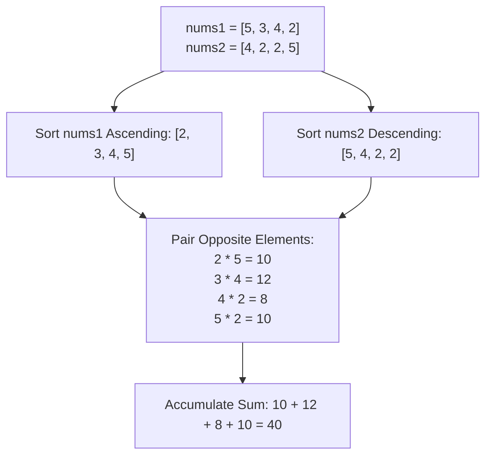

# Guided Example: Minimize Product Sum of Two Arrays

We trace the step-by-step sorting, anti-monotonic pairing, and dot product minimization using the classical rearrangement inequality:

- **Input:**
  - `nums1 = [5, 3, 4, 2]`
  - `nums2 = [4, 2, 2, 5]`
- **Required Output:** `40`

This instance demonstrates how pairing the largest available element in one array with the smallest available element in the other produces the provable global minimum product sum across all possible permutations.

---

## 1. Instance & Teaching Goal

We are given two integer arrays `nums1` and `nums2` of equal length $N$.
The product sum of the two arrays is:
$$\text{Product Sum} = \sum_{i=0}^{N-1} nums1[i] \times nums2[i]$$
We are permitted to permute the elements of `nums1` in any arbitrary order.
We seek the minimum possible product sum obtainable.

In our instance:
- `nums1 = [5, 3, 4, 2]`
- `nums2 = [4, 2, 2, 5]`
- Length $N = 4$.
- Suppose we sort `nums1` in ascending order:
  $$\text{sorted\_nums1} = [2, 3, 4, 5]$$
- Suppose we sort `nums2` in descending order:
  $$\text{sorted\_nums2} = [5, 4, 2, 2]$$
- Compute pairwise products:
  - $2 \times 5 = 10$
  - $3 \times 4 = 12$
  - $4 \times 2 = 8$
  - $5 \times 2 = 10$
- Sum: $10 + 12 + 8 + 10 = 40$.
- Minimal product sum is $40$.

The teaching goal is to apply the **Rearrangement Inequality**: pairing elements in opposite sorted orders (anti-monotonic matching) strictly minimizes the scalar dot product.

---

## 2. Conceptual Foundation & Invariants

### Rearrangement Inequality Invariant Theorem

> **Rearrangement Inequality & Anti-Monotonic Pairing Theorem.**
> 1. *Rearrangement Inequality:* For any two sequences of real numbers sorted in non-decreasing order $x_1 \le x_2 \le \dots \le x_n$ and $y_1 \le y_2 \le \dots \le y_n$, and for any permutation $\sigma$ of $\{1, \dots, n\}$:
>    $$\sum_{i=1}^n x_i y_{n - i + 1} \le \sum_{i=1}^n x_i y_{\sigma(i)} \le \sum_{i=1}^n x_i y_i$$
> 2. *Global Minimality:* The lower bound is uniquely attained when $x$ and $y$ are paired in strictly opposite order: the smallest element of $x$ is multiplied by the largest element of $y$, the second smallest by the second largest, and so on.
> 3. *Exchange Invariant:* If any pair of elements $(x_i, y_j)$ and $(x_k, y_l)$ has $x_i < x_k$ and $y_j < y_l$, exchanging their targets to $(x_i, y_l)$ and $(x_k, y_j)$ changes the sum by $(x_k - x_i)(y_j - y_l) \le 0$, strictly non-increasing the total.
> 4. *Complexity:* Sorting both arrays takes $\mathcal{O}(N \log N)$ (or $\mathcal{O}(N + K)$ via counting sort where $K = 100$ is the maximum value). The dot product evaluates in $\mathcal{O}(N)$ time.

---

## 3. Step-by-Step Worked Execution

We trace the algorithm on `nums1 = [5, 3, 4, 2]` and `nums2 = [4, 2, 2, 5]`.

---

### Step 1: Sort `nums1` in Ascending Order
$$\text{sorted\_nums1} = [2, 3, 4, 5]$$

---

### Step 2: Sort `nums2` in Descending Order
$$\text{sorted\_nums2} = [5, 4, 2, 2]$$

---

### Step 3: Compute Pairwise Products
Initialize running sum $S = 0$.

1. **Index $i = 0$:**
   - Smallest from `nums1`: $2$.
   - Largest from `nums2`: $5$.
   - Product: $2 \times 5 = 10$.
   - Accumulator: $S \gets 0 + 10 = 10$.

2. **Index $i = 1$:**
   - Next smallest from `nums1`: $3$.
   - Next largest from `nums2`: $4$.
   - Product: $3 \times 4 = 12$.
   - Accumulator: $S \gets 10 + 12 = 22$.

3. **Index $i = 2$:**
   - Next smallest from `nums1`: $4$.
   - Next largest from `nums2`: $2$.
   - Product: $4 \times 2 = 8$.
   - Accumulator: $S \gets 22 + 8 = 30$.

4. **Index $i = 3$:**
   - Largest from `nums1`: $5$.
   - Smallest from `nums2`: $2$.
   - Product: $5 \times 2 = 10$.
   - Accumulator: $S \gets 30 + 10 = 40$.

---

### Step 4: Final Output
Minimal product sum: **`40`**.

---

## 4. Complete Execution Trace

| Index $i$ | `sorted_nums1[i]` (Ascending) | `sorted_nums2[i]` (Descending) | Index Product | Running Accumulated Sum |
|:---:|:---:|:---:|:---:|:---:|
| 0 | 2 | 5 | $2 \times 5 = 10$ | 10 |
| 1 | 3 | 4 | $3 \times 4 = 12$ | 22 |
| 2 | 4 | 2 | $4 \times 2 = 8$ | 30 |
| 3 | 5 | 2 | $5 \times 2 = 10$ | **40** |

---

## 5. Algorithmic Correctness

**Soundness.** Every element of `nums1` is matched with exactly one element of `nums2`, representing a legal bijection and permutation. Multiplying elements in opposite order is proven by the rearrangement inequality to minimize the sum of products.

**Completeness.** Suppose an optimal permutation did not sort elements anti-monotonically. There would exist an inversion where $x_a < x_b$ but $y_a < y_b$. Swapping their pairings transforms $x_a y_a + x_b y_b$ to $x_a y_b + x_b y_a$, strictly reducing the sum by $(x_b - x_a)(y_b - y_a) > 0$. By repeated adjacent transpositions, any permutation can be transformed into the anti-monotonic pairing without ever increasing the product sum.

---

## 6. Traps This Instance Exposes

- **Same-Direction Pairing:** Pairing largest with largest (e.g. $[2, 3, 4, 5]$ with $[2, 2, 4, 5] \to 2\times 2 + 3\times 2 + 4\times 4 + 5\times 5 = 4 + 6 + 16 + 25 = 51$) *maximizes* the product sum instead of minimizing it.
- **Modifying `nums2` Legality:** The problem states `nums1` may be rearranged while `nums2` supplies the positions. Sorting both arrays conceptually achieves the exact same pairing as permuting `nums1` to oppose `nums2`'s original positions.
- **Counting Sort Optimization:** Since values satisfy $1 \le nums[i] \le 100$, bucket / counting sort runs in $\mathcal{O}(N)$ linear time, avoiding logarithmic comparison overhead.

---

## 7. Complexity Derivation

- **Time Complexity:** $\mathcal{O}(N \log N)$ with standard sorting, or $\mathcal{O}(N + K)$ with counting sort where $K = 100$. Computing the dot product takes $\mathcal{O}(N)$ time.
- **Auxiliary Space Complexity:** $\mathcal{O}(1)$ beyond the sorted arrays, or $\mathcal{O}(K)$ for counting sort frequency arrays.
