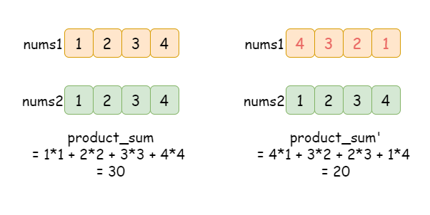
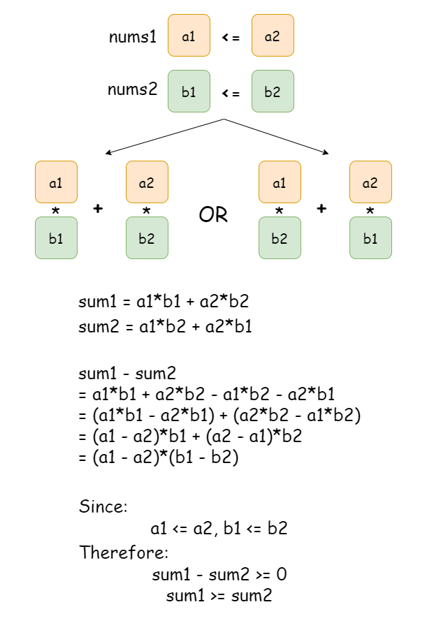
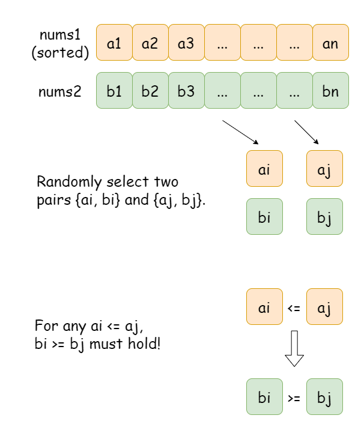
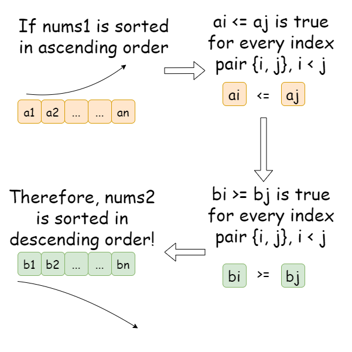
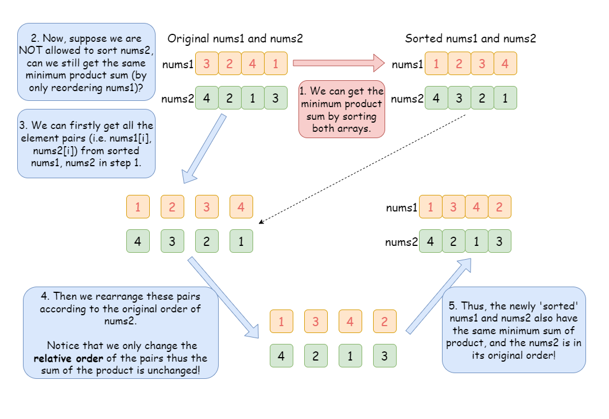
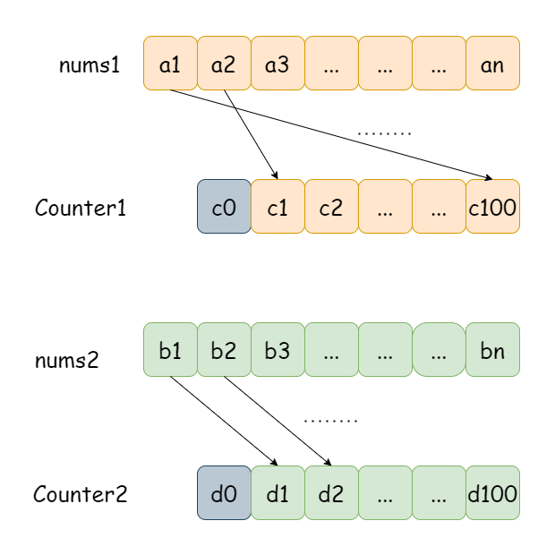
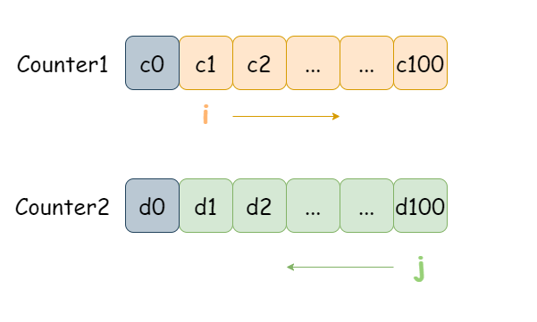

[TOC]

## Solution

---
### Overview

In this problem, we are given two arrays $\text{nums1}$ and $\text{nums2}$ of the same length. Let's assume that $\text{nums1} = [a_1, a_2, ... , a_n]$, $\text{nums2} = [b_1, b_2, ... , b_n]$, their **product sum** is defined as:
$\text{product\\_sum} = a_1 \cdot b_1 + a_2 \cdot b_2 + ... + a_n \cdot b_n$.

We are allowed to freely rearrange the order of the elements in $\text{nums1}$. After doing so, this operation might result in a different **product sum**. Take the figure below as an example:



Our goal is to find the minimum **product sum** of $\text{nums1}$ and $\text{nums2}$.

---

### Approach 1: Sort both arrays

**Intuition**

For convenience, let's temporarily disregard the restriction on $\text{nums2}$ and assume that we can freely sort both arrays.

Start from the base case, given $\text{nums1} = [a1, a2]$ and $\text{nums2} = [b1, b2]$ respectively, assume that:
- $a1 \leqslant a2$
- $b1 \leqslant b2$

As shown in the figure below, these two arrays have two possible product sums:
- $\text{sum1} = a_1 \cdot b_1 + a_2 \cdot b_2$
- $\text{sum2} = a_1 \cdot b_2 + a_1 \cdot b_2$



It shows that: if we pair them as ${a_1 \times b_2}$ and ${a_2 \times b_1}$, their product sum is smaller than that of the other case.

> Can we extend the conclusion of the base case to a more general case? In other words, will this rule work for longer arrays?

Suppose that we have two arrays with certain orders so that their product sum is minimized. We randomly select two indexes $i, j$ and the corresponding elements from $\text{nums1}$ and $\text{nums2}$, namely: $\text{nums1}[i], \text{nums1}[j], \text{nums2}[i]$, and $\text{nums2}[j]$.

> Assume $i < j$, what should the order of $a_i,\  a_j$ and $b_i,\ b_j$ be?

In the previous section, we demonstrated that: in order to obtain the minimum product sum of two arrays of size 2:
- If $a_i \leqslant a_j$, then $b_i \geqslant b_j$ must hold.
- If $a_i \geqslant a_j$, then $b_i \leqslant b_j$ must hold.

For this example, let's assume $\text{nums1}$ is sorted in ascending order, that is: $a_i \leqslant a_j$ if $i < j$.
Let's also assume $b_i \geqslant b_j$ for $b_i, b_j$ from $\text{nums2}$, that is, $\text{nums2}$ is sorted in descending order.



> This is equivalent to saying that $\text{nums2}$ is sorted in descending order!



Therefore, if $\text{nums1}$ is sorted in ascending order, then we must sort $\text{nums2}$ in **descending** order to get the minimum product sum!

> Recall that we temporarily ignored the restriction that says we can only sort $\text{nums1}$. Did sorting $\text{nums1}$ and $\text{nums2}$ allow us to obtain a smaller product sum than we could obtain by only sorting $\text{nums1}$?

The answer is No. Suppose we sort $\text{nums1}$ and $\text{nums2}$ accordingly. We can always rearrange the relative order of these **element pairs** according to the original $\text{nums2}$. Then the rearranged $\text{nums1}$ can be obtained by reordering it. In other words, any product sum obtained from reordering both arrays can also be obtained from only reordering one array.

Take the picture below as an example.



**Algorithm**

1) Sort $\text{nums1}$ in ascending order and $\text{nums2}$ in descending order.
2) Initialize the product sum $\text{ans}$ as 0.
3) Iterate over both sorted arrays and update the cumulative product sum.
4) Return $\text{ans}$.

**Implementation**

```python
class Solution:
    def minProductSum(self, nums1: List[int], nums2: List[int]) -> int:
        # Sort nums1 in ascending order, and nums2 in
        # descending order.
        nums1.sort()
        nums2.sort(reverse=True)

        # Initialize sum as 0.
        ans = 0

        # Iterate over two sorted arrays and calculate the
        # cumulative product sum.
        for num1, num2 in zip(nums1, nums2):
            ans += num1 * num2

        return ans
```

**Complexity Analysis**

Let $n$ be the length of the input arrays $\text{nums1}$ and $\text{nums2}$.

* Time complexity: $O(n\cdot \log n)$

- We sort $\text{nums1}$ and $\text{nums2}$, each takes $O(n\cdot \log n)$ time.
- Then we iterate over the two sorted arrays to calculate the cumulative product sum, at step $i$ we need to calculate $\text{nums1}[i] \cdot \text{nums2}[i]$ which takes constant time. This iteration takes $O(n)$ time.
- To sum up, the overall time complexity is $O(n\cdot \log n)$

* Space complexity: $O(n)$
- Some extra space is used when we sort $\text{nums1}$ and $\text{nums2}$ in place. The space complexity of the sorting algorithm depends on the programming language.
- In Python, the `sort` method sorts a list using the Timsort algorithm, which is a combination of Merge Sort and Insertion Sort and uses $O(n)$ additional space.
- In C++, the sort() function is implemented as a hybrid of Quick Sort, Heap Sort, and Insertion Sort, with worst-case space complexity of $O(\log n)$.
- In Java, Arrays.sort() is implemented using a variant of the Quick Sort algorithm which has a space complexity of $O(\log n)$.
- We then traverse both arrays and calculate the cumulative product sum, this step takes $O(1)$ extra space.
- To sum up, the overall space complexity is $O(n)$ for Python and $O(\log n)$ for C++ and Java.

<br/>

---

### Approach 2: PriorityQueue

**Intuition**

In the previous approach, we sorted both $\text{nums1}$ and $\text{nums2}$. Recall the restriction on $\text{nums2}$. So in this approach, we will just sort $\text{nums1}$ in ascending order and keep $\text{nums2}$ as it is. However, we can use a PriorityQueue $\text{pq}$ to store all the elements from $\text{nums2}$, thus we can get the elements from $\text{nums2}$ in sorted order without actually 'sorting' $\text{nums2}$.

In the previous approach, we iterated over the elements of $\text{nums2}$ by their descending values. Similarly, we can get the elements from $\text{nums2}$ in descending order by implementing a PriorityQueue $\text{pq}$ as a Max-Heap; in each step during the iteration, we pop the top element - the largest element from the $\text{pq}$. Therefore, we can repeatedly accumulate the product of each element from $\text{nums1}$ with the top element in $\text{pq}$, which is equivalent to iterating over decreasingly sorted $\text{nums2}$.

**Algorithm**

1) Sort $\text{nums1}$ in ascending order.
2) Initialize the product sum $\text{ans}$ as 0.
3) Initialize an empty PriorityQueue $\text{pq}$ and add every element of $\text{nums}$ to $\text{pq}$.
4) Iterate over the sorted arrays $\text{nums1}$. For each element in $\text{nums1}$, calculate its product with the top element in $\text{pq}$, then pop the top element from $\text{pq}$.
5) After finishing the iteration in step 4, return $\text{ans}$.

```python
class Solution:
    def minProductSum(self, nums1: List[int], nums2: List[int]) -> int:
        # Sort nums1 in ascending order.
        nums1.sort()

        # Initialize a PriorityQueue pq as a Max-Heap, and add
        # every element of nums2 to pq.
        pq = [-num for num in nums2]
        heapq.heapify(pq)

        # Initialize the product sum as 0 before the iteration.
        ans = 0

        # During the iteration
        for idx in range(len(nums2)):
            # Add the product of nums[idx] and the maximum element
            # left in pq, remove this element from pq
            ans += nums1[idx] * (-heapq.heappop(pq))

        return ans
```

**Complexity Analysis**

Let $n$ be the length of the input array $\text{nums1}$ and $\text{nums2}$.

* Time complexity: $O(n\cdot \log n)$

- We create a max heap with the elements in $\text{nums2}$. This requires $O(n \log n)$ time if we push each element into the heap one by one and $O(n)$ time if we use the heapify method.
- During the iteration, we repeatedly pop the top element from $\text{pq}$, it takes $O(n\cdot \log n)$ time to pop $n$ elements.
- To sum up, the overall time complexity is $O(n\cdot \log n)$.

* Space complexity: $O(n)$

- We initialize a PriorityQueue $\text{pq}$ to keep all the elements from $\text{nums2}$, which takes $O(n)$ space.
- Some extra space is used when we sort $\text{nums1}$ in place. The space complexity of the sorting algorithm depends on the programming language.
- In Python, the `sort` method sorts a list using Timesort algorithm which is a combination of Merge Sort and Insertion Sort, and has $O(n)$ additional space.
- In C++, the sort() function is implemented as a hybrid of Quick Sort, Heap Sort, and Insetion Sort, with worse-case space complexity of $O(\log n)$.
- In Java, Arrays.sort() is implemented using a variant of the Quick Sort algorithm which has a space complexity of $O(\log n)$.
- In the iteration, we repeatedly pop the top element from $\text{pq}$, calculate the product of each pair, and update the product sum, which only takes constant space.
- Therefore, the overall space complexity is $O(n)$.

<br/>

---

### Approach 3: Counting Sort

**Intuition**

The constraints of integers in the input arrays is $1 \leq \text{nums1}[i], \text{nums2}[i] \leq 100$. Notice that the valid range of elements is quite small compared with the scale of the array. Therefore, it seems like a promising method is Counting Sort, which has linear time complexity and space complexity.

>What is Counting Sort?

For a detailed introduction, you can refer to this article on [Counting Sort](https://en.wikipedia.org/wiki/Counting_sort).

In short, Counting Sort is not a comparison sort; thus, the $O(n \cdot \log(n))$ time complexity for comparison sorting does not apply. To perform a Counting Sort, we create an empty auxiliary array ($\text{counter1}$), and for each number in $\text{nums1}$, we increment $\text{\text{counter1}[index]}$ where the index is based on the number's value.

>How do we determine the size of the auxiliary array?

Given the constraints of integers in the input arrays as $1 \leq \text{nums1}[i], \text{nums2}[i] \leq 100$, using an auxiliary array with a length of 101 is enough to cover all the possible values within the given range. We let $\text{counter1}[1]$ represent the number of occurrences of all 1's, $\text{counter1}[2]$ represent the number of occurrences of all 2's, so on so forth. Hence we have built a bijection, a one-to-one correspondence between the element value in $\text{nums1}$ and the index of $counter1$. As shown in the figure below.



More specifically, let's take a look at the slides below as an example of how we sort $\text{nums1}$ using Counting Sort. All the elements in $\text{counter1}$ are initialized as 0 since we haven't count the occurrence of any number yet. Then we traverse $\text{nums1}$, for each number $num$ in the array, we increment its number of occurrence by 1 in $\text{counter1}$, that is, let $\text{\text{counter1}[num]} = \text{\text{counter1}[num]} + 1$. Please refer to the slides below.

!?!../Documents/1874/countingSort.json:601,301!?!

Now we have saved the 'sorted' arrays $\text{nums1}$ and $\text{nums2}$ in $\text{counter1}$ and $\text{counter2}$ respectively, the next step is to traverse $\text{counter1}$ in ascending order and $\text{counter2}$ in descending order.



Take the slides below as an example.

!?!../Documents/1874/countingSort2.json:601,301!?!

**Algorithm**

1) Initialize two empty arrays $\text{counter1}$ and $\text{counter2}$ of length 101 as counters, initialize the product sum as $\text{ans} = 0$.
2) Iterate over $\text{nums1}$ and update $\text{counter1}$, the occurrence of each element, during the iteration.
3) Iterate over $\text{nums2}$ and update $\text{counter2}$, the occurrence of each element, during the iteration.
4) Initialize two 'pointers' $p1 = 1$, $p2 = 100$, stands for the index of $\text{counter1}$ and $\text{counter2}$ respectively.
5) Calculate the cumulative product sum $\text{ans}$ of each pair of elements.
6) Return $\text{ans}$.

**Implementation**

```python
class Solution:
    def minProductSum(self, nums1: List[int], nums2: List[int]) -> int:
        # Initialize counter1 and counter2.
        counter1, counter2 = [0] * 101, [0] * 101

        # Record the number of occurrence of elements in nums1 and nums2.
        for num in nums1:
            counter1[num] += 1
        for num in nums2:
            counter2[num] += 1

        # Initialize two pointers p1 = 1, p2 = 100.
        # Stands for counter1[1] and counter2[100], respectively.
        p1, p2 = 1, 100
        ans = 0

        # While the two pointers are in the valid range.
        while p1 <= 100 and p2 > 0:

            # If counter1[p1] == 0, meaning there is no element equals p1 in counter1,
            # thus we shall increment p1 by 1.
            while p1 <= 100 and counter1[p1] == 0:
                p1 += 1

            # If counter2[p2] == 0, meaning there is no element equals p2 in counter2,
            # thus we shall decrement p2 by 1.
            while p2 > 0 and counter2[p2] == 0:
                p2 -= 1

            # If any of the pointer goes beyond the border, we have finished the
            # iteration, break the loop.
            if p1 == 101 or p2 == 0:
                break

            # Otherwise, we can make at most min(counter1[p1], counter2[p2])
            # pairs {p1, p2} from nums1 and nums2, let's call it occ.
            # Each pair has product of p1 * p2, thus the cumulative sum is
            # incresed by occ * p1 * p2. Update counter1[p1] and counter2[p2].
            occ = min(counter1[p1], counter2[p2])
            ans += occ * p1 * p2
            counter1[p1] -= occ
            counter2[p2] -= occ

        # Once we finish the loop, return ans as the product sum.
        return ans
```

**Complexity Analysis**

Let $n$ be the length of the input array $\text{nums1}$ and $\text{nums2}$, and $k$ be the range of values in $\text{nums1}$ or $\text{nums2}$.

* Time complexity: $O(n + k)$
- We need to traverse both the input arrays once. In each step during the iteration, we increment the count of the current number by 1 in $\text{counter1}$ or $\text{counter2}$; which just takes constant time. Thus each of these two traversals takes $O(n)$ time.
- Then, we traverse the two counter arrays $\text{counter1}$ and $\text{counter2}$, calculate the cumulative product sum, which takes $O(k)$ time.
- To sum up, the overall time complexity is $O(n + k)$.

* Space complexity: $O(k)$
- Given the range of input values, we used two arrays $\text{counter1}$, $\text{counter2}$ of size $k$ to record the number of occurrences of each number in $\text{nums1}$ and $\text{nums2}$, which takes $O(k)$ space.
- In the second iteration, we just need to record the cumulative product sum of the elements.
- To sum up, the overall space complexity is $O(k)$.

<br/>

---