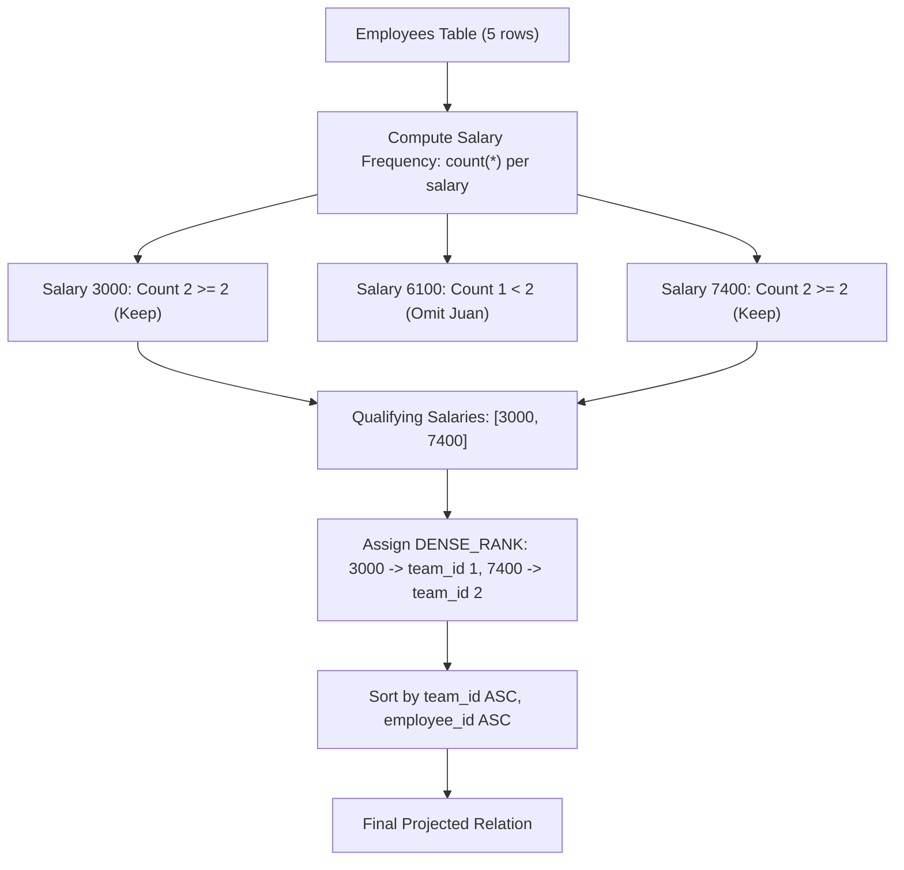

# Guided Example: Group Employees of the Same Salary

We trace the step-by-step salary frequency counting, singleton omission, and dense ranking of qualifying salary cohorts to assign team identifiers:

- **Input:**
  - `Employees` table:
    - ID 2: `"Meir"`, salary 3000
    - ID 3: `"Michael"`, salary 3000
    - ID 7: `"Addilyn"`, salary 7400
    - ID 8: `"Juan"`, salary 6100
    - ID 9: `"Kannon"`, salary 7400
- **Required Output:**

| employee_id | name | salary | team_id |
|:---:|:---|:---:|:---:|
| 2 | Meir | 3000 | 1 |
| 3 | Michael | 3000 | 1 |
| 7 | Addilyn | 7400 | 2 |
| 9 | Kannon | 7400 | 2 |

This instance demonstrates identifying and pruning unique salaries (Juan's salary 6100 appears only once), grouping shared salaries (3000 and 7400), assigning contiguous gapless team IDs via dense ranking over ascending salaries, and ordering by `team_id ASC, employee_id ASC`.

---

## 1. Instance & Teaching Goal

We are given an `Employees` table with employee IDs, names, and salaries.
Rules for team formation:
1. A team must consist of at least two employees who share the exact same salary.
2. Any employee whose salary is unique (frequency equals 1) is disqualified and omitted from the results.
3. Each distinct qualifying salary is assigned a 1-indexed `team_id` starting from 1 in ascending order of salary, with no gaps.
4. Output all qualifying employees with their `employee_id`, `name`, `salary`, and `team_id`, ordered first by `team_id` ascending, then by `employee_id` ascending.

In our instance:
- Salaries present:
  - $3000$: Employees 2 and 3 $\implies$ count $= 2 \ge 2$ (Qualifying team).
  - $6100$: Employee 8 $\implies$ count $= 1$ (Singleton, omitted).
  - $7400$: Employees 7 and 9 $\implies$ count $= 2 \ge 2$ (Qualifying team).
- Distinct qualifying salaries sorted ascending:
  1. $3000 \implies \text{team\_id} = 1$.
  2. $7400 \implies \text{team\_id} = 2$.
- Assigning team IDs:
  - Employee 2 (salary 3000) $\to \text{team\_id} = 1$.
  - Employee 3 (salary 3000) $\to \text{team\_id} = 1$.
  - Employee 7 (salary 7400) $\to \text{team\_id} = 2$.
  - Employee 9 (salary 7400) $\to \text{team\_id} = 2$.
- Sorting by `team_id ASC, employee_id ASC` produces the required 4 rows.

The teaching goal is to structure **window partition filtering and dense ranking**:
1. Filter out rows where `COUNT(*) OVER(PARTITION BY salary) < 2`.
2. Compute `team_id = DENSE_RANK() OVER(ORDER BY salary)`.
3. Order the final relation by `team_id, employee_id`.

---

## 2. Conceptual Foundation & Invariants

### Dense Rank Salary Partition Invariant Theorem

> **Salary Cohort Partition & Dense Rank Team Allocation Theorem.**
> 1. *Singleton Pruning Invariant:* Let $\text{freq}(s) = |\{e \in \text{Employees} \mid e.\text{salary} == s\}|$. An employee $e$ belongs to a valid team if and only if:
>    $$\text{freq}(e.\text{salary}) \ge 2$$
> 2. *Contiguous Team Identifier Assignment:* Let $\mathcal{S}_{\text{valid}} = \{s_1 < s_2 < \dots < s_k\}$ be the sorted set of distinct salaries with frequency $\ge 2$. Each salary $s_m$ is assigned:
>    $$\text{team\_id}(s_m) = m \quad (1 \le m \le k)$$
>    Dense ranking over $\mathcal{S}_{\text{valid}}$ guarantees consecutive integers $1, 2, \dots, k$ with zero gaps between teams.
> 3. *Deterministic Multi-Column Sort:* Ordering output rows by `(team_id ASC, employee_id ASC)` yields a strictly deterministic sequence.
> 4. *Complexity:* Window counting or group aggregation takes $\mathcal{O}(R \log R)$. Dense ranking and final sorting take $\mathcal{O}(R \log R)$ time.

---

## 3. Step-by-Step Worked Execution

We trace the relational transformations on the 5 employee records:

---

### Step 1: Evaluate Salary Frequencies
Count occurrences of each unique salary across all employees:
- Salary $3000$: Employees $2$ (`"Meir"`) and $3$ (`"Michael"`). Count $= 2$.
- Salary $6100$: Employee $8$ (`"Juan"`). Count $= 1$.
- Salary $7400$: Employees $7$ (`"Addilyn"`) and $9$ (`"Kannon"`). Count $= 2$.

---

### Step 2: Filter Non-Singleton Cohorts ($\text{count} \ge 2$)
- Salary $6100$ has count $1 < 2 \implies$ Employee $8$ is pruned.
- Qualifying employees:
  - Employee $2$: `"Meir"`, salary $3000$.
  - Employee $3$: `"Michael"`, salary $3000$.
  - Employee $7$: `"Addilyn"`, salary $7400$.
  - Employee $9$: `"Kannon"`, salary $7400$.

---

### Step 3: Assign `team_id` via Dense Ranking
Extract distinct qualifying salaries and sort ascending:
1. Salary $3000$: First distinct salary $\implies \text{team\_id} = 1$.
2. Salary $7400$: Second distinct salary $\implies \text{team\_id} = 2$.

Map team IDs to qualifying rows:
- Employee 2: `team_id = 1`
- Employee 3: `team_id = 1`
- Employee 7: `team_id = 2`
- Employee 9: `team_id = 2`

---

### Step 4: Multi-Column Sort
Order rows by `team_id ASC, employee_id ASC`:
1. Row 1: `team_id = 1, employee_id = 2` (`"Meir"`, $3000$).
2. Row 2: `team_id = 1, employee_id = 3` (`"Michael"`, $3000$).
3. Row 3: `team_id = 2, employee_id = 7` (`"Addilyn"`, $7400$).
4. Row 4: `team_id = 2, employee_id = 9` (`"Kannon"`, $7400$).

---

## 4. Complete Execution Trace

| `employee_id` | Name | Salary | Salary Frequency | Retained? | Assigned `team_id` | Final Sort Order |
|:---:|:---|:---:|:---:|:---:|:---:|:---:|
| 2 | Meir | 3000 | 2 | **Yes** ($\ge 2$) | 1 | 1 |
| 3 | Michael | 3000 | 2 | **Yes** ($\ge 2$) | 1 | 2 |
| 7 | Addilyn | 7400 | 2 | **Yes** ($\ge 2$) | 2 | 3 |
| 8 | Juan | 6100 | 1 | **No** ($1 < 2$) | - | Excluded |
| 9 | Kannon | 7400 | 2 | **Yes** ($\ge 2$) | 2 | 4 |

---

## 5. Algorithmic Correctness

**Soundness.** All returned employees belong to a salary group with frequency at least 2. The assigned team IDs are contiguous positive integers $1, 2, \dots$ strictly matching the ascending order of qualifying salaries, guaranteeing zero spurious IDs or rank gaps.

**Completeness.** Every employee with a shared salary is retained, and no qualifying salary is skipped in the dense rank enumeration.

---

## 6. Traps This Instance Exposes

- **Ranking Before Filtering:** Calculating `DENSE_RANK()` on the unfiltered table would assign salary $6100$ a team ID (e.g. team 2), causing salary $7400$ to become team 3. Discarding Juan *afterwards* leaves a hole in the team IDs (`1, 3`), which violates the gapless contiguous constraint ($1, 2, \dots$). Filtering singletons *before* dense ranking is mandatory.
- **`RANK()` vs `DENSE_RANK()`:** Using `RANK()` skips rank positions when multiple employees share a salary, whereas `DENSE_RANK()` assigns identical identifiers to equal salaries and increments by 1 for the next distinct salary.
- **Secondary Sort on Employee ID:** Sorting only by `team_id` produces non-deterministic employee order within teams; secondary sorting on `employee_id` is essential.

---

## 7. Complexity Derivation

- **Time Complexity:** $\mathcal{O}(R \log R)$, where $R$ is the number of rows in `Employees`. Window aggregation, filtering, dense ranking, and final multi-key sorting all execute in $\mathcal{O}(R \log R)$ time.
- **Auxiliary Space Complexity:** $\mathcal{O}(R)$ to store intermediate window metrics and filtered relations.
