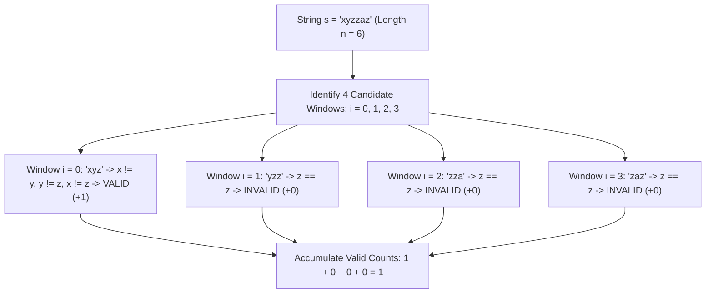

# Guided Example: Substrings of Size Three with Distinct Characters

We trace the sliding window evaluation of all 3-character substrings on a representative string instance to count those containing mutually distinct characters:

- **Input:** `s = "xyzzaz"`
- **Required Output:** `1`

This instance demonstrates iterating across all contiguous windows of fixed length $k = 3$, evaluating the pairwise inequality condition across adjacent triplets, filtering out substrings with duplicate characters, and accumulating the count of valid substrings.

---

## 1. Instance & Teaching Goal

We are given a string `s` of lowercase English letters. A string is defined as *good* if there are no repeated characters. We want to determine the count of good substrings of length exactly $3$.

For `s = "xyzzaz"`, the length is $n = 6$.
The number of contiguous substrings of length $3$ is:
$$n - 3 + 1 = 6 - 3 + 1 = 4$$

The candidate 3-character windows start at indices $i \in \{0, 1, 2, 3\}$:
1. Window $i = 0$: $s[0 \dots 2] = \text{"xyz"}$
   - Characters: `'x'`, `'y'`, `'z'`.
   - All three characters are distinct $\implies$ Good substring. (Total: $1$)
2. Window $i = 1$: $s[1 \dots 3] = \text{"yzz"}$
   - Characters: `'y'`, `'z'`, `'z'`.
   - Character `'z'` is repeated $\implies$ Not good.
3. Window $i = 2$: $s[2 \dots 4] = \text{"zza"}$
   - Characters: `'z'`, `'z'`, `'a'`.
   - Character `'z'` is repeated $\implies$ Not good.
4. Window $i = 3$: $s[3 \dots 5] = \text{"zaz"}$
   - Characters: `'z'`, `'a'`, `'z'`.
   - Character `'z'` appears at both ends $\implies$ Not good.

The total count of good substrings is $1$.

The teaching goal is to understand **fixed-size window verification**:
1. How a constant window size simplifies frequency tracking to direct pairwise comparisons.
2. The exact index bounds for candidate enumeration: $0 \le i \le n - 3$.
3. Why pairwise distinctness among 3 elements requires verifying exactly 3 inequalities: $a \neq b$, $b \neq c$, and $a \neq c$.

---

## 2. Conceptual Foundation & Invariants

### Fixed-Length Trigram Uniqueness Invariant Theorem

> **Fixed-Length Trigram Uniqueness Invariant Theorem.**
> 1. *Candidate Enumeration Invariant:* For any string of length $n$, the total number of substrings of length $k = 3$ is $\max(0, n - 2)$. Each candidate corresponds uniquely to the starting index $i \in \{0, 1, \dots, n - 3\}$.
> 2. *Trigram Distinctness Invariant:* A triplet $(s[i], s[i+1], s[i+2])$ consists of mutually distinct characters if and only if:
>    $$(s[i] \neq s[i+1]) \land (s[i] \neq s[i+2]) \land (s[i+1] \neq s[i+2])$$
>    The cardinality of the set of characters $\{s[i], s[i+1], s[i+2]\}$ equals $3$ if and only if all three conjunction terms hold.
> 3. *Additive Accumulation:* Let $\mathbb{I}(i) \in \{0, 1\}$ denote the truth value of the distinctness predicate for the window starting at $i$. The global count of good substrings is:
>    $$\text{Total} = \sum_{i=0}^{n-3} \mathbb{I}(i)$$
> 4. *Complexity:* Evaluating $\mathbb{I}(i)$ requires $\mathcal{O}(1)$ operations. Summing over all $n - 2$ candidate positions runs in strictly $\mathcal{O}(n)$ time and $\mathcal{O}(1)$ auxiliary space.

---

## 3. Step-by-Step Worked Execution

We trace the verification of each 3-character window in `s = "xyzzaz"`:

---

### Step 1: Initialize Scan Parameters
- Length $n = 6$.
- Number of candidate windows: $n - 2 = 4$.
- Running counter: $\text{good\_count} = 0$.

---

### Step 2: Evaluate Window at Index 0 ($s[0 \dots 2]$)
- Window substring: `"xyz"`.
- Triplet: $a = \text{'x'}, b = \text{'y'}, c = \text{'z'}$.
- Check conditions:
  - $a \neq b$: $\text{'x'} \neq \text{'y'}$ (True)
  - $b \neq c$: $\text{'y'} \neq \text{'z'}$ (True)
  - $a \neq c$: $\text{'x'} \neq \text{'z'}$ (True)
- All three distinct $\implies$ Valid.
- Update counter: $\text{good\_count} = 0 + 1 = 1$.

---

### Step 3: Evaluate Window at Index 1 ($s[1 \dots 3]$)
- Window substring: `"yzz"`.
- Triplet: $a = \text{'y'}, b = \text{'z'}, c = \text{'z'}$.
- Check conditions:
  - $a \neq b$: $\text{'y'} \neq \text{'z'}$ (True)
  - $b \neq c$: $\text{'z'} \neq \text{'z'}$ (False)
- Duplicate detected ($b = c$) $\implies$ Invalid.
- Counter remains: $\text{good\_count} = 1$.

---

### Step 4: Evaluate Window at Index 2 ($s[2 \dots 4]$)
- Window substring: `"zza"`.
- Triplet: $a = \text{'z'}, b = \text{'z'}, c = \text{'a'}$.
- Check conditions:
  - $a \neq b$: $\text{'z'} \neq \text{'z'}$ (False)
- Duplicate detected ($a = b$) $\implies$ Invalid.
- Counter remains: $\text{good\_count} = 1$.

---

### Step 5: Evaluate Window at Index 3 ($s[3 \dots 5]$)
- Window substring: `"zaz"`.
- Triplet: $a = \text{'z'}, b = \text{'a'}, c = \text{'z'}$.
- Check conditions:
  - $a \neq b$: $\text{'z'} \neq \text{'a'}$ (True)
  - $b \neq c$: $\text{'a'} \neq \text{'z'}$ (True)
  - $a \neq c$: $\text{'z'} \neq \text{'z'}$ (False)
- Duplicate detected ($a = c$) $\implies$ Invalid.
- Counter remains: $\text{good\_count} = 1$.

---

### Step 6: Conclude and Finalize Result
- All starting indices $0 \le i \le 3$ have been evaluated.
- Final count of good substrings: $1$.

---

## 4. Complete Execution Trace

| Start Index $i$ | Window $s[i \dots i+2]$ | Triplet $(a, b, c)$ | $a \neq b$? | $b \neq c$? | $a \neq c$? | Valid? | Running Total |
|:---:|:---:|:---:|:---:|:---:|:---:|:---:|:---:|
| 0 | `"xyz"` | `('x', 'y', 'z')` | Yes | Yes | Yes | **Yes** | 1 |
| 1 | `"yzz"` | `('y', 'z', 'z')` | Yes | **No** | Yes | **No** | 1 |
| 2 | `"zza"` | `('z', 'z', 'a')` | **No** | Yes | Yes | **No** | 1 |
| 3 | `"zaz"` | `('z', 'a', 'z')` | Yes | Yes | **No** | **No** | 1 |

---

## 5. Algorithmic Correctness

**Soundness.** Every substring counted has length exactly 3 and satisfies all pairwise inequality relations among its characters. By definition, a set of 3 elements whose members are pairwise unequal contains exactly 3 distinct elements.

**Completeness.** The loop iterates through every contiguous subsegment of length 3 by testing all valid starting indices $0 \le i \le n - 3$. No candidate substring is missed or counted more than once.

---

## 6. Traps This Instance Exposes

- **Incomplete Inequality Checking:** Checking only adjacent characters ($a \neq b$ and $b \neq c$) fails on strings like `"zaz"`, where the first and third characters match. Verifying $a \neq c$ is required to guarantee complete distinctness.
- **Off-by-One Loop Boundary:** The upper bound for the starting index is $n - 3$, which corresponds to index $n - 3$ inclusive (or range endpoint $n - 2$). Iterating up to $n - 2$ inclusive leads to out-of-bounds index access at $i + 2$.
- **Short Input Strings:** When $n < 3$, no 3-character substring exists. The loop must cleanly skip without executing or raising index errors, correctly yielding 0.

---

## 7. Complexity Derivation

- **Time Complexity:** $\mathcal{O}(n)$, where $n$ is the length of the string `s`. There are $n - 2$ windows, each evaluated in $\mathcal{O}(1)$ time via 3 character comparisons.
- **Auxiliary Space Complexity:** $\mathcal{O}(1)$, as only a constant number of loop indices, character variables, and an accumulator counter are maintained.