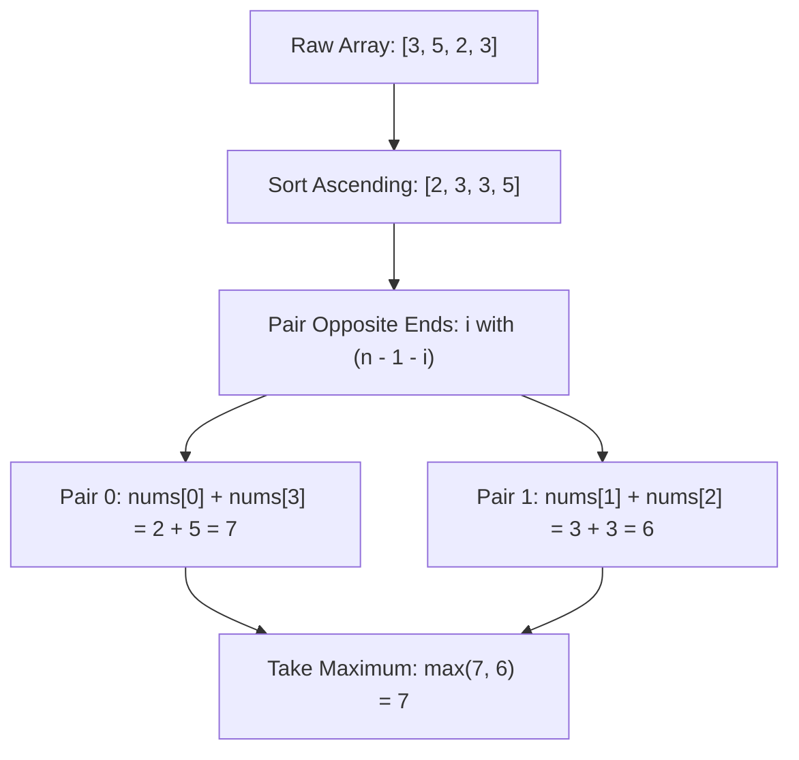

# Guided Example: Minimize Maximum Pair Sum in Array

We trace the sorting and complementary opposite-ends two-pointer pairing on a representative array instance to minimize the maximum pair sum:

- **Input:** `nums = [3, 5, 2, 3]`
- **Required Output:** `7`

This instance demonstrates sorting an even-length array ascending, pairing each element with its symmetric counterpart from the opposite end ($nums[i]$ with $nums[n - 1 - i]$), and evaluating the maximum pair sum across all formed pairs.

---

## 1. Instance & Teaching Goal

We are given an integer array `nums` of even length $n$. We must partition the $n$ numbers into $n / 2$ pairs such that the maximum sum among all pairs is minimized.

For `nums = [3, 5, 2, 3]`:
- Length $n = 4$, so we must form $4 / 2 = 2$ pairs.
- Possible pairings:
  1. Pair $(2, 3)$ and $(3, 5)$:
     - Sums: $2 + 3 = 5$, $3 + 5 = 8$.
     - Maximum pair sum: $\max(5, 8) = 8$.
  2. Pair $(2, 5)$ and $(3, 3)$:
     - Sums: $2 + 5 = 7$, $3 + 3 = 6$.
     - Maximum pair sum: $\max(7, 6) = 7$.
- The minimal maximum pair sum is $7$.

The teaching goal is to understand the **exchange argument behind greedy extremal pairing**:
1. Why sorting transforms an arbitrary combinatorial pairing problem into an exact symmetric pairing.
2. The mathematical proof showing that pairing the smallest element with the largest element balances the pair sums optimally.
3. How a two-pointer scan over the sorted array finds the minimax objective in linear time after sorting.

---

## 2. Conceptual Foundation & Invariants

### Anti-Monotonic Extremal Pairing Theorem

> **Anti-Monotonic Extremal Pairing Theorem.**
> 1. *Sorted Ordering:* Let the elements of `nums` be sorted in non-decreasing order:
>    $$a_0 \le a_1 \le a_2 \le \dots \le a_{n-1}$$
> 2. *Complementary Pairing Rule:* Form $n / 2$ pairs by matching index $i$ with index $n - 1 - i$ for all $0 \le i < n / 2$:
>    $$P_i = (a_i, a_{n-1-i}), \quad \text{with sum } S_i = a_i + a_{n-1-i}$$
> 3. *Exchange Argument Optimality:* Suppose an optimal pairing matches $x_1 \le x_2$ with $y_1 \le y_2$ in the uncrossed configuration $(x_1, y_1)$ and $(x_2, y_2)$. The pair sums are $x_1 + y_1$ and $x_2 + y_2$. The maximum is $x_2 + y_2$.
>    If we swap to the crossed configuration $(x_1, y_2)$ and $(x_2, y_1)$:
>    $$x_1 + y_2 \le x_2 + y_2 \quad \text{and} \quad x_2 + y_1 \le x_2 + y_2$$
>    Therefore:
>    $$\max(x_1 + y_2, x_2 + y_1) \le x_2 + y_2$$
>    Swapping never increases the maximum pair sum. Repeatedly applying this uncrossing step transforms any pairing into the anti-monotonic pairing without worsening the maximum.
> 4. *Complexity:* Sorting requires $\mathcal{O}(n \log n)$ time. Evaluating the $n / 2$ sums takes $\mathcal{O}(n)$ time. Auxiliary space is $\mathcal{O}(1)$ beyond the sort space.

---

## 3. Step-by-Step Worked Execution

We trace the execution on `nums = [3, 5, 2, 3]`:

---

### Step 1: Sort the Array Ascending
- Original array: `[3, 5, 2, 3]`.
- Sorted array: `a = [2, 3, 3, 5]`.
- Indices: $a[0] = 2, a[1] = 3, a[2] = 3, a[3] = 5$.
- Number of pairs to form: $n / 2 = 4 / 2 = 2$.

---

### Step 2: Initialize Two Pointers and Global Maximum
- Left pointer: $i = 0$.
- Right pointer: $j = n - 1 = 3$.
- Running maximum: $\text{max\_sum} = -\infty$.

---

### Step 3: Evaluate First Pair ($i = 0, j = 3$)
- Elements: $a[0] = 2$, $a[3] = 5$.
- Pair sum: $S_0 = 2 + 5 = 7$.
- Update maximum:
  $$\text{max\_sum} = \max(-\infty, 7) = 7$$
- Advance pointers: $i = 1, j = 2$.

---

### Step 4: Evaluate Second Pair ($i = 1, j = 2$)
- Elements: $a[1] = 3$, $a[2] = 3$.
- Pair sum: $S_1 = 3 + 3 = 6$.
- Update maximum:
  $$\text{max\_sum} = \max(7, 6) = 7$$
- Advance pointers: $i = 2, j = 1$.

---

### Step 5: Termination and Result
- Since $i > j$, all $n / 2 = 2$ pairs have been processed.
- Final minimized maximum pair sum: $7$.

---

## 4. Complete Execution Trace

| Pair Index | Left Pointer $i$ | Value $a[i]$ | Right Pointer $j$ | Value $a[j]$ | Pair Sum $a[i] + a[j]$ | Running Maximum $\text{max\_sum}$ |
|:---:|:---:|:---:|:---:|:---:|:---:|:---:|
| 0 | 0 | 2 | 3 | 5 | $2 + 5 = 7$ | 7 |
| 1 | 1 | 3 | 2 | 3 | $3 + 3 = 6$ | 7 |

---

## 5. Algorithmic Correctness

**Soundness.** The constructed partition consists of exactly $n / 2$ disjoint pairs that cover the entire array. By the exchange argument in the Anti-Monotonic Extremal Pairing Theorem, pairing the $i$-th smallest element with the $i$-th largest element guarantees that the maximum sum cannot be strictly improved by any other pairing permutation.

**Completeness.** Every element in the sorted array is visited exactly once by the symmetric two-pointer convergence, ensuring all pairs are accounted for in the evaluation of $\text{max\_sum}$.

---

## 6. Traps This Instance Exposes

- **Pairing Adjacent Elements:** A greedy approach that pairs adjacent elements after sorting ($(2, 3)$ and $(3, 5)$) produces pairs with sums $5$ and $8$, yielding maximum $8 > 7$. Pairing adjacent elements creates severe imbalance between the small end and the large end.
- **Unsorted Symmetric Pairing:** Pairing $nums[i]$ with $nums[n - 1 - i]$ without sorting first relies entirely on the input order, which produces arbitrary and suboptimal pair sums.
- **Odd Length Misconception:** The problem guarantees an even length $n$, meaning every element is uniquely paired without leaving a dangling singleton.

---

## 7. Complexity Derivation

- **Time Complexity:** $\mathcal{O}(n \log n)$, dominated by sorting the array of length $n$. The subsequent two-pointer pass iterates $n / 2$ times, taking $\mathcal{O}(n)$ time.
- **Auxiliary Space Complexity:** $\mathcal{O}(1)$ beyond the $\mathcal{O}(n)$ or $\mathcal{O}(\log n)$ internal memory required by standard sorting algorithms.
