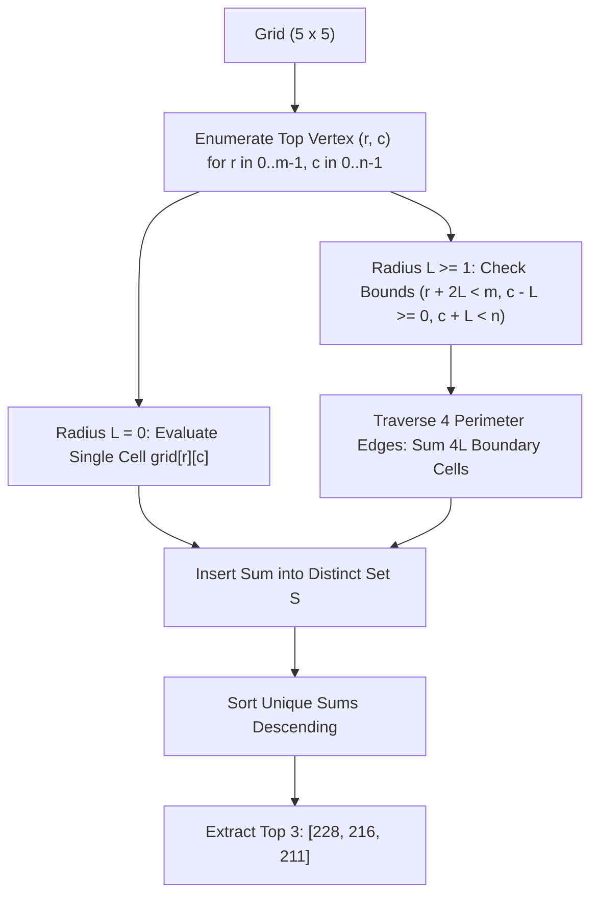

# Guided Example: Get Biggest Three Rhombus Sums in a Grid

We trace the geometric perimeter enumeration of valid rhombuses of all side lengths across a 2D matrix to identify the top three distinct rhombus sums:

- **Input:**
  $$\text{grid} = \begin{pmatrix} 3 & 4 & 5 & 1 & 3 \\ 3 & 3 & 4 & 2 & 3 \\ 20 & 30 & 200 & 40 & 10 \\ 1 & 5 & 5 & 4 & 1 \\ 4 & 3 & 2 & 2 & 5 \end{pmatrix}$$
- **Required Output:** `[228, 216, 211]`

This instance demonstrates enumerating degenerate single-cell rhombuses ($L = 0$) and expanded diagonal-border rhombuses ($L \ge 1$), computing boundary sums while preventing vertex double-counting, maintaining a deduplicated set of observed sums, and selecting the top three distinct values in descending order.

---

## 1. Instance & Teaching Goal

We are given an $m \times n$ integer matrix. A rhombus is oriented with its diagonals aligned along the Cartesian axes:
- Top vertex: $(r, c)$
- Right vertex: $(r + L, c + L)$
- Bottom vertex: $(r + 2L, c)$
- Left vertex: $(r + L, c - L)$
where $L \ge 0$ represents the half-diagonal radius (side offset).

Rules for rhombus evaluation:
1. When $L = 0$, the rhombus degenerates to the single cell $(r, c)$, with sum equal to $\text{grid}[r][c]$.
2. When $L \ge 1$, the rhombus boundary consists of four diagonal edges connecting the vertices:
   - Top-right edge: from $(r, c)$ to $(r + L, c + L)$
   - Bottom-right edge: from $(r + L, c + L)$ to $(r + 2L, c)$
   - Bottom-left edge: from $(r + 2L, c)$ to $(r + L, c - L)$
   - Top-left edge: from $(r + L, c - L)$ to $(r, c)$
   Only the boundary cells are summed; interior cells are excluded.
3. The rhombus must lie entirely within grid bounds:
   $$0 \le r, \quad r + 2L < m, \quad 0 \le c - L, \quad c + L < n$$
4. Collect all possible rhombus sums, discard duplicates, and return the up to three largest distinct sums sorted in descending order.

In our $5 \times 5$ instance, notice the dominant cell $\text{grid}[2][2] = 200$.
Rhombuses with side length $L = 1$ that place $200$ on their perimeter achieve the largest sums:
1. Rhombus with Right Vertex at $(2, 2)$:
   - Top: $(1, 1) = 3$
   - Right: $(2, 2) = 200$
   - Bottom: $(3, 1) = 5$
   - Left: $(2, 0) = 20$
   - Perimeter sum: $3 + 200 + 5 + 20 = 228$.
2. Rhombus with Left Vertex at $(2, 2)$:
   - Top: $(1, 3) = 2$
   - Right: $(2, 4) = 10$
   - Bottom: $(3, 3) = 4$
   - Left: $(2, 2) = 200$
   - Perimeter sum: $2 + 10 + 4 + 200 = 216$.
3. Rhombus with Top Vertex at $(2, 2)$:
   - Top: $(2, 2) = 200$
   - Right: $(3, 3) = 4$
   - Bottom: $(4, 2) = 2$
   - Left: $(3, 1) = 5$
   - Perimeter sum: $200 + 4 + 2 + 5 = 211$.

The next largest distinct values are single cells (such as $L = 0$ at $(2, 2)$ yielding $200$, followed by $40, 30, \dots$).
The top three distinct sums are therefore $228, 216, 211$.

The teaching goal is to structure **geometric coordinate parameterization and boundary summation**:
1. How to iterate systematically over all candidate centers/top vertices and radii $L$.
2. How to traverse the 4 boundary line segments without double-counting the four corner vertices.
3. How to maintain a bounded distinct set of top 3 values.

---

## 2. Conceptual Foundation & Invariants

### Orthogonal Diagonal Perimeter & Distinct Extremal Set Theorem

> **Orthogonal Diagonal Perimeter & Distinct Extremal Set Theorem.**
> 1. *Coordinate Parameterization:* A rhombus is uniquely specified by its topmost vertex $(r, c)$ and radius $L \ge 0$. The four vertices are:
>    $$V_{\text{top}} = (r, c), \quad V_{\text{right}} = (r + L, c + L), \quad V_{\text{bottom}} = (r + 2L, c), \quad V_{\text{left}} = (r + L, c - L)$$
> 2. *Feasibility Invariant:* A configuration $(r, c, L)$ is valid if and only if:
>    $$0 \le r \le r + 2L < m \quad \text{and} \quad 0 \le c - L \le c + L < n$$
>    Consequently, the maximum possible radius is $L_{\max} = \min\left(\lfloor \frac{m - 1 - r}{2} \rfloor, c, n - 1 - c\right)$.
> 3. *Boundary Sum Formulation:*
>    - For $L = 0$: $S(r, c, 0) = \text{grid}[r][c]$.
>    - For $L \ge 1$: The perimeter consists of $4L$ distinct boundary cells. Summing the four directed edges with open interval endpoints prevents corner duplicates:
>      $$S(r, c, L) = \sum_{k=0}^{L-1} \left( \text{grid}[r + k][c + k] + \text{grid}[r + L + k][c + L - k] + \text{grid}[r + 2L - k][c - k] + \text{grid}[r + L - k][c - L + k] \right)$$
> 4. *Top-3 Distinct Set Retention:* Let $\mathcal{S}$ be the set of unique values $S(r, c, L)$ observed across all valid triples. The final answer is the prefix of length $\min(3, |\mathcal{S}|)$ of $\mathcal{S}$ sorted descending.
> 5. *Complexity:* For an $m \times n$ matrix, $L \le \min(m, n) / 2$. Traversing the boundary takes $\mathcal{O}(L)$ operations, leading to total time $\mathcal{O}(m \cdot n \cdot \min(m, n)^2)$, with $\mathcal{O}(1)$ auxiliary space beyond the candidate set.

---

## 3. Step-by-Step Worked Execution

We trace the perimeter evaluation of the prominent candidates in the $5 \times 5$ grid:

---

### Step 1: Base Case Single-Cell Evaluation ($L = 0$)
Every cell in the matrix constitutes an $L = 0$ rhombus:
- Cell $(2, 2) \implies 200$.
- Cell $(2, 3) \implies 40$.
- Cell $(2, 1) \implies 30$.
- Cell $(2, 0) \implies 20$.
- Other cells contribute values ranging from $1$ to $10$.
- Distinct set $\mathcal{S}$ receives: $\{200, 40, 30, 20, 10, 5, 4, 3, 2, 1\}$.

---

### Step 2: Evaluate Rhombus $A$ ($r = 1, c = 1, L = 1$)
Check feasibility:
- Top: $(1, 1)$, Right: $(2, 2)$, Bottom: $(3, 1)$, Left: $(2, 0)$.
- Row bounds: $1 + 2(1) = 3 < 5$ (Valid).
- Column bounds: $1 - 1 = 0 \ge 0$ and $1 + 1 = 2 < 5$ (Valid).

Traverse perimeter cells:
- Top-to-Right: $(1, 1) \implies 3$.
- Right-to-Bottom: $(2, 2) \implies 200$.
- Bottom-to-Left: $(3, 1) \implies 5$.
- Left-to-Top: $(2, 0) \implies 20$.
- Perimeter Sum:
  $$S_A = 3 + 200 + 5 + 20 = 228$$
- Insert $228$ into $\mathcal{S}$.

---

### Step 3: Evaluate Rhombus $B$ ($r = 1, c = 3, L = 1$)
Check feasibility:
- Top: $(1, 3)$, Right: $(2, 4)$, Bottom: $(3, 3)$, Left: $(2, 2)$.
- Row bounds: $1 + 2(1) = 3 < 5$ (Valid).
- Column bounds: $3 - 1 = 2 \ge 0$ and $3 + 1 = 4 < 5$ (Valid).

Traverse perimeter cells:
- Top-to-Right: $(1, 3) \implies 2$.
- Right-to-Bottom: $(2, 4) \implies 10$.
- Bottom-to-Left: $(3, 3) \implies 4$.
- Left-to-Top: $(2, 2) \implies 200$.
- Perimeter Sum:
  $$S_B = 2 + 10 + 4 + 200 = 216$$
- Insert $216$ into $\mathcal{S}$.

---

### Step 4: Evaluate Rhombus $C$ ($r = 2, c = 2, L = 1$)
Check feasibility:
- Top: $(2, 2)$, Right: $(3, 3)$, Bottom: $(4, 2)$, Left: $(3, 1)$.
- Row bounds: $2 + 2(1) = 4 < 5$ (Valid).
- Column bounds: $2 - 1 = 1 \ge 0$ and $2 + 1 = 3 < 5$ (Valid).

Traverse perimeter cells:
- Top-to-Right: $(2, 2) \implies 200$.
- Right-to-Bottom: $(3, 3) \implies 4$.
- Bottom-to-Left: $(4, 2) \implies 2$.
- Left-to-Top: $(3, 1) \implies 5$.
- Perimeter Sum:
  $$S_C = 200 + 4 + 2 + 5 = 211$$
- Insert $211$ into $\mathcal{S}$.

---

### Step 5: Evaluate Rhombuses of Radius $L = 2$
Consider candidate centered at $(2, 2)$ with $r = 0, c = 2, L = 2$:
- Top: $(0, 2) = 5$.
- Right: $(2, 4) = 10$.
- Bottom: $(4, 2) = 2$.
- Left: $(2, 0) = 20$.
- Edges:
  - Top-Right: $(0, 2) = 5, (1, 3) = 2$.
  - Bottom-Right: $(2, 4) = 10, (3, 3) = 4$.
  - Bottom-Left: $(4, 2) = 2, (3, 1) = 5$.
  - Top-Left: $(2, 0) = 20, (1, 1) = 3$.
- Perimeter sum:
  $$5 + 2 + 10 + 4 + 2 + 5 + 20 + 3 = 51$$
- $51$ is far smaller than the leading values and does not displace the top three.

---

### Step 6: Extract Top Three Distinct Elements
Sorted distinct set in descending order begins:
$$228, 216, 211, 200, 79, 51, 40, \dots$$
The top three distinct values are:
$$[228, 216, 211]$$

---

## 4. Complete Execution Trace

| Rhombus Identifier | Top $(r, c)$ | Radius $L$ | Boundary Cells Traversed | Computed Perimeter Sum | Status in Top 3 |
|:---:|:---:|:---:|:---|:---:|:---:|
| Rhombus $A$ | $(1, 1)$ | 1 | $(1, 1), (2, 2), (3, 1), (2, 0)$ | $3 + 200 + 5 + 20 = 228$ | **Rank 1** |
| Rhombus $B$ | $(1, 3)$ | 1 | $(1, 3), (2, 4), (3, 3), (2, 2)$ | $2 + 10 + 4 + 200 = 216$ | **Rank 2** |
| Rhombus $C$ | $(2, 2)$ | 1 | $(2, 2), (3, 3), (4, 2), (3, 1)$ | $200 + 4 + 2 + 5 = 211$ | **Rank 3** |
| Cell $(2, 2)$ | $(2, 2)$ | 0 | $(2, 2)$ | $200$ | Displaced (Rank 4) |
| Centered $L=1$ | $(1, 2)$ | 1 | $(1, 2), (2, 3), (3, 2), (2, 1)$ | $4 + 40 + 5 + 30 = 79$ | Displaced |
| Global $L=2$ | $(0, 2)$ | 2 | 8 border cells | $5 + 2 + 10 + 4 + 2 + 5 + 20 + 3 = 51$ | Displaced |

---

## 5. Algorithmic Correctness

**Soundness.** Every evaluated candidate is a strictly valid regular rhombus lying entirely within matrix boundaries. The perimeter summation visits each boundary cell exactly once by using half-open intervals along the four edges, preventing vertex overcounting.

**Completeness.** The nested loops iterate over all possible top vertex positions $(r, c)$ and all feasible radii $L \ge 0$. No valid rhombus shape within the grid is omitted. Inserting into a hash set guarantees distinctness, and extracting the three largest values satisfies the problem requirements.

---

## 6. Traps This Instance Exposes

- **Double-Counting Vertices:** Summing the four edges naively as closed intervals ($k = 0 \dots L$ on each edge) counts the four corner vertices twice each. Using half-open intervals ($k = 0 \dots L - 1$) or summing corners separately is required.
- **Interior Infiltration:** Rhombus sums include only the *border* elements. Adding interior cells (such as including $(2, 2)$ inside a surrounding $L = 2$ rhombus) produces incorrect sums.
- **Duplicate Values in Output:** If multiple rhombuses produce the same perimeter sum, the problem demands *distinct* values. A multiset or simple array sort would include duplicate values in the top three.
- **Fewer than Three Distinct Sums:** When a small grid (e.g. $1 \times 1$ or $1 \times 2$) produces fewer than 3 unique values, the algorithm must return all available distinct sums without padding.

---

## 7. Complexity Derivation

- **Time Complexity:** $\mathcal{O}(m \cdot n \cdot \min(m, n)^2)$. There are $m \times n$ possible top vertices, each admitting at most $\min(m, n) / 2$ radii $L$. For each $L$, walking the $4L$ boundary cells takes $\mathcal{O}(L)$ steps. Since $\sum_{L=1}^{K} L = \mathcal{O}(K^2)$, the total time is bounded by $\mathcal{O}(m \cdot n \cdot \min(m, n)^2)$, which for $50 \times 50$ is under $2 \times 10^5$ operations (well within runtime limits).
- **Auxiliary Space Complexity:** $\mathcal{O}(m \cdot n \cdot \min(m, n))$ to store the unique sums in a set, which requires negligible memory.
