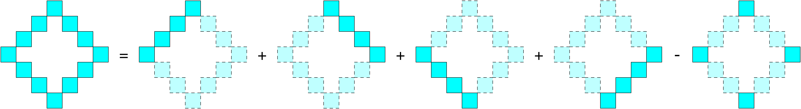

### Approach: Enumerate All Rhombuses

#### Hint $1$

How many degrees of freedom does a rhombus have? In other words, how many variables are required to uniquely represent a rhombus?

#### Hint $1$ Explanation

A rhombus has **three degrees of freedom**. For example:

> Two variables represent the coordinates of the top vertex of the rhombus, and one variable represents the width of the rhombus in the horizontal (or vertical) direction.

#### Hint $2$



#### Hint $3$

To quickly calculate each part mentioned in Hint 2, we can use prefix sums.

* Let $\textit{sum}\text{_1}[x][y]$ denote the sum of all elements along the diagonal from the cell $(x-1, y-1)$ toward the **top-left** direction.

* Let $\textit{sum}\text{_2}[x][y]$ denote the sum of all elements along the diagonal from the cell $(x-1, y-1)$ toward the **top-right** direction.

#### Intuition

First, we preprocess all values of $\textit{sum}\text{_1}[i][j]$ and $\textit{sum}\text{_2}[i][j]$ using a double loop. The recurrence relations are:

$\textit{sum}\text{_1}[i][j] = \textit{sum}_1[i-1][j-1] + \textit{grid}[i-1][j-1]$

and

$\textit{sum}\text{_2}[i][j] = \textit{sum}_2[i-1][j+1] + \textit{grid}[i-1][j-1]$

where the ranges of $i$ and $j$ are $[1, m]$ and $[1, n]$, respectively.

Next, we use a triple loop to enumerate the position of the **top vertex** of the rhombus and its width in the horizontal direction. From these values, we can determine the positions of the four vertices of the rhombus, denoted as $(u_x, u_y)$, $(d_x, d_y)$, $(l_x, l_y)$, and $(r_x, r_y)$.

Using these vertices, we can compute the border sum of the rhombus in $O(1)$ time. Specifically, the sum consists of the five parts shown in Hint 2:

$$
\begin{cases}
\textit{sum}_2[l_x + 1][l_y + 1] - \textit{sum}_2[u_x][u_y + 2] \
\textit{sum}_1[r_x + 1][r_y + 1] - \textit{sum}_1[u_x][u_y] \
\textit{sum}_1[d_x + 1][d_y + 1] - \textit{sum}_1[l_x][l_y] \
\textit{sum}_2[d_x + 1][d_y + 1] - \textit{sum}_2[r_x][r_y + 2] \
\textit{grid}[u_x][u_y] + \textit{grid}[d_x][d_y] + \textit{grid}[l_x][l_y] + \textit{grid}[r_x][r_y]
\end{cases}
$$

In addition, we can design a small data structure that maintains the **top three distinct rhombus sums** dynamically as they are computed. The implementation is shown below.

#### Details

Note that a **single cell** is also considered a rhombus.

#### Implementation

```python
class Answer:
    def __init__(self):
        self.ans = [0, 0, 0]

    def put(self, x: int):
        _ans = self.ans

        if x > _ans[0]:
            _ans[0], _ans[1], _ans[2] = x, _ans[0], _ans[1]
        elif x != _ans[0] and x > _ans[1]:
            _ans[1], _ans[2] = x, _ans[1]
        elif x != _ans[0] and x != _ans[1] and x > _ans[2]:
            _ans[2] = x

    def get(self) -> List[int]:
        _ans = self.ans

        return [num for num in _ans if num != 0]

class Solution:
    def getBiggestThree(self, grid: List[List[int]]) -> List[int]:
        m, n = len(grid), len(grid[0])
        sum1 = [[0] * (n + 2) for _ in range(m + 1)]
        sum2 = [[0] * (n + 2) for _ in range(m + 1)]

        for i in range(1, m + 1):
            for j in range(1, n + 1):
                sum1[i][j] = sum1[i - 1][j - 1] + grid[i - 1][j - 1]
                sum2[i][j] = sum2[i - 1][j + 1] + grid[i - 1][j - 1]

        ans = Answer()
        for i in range(m):
            for j in range(n):
                # a single cell is also a rhombus
                ans.put(grid[i][j])
                for k in range(i + 2, m, 2):
                    ux, uy = i, j
                    dx, dy = k, j
                    lx, ly = (i + k) // 2, j - (k - i) // 2
                    rx, ry = (i + k) // 2, j + (k - i) // 2

                    if ly < 0 or ry >= n:
                        break

                    ans.put(
                        (sum2[lx + 1][ly + 1] - sum2[ux][uy + 2])
                        + (sum1[rx + 1][ry + 1] - sum1[ux][uy])
                        + (sum1[dx + 1][dy + 1] - sum1[lx][ly])
                        + (sum2[dx + 1][dy + 1] - sum2[rx][ry + 2])
- (
                            grid[ux][uy]
                            + grid[dx][dy]
                            + grid[lx][ly]
                            + grid[rx][ry]
                        )
                    )

        return ans.get()
```

#### Complexity Analysis

- Time complexity: $O(mn \min(m, n))$.

  Preprocessing the prefix sums takes $O(mn)$ time. Enumerating all possible rhombuses and computing their sums requires $O(mn \min(m, n))$ time. Therefore, the overall time complexity is $O(mn \min(m, n))$.

- Space complexity: $O(mn)$.

  The prefix sum arrays require $O(mn)$ additional space.

---