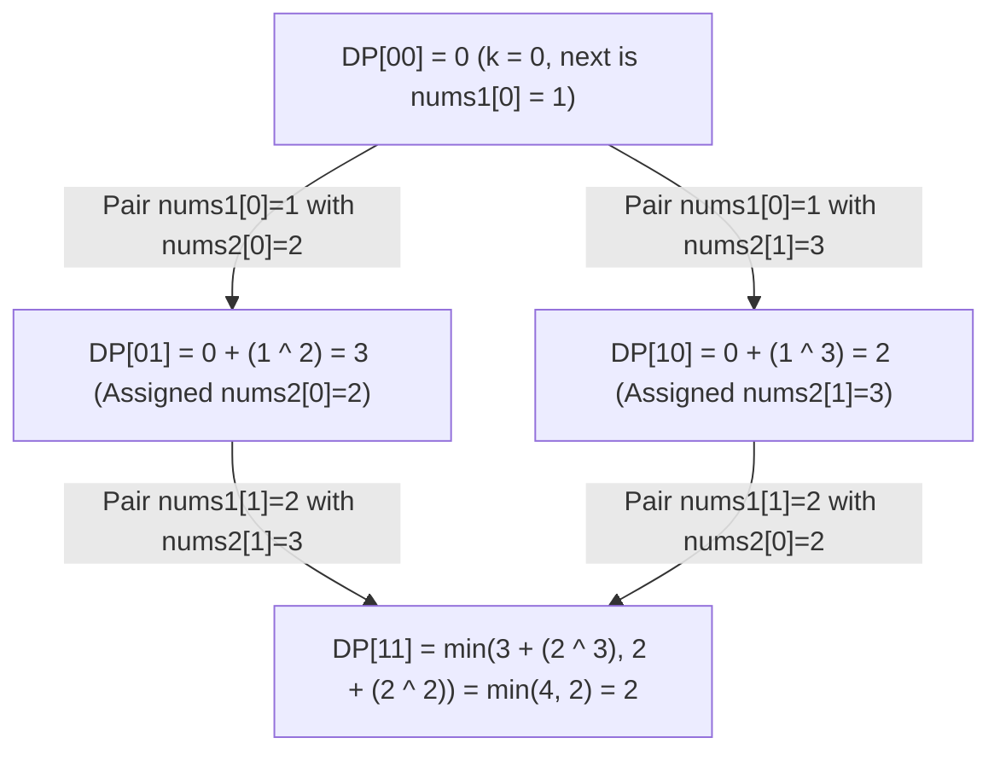

# Guided Example: Minimum XOR Sum of Two Arrays

We trace the subset bitmask dynamic programming on a representative array instance to find the optimal one-to-one assignment between two arrays that minimizes the total XOR sum:

- **Input:** `nums1 = [1, 2]`, `nums2 = [2, 3]`
- **Required Output:** `2`

This instance demonstrates assigning each element of `nums1` to a unique element of `nums2`, representing the set of chosen `nums2` elements as a bitmask, using the population count of the mask to determine the active index of `nums1`, and relaxing optimal subset costs.

---

## 1. Instance & Teaching Goal

We are given two integer arrays `nums1` and `nums2`, each of length $n$. We must rearrange the elements of `nums2` into a permutation $p$ that minimizes the total XOR sum:
$$\sum_{i=0}^{n-1} \left(nums1[i] \oplus nums2[p_i]\right)$$

For `nums1 = [1, 2]` and `nums2 = [2, 3]`:
- Length $n = 2$.
- Candidate permutations for `nums2`:
  1. Permutation $[2, 3]$ (identity order):
     - Pair 0: $nums1[0] \oplus nums2[0] = 1 \oplus 2 = 3$.
     - Pair 1: $nums1[1] \oplus nums2[1] = 2 \oplus 3 = 1$.
     - Total XOR sum: $3 + 1 = 4$.
  2. Permutation $[3, 2]$ (swapped order):
     - Pair 0: $nums1[0] \oplus nums2[1] = 1 \oplus 3 = 2$.
     - Pair 1: $nums1[1] \oplus nums2[0] = 2 \oplus 2 = 0$.
     - Total XOR sum: $2 + 0 = 2$.
- The minimal XOR sum is $2$.

The teaching goal is to understand **bitmask dynamic programming for minimum weight bipartite matching**:
1. Why iterating over all $n!$ permutations becomes prohibitive for $n \le 14$ ($14! \approx 8.7 \times 10^{10}$).
2. How the subset of assigned indices from `nums2` can be represented as an integer bitmask with $n$ bits.
3. Why the number of set bits ($\text{popcount}$) uniquely specifies which element of `nums1` is being matched, collapsing the state space from $n!$ down to $2^n$.

---

## 2. Conceptual Foundation & Invariants

### Subspace Assignment & Bitmask Dynamic Programming Theorem

> **Subspace Assignment & Bitmask Dynamic Programming Theorem.**
> 1. *Bitmask State Encoding:* Let an integer $\text{mask} \in [0, 2^n - 1]$ encode the subset of elements from `nums2` that have already been assigned. The $j$-th bit of $\text{mask}$ is $1$ if and only if $nums2[j]$ has been paired.
> 2. *Prefix Cardinality Invariant:* Let $k = \text{popcount}(\text{mask})$ be the number of set bits. In any valid prefix assignment, exactly the first $k$ elements of `nums1` (indices $0, 1, \dots, k - 1$) have been paired with the $k$ chosen elements of `nums2`.
> 3. *Optimal Substructure & Recurrence:* Define $DP[\text{mask}]$ as the minimum XOR sum to match the prefix $nums1[0 \dots k - 1]$ with the subset of elements indicated by $\text{mask}$.
>    - Base Case: $DP[0] = 0$.
>    - Transition: For each state $\text{mask}$ with $k = \text{popcount}(\text{mask})$, to assign $nums1[k]$ to an unused element $nums2[j]$ (where the $j$-th bit of $\text{mask}$ is $0$):
>      $$DP[\text{mask} \mid (1 \ll j)] = \min\left(DP[\text{mask} \mid (1 \ll j)], \; DP[\text{mask}] + (nums1[k] \oplus nums2[j])\right)$$
> 4. *Global Optimum:* The minimum XOR sum for the full assignment is given by the completely saturated mask:
>    $$\text{Answer} = DP[2^n - 1]$$
> 5. *Complexity:* There are $2^n$ masks. From each mask, there are $n - k$ transitions. The total number of edges in the state graph is $\sum_{k=0}^n \binom{n}{k} (n - k) = n 2^{n-1} = \mathcal{O}(n \cdot 2^n)$. Auxiliary space is $\mathcal{O}(2^n)$ for the DP table.

---

## 3. Step-by-Step Worked Execution

We trace the state transitions for `nums1 = [1, 2]` and `nums2 = [2, 3]` ($n = 2$):

---

### Step 1: Initialize the State Array
- Masks range from $0$ to $2^2 - 1 = 3$.
- Binary representations:
  - $0 = 00_2$ (no elements chosen)
  - $1 = 01_2$ (only $nums2[0]$ chosen)
  - $2 = 10_2$ (only $nums2[1]$ chosen)
  - $3 = 11_2$ (both elements chosen)
- Initial state values:
  - $DP[00_2] = 0$
  - $DP[01_2] = \infty$
  - $DP[10_2] = \infty$
  - $DP[11_2] = \infty$

---

### Step 2: Process Mask $00_2$ ($\text{popcount} = 0$)
- Active element from `nums1`: $k = 0 \implies nums1[0] = 1$.
- Unused bits in $\text{mask} = 00_2$:
  1. Bit $j = 0$ ($nums2[0] = 2$):
     - Cost: $nums1[0] \oplus nums2[0] = 1 \oplus 2 = 3$.
     - New mask: $00_2 \mid 01_2 = 01_2$.
     - Candidate value: $DP[00_2] + 3 = 0 + 3 = 3$.
     - Update: $DP[01_2] = \min(\infty, 3) = 3$.
  2. Bit $j = 1$ ($nums2[1] = 3$):
     - Cost: $nums1[0] \oplus nums2[1] = 1 \oplus 3 = 2$.
     - New mask: $00_2 \mid 10_2 = 10_2$.
     - Candidate value: $DP[00_2] + 2 = 0 + 2 = 2$.
     - Update: $DP[10_2] = \min(\infty, 2) = 2$.

---

### Step 3: Process Masks of $\text{popcount} = 1$
Active element from `nums1`: $k = 1 \implies nums1[1] = 2$.

#### Branch A: Mask $01_2$ ($nums2[0]$ already used)
- Current cost: $DP[01_2] = 3$.
- Unused bit: $j = 1$ ($nums2[1] = 3$).
- Cost: $nums1[1] \oplus nums2[1] = 2 \oplus 3 = 1$.
- Target mask: $01_2 \mid 10_2 = 11_2$.
- Candidate value: $DP[01_2] + 1 = 3 + 1 = 4$.
- Update: $DP[11_2] = \min(\infty, 4) = 4$.

#### Branch B: Mask $10_2$ ($nums2[1]$ already used)
- Current cost: $DP[10_2] = 2$.
- Unused bit: $j = 0$ ($nums2[0] = 2$).
- Cost: $nums1[1] \oplus nums2[0] = 2 \oplus 2 = 0$.
- Target mask: $10_2 \mid 01_2 = 11_2$.
- Candidate value: $DP[10_2] + 0 = 2 + 0 = 2$.
- Update: $DP[11_2] = \min(4, 2) = 2$.

---

### Step 4: Final Value Extraction
- Fully assigned state: $\text{mask} = 11_2 = 3$.
- Stored optimal value: $DP[11_2] = 2$.
- Minimal total XOR sum is $2$.

---

## 4. Complete Execution Trace

| State $\text{mask}$ | Binary | $\text{popcount}$ | $nums1[k]$ | Unused $j$ | $nums2[j]$ | XOR Cost | Target Mask | Updated $DP[\text{target}]$ |
|:---:|:---:|:---:|:---:|:---:|:---:|:---:|:---:|:---:|
| 0 | $00_2$ | 0 | $nums1[0] = 1$ | 0 | 2 | $1 \oplus 2 = 3$ | $01_2$ (1) | 3 |
| 0 | $00_2$ | 0 | $nums1[0] = 1$ | 1 | 3 | $1 \oplus 3 = 2$ | $10_2$ (2) | 2 |
| 1 | $01_2$ | 1 | $nums1[1] = 2$ | 1 | 3 | $2 \oplus 3 = 1$ | $11_2$ (3) | $\min(\infty, 3 + 1) = 4$ |
| 2 | $10_2$ | 1 | $nums1[1] = 2$ | 0 | 2 | $2 \oplus 2 = 0$ | $11_2$ (3) | $\min(4, 2 + 0) = \mathbf{2}$ |
| 3 | $11_2$ | 2 | Completed | - | - | - | - | **Final: 2** |

---

## 5. Algorithmic Correctness

**Soundness.** Every state $DP[\text{mask}]$ represents a valid bijective mapping between the prefix $nums1[0 \dots k - 1]$ and the $k$ elements of $nums2$ whose indices have set bits in $\text{mask}$. Transitions accurately accumulate the pairwise XOR metric without omitting or reusing elements.

**Completeness.** Since DP processes states in topological order (by increasing mask value or increasing popcount), every valid subset assignment is explored, guaranteeing that the terminal state $DP[2^n - 1]$ captures the global minimum among all $n!$ possible permutations.

---

## 6. Traps This Instance Exposes

- **Greedy Matching Fallacy:** Choosing the minimum XOR match for $nums1[0]$ greedily would pair $1$ with $3$ ($1 \oplus 3 = 2$) rather than $1$ with $2$ ($1 \oplus 2 = 3$). In this small case greedy happens to find the optimum, but in general (e.g. `nums1 = [1, 0, 3]`, `nums2 = [5, 3, 4]`), greedy assignment traps the remaining elements into high-cost XORs, yielding suboptimal sums.
- **Order of State Traversal:** Updating DP states must proceed in an order where subproblems are solved before they are used. Iterating mask values from $0$ to $2^n - 1$ naturally satisfies topological order because setting an extra bit strictly increases the numerical value of the mask.
- **Bit Shift Precedence:** Bitwise operations have lower operator precedence than addition and subtraction in most environments. Grouping with parentheses, such as `mask | (1 << j)`, is critical.

---

## 7. Complexity Derivation

- **Time Complexity:** $\mathcal{O}(n \cdot 2^n)$. There are $2^n$ masks. From a mask with $k$ set bits, there are $n - k$ outgoing transitions. Summing over all masks gives $\sum_{k=0}^n \binom{n}{k}(n - k) = n 2^{n-1}$. For $n = 14$, this is $14 \times 8192 = 114,688$ operations, executing in mere milliseconds.
- **Auxiliary Space Complexity:** $\mathcal{O}(2^n)$ to store the DP array of size $2^n$. For $n = 14$, $2^{14} = 16,384$ entries, requiring less than $100\text{ KB}$ of memory.