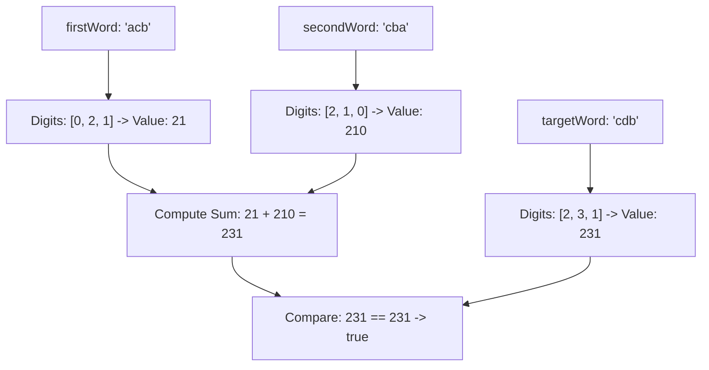

# Guided Example: Check if Word Equals Summation of Two Words

We trace the positional radix-10 decoding of alphabetic words into numerical values and test their additive identity:

- **Input:** `firstWord = "acb"`, `secondWord = "cba"`, `targetWord = "cdb"`
- **Required Output:** `true`

This instance demonstrates mapping lowercase characters `'a'` through `'j'` to decimal digits $0$ through $9$, accumulating positional decimal values via Horner's rule, handling leading zeros naturally, and testing whether the sum of the first two integers equals the third integer.

---

## 1. Instance & Teaching Goal

We are given three strings: `firstWord`, `secondWord`, and `targetWord`, composed of lowercase English letters between `'a'` and `'j'`.
The numerical value of a character is defined by its 0-indexed alphabetical offset:
$$\text{'a'} \to 0, \; \text{'b'} \to 1, \; \text{'c'} \to 2, \; \text{'d'} \to 3, \; \text{'e'} \to 4, \; \text{'f'} \to 5, \; \text{'g'} \to 6, \; \text{'h'} \to 7, \; \text{'i'} \to 8, \; \text{'j'} \to 9$$

A word's numerical value is obtained by concatenating the digits of each character and interpreting the result as a standard base-10 integer.

For `firstWord = "acb"`, `secondWord = "cba"`, and `targetWord = "cdb"`:
1. `firstWord = "acb"`:
   - Digits: `'a' \to 0`, `'c' \to 2`, `'b' \to 1`.
   - Concatenated digits: `"021"`.
   - Decimal value: $21$.
2. `secondWord = "cba"`:
   - Digits: `'c' \to 2`, `'b' \to 1`, `'a' \to 0`.
   - Concatenated digits: `"210"`.
   - Decimal value: $210$.
3. `targetWord = "cdb"`:
   - Digits: `'c' \to 2`, `'d' \to 3`, `'b' \to 1`.
   - Concatenated digits: `"231"`.
   - Decimal value: $231$.

Check the sum:
$$21 + 210 = 231$$
Since $231 == 231$, the equality holds, and the result is `true`.

The teaching goal is to understand **positional digit parsing and Horner's evaluation**:
1. How character offsets map directly to decimal digits.
2. How iterative accumulation ($v \leftarrow v \times 10 + \text{digit}$) computes the numeric value without explicit string conversions.
3. How leading zeros (e.g. `'a'` at the start of `"acb"`) are handled consistently in arithmetic evaluation.

---

## 2. Conceptual Foundation & Invariants

### Positional Radix-10 Projection & Additive Equality Theorem

> **Positional Radix-10 Projection & Additive Equality Theorem.**
> 1. *Character-to-Digit Projection:* For any letter $c \in \{\text{'a'}, \dots, \text{'j'}\}$, the digit projection is:
>    $$d(c) = \text{ord}(c) - \text{ord}(\text{'a'}) \in \{0, 1, \dots, 9\}$$
> 2. *Horner's Radix-10 Evaluation:* For a word $W = c_0 c_1 \dots c_{L-1}$ of length $L$, the numerical value is given by:
>    $$V(W) = \sum_{k=0}^{L-1} d(c_k) \cdot 10^{L - 1 - k}$$
>    Computed iteratively from left to right:
>    $$v_0 = 0, \quad v_{k+1} = v_k \cdot 10 + d(c_k) \quad (0 \le k < L)$$
>    with final value $V(W) = v_L$.
> 3. *Additive Verification Predicate:* The condition to test is:
>    $$V(\text{firstWord}) + V(\text{secondWord}) == V(\text{targetWord})$$
> 4. *Complexity:* Decoding a word of length $L$ takes $\mathcal{O}(L)$ operations and $\mathcal{O}(1)$ auxiliary space. With string lengths at most $8$, the entire validation runs in $\mathcal{O}(L_1 + L_2 + L_3)$ time, well within integer precision limits.

---

## 3. Step-by-Step Worked Execution

We trace the Horner evaluation for each word:

---

### Step 1: Decode `firstWord = "acb"`
- Length $L = 3$.
- Start accumulator: $v = 0$.
- Character 0: $\text{'a'} \implies d = \text{ord}('a') - \text{ord}('a') = 0$.
  $$v \leftarrow 0 \times 10 + 0 = 0$$
- Character 1: $\text{'c'} \implies d = \text{ord}('c') - \text{ord}('a') = 2$.
  $$v \leftarrow 0 \times 10 + 2 = 2$$
- Character 2: $\text{'b'} \implies d = \text{ord}('b') - \text{ord}('a') = 1$.
  $$v \leftarrow 2 \times 10 + 1 = 21$$
- Final numerical value: $V(\text{firstWord}) = 21$.

---

### Step 2: Decode `secondWord = "cba"`
- Length $L = 3$.
- Start accumulator: $v = 0$.
- Character 0: $\text{'c'} \implies d = \text{ord}('c') - \text{ord}('a') = 2$.
  $$v \leftarrow 0 \times 10 + 2 = 2$$
- Character 1: $\text{'b'} \implies d = \text{ord}('b') - \text{ord}('a') = 1$.
  $$v \leftarrow 2 \times 10 + 1 = 21$$
- Character 2: $\text{'a'} \implies d = \text{ord}('a') - \text{ord}('a') = 0$.
  $$v \leftarrow 21 \times 10 + 0 = 210$$
- Final numerical value: $V(\text{secondWord}) = 210$.

---

### Step 3: Decode `targetWord = "cdb"`
- Length $L = 3$.
- Start accumulator: $v = 0$.
- Character 0: $\text{'c'} \implies d = \text{ord}('c') - \text{ord}('a') = 2$.
  $$v \leftarrow 0 \times 10 + 2 = 2$$
- Character 1: $\text{'d'} \implies d = \text{ord}('d') - \text{ord}('a') = 3$.
  $$v \leftarrow 2 \times 10 + 3 = 23$$
- Character 2: $\text{'b'} \implies d = \text{ord}('b') - \text{ord}('a') = 1$.
  $$v \leftarrow 23 \times 10 + 1 = 231$$
- Final numerical value: $V(\text{targetWord}) = 231$.

---

### Step 4: Evaluate Additive Equality
- Sum of operands:
  $$V(\text{firstWord}) + V(\text{secondWord}) = 21 + 210 = 231$$
- Compare with target:
  $$231 == V(\text{targetWord}) = 231 \implies \text{True}$$
- The output is `true`.

---

## 4. Complete Execution Trace

| Word | Char Index $k$ | Character | Digit $d$ | Prior Accumulator $v$ | Updated $v \times 10 + d$ | Decoded Integer |
|:---:|:---:|:---:|:---:|:---:|:---:|:---:|
| `firstWord` | 0 | `'a'` | 0 | 0 | $0 \times 10 + 0 = 0$ | - |
| `firstWord` | 1 | `'c'` | 2 | 0 | $0 \times 10 + 2 = 2$ | - |
| `firstWord` | 2 | `'b'` | 1 | 2 | $2 \times 10 + 1 = 21$ | **21** |
| `secondWord` | 0 | `'c'` | 2 | 0 | $0 \times 10 + 2 = 2$ | - |
| `secondWord` | 1 | `'b'` | 1 | 2 | $2 \times 10 + 1 = 21$ | - |
| `secondWord` | 2 | `'a'` | 0 | 21 | $21 \times 10 + 0 = 210$ | **210** |
| `targetWord` | 0 | `'c'` | 2 | 0 | $0 \times 10 + 2 = 2$ | - |
| `targetWord` | 1 | `'d'` | 3 | 2 | $2 \times 10 + 3 = 23$ | - |
| `targetWord` | 2 | `'b'` | 1 | 23 | $23 \times 10 + 1 = 231$ | **231** |
| **Verification** | - | - | - | - | $21 + 210 = 231$ | **true** |

---

## 5. Algorithmic Correctness

**Soundness.** Decimal evaluation using base 10 corresponds directly to the problem's definition of letter concatenations converted to integers. Arithmetic addition over standard integers guarantees that checking equality reflects exact numerical congruence.

**Completeness.** Every character of each input word is processed in order from left to right. Leading `'a'` characters map to zero and naturally contribute zero weight to higher powers of 10, correctly handling all possible letter configurations.

---

## 6. Traps This Instance Exposes

- **Leading Zero Misinterpretation:** Words beginning with `'a'` (such as `"aaa"`) produce leading zeros (`"000"`). In string-based implementations, leading zeros can cause formatting issues or octal parsing traps. Numeric Horner iteration safely collapses `"000"` into integer $0$.
- **Alphabet Offset Indexing:** The mapping uses 0-indexing (`'a' -> 0`), not 1-indexing (`'a' -> 1`). Shifting by 1 would distort the numerical values and lead to false negatives.
- **Word Length Limits:** Word lengths are up to $8$, which produces values up to $99,999,999$. This fits comfortably inside standard 32-bit signed integer limits without integer overflow concerns.

---

## 7. Complexity Derivation

- **Time Complexity:** $\mathcal{O}(L_1 + L_2 + L_3)$, where $L_1, L_2, L_3$ are the lengths of `firstWord`, `secondWord`, and `targetWord`. Each word is scanned once with constant-time arithmetic per character.
- **Auxiliary Space Complexity:** $\mathcal{O}(1)$, as only scalar integer accumulators are maintained during decoding.
