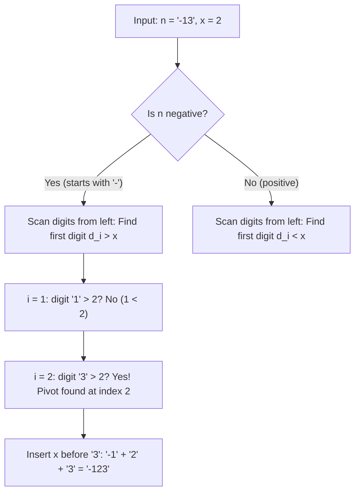

# Guided Example: Maximum Value after Insertion

We trace the greedy positional digit insertion on representative positive and negative integer instances to maximize the resulting numerical value:

- **Input:** `n = "-13"`, `x = 2`
- **Required Output:** `"-123"`

This instance demonstrates distinguishing positive numbers from negative numbers, optimizing the absolute magnitude in the correct direction (minimizing absolute magnitude for negative numbers vs maximizing absolute magnitude for positive numbers), performing a single forward scan to locate the earliest qualifying pivot digit, and inserting digit $x$ in-place.

---

## 1. Instance & Teaching Goal

We are given a string `n` representing a large integer, which may be positive or negative (starting with a minus sign `'-'`), and a decimal digit $x \in [1, 9]$. We wish to insert digit $x$ at any position to produce the maximum possible numerical value.

For `n = "-13"` and $x = 2$:
- The number is negative.
- For negative numbers, maximizing numerical value is equivalent to **minimizing the absolute magnitude**:
  $$\text{maximize } -M \iff \text{minimize } M$$
- Potential insertion positions for digit `2`:
  1. Immediately after the minus sign (before `'1'`): `"-213"`
     - Numerical value: $-213$.
  2. Between `'1'` and `'3'`: `"-123"`
     - Numerical value: $-123$.
  3. At the end (after `'3'`): `"-132"`
     - Numerical value: $-132$.
- Comparing candidates:
  $$-123 > -132 > -213$$
- The maximum value is `"-123"`.

The teaching goal is to understand **greedy positional significance**:
1. In base-10 positional notation, higher-order digits carry exponentially greater weight than lower-order digits.
2. For positive numbers, we maximize the first difference from the left by placing $x$ before the first digit smaller than $x$ ($n[i] < x$).
3. For negative numbers, we minimize the first difference from the left by placing $x$ before the first digit larger than $x$ ($n[i] > x$).
4. If no such pivot exists, placing $x$ at the least significant position (the end) is optimal.

---

## 2. Conceptual Foundation & Invariants

### Greedy Positional Magnitude Optimization Theorem

> **Greedy Positional Magnitude Optimization Theorem.**
> 1. *Positional Dominance:* In base $B = 10$, if two numbers of equal length differ first at index $k$, the number with the larger digit at index $k$ is strictly greater, regardless of all subsequent digits:
>    $$\sum_{j=k}^{L-1} d_j \cdot 10^{L-1-j}$$
> 2. *Positive Numbers (Maximization of Magnitude):*
>    - Let $n = d_0 d_1 \dots d_{m-1}$ with $d_0 \neq \text{'-'}$.
>    - To make the prefix as large as possible, find the smallest index $i$ such that $d_i < x$.
>    - Inserting $x$ before $d_i$ yields prefix $d_0 \dots d_{i-1} x$, which is strictly greater than keeping $d_0 \dots d_{i-1} d_i$.
>    - If for all $i$, $d_i \ge x$, appending $x$ to the end is optimal.
> 3. *Negative Numbers (Minimization of Magnitude):*
>    - Let $n = \text{'-'} d_1 d_2 \dots d_m$.
>    - To minimize the magnitude, find the smallest index $i \ge 1$ such that $d_i > x$.
>    - Inserting $x$ before $d_i$ yields prefix $d_1 \dots d_{i-1} x$, which has a smaller leading digit than $d_i$.
>    - If for all $i \ge 1$, $d_i \le x$, appending $x$ to the end minimizes the magnitude.
> 4. *Complexity:* Scanning for the first pivot digit takes $\mathcal{O}(|n|)$ time. Splicing the string takes $\mathcal{O}(|n|)$ time. Auxiliary space is $\mathcal{O}(|n|)$ to form the output.

---

## 3. Step-by-Step Worked Execution

We trace the algorithm on `n = "-13"`, `x = 2`:

---

### Step 1: Detect Sign of the Number
- Check initial character: $n[0] = \text{'-'}$.
- The number is negative.
- Objective: Minimize the magnitude of the digits starting at index $1$.
- Pivot condition: Find first index $i \ge 1$ where $n[i] > x$ (with $x = 2$).

---

### Step 2: Scan Magnitude Digits
- Index $i = 1$:
  - Current digit: $n[1] = \text{'1'}$.
  - Numerical comparison: $1 > 2$ is False.
  - Advance scan.
- Index $i = 2$:
  - Current digit: $n[2] = \text{'3'}$.
  - Numerical comparison: $3 > 2$ is True.
  - Pivot located at index $i = 2$.

---

### Step 3: Splice and Construct Output
- Prefix before pivot: $n[0 \dots 1] = \text{"-1"}$.
- Inserted digit: $\text{"2"}$.
- Suffix from pivot: $n[2 \dots 2] = \text{"3"}$.
- Resulting string:
  $$\text{"-1"} + \text{"2"} + \text{"3"} = \text{"-123"}$$

---

### Step 4: Verification Against Positive Counterpart
Consider positive instance `n = "99"`, `x = 9`:
- Number is positive $\implies$ maximize magnitude.
- Pivot condition: First digit where $n[i] < 9$.
  - Index $0$: $9 < 9$ (False).
  - Index $1$: $9 < 9$ (False).
- No digit smaller than $9$ exists $\implies$ append $9$ at the end:
  $$\text{"99"} + \text{"9"} = \text{"999"}$$

---

## 4. Complete Execution Trace

| Step | Index $i$ | Character $n[i]$ | Digit Value | Target $x$ | Condition Tested | Triggered? | Action Taken |
|:---:|:---:|:---:|:---:|:---:|:---:|:---:|:---:|
| 1 | 0 | `'-'` | Sign | 2 | Is Negative? | **Yes** | Set mode to minimize magnitude |
| 2 | 1 | `'1'` | 1 | 2 | $1 > 2$? | No | Continue scanning |
| 3 | 2 | `'3'` | 3 | 2 | $3 > 2$? | **Yes** | Split at index 2, insert `'2'` |
| **Final** | - | - | - | - | Splice | - | **`"-123"`** |

---

## 5. Algorithmic Correctness

**Soundness.** Inserting $x$ produces a valid integer string with length $|n| + 1$ containing all original digits plus $x$. By the Positional Dominance lemma, the highest-order digit that differs between any two candidate placements dictates which number is larger.

**Completeness.** Since the scan tests indices strictly from left to right, it identifies the most significant position where the replacement benefits the objective. Any later placement would alter lower-order digits, leaving a less optimal digit at the higher-order position.

---

## 6. Traps This Instance Exposes

- **Inverting Negative Number Logic:** Treating negative numbers like positive numbers would look for $d_i < x$, inserting `'2'` before `'1'` to yield `"-213"`, which is significantly smaller than `"-123"` ($-213 < -123$).
- **Equal Digits ($d_i == x$):** When $d_i == x$, inserting $x$ before $d_i$ does not alter the prefix (e.g. inserting $9$ before $9$ in `"99"` gives `"999"` regardless of which identical digit it precedes). The strict inequality ($d_i < x$ or $d_i > x$) ensures we find the true decisive change.
- **Minus Sign Preservation:** The sign character `'-'` at index 0 must never be shifted or displaced; magnitude digits start at index 1.

---

## 7. Complexity Derivation

- **Time Complexity:** $\mathcal{O}(L)$, where $L = |n|$ is the length of the string `n`. A single linear pass locates the insertion point in at most $L$ comparisons, and string concatenation copies $L + 1$ characters.
- **Auxiliary Space Complexity:** $\mathcal{O}(L)$ to allocate and return the newly formed result string of length $L + 1$.
