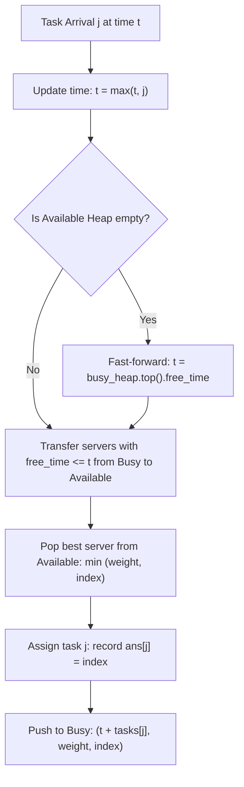

# Guided Example: Process Tasks Using Servers

We trace the discrete event simulation and dual min-heap priority scheduling on a representative cluster of servers and incoming task streams:

- **Input:** `servers = [3, 3, 2]`, `tasks = [1, 2, 3, 2, 1, 2]`
- **Required Output:** `[2, 2, 0, 2, 1, 2]`

This instance demonstrates coordinating two priority queues (available servers and busy servers), managing task arrival times with potential time warping when all servers are saturated, enforcing priority criteria (smallest weight, broken by smallest index), and reinserting freed servers immediately upon job completion.

---

## 1. Instance & Teaching Goal

We are given $n$ servers with initial capacities and weights, and $m$ sequential tasks.
- Task $j$ arrives at second $j$ and requires $\text{tasks}[j]$ seconds of execution time.
- Unassigned tasks wait in a FIFO queue.
- At any second, if servers are available, tasks are assigned to the server with:
  1. Minimum weight $\text{servers}[i]$.
  2. Minimum index $i$ in case of equal weight.
- If all servers are occupied, time fast-forwards to the moment the earliest occupied server finishes its task.

For `servers = [3, 3, 2]` and `tasks = [1, 2, 3, 2, 1, 2]`:
- $n = 3$ servers:
  - Server 0: weight 3
  - Server 1: weight 3
  - Server 2: weight 2 (lightest server, highest priority)
- $m = 6$ tasks arriving at times $t = 0, 1, 2, 3, 4, 5$.

Step-by-step assignments:
- At $t = 0$: Task 0 (duration 1) arrives. Server 2 is selected. Busy until $t = 1$. $\implies \text{ans}[0] = 2$.
- At $t = 1$: Server 2 becomes free. Task 1 (duration 2) arrives. Server 2 is selected. Busy until $t = 3$. $\implies \text{ans}[1] = 2$.
- At $t = 2$: Task 2 (duration 3) arrives. Available: Servers 0 and 1 (both weight 3). Tie broken by index $\implies$ Server 0 chosen. Busy until $t = 5$. $\implies \text{ans}[2] = 0$.
- At $t = 3$: Server 2 becomes free. Task 3 (duration 2) arrives. Server 2 is chosen. Busy until $t = 5$. $\implies \text{ans}[3] = 2$.
- At $t = 4$: Task 4 (duration 1) arrives. Available: Server 1. Server 1 chosen. Busy until $t = 5$. $\implies \text{ans}[4] = 1$.
- At $t = 5$: All servers finish simultaneously. Task 5 (duration 2) arrives. Server 2 is chosen. $\implies \text{ans}[5] = 2$.

The teaching goal is to understand **event-driven dual-heap coordination**:
1. Partitioning server states into two priority heaps:
   - `available`: ordered by `(weight, index)`.
   - `busy`: ordered by `(free_time, weight, index)`.
2. How to lazily advance cluster time: $t_{\text{current}} = \max(t_{\text{current}}, j)$, or warping directly to `busy.top().free_time` when `available` is empty.
3. How to flush all servers whose release times satisfy $\text{free\_time} \le t_{\text{current}}$ before making the next assignment.

---

## 2. Conceptual Foundation & Invariants

### Dual-Heap Event Scheduling & Lexicographical Priority Theorem

> **Dual-Heap Event Scheduling & Lexicographical Priority Theorem.**
> 1. *Disjoint State Partition:* At any simulation time $t$, every server $i \in \{0, \dots, n-1\}$ belongs to exactly one of two sets:
>    $$\text{Available} \cup \text{Busy} = \{0, 1, \dots, n-1\}, \quad \text{Available} \cap \text{Busy} = \emptyset$$
> 2. *Lexicographical Server Selection:* The priority order in `Available` is defined by the strict tuple comparison:
>    $$(w_a, a) < (w_b, b) \iff (w_a < w_b) \lor (w_a == w_b \land a < b)$$
> 3. *Temporal Expiration Order:* The priority in `Busy` is defined by earliest completion time:
>    $$(t_{\text{free}}, w, i)$$
>    All servers with $t_{\text{free}} \le t_{\text{current}}$ are popped from `Busy` and pushed into `Available`.
> 4. *Time Warping Invariant:* If `Available` is empty when task $j$ needs processing, the simulation time jumps instantaneously to the next completion event:
>    $$t_{\text{current}} = \max(j, \; \text{min-key}(\text{Busy}).t_{\text{free}})$$
> 5. *Complexity:* Each of the $m$ tasks causes at most one insertion into and deletion from both heaps. Total time is $\mathcal{O}((n + m) \log n)$ using binary min-heaps, with $\mathcal{O}(n + m)$ auxiliary space.

---

## 3. Step-by-Step Worked Execution

We trace the heap states across all 6 task assignments:

---

### Step 1: Initial Cluster Setup
- All 3 servers are initially available at $t = 0$.
- Available Min-Heap:
  - $(2, 2)$ [Server 2, weight 2]
  - $(3, 0)$ [Server 0, weight 3]
  - $(3, 1)$ [Server 1, weight 3]
- Busy Min-Heap: $\emptyset$.
- Clock: $t = 0$.

---

### Step 2: Task 0 Arrival ($j = 0$, duration 1)
- Set clock: $t = \max(0, 0) = 0$.
- Busy heap is empty $\implies$ no releases.
- Pop from Available: Server 2 (weight 2).
- Assignment: $\text{ans}[0] = 2$.
- Push to Busy: $(t + \text{tasks}[0], \text{weight}, \text{index}) = (0 + 1, 2, 2) = (1, 2, 2)$.
- Available: $\{ (3, 0), (3, 1) \}$.

---

### Step 3: Task 1 Arrival ($j = 1$, duration 2)
- Set clock: $t = \max(0, 1) = 1$.
- Check Busy heap: Top is $(1, 2, 2)$. Since $1 \le 1$, Server 2 is freed!
  - Pop $(1, 2, 2)$ from Busy, push $(2, 2)$ into Available.
- Available: $\{ (2, 2), (3, 0), (3, 1) \}$.
- Pop from Available: Server 2.
- Assignment: $\text{ans}[1] = 2$.
- Push to Busy: $(1 + 2, 2, 2) = (3, 2, 2)$.
- Available: $\{ (3, 0), (3, 1) \}$.

---

### Step 4: Task 2 Arrival ($j = 2$, duration 3)
- Set clock: $t = \max(1, 2) = 2$.
- Check Busy heap: Top is $(3, 2, 2)$. Since $3 > 2$, no servers freed.
- Available: $\{ (3, 0), (3, 1) \}$. Both have weight 3. Tie-break: index $0 < 1$.
- Pop from Available: Server 0.
- Assignment: $\text{ans}[2] = 0$.
- Push to Busy: $(2 + 3, 3, 0) = (5, 3, 0)$.
- Available: $\{ (3, 1) \}$.

---

### Step 5: Task 3 Arrival ($j = 3$, duration 2)
- Set clock: $t = \max(2, 3) = 3$.
- Check Busy heap: Top is $(3, 2, 2)$. Since $3 \le 3$, Server 2 is freed!
  - Pop $(3, 2, 2)$ from Busy, push $(2, 2)$ into Available.
- Next top in Busy: $(5, 3, 0)$ ($5 > 3$, remains busy).
- Available: $\{ (2, 2), (3, 1) \}$.
- Pop from Available: Server 2 (weight $2 < 3$).
- Assignment: $\text{ans}[3] = 2$.
- Push to Busy: $(3 + 2, 2, 2) = (5, 2, 2)$.
- Available: $\{ (3, 1) \}$.

---

### Step 6: Task 4 Arrival ($j = 4$, duration 1)
- Set clock: $t = \max(3, 4) = 4$.
- Check Busy heap: Earliest finish times are both 5 ($5 > 4$). No servers freed.
- Available: $\{ (3, 1) \}$.
- Pop from Available: Server 1.
- Assignment: $\text{ans}[4] = 1$.
- Push to Busy: $(4 + 1, 3, 1) = (5, 3, 1)$.
- Available: $\emptyset$. Cluster fully saturated!

---

### Step 7: Task 5 Arrival ($j = 5$, duration 2)
- Set clock: $t = \max(4, 5) = 5$.
- Check Busy heap:
  - Pop $(5, 2, 2) \implies$ Server 2 pushed to Available.
  - Pop $(5, 3, 0) \implies$ Server 0 pushed to Available.
  - Pop $(5, 3, 1) \implies$ Server 1 pushed to Available.
- Available: $\{ (2, 2), (3, 0), (3, 1) \}$.
- Pop from Available: Server 2.
- Assignment: $\text{ans}[5] = 2$.
- Push to Busy: $(5 + 2, 2, 2) = (7, 2, 2)$.

---

## 4. Complete Execution Trace

| Task $j$ | Task Duration | Clock $t$ | Busy Servers Released | Available Servers | Chosen Server | Release Time | Result $\text{ans}[j]$ |
|:---:|:---:|:---:|:---:|:---:|:---:|:---:|:---:|
| 0 | 1 | 0 | None | S2(2), S0(3), S1(3) | **Server 2** | $0 + 1 = 1$ | 2 |
| 1 | 2 | 1 | Server 2 | S2(2), S0(3), S1(3) | **Server 2** | $1 + 2 = 3$ | 2 |
| 2 | 3 | 2 | None | S0(3), S1(3) | **Server 0** | $2 + 3 = 5$ | 0 |
| 3 | 2 | 3 | Server 2 | S2(2), S1(3) | **Server 2** | $3 + 2 = 5$ | 2 |
| 4 | 1 | 4 | None | S1(3) | **Server 1** | $4 + 1 = 5$ | 1 |
| 5 | 2 | 5 | S2, S0, S1 | S2(2), S0(3), S1(3) | **Server 2** | $5 + 2 = 7$ | 2 |

---

## 5. Algorithmic Correctness

**Soundness.** Every assignment strictly adheres to the tie-breaking rules: minimum weight first, minimum index second. Servers are marked busy immediately upon task allocation and are never reassigned until their execution window completes.

**Completeness.** Every task from $0$ to $m - 1$ is assigned in FIFO order. If no server is free, jumping time directly to the earliest completion guarantees no infinite loop or busy-waiting occurs.

---

## 6. Traps This Instance Exposes

- **Incrementing Time by 1 Unit:** Simulating second-by-second ($t \leftarrow t + 1$) causes severe Time Limit Exceeded when tasks have long durations (e.g. $10^9$ seconds). Jumping the clock directly to the next completion event is mandatory.
- **Simultaneous Server Releases:** Multiple servers can complete their tasks at or before the same time $t$. All such servers must be flushed into `Available` before picking the next server; otherwise, a lower-weight server that just finished might be missed.
- **Clock Regressing:** Time can never move backwards. If a previous task forced $t$ into the future due to server saturation, subsequent tasks arriving at earlier times $j < t$ must still be processed at the advanced cluster time $t$.

---

## 7. Complexity Derivation

- **Time Complexity:** $\mathcal{O}((n + m) \log n)$. Initializing the available heap of $n$ servers takes $\mathcal{O}(n \log n)$. Each of the $m$ tasks is pushed and popped from the available and busy heaps at most once, each taking $\mathcal{O}(\log n)$ time.
- **Auxiliary Space Complexity:** $\mathcal{O}(n + m)$ to store the $n$ heap elements and the output array of length $m$.
