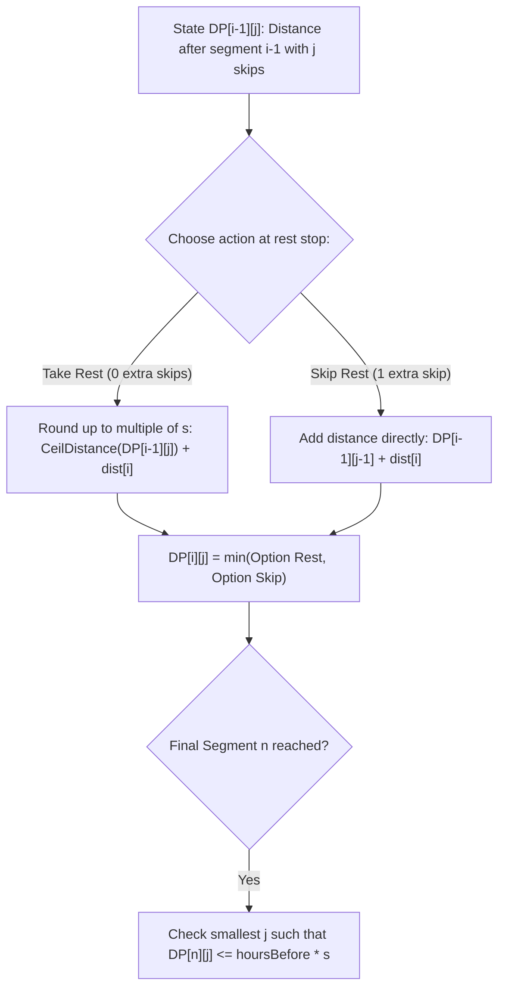

# Guided Example: Minimum Skips to Arrive at Meeting On Time

We trace the integer-scaled dynamic programming on a representative multi-leg journey to find the minimum number of rest skips required to reach the destination before a strict deadline:

- **Input:** `dist = [1, 3, 2]`, `speed = 4`, `hoursBefore = 2`
- **Required Output:** `1`

This instance demonstrates transforming fractional hourly travel times into exact integer distance units to eliminate floating-point precision loss, formulating the dynamic programming state over segments and skip counts, applying integer ceiling arithmetic for rest stops, and selecting the minimal skip count that satisfies the deadline.

---

## 1. Instance & Teaching Goal

We need to travel through $n$ road segments given by array `dist`. Our travel speed is `speed`.
- Driving segment $i$ takes $dist[i] / speed$ hours.
- After each segment except the last one ($i < n - 1$), we must rest until the next integer hour mark (i.e. $\lceil \text{current\_time} \rceil$).
- We may choose to skip rests. If we skip the rest after segment $i$, we immediately begin segment $i + 1$ without waiting.
- No rest is required after the final segment $n - 1$.
- We must arrive within `hoursBefore` hours using the minimum number of skips, or determine that it is impossible.

For `dist = [1, 3, 2]`, `speed = 4`, and `hoursBefore = 2`:
- $n = 3$ segments.
- Travel time without skips ($j = 0$):
  - Segment 0 ($dist = 1$): takes $1/4$ hr. Rest rounds up to $1$ hr.
  - Segment 1 ($dist = 3$): arrives at $1 + 3/4$ hr. Rest rounds up to $2$ hr.
  - Segment 2 ($dist = 2$): arrives at $2 + 2/4 = 2.5$ hr.
  - Total time: $2.5$ hours $> 2$ hours $\implies$ Fails deadline!
- Travel time with $1$ skip ($j = 1$):
  - Skip rest after Segment 0:
    - Segment 0: takes $1/4$ hr. No rest.
    - Segment 1: starts at $1/4$, takes $3/4$ hr $\implies$ arrives at $1/4 + 3/4 = 1.0$ hr.
    - Rest after Segment 1: already at integer hour $1.0$, so no waiting needed.
    - Segment 2: takes $2/4 = 0.5$ hr $\implies$ arrives at $1.0 + 0.5 = 1.5$ hr.
  - Total time: $1.5$ hours $\le 2$ hours $\implies$ On time!
- Minimal skips required: $1$.

The teaching goal is to understand **exact integer state tracking for mixed continuous-discrete systems**:
1. Why native floating-point calculations with `ceil()` suffer from cumulative precision errors (e.g. $0.25 + 0.75 = 0.9999999999999999 \to \text{ceil} = 1$ vs $1.0000000000000002 \to \text{ceil} = 2$).
2. How multiplying all time quantities by `speed` converts fractional hours into exact integer distance units.
3. How to represent ceiling rounding with integer arithmetic: $\lceil x / s \rceil \cdot s = \lfloor (x + s - 1) / s \rfloor \cdot s$.

---

## 2. Conceptual Foundation & Invariants

### Integer-Scaled Distance Dynamic Programming Theorem

> **Integer-Scaled Distance Dynamic Programming Theorem.**
> 1. *Metric Transformation (Distance Scaling):* Let $s = \text{speed}$. Instead of tracking fractional elapsed time $T$, track the equivalent distance travelled:
>    $$D = T \cdot s$$
>    Waiting until the next integer hour $\lceil T \rceil$ corresponds to rounding $D$ up to the next multiple of $s$:
>    $$\text{CeilDistance}(D) = \left\lceil \frac{D}{s} \right\rceil \cdot s = \left\lfloor \frac{D + s - 1}{s} \right\rfloor \cdot s$$
> 2. *DP State Definition:* Let $DP[i][j]$ denote the minimum scaled distance accumulated after traversing the first $i$ segments ($1 \le i \le n$) using exactly $j$ skips ($0 \le j \le i$).
> 3. *Transitions:*
>    - *Without skipping rest after segment $i - 1$ (uses $j$ skips overall):*
>      $$DP[i][j] = \text{CeilDistance}(DP[i-1][j]) + dist[i-1]$$
>    - *With skipping rest after segment $i - 1$ (uses $j$ skips overall, so $j - 1$ prior skips):*
>      $$DP[i][j] = DP[i-1][j-1] + dist[i-1]$$
>    - *Combined Recurrence:*
>      $$DP[i][j] = \min\left( \text{CeilDistance}(DP[i-1][j]) + dist[i-1], \; DP[i-1][j-1] + dist[i-1] \right)$$
> 4. *Termination & Feasibility Condition:* The deadline is met if and only if the final scaled distance does not exceed the target scaled threshold:
>    $$DP[n][j] \le \text{hoursBefore} \cdot s$$
>    The optimal answer is the smallest $j \in \{0, 1, \dots, n\}$ satisfying this inequality, or $-1$ if no such $j$ exists.
> 5. *Complexity:* The DP table has dimensions $n \times (n + 1)$, requiring $\mathcal{O}(n^2)$ time and $\mathcal{O}(n)$ auxiliary space via rolling arrays.

---

## 3. Step-by-Step Worked Execution

We trace the scaled distance table for `dist = [1, 3, 2]`, `speed = 4`, `hoursBefore = 2`:
- Target distance threshold: $\text{hoursBefore} \times \text{speed} = 2 \times 4 = 8$.
- Base state: $DP[0][0] = 0$; all other $DP[0][j] = \infty$.

---

### Step 1: Process Segment 0 ($dist[0] = 1$)
- **For $j = 0$ skips:**
  - Previous state: $DP[0][0] = 0$.
  - $\text{CeilDistance}(0) = 0$.
  - $DP[1][0] = 0 + 1 = 1$.

---

### Step 2: Process Segment 1 ($dist[1] = 3$)
- **For $j = 0$ skips (no skips so far):**
  - Must take rest after Segment 0:
    $$\text{CeilDistance}(DP[1][0]) = \left\lfloor \frac{1 + 4 - 1}{4} \right\rfloor \cdot 4 = 1 \cdot 4 = 4$$
  - $DP[2][0] = 4 + 3 = 7$.
- **For $j = 1$ skip (skip rest after Segment 0):**
  - Option A (rest after Segment 0, using 1 prior skip): $DP[1][1] = \infty$.
  - Option B (skip rest after Segment 0, using 0 prior skips):
    $$DP[1][0] + 3 = 1 + 3 = 4$$
  - $DP[2][1] = \min(\infty, 4) = 4$.

---

### Step 3: Process Segment 2 ($dist[2] = 2$)
- **For $j = 0$ skips:**
  - Must rest after Segment 1:
    $$\text{CeilDistance}(DP[2][0]) = \left\lfloor \frac{7 + 4 - 1}{4} \right\rfloor \cdot 4 = 2 \cdot 4 = 8$$
  - $DP[3][0] = 8 + 2 = 10$.
- **For $j = 1$ skip:**
  - Option A (rest after Segment 1, 1 prior skip):
    $$\text{CeilDistance}(DP[2][1]) + 2 = \text{CeilDistance}(4) + 2 = 4 + 2 = 6$$
  - Option B (skip rest after Segment 1, 0 prior skips):
    $$DP[2][0] + 2 = 7 + 2 = 9$$
  - $DP[3][1] = \min(6, 9) = 6$.
- **For $j = 2$ skips:**
  - Option A (rest after Segment 1, 2 prior skips): $\infty$.
  - Option B (skip rest after Segment 1, 1 prior skip):
    $$DP[2][1] + 2 = 4 + 2 = 6$$
  - $DP[3][2] = \min(\infty, 6) = 6$.

---

### Step 4: Evaluate Against Deadline Threshold ($D \le 8$)
Scan $j$ in ascending order:
1. $j = 0$: $DP[3][0] = 10 > 8$ (Exceeds 2 hours: $10 / 4 = 2.5\text{ hrs}$).
2. $j = 1$: $DP[3][1] = 6 \le 8$ (Meets deadline: $6 / 4 = 1.5\text{ hrs} \le 2\text{ hrs}$).
Smallest valid skip count is $j = 1$.

---

## 4. Complete Execution Trace

| Segment Index $i$ | Segment Length | Skip Count $j = 0$ | Skip Count $j = 1$ | Skip Count $j = 2$ | Skip Count $j = 3$ |
|:---:|:---:|:---:|:---:|:---:|:---:|
| 0 (Start) | - | 0 | $\infty$ | $\infty$ | $\infty$ |
| 1 | 1 | 1 | $\infty$ | $\infty$ | $\infty$ |
| 2 | 3 | 7 | 4 | $\infty$ | $\infty$ |
| 3 (Destination) | 2 | 10 | **6** | 6 | $\infty$ |
| **Status vs Limit ($\le 8$)** | - | $10 > 8$ (Fail) | **$6 \le 8$ (Pass)** | $6 \le 8$ (Pass) | - |

---

## 5. Algorithmic Correctness

**Soundness.** Every computed state $DP[i][j]$ reflects a physically attainable route using exact integer additions and integer ceiling functions. Since scaling by `speed` preserves the strict total ordering of all intermediate times, testing $DP[n][j] \le \text{hoursBefore} \times \text{speed}$ is mathematically identical to evaluating whether actual travel time is within `hoursBefore`.

**Completeness.** By exploring both possibilities (resting vs skipping) at each of the $n - 1$ intermediate rest stops, the dynamic programming explores the entire combinatorial decision space without premature pruning.

---

## 6. Traps This Instance Exposes

- **Floating-Point Roundoff Errors:** Accumulating fractional numbers (e.g. `1/3 + 2/3`) in standard 64-bit floats yields values like `0.9999999999999999` or `1.0000000000000002`. Taking `ceil()` turns small rounding inaccuracies into full 1-hour errors. Using integer scaling completely eliminates floating-point arithmetic.
- **Resting After the Final Leg:** The destination does not require a rest period. The algorithm must simply add $dist[n-1]$ without applying $\text{CeilDistance}$ to the final segment.
- **Impossible Journeys:** If even using $n$ skips (skipping every rest stop) results in $\sum dist > \text{hoursBefore} \times \text{speed}$, reaching the destination is physically impossible, and the algorithm must output $-1$.

---

## 7. Complexity Derivation

- **Time Complexity:** $\mathcal{O}(n^2)$, where $n$ is the number of road segments. There are $n$ stages, and stage $i$ computes values for $j \in \{0, \dots, i\}$, totaling $\sum_{i=1}^n (i + 1) = \mathcal{O}(n^2)$ constant-time transitions. With $n \le 1000$, $10^6$ operations execute in under $50\text{ ms}$.
- **Auxiliary Space Complexity:** $\mathcal{O}(n)$ using a 1D rolling array, as stage $i$ depends only on the values from stage $i - 1$.