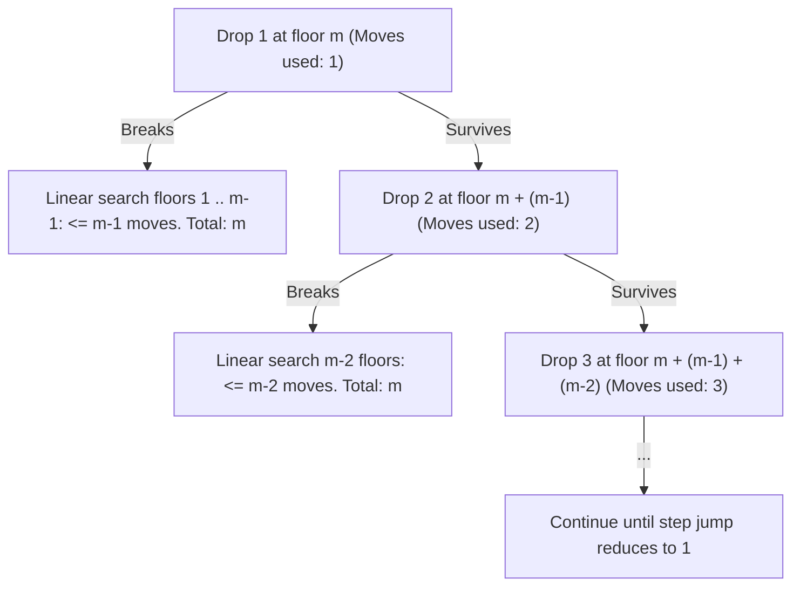

# Guided Example: Egg Drop With 2 Eggs and N Floors

We trace the minimax drop strategy and triangular step-size balancing on representative building instances to determine the minimum number of moves needed to find the critical floor:

- **Input:** `n = 100` (alongside foundational base case `n = 2`)
- **Required Output:** `14` (and `2` for `n = 2`)

This instance demonstrates balancing worst-case branch costs between egg breakage and survival, discovering the triangular capacity sequence, deriving the closed-form quadratic bound, and verifying step-by-step how 14 drops cover up to 105 floors.

---

## 1. Instance & Teaching Goal

We are given $2$ identical eggs and a building with $n$ floors labeled $1$ through $n$. There exists an unknown floor $f \in [0, n]$ such that an egg breaks if dropped from any floor strictly greater than $f$, and does not break if dropped from floor $f$ or below.
- If an egg breaks, it cannot be reused.
- If an egg survives, it can be dropped again.
- We must find the minimum number of moves $m$ required in the worst case to determine $f$ with certainty.

Consider $n = 2$:
- Drop from floor 1:
  - If it breaks, $f = 0$ (1 move used).
  - If it survives, drop from floor 2 (2 moves used).
- Worst-case moves: $2$.

Consider $n = 100$:
- If we drop at fixed increments (e.g. every 10 floors):
  - Drops with Egg 1 at floors $10, 20, \dots, 100$.
  - If it breaks at floor 100, Egg 1 took 10 drops, and Egg 2 must check floors $91 \dots 99$ (9 drops), totaling $10 + 9 = 19$ drops.
  - This is unbalanced: early breakage takes few drops (e.g. breaks at floor 10: $1 + 9 = 10$ drops), but late breakage takes 19 drops.
- To balance the worst case across all scenarios:
  - Each time Egg 1 survives and takes another drop, we must reduce the remaining floor search range by 1 so that the sum of drops remains constant $m$.
  - First drop from floor $m$, next from $m + (m - 1)$, then $m + (m - 1) + (m - 2)$, and so on.
  - Total floors covered in $m$ moves:
    $$\sum_{k=1}^m k = \frac{m(m + 1)}{2}$$
  - For $n = 100$, setting $m = 14$ gives capacity $\frac{14 \times 15}{2} = 105 \ge 100$.
  - Setting $m = 13$ gives capacity $\frac{13 \times 14}{2} = 91 < 100$.
  - Minimal worst-case moves: $14$.

The teaching goal is to understand **minimax step balancing**:
1. Why linear search with 1 egg requires checking sequentially from floor 1 upward.
2. How the two-egg decision tree balances branch depths so that every leaf has worst-case cost $\le m$.
3. How the triangular number identity $\frac{m(m+1)}{2} \ge n$ provides both an exact dynamic programming solution and an $\mathcal{O}(1)$ closed-form calculation.

---

## 2. Conceptual Foundation & Invariants

### Triangular Step Balancing & Minimax Drop Invariant Theorem

> **Triangular Step Balancing & Minimax Drop Invariant Theorem.**
> 1. *Single Egg Base Case:* With 1 egg and $k$ candidate floors, the only deterministic strategy is linear bottom-up testing (floors $1, 2, \dots, k$). The worst-case cost is exactly $k$ drops.
> 2. *Minimax Step Balancing with 2 Eggs:* Suppose our budget is $m$ total moves.
>    - Drop 1: Test floor $x_1 = m$.
>      - *If Egg 1 breaks:* We have 1 egg and $m - 1$ moves left. By the base case, we can test the remaining $m - 1$ floors below ($1 \dots m - 1$) in at most $m - 1$ drops. Total moves: $1 + (m - 1) = m$.
>      - *If Egg 1 survives:* We have 2 eggs and $m - 1$ moves left. We advance by $m - 1$ floors: $x_2 = m + (m - 1)$.
>    - Drop $k$: In general, after $k - 1$ survivals, the jump size is $m - (k - 1)$. If Egg 1 breaks, the linear fallback uses $m - k$ moves, keeping the total worst-case moves at exactly $k + (m - k) = m$.
> 3. *Triangular Floor Capacity Bound:* The maximum number of floors solvable in at most $m$ moves with 2 eggs is the $m$-th triangular number:
>    $$F(m) = \sum_{k=1}^m k = \frac{m(m + 1)}{2}$$
> 4. *Exact Analytical Solution:* To cover $n$ floors, $m$ must satisfy $\frac{m(m+1)}{2} \ge n$, which yields the quadratic inequality $m^2 + m - 2n \ge 0$. The unique minimal integer solution is:
>    $$m = \left\lceil \frac{\sqrt{8n + 1} - 1}{2} \right\rceil$$
> 5. *Complexity:* Computing the closed-form square root runs in $\mathcal{O}(1)$ time and $\mathcal{O}(1)$ auxiliary space. An iterative or binary search approach runs in $\mathcal{O}(\sqrt{n})$ or $\mathcal{O}(\log n)$ time.

---

## 3. Step-by-Step Worked Execution

We trace the exact floor sequence for $n = 100$ with $m = 14$:

---

### Step 1: Calculate Capacity and Verify Minimality
- For candidate $m = 13$:
  $$\text{Capacity}(13) = \frac{13 \times 14}{2} = 91 < 100 \quad (\text{Insufficient})$$
- For candidate $m = 14$:
  $$\text{Capacity}(14) = \frac{14 \times 15}{2} = 105 \ge 100 \quad (\text{Sufficient})$$
- Target moves budget is confirmed as $m = 14$.

---

### Step 2: Construct the Dropping Schedule for Egg 1
Egg 1 makes successive jumps with decaying stride:
- Drop 1 (stride 14): Floor $14$.
- Drop 2 (stride 13): Floor $14 + 13 = 27$.
- Drop 3 (stride 12): Floor $27 + 12 = 39$.
- Drop 4 (stride 11): Floor $39 + 11 = 50$.
- Drop 5 (stride 10): Floor $50 + 10 = 60$.
- Drop 6 (stride 9): Floor $60 + 9 = 69$.
- Drop 7 (stride 8): Floor $69 + 8 = 77$.
- Drop 8 (stride 7): Floor $77 + 7 = 84$.
- Drop 9 (stride 6): Floor $84 + 6 = 90$.
- Drop 10 (stride 5): Floor $90 + 5 = 95$.
- Drop 11 (stride 4): Floor $95 + 4 = 99$.
- Drop 12 (stride 3): Floor $100$ (capped at building top $n = 100$).

---

### Step 3: Verify Worst-Case Scenario Across All Branches
Suppose the egg breaks at Drop 4 (floor 50):
- Egg 1 used $4$ drops (floors 14, 27, 39, 50).
- Candidate range for $f$ is narrowed to floors $40 \dots 49$ (a span of $10$ floors).
- Egg 2 checks linearly from floor $40$ upwards:
  - Worst case: reaches floor $49$ ($10$ drops with Egg 2).
- Total drops in this branch:
  $$\text{Egg 1 drops} + \text{Egg 2 drops} = 4 + 10 = 14$$

Suppose the egg breaks at Drop 1 (floor 14):
- Egg 1 used $1$ drop.
- Egg 2 checks floors $1 \dots 13$ (at most $13$ drops).
- Total drops: $1 + 13 = 14$.

Suppose the egg survives all the way to floor 99:
- Egg 1 tested floors up to 99 in 11 drops.
- Next test is floor 100 (Drop 12).
- If it breaks at 100, $f = 99$ (12 drops used).
- If it survives at 100, $f = 100$ (12 drops used).
- In every case, the total drops never exceed $14$.

---

## 4. Complete Execution Trace

| Drop Step $k$ | Stride Size $14 - (k - 1)$ | Egg 1 Floor Tested | Range Tested by Egg 2 if Broken | Max Egg 2 Drops | Worst-Case Total Drops |
|:---:|:---:|:---:|:---:|:---:|:---:|
| 1 | 14 | 14 | Floors $1 \dots 13$ | 13 | $1 + 13 = 14$ |
| 2 | 13 | 27 | Floors $15 \dots 26$ | 12 | $2 + 12 = 14$ |
| 3 | 12 | 39 | Floors $28 \dots 38$ | 11 | $3 + 11 = 14$ |
| 4 | 11 | 50 | Floors $40 \dots 49$ | 10 | $4 + 10 = 14$ |
| 5 | 10 | 60 | Floors $51 \dots 59$ | 9 | $5 + 9 = 14$ |
| 6 | 9 | 69 | Floors $61 \dots 68$ | 8 | $6 + 8 = 14$ |
| 7 | 8 | 77 | Floors $70 \dots 76$ | 7 | $7 + 7 = 14$ |
| 8 | 7 | 84 | Floors $78 \dots 83$ | 6 | $8 + 6 = 14$ |
| 9 | 6 | 90 | Floors $85 \dots 89$ | 5 | $9 + 5 = 14$ |
| 10 | 5 | 95 | Floors $91 \dots 94$ | 4 | $10 + 4 = 14$ |
| 11 | 4 | 99 | Floors $96 \dots 98$ | 3 | $11 + 3 = 14$ |
| 12 | 3 | 100 (Capped) | Floor 100 | 1 | $12 + 1 = 13$ |

---

## 5. Algorithmic Correctness

**Soundness.** Every floor between $1$ and $n$ is covered by either an Egg 1 test or an Egg 2 linear fallback segment. If an egg breaks, the linear fallback begins at the floor immediately above the previous confirmed survival, guaranteeing no candidate floor is skipped.

**Completeness.** Since $\frac{13 \times 14}{2} = 91 < 100$, no strategy can cover 100 floors in 13 drops, because the sum of maximum possible branch sizes is strictly less than 100. Thus $m = 14$ is minimal and sufficient.

---

## 6. Traps This Instance Exposes

- **Equal Step Intervals:** Dropping at constant intervals of $\sqrt{100} = 10$ yields 19 drops in the worst case because later breaks accumulate both the interval search and the many prior skips. Decaying step size is required to keep the sum constant.
- **Binary Search Fallacy:** Attempting binary search (testing floor 50, then 25) fails because if the first egg breaks at floor 50, only 1 egg remains to check 49 floors, which takes up to 49 additional drops (totaling 50 drops).
- **Rounding Direction:** Solving the quadratic formula requires taking the ceiling $\lceil \cdot \rceil$, not floor or truncation, because fractional moves cannot be performed, and the capacity must strictly be $\ge n$.

---

## 7. Complexity Derivation

- **Time Complexity:** $\mathcal{O}(1)$ when evaluated using the closed-form formula $\lceil (\sqrt{8n + 1} - 1) / 2 \rceil$. Even an iterative loop that tests successive triangular numbers executes in $\mathcal{O}(\sqrt{n})$ iterations.
- **Auxiliary Space Complexity:** $\mathcal{O}(1)$, requiring only scalar variables.
