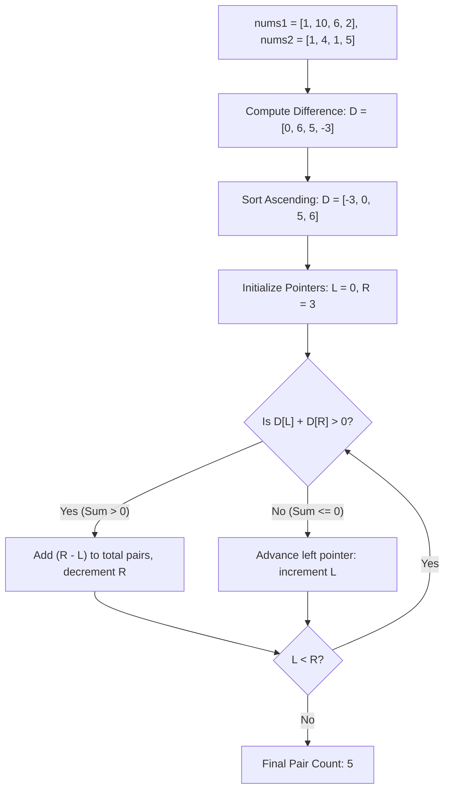

# Guided Example: Count Pairs in Two Arrays

We trace the difference transformation and sorted two-pointer sweep on representative array pairs to count index pairs where the sum in `nums1` strictly exceeds the sum in `nums2`:

- **Input:** `nums1 = [1, 10, 6, 2]`, `nums2 = [1, 4, 1, 5]` (alongside base case `nums1 = [2, 1, 2, 1]`, `nums2 = [1, 2, 1, 2]`)
- **Required Output:** `5` (and `1` for the base case)

This instance demonstrates algebraically reorganizing a coupled two-array inequality into a single difference metric $D[k] = nums1[k] - nums2[k]$, exploiting the symmetry of unordered pairs to sort $D$, and applying a two-pointer convergent scan to count valid combinations in $\mathcal{O}(n \log n)$ time.

---

## 1. Instance & Teaching Goal

We are given two integer arrays `nums1` and `nums2` of length $n$. We wish to count the number of index pairs $(i, j)$ with $0 \le i < j < n$ such that:
$$nums1[i] + nums1[j] > nums2[i] + nums2[j]$$

Consider `nums1 = [1, 10, 6, 2]` and `nums2 = [1, 4, 1, 5]`:
- Length $n = 4$. Total candidate pairs: $\binom{4}{2} = 6$.
- Rearranging the inequality:
  $$nums1[i] - nums2[i] + nums1[j] - nums2[j] > 0$$
- Define the difference array $D$:
  - $D[0] = nums1[0] - nums2[0] = 1 - 1 = 0$
  - $D[1] = nums1[1] - nums2[1] = 10 - 4 = 6$
  - $D[2] = nums1[2] - nums2[2] = 6 - 1 = 5$
  - $D[3] = nums1[3] - nums2[3] = 2 - 5 = -3$
- Difference values: $D = [0, 6, 5, -3]$.
- We want to count pairs $\{i, j\}$ ($i \neq j$) such that $D[i] + D[j] > 0$.
- Candidate pair sums:
  - $(0, 1): 0 + 6 = 6 > 0$ (Valid)
  - $(0, 2): 0 + 5 = 5 > 0$ (Valid)
  - $(0, 3): 0 + (-3) = -3 \le 0$ (Invalid)
  - $(1, 2): 6 + 5 = 11 > 0$ (Valid)
  - $(1, 3): 6 + (-3) = 3 > 0$ (Valid)
  - $(2, 3): 5 + (-3) = 2 > 0$ (Valid)
- Exactly $5$ pairs satisfy the inequality.

The teaching goal is to understand **algebraic decoupling and monotonic pair counting**:
1. Decoupling the cross-array inequality into an independent difference array $D[k] = nums1[k] - nums2[k]$.
2. Recognizing that the pair sum $D[i] + D[j]$ is invariant to sorting because unordered pairs depend only on multiset values, not original indices.
3. Using two pointers on the sorted difference array to count valid partners in bulk rather than checking all $\mathcal{O}(n^2)$ pairs.

---

## 2. Conceptual Foundation & Invariants

### Differential Projection & Symmetric Two-Pointer Summation Theorem

> **Differential Projection & Symmetric Two-Pointer Summation Theorem.**
> 1. *Algebraic Decoupling:* For any two indices $i \neq j$:
>    $$nums1[i] + nums1[j] > nums2[i] + nums2[j] \iff (nums1[i] - nums2[i]) + (nums1[j] - nums2[j]) > 0$$
>    Let $D[k] = nums1[k] - nums2[k]$ for all $0 \le k < n$. The condition becomes:
>    $$D[i] + D[j] > 0$$
> 2. *Index Permutation Invariance:* Since addition is commutative ($D[i] + D[j] = D[j] + D[i]$) and each distinct unordered pair $\{i, j\}$ corresponds to exactly one ordered pair $i < j$, sorting the array $D$ preserves the exact count of qualifying pairs.
> 3. *Sorted Two-Pointer Monotonicity:* Let $D$ be sorted non-decreasingly: $D[0] \le D[1] \le \dots \le D[n-1]$. Maintain pointers $L = 0$ and $R = n - 1$:
>    - *Case $D[L] + D[R] > 0$:* Because $D$ is non-decreasing, for all $k \in [L, R - 1]$, we have $D[k] + D[R] \ge D[L] + D[R] > 0$. Thus, $D[R]$ forms a valid pair with every element from index $L$ to $R - 1$. This contributes exactly $R - L$ valid pairs. We then decrement $R \leftarrow R - 1$.
>    - *Case $D[L] + D[R] \le 0$:* Even the largest available element $D[R]$ is insufficient to produce a positive sum when paired with $D[L]$. Consequently, $D[L]$ cannot form a positive sum with any element $\le D[R]$. We increment $L \leftarrow L + 1$.
> 4. *Complexity:* Constructing $D$ takes $\mathcal{O}(n)$ time. Sorting $D$ takes $\mathcal{O}(n \log n)$ time. The two-pointer sweep processes each element at most once in $\mathcal{O}(n)$ time. Total time is $\mathcal{O}(n \log n)$ with $\mathcal{O}(n)$ auxiliary space.

---

## 3. Step-by-Step Worked Execution

We trace the sorted two-pointer sweep on `nums1 = [1, 10, 6, 2]` and `nums2 = [1, 4, 1, 5]`:

---

### Step 1: Compute Difference Array $D$
- $D[0] = 1 - 1 = 0$
- $D[1] = 10 - 4 = 6$
- $D[2] = 6 - 1 = 5$
- $D[3] = 2 - 5 = -3$
- Difference multiset: $\{0, 6, 5, -3\}$.

---

### Step 2: Sort $D$ Ascending
- Sorted array: $D = [-3, 0, 5, 6]$.
- Indices: $D[0] = -3, D[1] = 0, D[2] = 5, D[3] = 6$.
- Initialize: $L = 0$, $R = 3$, $\text{pair\_count} = 0$.

---

### Step 3: Two-Pointer Iteration 1 ($L = 0, R = 3$)
- Elements: $D[0] = -3$, $D[3] = 6$.
- Evaluate sum:
  $$D[0] + D[3] = -3 + 6 = 3 > 0$$
- Condition is met: $D[3]$ pairs validly with all elements in $D[0 \dots 2]$ (indices $0, 1, 2$).
- Valid pairs added:
  $$\Delta = R - L = 3 - 0 = 3$$
  Pairs represented: $(-3, 6), (0, 6), (5, 6)$.
- Update counter: $\text{pair\_count} = 0 + 3 = 3$.
- Decrement right pointer: $R \leftarrow 2$.

---

### Step 4: Two-Pointer Iteration 2 ($L = 0, R = 2$)
- Elements: $D[0] = -3$, $D[2] = 5$.
- Evaluate sum:
  $$D[0] + D[2] = -3 + 5 = 2 > 0$$
- Condition is met: $D[2]$ pairs validly with all elements in $D[0 \dots 1]$ (indices $0, 1$).
- Valid pairs added:
  $$\Delta = R - L = 2 - 0 = 2$$
  Pairs represented: $(-3, 5), (0, 5)$.
- Update counter: $\text{pair\_count} = 3 + 2 = 5$.
- Decrement right pointer: $R \leftarrow 1$.

---

### Step 5: Two-Pointer Iteration 3 ($L = 0, R = 1$)
- Elements: $D[0] = -3$, $D[1] = 0$.
- Evaluate sum:
  $$D[0] + D[1] = -3 + 0 = -3 \le 0$$
- Condition fails: $D[0]$ cannot pair with $D[1]$ or any smaller element.
- Increment left pointer: $L \leftarrow 1$.

---

### Step 6: Loop Termination
- Pointers meet: $L = 1, R = 1 \implies L \ge R$.
- Sweep completes.
- Final pair count: $5$.

---

## 4. Complete Execution Trace

| Iteration | Pointer $L$ | Value $D[L]$ | Pointer $R$ | Value $D[R]$ | Sum $D[L] + D[R]$ | Sum $> 0$? | Pairs Added | Cumulative Pairs | Next Action |
|:---:|:---:|:---:|:---:|:---:|:---:|:---:|:---:|:---:|:---:|
| 1 | 0 | -3 | 3 | 6 | $3$ | **Yes** | $3 - 0 = 3$ | 3 | $R \leftarrow 2$ |
| 2 | 0 | -3 | 2 | 5 | $2$ | **Yes** | $2 - 0 = 2$ | 5 | $R \leftarrow 1$ |
| 3 | 0 | -3 | 1 | 0 | $-3$ | **No** | 0 | 5 | $L \leftarrow 1$ |
| **End** | 1 | 0 | 1 | 0 | - | - | - | **5** | Terminate ($L = R$) |

---

## 5. Algorithmic Correctness

**Soundness.** Every pair counted by adding $R - L$ satisfies $D[k] + D[R] \ge D[L] + D[R] > 0$ due to the sorted property $D[k] \ge D[L]$ for all $k \ge L$. Reversing the algebraic transformation demonstrates that each identified pair strictly satisfies $nums1[i] + nums1[j] > nums2[i] + nums2[j]$.

**Completeness.** Every right boundary $R$ accounts for all valid partners with indices strictly less than $R$. When $D[L] + D[R] \le 0$, no valid partner for $D[L]$ exists among remaining candidates $\le R$, so advancing $L$ discards zero valid pairs.

---

## 6. Traps This Instance Exposes

- **Preserving Original Indices:** Trying to maintain original index positions $i < j$ prevents sorting and leads to a quadratic $\mathcal{O}(n^2)$ search. Because addition is commutative, the multiset of differences contains all information needed to count unordered pairs.
- **Strict Inequality ($> 0$ vs $\ge 0$):** Pairs with sum equal to $0$ (such as $D[i] + D[j] == 0$) are strictly invalid. The condition requires $D[L] + D[R] > 0$, not $\ge 0$.
- **Large Output Range:** For $n = 10^5$, the maximum number of pairs is $\binom{10^5}{2} \approx 5 \times 10^9$, which exceeds standard 32-bit signed integer limits ($2^{31} - 1 \approx 2.14 \times 10^9$). The accumulator must use a 64-bit integer type.

---

## 7. Complexity Derivation

- **Time Complexity:** $\mathcal{O}(n \log n)$, dominated by sorting the difference array of size $n$. Computing the difference takes $\mathcal{O}(n)$ time, and the two-pointer scan takes $\mathcal{O}(n)$ time since each pointer moves at most $n$ times.
- **Auxiliary Space Complexity:** $\mathcal{O}(n)$ to store the difference array $D$.
