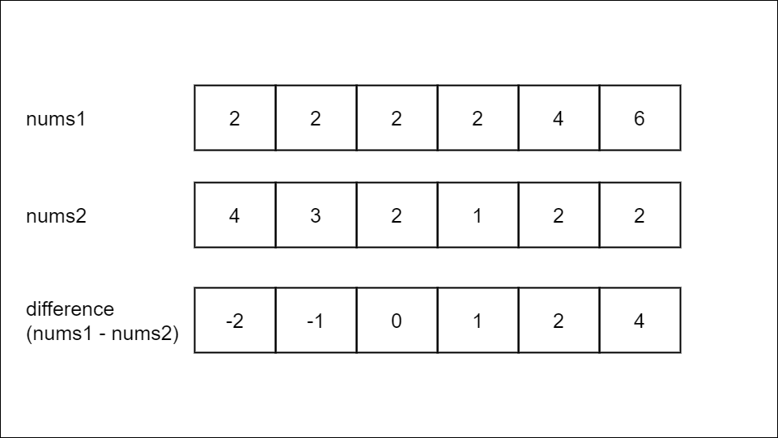
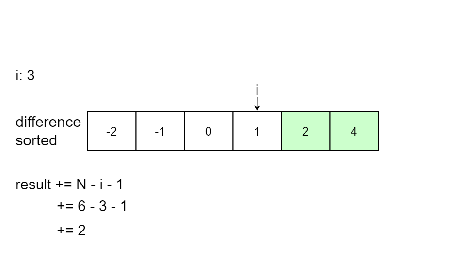

[TOC]

## Solution

---

### Overview

We are given two arrays, `nums1` and `nums2`, and need to count the pairs of indices `(i, j)` where the values in `nums1` have a greater sum than the values in `nums2`.

**Key Observations**
1. Both `nums1` and `nums2` are arrays of the same length.
2. The values in the arrays are numbers greater than `0`.
3. We need to count the pairs, not return the pairs themselves.

---

### Approach 1: Binary Search

#### Intuition

The brute force approach would be to iterate using nested loops through every possible pair of indices in `nums1`, calculating the sum for each pair, and then comparing it with the sum of corresponding elements in `nums2`. This process is repeated for all pairs, incrementing a counter each time the condition is met.

Unfortunately, this solution gives "Time Limit Exceeded" because it is computationally expensive. We need a more efficient approach.

We need to be able to count multiple pairs without explicitly checking each pair's validity. The inequality given in the problem description $\text{nums1}[i] + \text{nums1}[j] > \text{nums2}[i] + \text{nums2}[j]$ is an algebraic expression, so we can manipulate it.

We can manipulate the inequality by subtracting like terms from each side:

```
nums1[i] + nums1[j]             >   nums2[i] + nums2[j]
         - nums1[j] - nums2[i]    - nums2[i]            - nums1[j]
```

Subtract $\text{nums2}[i]$ and $\text{nums1}[j]$ from both sides.

```
nums1[i] - nums2[i] > nums2[j] - nums1[j]
```

To determine a valid pair, we compare differences. We can store the difference between the value of each index of `nums1` and the corresponding value in `nums2` in an array `difference`. This way, each difference only needs to be calculated once.



The `difference` array only stores the differences for `nums1[i] - nums2[i]`, not the differences for `nums2[j] - nums1[j]`.

We want to be able to directly compare `(i, j)` as two indexes of `difference`.

We can again rewrite the inequality:

```
nums1[i] - nums2[i]                      >  nums2[j] - nums1[j]
                   - nums2[j] + nums1[j]  - nums2[j] + nums1[j]
```

Subtract `nums1[j]` and `nums2[j]` from both sides.

```
nums1[i] - nums2[i] - nums2[j] + nums1[j] > 0
```

Re-order terms.

```
(nums1[i] - nums2[i]) + (nums1[j] - nums2[j]) > 0
```

`nums1[j] - nums2[j]` is stored in `differences`, so given two elements `difference[i]` and `difference[j]`,  if their sum is greater than zero, we know the indices `(i, j)` are a valid pair.

Given `difference[i]`, we need to find indices that create valid pairs. Binary search is an efficient search method.

Binary search can only be utilized on sorted data, so we start by sorting the array. Once we sort the difference array, we no longer have a record of the original index of each difference. When comparing a pair of distinct indices of the difference array, one index must be smaller than the other so the pair still meets the directive that `i < j`.

> Binary search is an algorithm for finding the position of a target value within a sorted array. If you are unfamiliar with binary search, check out the [binary search explore card](https://leetcode.com/explore/learn/card/binary-search/).

Binary search uses three-pointers. We can call them `left`, `mid`, and `right`.

Initially, `left` points to the index of the first element in the search space, and `right` points to the last. During each iteration, we calculate `mid` as the middle element between `left` and `right`.

With every iteration, the search window is halved, and the search continues on either the right or the left side until either the target is found or the `left` becomes greater than the `right`.

We are not looking for just one target but for all indices that result in a positive sum when added to `difference[i]`.

Notice that if `difference[i]` is positive, all following elements must also be positive because the elements are sorted. Therefore, this element forms a valid pair with every following element in the `difference` array. We add the number of elements that follow this element, or `N - i + 1`, to `result`.



> Elements highlighted in green make a valid pair with `i`.

Otherwise, we use binary search to find the index of the first element where the sum of `difference[i]` and `difference[mid]` is greater than `0`. If `difference[mid]` makes a valid pair with `difference[i]`, we continue the search in the right half; otherwise, we search in the left half. Once we find the first element that makes a valid pair with `difference[i]`, we know all of the following elements are larger than the first valid element and, therefore, also make valid pairs. Thus, we add `N - left` to `result`.

Finding the valid pairs for a given index `i` using binary search is visualized below:

!?!../Documents/1885/1885_slideshow1.json:960,540!?!

This strategy allows us to count the valid pairs without explicitly comparing the values of each pair.

#### Algorithm

1. Initialize a variable `N` to the length of `nums1`, which is the same length as `nums2`.

2. Initialize an array `difference` of size `N`, and for each index `i` of difference, store `nums1[i] - nums2[i]`.

3. Sort `difference` in ascending order.

4. Initialize a variable `result`.

5. For each index `i` of difference:

- If `difference[i]` is positive, all elements after `i` make a valid pair. Add `N - i - 1` to `result`.
- Otherwise, perform a binary search to find the first index of `difference` that makes a valid pair with `difference[i]`:
- Set `left` to `i + 1` and `right` to `N - 1`. These pointers represent the boundaries of the search space.
- While `left` is less than or equal to `right`:
- Set `mid` to `left + (right - left) / 2`, which is the middle of the search space.
- If `difference[i]` + `difference[mid]` is greater than `0`, it is a valid pair. Set `right` to `mid - 1`; we will continue to search in the left half of `difference`.
- Otherwise, `difference[i]` and `difference[mid]` are not a valid pair; their sum is not positive. Set `left` to `mid + 1`; we will continue to search in the right half `difference`.
- After the search completes, `left` points to the first index of `difference` that makes a valid pair with `i`. Add `N - left` to the `result` because all indexes following `left` also make a valid pair with `i`.

6. Return `result`.

#### Implementation

`mid`, the middle of the search space, is set to the index in the middle of the search space. The basic midpoint formula is `(left + right) / 2`.
You'll notice that the below implementations instead use `left + (right - left) / 2`. This is because if `left + right` is greater than the maximum integer value, $2^{31} - 1$, it overflows and causes errors.

`left + (right - left) / 2` is an equivalent formula, and never stores a value larger than `left` or `right`. Thus, if `left` and `right` are within the integer limits, we will never overflow.

```python
class Solution:
    def countPairs(self, nums1, nums2):
        N = len(nums1)  # nums2 is the same length

        # Difference[i] stores nums1[i] - nums2[i]
        difference = [nums1[i] - nums2[i] for i in range(N)]
        difference.sort()

        # Count the number of valid pairs
        result = 0
        for i in range(0, N):
            # All indices j following i make a valid pair
            if difference[i] > 0:
                result += N - i - 1

            # Binary search to find the first index j
            # that makes a valid pair with i
            else:
                left = i + 1
                right = N - 1
                while left <= right:
                    mid = (left + right) // 2
                    # If difference[mid] is a valid pair, search in left half
                    if difference[i] + difference[mid] > 0:
                        right = mid - 1
                    # If difference[mid] does not make a valid pair, search in right half
                    else:
                        left = mid + 1

                # After the search left points to the first index j that makes
                # a valid pair with i so we count that and all following indices
                result += N - left

        return result
```

#### Complexity Analysis

Let $n$ be the length of `nums1` and `nums2`.

* Time complexity: $O(n \log n)$

    Calculating the difference of each pair of elements `nums1[i]` and `nums2[i]` takes $O(n)$.

    `difference` is of size $n$, so sorting `difference` takes $O(n \log n)$.

    Counting the number of valid pairs using binary search takes $O(n \log n)$. The outer loop runs $n$ times, once for each element in `difference`, and the inner loop can run up to $\log n$ times since we divide the search space in half with each iteration.

    The total time complexity will be $O(n + 2n \log n)$, which we can simplify to $O(n \log n)$.

* Space complexity: $O(n)$

    We use a few variables and the array `difference`, which is size $O(n)$

    Note that some extra space is used when we sort an array in place. The space complexity of the sorting algorithm depends on the programming language.
- In Python, the `sort` method sorts a list using the Tim Sort algorithm which is a combination of Merge Sort and Insertion Sort and has $O(n)$ additional space. Additionally, Tim Sort is designed to be a stable algorithm.
- In Java, Arrays.sort() is implemented using a variant of the Quick Sort algorithm which has a space complexity of $O( \log n)$ for sorting an array.
- In C++, the sort() function is implemented as a hybrid of Quick Sort, Heap Sort, and Insertion Sort, with a worse-case space complexity of $O( \log n)$.

    The dominating term is $O(n)$.

---

### Approach 2: Sort and Two Pointer

#### Intuition

We can use some insights from the above solution to develop a more efficient solution. Similar to the last approach, we will populate and sort `difference` and initialize the variable `result`.

If `difference` is sorted, we can calculate the number of valid pairs without explicitly comparing each pair.

Given two elements, `difference[i]` and `difference[j]`, if their sum is positive, we know the indices `(i, j)` are a valid pair.

> nums1 = [1,10,6,2]
> nums2 = [1,4,1,5]
> difference = [0,6,5,-3]
> difference sorted = [-3,0,5,6]

Let's say `i = 1` and `j = 3`. `difference[1] + difference[3] = 6 + 0 = 6` results in a positive sum.

Notice that `i = 1` and `j = 2`. `difference[1] + difference[2] = 5 + 0 = 5` results in a positive sum also.

For a valid pair of indices, `(i, j)`, any `indices` between `i` and `j` also form a valid pair with `j`.

We use two pointers, `left`, pointing to the beginning of `difference`, and `right`, pointing to the end of `difference`, to traverse the array until they meet in the middle. With each iteration, we check that `difference[left] + difference[right]` is positive. If so, `right` makes a valid pair with all indices between it and `left`. We add `right - left` to the `result` and decrement `right`. Otherwise, `left` does not make a valid pair with `right`, so we increment `left`.

#### Algorithm

1. Initialize a variable `N` to the length of `nums1`, which is the same length as `nums2`.

2. Initialize an array `difference` of size `N`, and for each index `i` of `difference`, store `nums1[i] - nums2[i]`.

3. Sort `difference` in ascending order.

4. Initialize a variable `result`.

5. Initialize two pointers, `left` to `0`, and `right` to `N - 1`, which point to the beginning and end of `difference`, respectively.

6. While `left` is less than `right`:

- If `difference[left] + difference[right]` is greater than `0`, `right` makes a valid pair with all indices between it and `left`. Add `right - left` to the `result` and decrement `right`.
- Otherwise, `difference[left]` and `difference[right]` are not a valid pair. Increment `left`.

7. Return `result`.

The algorithm is visualized below:

!?!../Documents/1885/1885_slideshow2.json:960,540!?!

#### Implementation

```python
class Solution:
    def countPairs(self, nums1, nums2):
        N = len(nums1)  # nums2 is the same length

        # Difference[i] stores nums1[i] - nums2[i]
        difference = [nums1[i] - nums2[i] for i in range(N)]
        difference.sort()

        # Count the number of valid pairs
        result = 0
        left = 0
        right = N - 1
        while left < right:
            # Left makes a valid pair with right
            # Right also makes a valid pair with the indices between the pointers
            if difference[left] + difference[right] > 0:
                result += right - left
                right -= 1
            # Left and right are not a valid pair
            else:
                left += 1
        return result
```

#### Complexity Analysis

Let $n$ be the length of `nums1` and `nums2`.

* Time complexity: $O(n \log n)$

    Calculating the difference of each pair of elements $\text{nums1}[i]$ and $\text{nums2}[i]$ takes $O(n)$.

    `difference` is of size $n$, so sorting `difference` takes $O(n \log n)$.

    Counting the number of valid pairs takes $O(n)$, since we use two pointers to traverse the array, one from the beginning and one from the end. One of the pointers is moved one step to the center with each iteration. Iteration stops when they meet in the middle.

    The total time complexity will be $O(2n + n \log n)$, which we can simplify to $O(n \log n)$.

* Space complexity: $O(n)$

    We use a few variables and the array `difference`, which is size $O(n)$

    Note that some extra space is used when we sort an array in place. The space complexity of the sorting algorithm depends on the programming language.
- In Python, the `sort` method sorts a list using the Tim Sort algorithm which is a combination of Merge Sort and Insertion Sort and has $O(n)$ additional space. Additionally, Tim Sort is designed to be a stable algorithm.
- In Java, Arrays.sort() is implemented using a variant of the Quick Sort algorithm which has a space complexity of $O( \log n)$ for sorting an array.
- In C++, the sort() function is implemented as a hybrid of Quick Sort, Heap Sort, and Insertion Sort, with a worse-case space complexity of $O( \log n)$.

    The dominating term is $O(n)$.

---