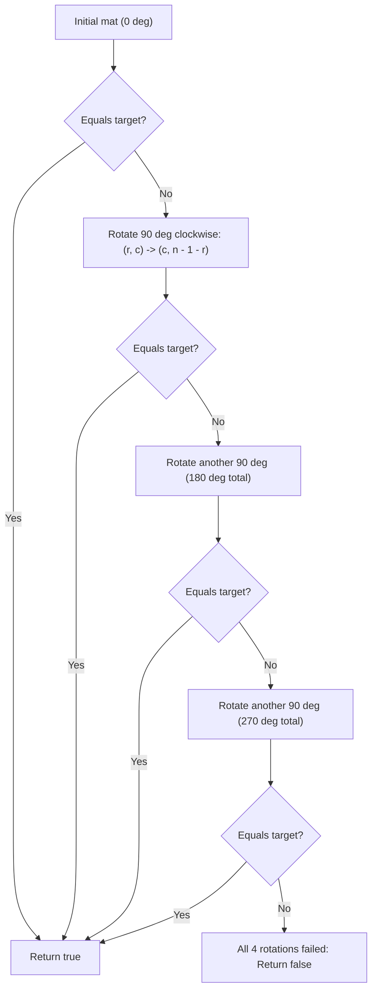

# Guided Example: Determine Whether Matrix Can Be Obtained By Rotation

We trace the cyclic orthogonal group rotations of an $n \times n$ binary matrix to determine whether it can match a target matrix:

- **Input:**
  $$\text{mat} = \begin{pmatrix} 0 & 1 \\ 1 & 0 \end{pmatrix}, \quad \text{target} = \begin{pmatrix} 1 & 0 \\ 0 & 1 \end{pmatrix}$$
- **Required Output:** `true`

This instance demonstrates generating successive $90^\circ$ clockwise matrix rotations through coordinate mapping, evaluating cell-by-cell matrix equality at each of the 4 cyclic orientations ($0^\circ, 90^\circ, 180^\circ, 270^\circ$), and terminating with `true` upon finding a match.

---

## 1. Instance & Teaching Goal

We are given two $n \times n$ binary matrices `mat` and `target`. We must determine if `mat` can be rotated in $90^\circ$ increments to become identical to `target`.

For $\text{mat} = \begin{pmatrix} 0 & 1 \\ 1 & 0 \end{pmatrix}$ and $\text{target} = \begin{pmatrix} 1 & 0 \\ 0 & 1 \end{pmatrix}$ ($n = 2$):
1. **$0^\circ$ Rotation (Original Matrix):**
   $$\begin{pmatrix} 0 & 1 \\ 1 & 0 \end{pmatrix} \neq \begin{pmatrix} 1 & 0 \\ 0 & 1 \end{pmatrix} \quad (\text{Mismatch at } (0, 0))$$
2. **$90^\circ$ Clockwise Rotation:**
   - Cell $(0, 0) = 0 \to (0, 1)$
   - Cell $(0, 1) = 1 \to (1, 1)$
   - Cell $(1, 0) = 1 \to (0, 0)$
   - Cell $(1, 1) = 0 \to (1, 0)$
   - Resulting matrix:
     $$\begin{pmatrix} 1 & 0 \\ 0 & 1 \end{pmatrix} == \text{target} \quad (\text{Exact Match!})$$
- A valid match is identified at $90^\circ$, returning `true`.

The teaching goal is to understand **discrete coordinate transformations in the cyclic group $\mathbb{Z}_4$**:
1. Deriving the 2D coordinate transformation $(r, c) \mapsto (c, n - 1 - r)$ for a $90^\circ$ clockwise rotation.
2. Understanding that 4 rotations form a complete closed orbit ($360^\circ \equiv 0^\circ$).
3. Tracking 4 orientation equality flags simultaneously or rotating iteratively up to 3 times.

---

## 2. Conceptual Foundation & Invariants

### Cyclic Orthogonal Rotation Group Theorem

> **Cyclic Orthogonal Rotation Group Theorem.**
> 1. *Coordinate Mapping Invariant:* Rotating an $n \times n$ matrix $M$ clockwise by $90^\circ$ maps the cell at coordinates $(r, c)$ to:
>    $$\rho(r, c) = (c, \; n - 1 - r)$$
> 2. *Cyclic Orbit Closure:* The rotation operation $\rho$ generates the cyclic group $\mathbb{Z}_4$:
>    - $\rho^0(r, c) = (r, c)$ ($0^\circ$)
>    - $\rho^1(r, c) = (c, n - 1 - r)$ ($90^\circ$)
>    - $\rho^2(r, c) = (n - 1 - r, n - 1 - c)$ ($180^\circ$)
>    - $\rho^3(r, c) = (n - 1 - c, r)$ ($270^\circ$)
>    - $\rho^4(r, c) = (r, c)$ ($360^\circ \equiv 0^\circ$)
> 3. *Equivalence Predicate:* The matrix `mat` can produce `target` if and only if there exists $k \in \{0, 1, 2, 3\}$ such that:
>    $$\forall r, c \in \{0, \dots, n-1\}, \quad \text{mat}[\rho^{-k}(r, c)] == \text{target}[r][c]$$
> 4. *Complexity:* Testing equality for a fixed orientation requires comparing $n^2$ cells. Evaluating all 4 rotations takes at most $4n^2 = \mathcal{O}(n^2)$ time and $\mathcal{O}(1)$ auxiliary space if checking in-place.

---

## 3. Step-by-Step Worked Execution

We trace the comparison between `mat` and `target` for $n = 2$:

---

### Step 1: Evaluate $0^\circ$ Orientation
- Source matrix:
  $$\text{mat} = \begin{pmatrix} 0 & 1 \\ 1 & 0 \end{pmatrix}$$
- Target matrix:
  $$\text{target} = \begin{pmatrix} 1 & 0 \\ 0 & 1 \end{pmatrix}$$
- Compare cells:
  - $(0, 0)$: $\text{mat}[0][0] = 0 \neq \text{target}[0][0] = 1$ (Mismatch).
- The $0^\circ$ orientation is invalid.

---

### Step 2: Apply $90^\circ$ Clockwise Rotation
Compute the transformed matrix $M^{(1)}$ using $(r', c') = (c, n - 1 - r)$ where $n = 2$:
- $(r=0, c=0) \implies (0, 2 - 1 - 0) = (0, 1)$: $M^{(1)}[0][1] = \text{mat}[0][0] = 0$.
- $(r=0, c=1) \implies (1, 2 - 1 - 0) = (1, 1)$: $M^{(1)}[1][1] = \text{mat}[0][1] = 1$.
- $(r=1, c=0) \implies (0, 2 - 1 - 1) = (0, 0)$: $M^{(1)}[0][0] = \text{mat}[1][0] = 1$.
- $(r=1, c=1) \implies (1, 2 - 1 - 1) = (1, 0)$: $M^{(1)}[1][0] = \text{mat}[1][1] = 0$.
- Transformed matrix:
  $$M^{(1)} = \begin{pmatrix} 1 & 0 \\ 0 & 1 \end{pmatrix}$$

---

### Step 3: Compare $90^\circ$ Matrix with Target
- Cell $(0, 0)$: $M^{(1)}[0][0] = 1 == \text{target}[0][0] = 1$ (Match).
- Cell $(0, 1)$: $M^{(1)}[0][1] = 0 == \text{target}[0][1] = 0$ (Match).
- Cell $(1, 0)$: $M^{(1)}[1][0] = 0 == \text{target}[1][0] = 0$ (Match).
- Cell $(1, 1)$: $M^{(1)}[1][1] = 1 == \text{target}[1][1] = 1$ (Match).
- All 4 cells match identically!
- Conclusion: Target reached in 1 rotation ($90^\circ$). Output is `true`.

---

## 4. Complete Execution Trace

| Orientation | Angle | Matrix Form | Comparison with Target | Match Found? | Action |
|:---:|:---:|:---:|:---:|:---:|:---:|
| $k = 0$ | $0^\circ$ | $\begin{pmatrix} 0 & 1 \\ 1 & 0 \end{pmatrix}$ | $(0, 0): 0 \neq 1$ | No | Rotate $90^\circ$ |
| $k = 1$ | $90^\circ$ | $\begin{pmatrix} 1 & 0 \\ 0 & 1 \end{pmatrix}$ | All 4 cells identical | **Yes** | **Return `true`** |
| $k = 2$ | $180^\circ$ | Unneeded | - | - | Pruned |
| $k = 3$ | $270^\circ$ | Unneeded | - | - | Pruned |

---

## 5. Algorithmic Correctness

**Soundness.** Rotating a 2D matrix by applying $(r, c) \mapsto (c, n - 1 - r)$ implements an exact Euclidean $90^\circ$ clockwise rotation. When an orientation matches `target` at every coordinate, the matrices are identical.

**Completeness.** Since four $90^\circ$ rotations cover all elements of the cyclic rotation group $\mathbb{Z}_4$, testing all 4 orientations evaluates the entire reachable orbit. If none of the 4 matches, no sequence of valid rotations can yield `target`.

---

## 6. Traps This Instance Exposes

- **Reflections vs Rotations:** Transposing a matrix or reversing rows alone represents a reflection (mirroring), not a pure rotation. A rotation requires both transposing and reversing rows ($M \mapsto M^T$ followed by reversing each row).
- **Coordinate Transformation Offsets:** The destination row is $c$ and destination column is $n - 1 - r$. Swapping these or omitting the $-1$ creates indexing errors.
- **Early Termination:** As soon as any rotation matches all $n^2$ cells, the algorithm can terminate immediately with `true` without completing all 4 cycles.

---

## 7. Complexity Derivation

- **Time Complexity:** $\mathcal{O}(n^2)$, where $n$ is the dimension of the matrix. We perform at most 4 rotation checks, each taking $\mathcal{O}(n^2)$ cell comparisons.
- **Auxiliary Space Complexity:** $\mathcal{O}(1)$ if comparing directly via coordinate index formulas, or $\mathcal{O}(n^2)$ if storing the rotated matrix buffer.
