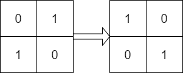
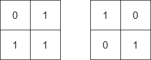

## Description

Given two `n x n` binary matrices `mat` and `target`, return `true`* if it is possible to make *`mat`* equal to *`target`* by **rotating** *`mat`* in **90-degree increments**, or *`false`* otherwise.*
### Function Contract

- `n`: Input parameter.
- Returns expected result.

### Examples
#### Example 1

- **Input:** $mat = [[0,1],[1,0]], target = [[1,0],[0,1]]$
- **Output:** `true`
- **Explanation:** We can rotate mat 90 degrees clockwise to make mat equal target.
#### Example 2

- **Input:** $mat = [[0,1],[1,1]], target = [[1,0],[0,1]]$
- **Output:** `false`
- **Explanation:** It is impossible to make mat equal to target by rotating mat.
#### Example 3

- **Input:** $mat = [[0,0,0],[0,1,0],[1,1,1]], target = [[1,1,1],[0,1,0],[0,0,0]]$
- **Output:** `true`
- **Explanation:** We can rotate mat 90 degrees clockwise two times to make mat equal target.
### Constraints

- $n = \text{mat.length} = \text{target.length}$

- $n = \text{mat}[i].length = \text{target}[i].length$

- $1 \le n \le 10$

- $\text{mat}[i][j]$ and $\text{target}[i][j]$ are either `0` or `1`.