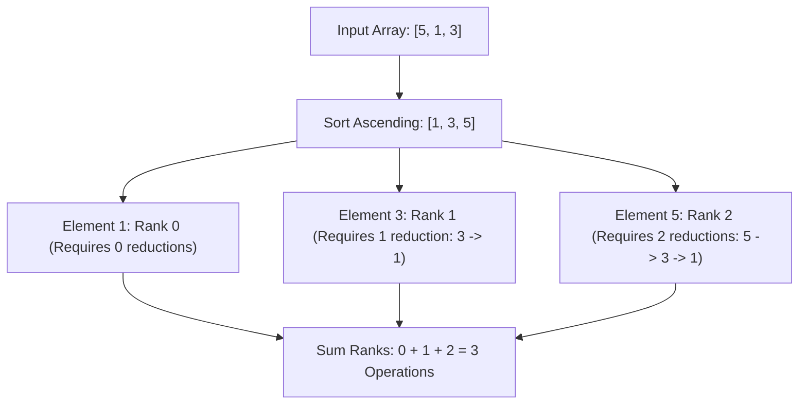

# Guided Example: Reduction Operations to Make the Array Elements Equal

We trace the value sorting, distinct rank aggregation, and reduction step summation on a representative array instance:

- **Input:** `nums = [5, 1, 3]`
- **Required Output:** `3`

This instance demonstrates sorting the array ascending, tracking distinct strictly increasing value thresholds, observing how each element must step down through every intermediate lower distinct value to reach the global minimum, and computing the total reduction operations in a single pass.

---

## 1. Instance & Teaching Goal

We are given an integer array `nums`. In one reduction operation:
1. Find the largest value in `nums`, say `largest`.
2. Find the strictly next-largest value in `nums`, say `next_largest`.
3. Replace all elements equal to `largest` with `next_largest` (one reduction per element, or step-by-step reduction of the elements).
We must find the total number of operations required to make all elements in `nums` equal.

For `nums = [5, 1, 3]`:
- Step-by-step direct reduction:
  - Initial array: `[5, 1, 3]`. Largest is $5$, next-largest is $3$.
  - Operation 1: Reduce $5 \to 3$. Array becomes `[3, 1, 3]`.
  - Next state: Largest is $3$, next-largest is $1$.
  - Operation 2: Reduce first $3 \to 1$. Array becomes `[1, 1, 3]`.
  - Operation 3: Reduce second $3 \to 1$. Array becomes `[1, 1, 1]`.
  - All elements are now equal. Total operations: $3$.

The teaching goal is to understand **telescoping rank aggregation**:
1. Why simulating operations element-by-element leads to a quadratic bottleneck.
2. How sorting ascending exposes the discrete rank $r$ of each element.
3. Why an element at distinct rank $r$ must undergo exactly $r$ reductions to reach the rank-$0$ minimum, yielding $\text{Total} = \sum_{i=0}^{n-1} \text{rank}(nums[i])$.

---

## 2. Conceptual Foundation & Invariants

### Strict Rank Aggregation & Telescoping Reduction Theorem

> **Strict Rank Aggregation & Telescoping Reduction Theorem.**
> 1. *Distinct Value Hierarchy:* Let the unique values of `nums` sorted in strictly increasing order be:
>    $$u_0 < u_1 < u_2 < \dots < u_{k-1}$$
>    The rank of any value $x \in \text{nums}$ is defined as its 0-indexed position in this hierarchy:
>    $$\text{rank}(x) = j \iff x = u_j$$
> 2. *Telescoping Descent Invariant:* By definition of the reduction operation, any element with value $u_j$ ($j > 0$) must be replaced by $u_{j-1}$ before it can ever be reduced further. It therefore passes through every intermediate value $u_{j-1}, u_{j-2}, \dots, u_0$ sequentially:
>    $$u_j \to u_{j-1} \to u_{j-2} \to \dots \to u_0$$
>    Each transition requires exactly one operation per element. Hence, every element equal to $u_j$ contributes exactly $j$ operations to the global total.
> 3. *Closed-Form Summation:*
>    $$\text{Total Operations} = \sum_{i=0}^{n-1} \text{rank}(nums[i])$$
>    When the array is sorted ascending ($a_0 \le a_1 \le \dots \le a_{n-1}$), the rank increments by 1 at each index where $a_i > a_{i-1}$.
> 4. *Complexity:* Sorting requires $\mathcal{O}(n \log n)$ time. Aggregating the ranks in a single linear pass takes $\mathcal{O}(n)$ time and $\mathcal{O}(1)$ auxiliary space.

---

## 3. Step-by-Step Worked Execution

We trace the sorted array accumulation for `nums = [5, 1, 3]`:

---

### Step 1: Sort the Array Ascending
- Original array: `[5, 1, 3]`.
- Sorted array: `a = [1, 3, 5]`.
- Length: $n = 3$.
- Initialize state variables:
  - Running distinct rank: $\text{rank} = 0$.
  - Total reduction operations: $\text{total\_ops} = 0$.

---

### Step 2: Evaluate Index 0 ($a[0] = 1$)
- Smallest element sets the base rank:
  $$\text{rank} = 0$$
- Add to total:
  $$\text{total\_ops} = 0 + 0 = 0$$

---

### Step 3: Evaluate Index 1 ($a[1] = 3$)
- Compare with predecessor: $a[1] = 3 > a[0] = 1$.
- A new strictly larger distinct value is reached $\implies$ increment rank:
  $$\text{rank} = 0 + 1 = 1$$
- Add to total:
  $$\text{total\_ops} = 0 + 1 = 1$$

---

### Step 4: Evaluate Index 2 ($a[2] = 5$)
- Compare with predecessor: $a[2] = 5 > a[1] = 3$.
- A new strictly larger distinct value is reached $\implies$ increment rank:
  $$\text{rank} = 1 + 1 = 2$$
- Add to total:
  $$\text{total\_ops} = 1 + 2 = 3$$

---

### Step 5: Final Result
- All elements have been processed.
- Total reduction operations required: $3$.

---

## 4. Complete Execution Trace

| Index $i$ | Sorted Value $a[i]$ | Previous Value $a[i-1]$ | $a[i] > a[i-1]$? | Distinct Rank $r$ | Operations Added | Cumulative Operations |
|:---:|:---:|:---:|:---:|:---:|:---:|:---:|
| 0 | 1 | None | Base element | 0 | 0 | 0 |
| 1 | 3 | 1 | **Yes** ($3 > 1$) | 1 | 1 | 1 |
| 2 | 5 | 3 | **Yes** ($5 > 3$) | 2 | 2 | **3** |

---

## 5. Algorithmic Correctness

**Soundness.** Every reduction operation defined in the problem lowers an element from its current value to the next strictly smaller existing value. By conservation of intermediate distinct values, an element of rank $r$ must traverse exactly $r$ stages before reaching the minimum value.

**Completeness.** Since the array is sorted, every step-up in value between adjacent elements $a_i > a_{i-1}$ corresponds to entering the next distinct value tier. No intermediate rank is skipped or double-counted.

---

## 6. Traps This Instance Exposes

- **Simulating Replacement Step-by-Step:** Tracking the maximum dynamically and repeatedly updating occurrences in the array takes $\mathcal{O}(n \cdot k)$ or $\mathcal{O}(n^2)$ time, which results in a Time Limit Exceeded error for $n = 5 \times 10^4$.
- **Ignoring Duplicate Elements:** Multiple elements with the same value (e.g. `[1, 3, 3, 5]`) share the exact same rank. Only strictly greater elements ($a_i > a_{i-1}$) cause the rank to increment. Duplicate elements contribute the *same* rank value to the total.
- **Identical Elements Base Case:** If all elements are equal (e.g. `[1, 1, 1]`), no step increases occur, rank remains 0 throughout, and the algorithm correctly returns 0 operations.

---

## 7. Complexity Derivation

- **Time Complexity:** $\mathcal{O}(n \log n)$, dominated by sorting the array of length $n$. The subsequent aggregation pass iterates through the array once in $\mathcal{O}(n)$ time.
- **Auxiliary Space Complexity:** $\mathcal{O}(1)$ beyond the memory used by standard sorting.
