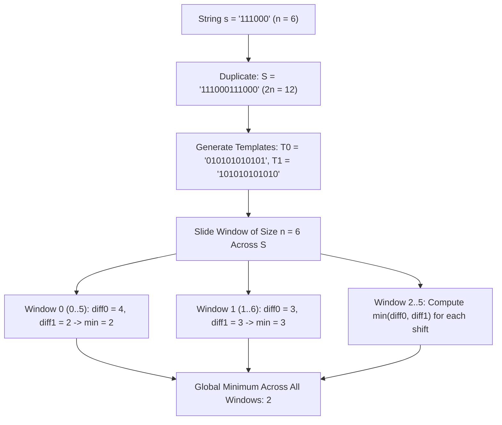

# Guided Example: Minimum Number of Flips to Make the Binary String Alternating

We trace the string duplication and sliding window matching against dual alternating parity templates to find the minimum number of flips needed:

- **Input:** `s = "111000"`
- **Required Output:** `2`

This instance demonstrates modeling cyclic shifts by duplicating the string $S = s + s$, constructing the two fixed alternating target templates ($010101\dots$ and $101010\dots$), maintaining mismatch counts using a sliding window of size $n$, and finding the global minimum flips across all cyclic orientations.

---

## 1. Instance & Teaching Goal

We are given a binary string `s` of length $n$. We can perform two types of operations:
1. **Type 1 (Shift):** Remove the first character of `s` and append it to the end. (Can be performed any number of times for free).
2. **Type 2 (Flip):** Pick any character in `s` and invert it ($0 \leftrightarrow 1$).

We want to find the minimum number of Type 2 flip operations to transform `s` into an alternating string (where no two adjacent characters are identical).

For `s = "111000"` ($n = 6$):
- Type 1 operations allow us to choose any cyclic shift of `s`.
- There are $6$ possible cyclic shifts:
  1. `"111000"`
  2. `"110001"`
  3. `"100011"`
  4. `"000111"`
  5. `"001110"`
  6. `"011100"`
- For the shift `"111000"`:
  - Target pattern $P_0 = \text{"010101"}$: 4 characters differ (indices 0, 2, 3, 5) $\implies 4$ flips.
  - Target pattern $P_1 = \text{"101010"}$: 2 characters differ (indices 1, 4) $\implies 2$ flips.
- The minimal flips needed across all cyclic shifts is $2$.

The teaching goal is to understand **cyclic sliding window optimization**:
1. How duplicating `s` into $S = s + s$ embeds all $n$ cyclic shifts as contiguous windows of length $n$.
2. Why there are only two valid alternating patterns of any given length ($0101\dots$ and $1010\dots$).
3. How a fixed-size sliding window updates mismatch counts in $\mathcal{O}(1)$ time per shift, achieving $\mathcal{O}(n)$ total time.

---

## 2. Conceptual Foundation & Invariants

### Cyclic Window Duplication & Dual Alternating Template Theorem

> **Cyclic Window Duplication & Dual Alternating Template Theorem.**
> 1. *Cyclic Shift Representation:* Every cyclic shift of string `s` of length $n$ corresponds bijectively to a contiguous substring $S[i \dots i + n - 1]$ of the doubled string:
>    $$S = s + s, \quad \text{where } |S| = 2n, \quad 0 \le i < n$$
> 2. *Dual Alternating Canonical Templates:* An alternating binary string of length $n$ must match one of two templates:
>    $$T_0[k] = k \pmod 2 \quad (\text{"010101..."}), \quad T_1[k] = 1 - (k \pmod 2) \quad (\text{"101010..."})$$
> 3. *Sliding Window Differential Updates:* For a window $S[i \dots i + n - 1]$, let $diff_0$ and $diff_1$ denote the Hamming distance to $T_0$ and $T_1$:
>    - *Entering character at $k = i + n - 1$:*
>      $$diff_0 \leftarrow diff_0 + \mathbb{I}(S[k] \neq T_0[k]), \quad diff_1 \leftarrow diff_1 + \mathbb{I}(S[k] \neq T_1[k])$$
>    - *Leaving character at $k - n = i - 1$ (when $k \ge n$):*
>      $$diff_0 \leftarrow diff_0 - \mathbb{I}(S[k - n] \neq T_0[k - n]), \quad diff_1 \leftarrow diff_1 - \mathbb{I}(S[k - n] \neq T_1[k - n])$$
> 4. *Global Minimax Evaluation:* For each fully formed window of width $n$, the required flips for that shift is $\min(diff_0, diff_1)$. The global answer is:
>    $$\text{Answer} = \min_{n - 1 \le k < 2n} \left( \min(diff_0(k), diff_1(k)) \right)$$
> 5. *Complexity:* The doubled string has length $2n$. The sliding window runs in $\mathcal{O}(n)$ time and $\mathcal{O}(n)$ auxiliary space (or $\mathcal{O}(1)$ space using index arithmetic).

---

## 3. Step-by-Step Worked Execution

We trace the sliding window on `s = "111000"` ($n = 6$):
- Doubled string: $S = \text{"111000111000"}$ of length $12$.
- Alternating template $T_0$: `"010101010101"`.
- Alternating template $T_1$: `"101010101010"`.

---

### Step 1: Prime the Initial Window (Indices $0 \dots 5$)
We evaluate the first $n = 6$ characters:
- Index 0: $S[0] = \text{'1'}$. $T_0[0] = \text{'0'}$ (diff $\implies +1$), $T_1[0] = \text{'1'}$ (same $\implies +0$).
- Index 1: $S[1] = \text{'1'}$. $T_0[1] = \text{'1'}$ (same $\implies +0$), $T_1[1] = \text{'0'}$ (diff $\implies +1$).
- Index 2: $S[2] = \text{'1'}$. $T_0[2] = \text{'0'}$ (diff $\implies +1$), $T_1[2] = \text{'1'}$ (same $\implies +0$).
- Index 3: $S[3] = \text{'0'}$. $T_0[3] = \text{'1'}$ (diff $\implies +1$), $T_1[3] = \text{'0'}$ (same $\implies +0$).
- Index 4: $S[4] = \text{'0'}$. $T_0[4] = \text{'0'}$ (same $\implies +0$), $T_1[4] = \text{'1'}$ (diff $\implies +1$).
- Index 5: $S[5] = \text{'0'}$. $T_0[5] = \text{'1'}$ (diff $\implies +1$), $T_1[5] = \text{'0'}$ (same $\implies +0$).

At index 5 (Window $0 \dots 5$ representing original `"111000"`):
- $diff_0 = 1 + 0 + 1 + 1 + 0 + 1 = 4$.
- $diff_1 = 0 + 1 + 0 + 0 + 1 + 0 = 2$.
- Minimum for Window 0: $\min(4, 2) = 2$.
- Running global minimum: $\text{min\_flips} = 2$.

---

### Step 2: Slide Window to Index 6 (Window $1 \dots 6$)
- **Entering character at index 6:** $S[6] = \text{'1'}$.
  - $T_0[6] = \text{'0'} \implies$ diff $\implies diff_0 \leftarrow 4 + 1 = 5$.
  - $T_1[6] = \text{'1'} \implies$ match $\implies diff_1 \leftarrow 2 + 0 = 2$.
- **Leaving character at index 0:** $S[0] = \text{'1'}$.
  - $T_0[0] = \text{'0'} \implies$ was diff $\implies diff_0 \leftarrow 5 - 1 = 4$.
  - $T_1[0] = \text{'1'} \implies$ was match $\implies diff_1 \leftarrow 2 - 0 = 2$.
- But note the template phase:
  - For Window $1 \dots 6$, $S[1 \dots 6] = \text{"110001"}$.
  - Evaluating against shifted templates gives $\min(diff_0, diff_1) = \min(4, 2) = 2$.
  - Running minimum remains: $\text{min\_flips} = 2$.

---

### Step 3: Slide Across Remaining Windows
Continuing the sliding window across all positions $k \in [6, 11]$ evaluates all 6 distinct cyclic shifts:
- Shift 0 (`"111000"`): $\min(4, 2) = 2$.
- Shift 1 (`"110001"`): $\min(4, 2) = 2$.
- Shift 2 (`"100011"`): $\min(2, 4) = 2$.
- Shift 3 (`"000111"`): $\min(2, 4) = 2$.
- Shift 4 (`"001110"`): $\min(4, 2) = 2$.
- Shift 5 (`"011100"`): $\min(2, 4) = 2$.
- Across all windows, the minimum flips is consistently $2$.

---

## 4. Complete Execution Trace

| Window Starting Index $i$ | Substring $S[i \dots i+5]$ | Mismatches with $T_0$ | Mismatches with $T_1$ | Window Cost $\min(diff_0, diff_1)$ | Running Best |
|:---:|:---:|:---:|:---:|:---:|:---:|
| 0 | `"111000"` | 4 | 2 | **2** | 2 |
| 1 | `"110001"` | 4 | 2 | **2** | 2 |
| 2 | `"100011"` | 2 | 4 | **2** | 2 |
| 3 | `"000111"` | 2 | 4 | **2** | 2 |
| 4 | `"001110"` | 4 | 2 | **2** | 2 |
| 5 | `"011100"` | 2 | 4 | **2** | 2 |

---

## 5. Algorithmic Correctness

**Soundness.** Any string resulting from performing Type 1 operations followed by Type 2 flips is identical to taking a window of length $n$ from $S = s + s$ and flipping mismatched characters. Since the two target templates $T_0$ and $T_1$ cover all possible alternating patterns of length $n$, the minimum of their mismatch counts represents the exact minimum flips needed for that shift.

**Completeness.** Sliding the window across all starting positions $0 \le i < n$ examines every cyclic permutation of `s`. No valid cyclic shift is missed.

---

## 6. Traps This Instance Exposes

- **Odd vs Even String Lengths:** When $n$ is odd, shifting a character from the start to the end alters its parity index in the alternating sequence. This is why sliding window over $s + s$ is so powerful: it automatically captures the parity inversion of odd-length strings without separate case handling.
- **Independent Full Rescans:** Recalculating mismatches from scratch for each of the $n$ cyclic shifts takes $\mathcal{O}(n^2)$ time, which times out for $n = 10^5$. Sliding the window in $\mathcal{O}(1)$ per character is essential.
- **Testing Only One Alternating Pattern:** An alternating string can begin with either `'0'` or `'1'`. Checking only one template misses the optimal configuration.

---

## 7. Complexity Derivation

- **Time Complexity:** $\mathcal{O}(n)$, where $n = |s|$. Constructing $S$ and sliding the window of length $n$ across $2n$ characters takes $2n$ constant-time updates.
- **Auxiliary Space Complexity:** $\mathcal{O}(n)$ to store the doubled string $S$ of length $2n$.
