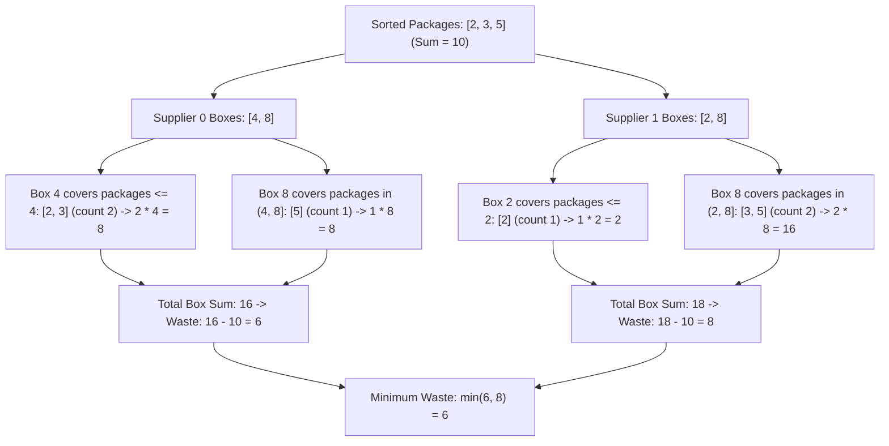

# Guided Example: Minimum Space Wasted From Packaging

We trace the package sorting, supplier box sorting, and binary search interval partition on representative packaging instances to minimize wasted box space:

- **Input:** `packages = [2, 3, 5]`, `boxes = [[4, 8], [2, 8]]`
- **Required Output:** `6`

This instance demonstrates sorting package sizes, evaluating candidate suppliers independently, partitioning packages into contiguous intervals using binary search (`bisect_right`), accumulating total box capacity, subtracting the invariant total package size, and selecting the minimal wasted space modulo $10^9 + 7$.

---

## 1. Instance & Teaching Goal

We have $n$ packages and $m$ suppliers. Each package must be packed into a box from the chosen supplier such that $\text{box size} \ge \text{package size}$.
- The space wasted for one package is $\text{box} - \text{package}$.
- We must choose a single supplier to pack all $n$ packages.
- Total wasted space for a supplier is:
  $$\sum_{i=0}^{n-1} (b_i - p_i) = \left(\sum_{i=0}^{n-1} b_i\right) - \left(\sum_{i=0}^{n-1} p_i\right)$$
- Notice that $\sum p_i$ is a fixed invariant across all suppliers. Minimizing wasted space is mathematically equivalent to **minimizing the sum of box capacities used**.

For `packages = [2, 3, 5]` and `boxes = [[4, 8], [2, 8]]`:
- Sum of packages: $S_P = 2 + 3 + 5 = 10$.
- Largest package: $5$.
- **Supplier 0:** Boxes `[4, 8]`.
  - Largest box is $8 \ge 5$ (Feasible).
  - Box 4 fits packages $\le 4$: packages $2$ and $3$ ($2$ packages). Capacity: $2 \times 4 = 8$.
  - Box 8 fits packages in $(4, 8]$: package $5$ ($1$ package). Capacity: $1 \times 8 = 8$.
  - Total box capacity: $8 + 8 = 16$.
  - Wasted space: $16 - 10 = 6$.
- **Supplier 1:** Boxes `[2, 8]`.
  - Largest box is $8 \ge 5$ (Feasible).
  - Box 2 fits packages $\le 2$: package $2$ ($1$ package). Capacity: $1 \times 2 = 2$.
  - Box 8 fits packages in $(2, 8]$: packages $3$ and $5$ ($2$ packages). Capacity: $2 \times 8 = 16$.
  - Total box capacity: $2 + 16 = 18$.
  - Wasted space: $18 - 10 = 8$.
- The minimal wasted space is $\min(6, 8) = 6$.

The teaching goal is to understand **interval-based binary search aggregation**:
1. Decoupling the problem into computing total box volume minus fixed package volume.
2. Sorting packages ascending so that each box size covers a contiguous prefix slice of unassigned packages.
3. Using bisection (`bisect_right`) to find slice boundaries in $\mathcal{O}(\log n)$ rather than scanning packages linearly.

---

## 2. Conceptual Foundation & Invariants

### Disjoint Interval Bisection & Monotonic Box Allocation Theorem

> **Disjoint Interval Bisection & Monotonic Box Allocation Theorem.**
> 1. *Additive Decoupling Invariant:* For any valid packaging assignment:
>    $$\text{Wasted Space} = \sum_{i=0}^{n-1} b_i - \sum_{i=0}^{n-1} p_i = C_{\text{boxes}} - S_P$$
>    Since $S_P = \sum p_i$ is constant, minimizing waste is identical to minimizing $C_{\text{boxes}}$.
> 2. *Contiguous Prefix Partition:* Let packages be sorted ascending: $P[0] \le P[1] \le \dots \le P[n-1]$. Let a supplier's boxes be sorted ascending: $B[0] < B[1] < \dots < B[k-1]$.
>    - If $B[k-1] < P[n-1]$, the supplier cannot fit the largest package; discard the supplier.
>    - The packages that fit into $B[j]$ but not into $B[j-1]$ form a contiguous half-open slice $[idx_{j-1}, idx_j)$, where:
>      $$idx_j = \text{bisect\_right}(P, B[j])$$
> 3. *Capacity Accumulation:* Box size $B[j]$ is assigned to exactly $c_j = idx_j - idx_{j-1}$ packages. The capacity contributed is:
>    $$C_j = c_j \cdot B[j]$$
>    Summing over all boxes yields $C_{\text{boxes}} = \sum_{j=0}^{k-1} c_j \cdot B[j]$.
> 4. *Complexity:* Let $N$ be the number of packages and $M$ be the total number of boxes across all suppliers. Sorting packages takes $\mathcal{O}(N \log N)$. Sorting boxes takes $\mathcal{O}(M \log M)$. Bisection queries take $\mathcal{O}(M \log N)$. Total time is $\mathcal{O}((N + M) \log N)$, with $\mathcal{O}(1)$ auxiliary space beyond sorting.

---

## 3. Step-by-Step Worked Execution

We trace the bisection evaluation on `packages = [2, 3, 5]` and suppliers `boxes = [[4, 8], [2, 8]]`:

---

### Step 1: Precompute Package Invariants
- Sort packages: $P = [2, 3, 5]$.
- Total package sum:
  $$S_P = 2 + 3 + 5 = 10$$
- Number of packages: $n = 3$.
- Maximum package size: $P[2] = 5$.
- Initialize global best capacity: $C_{\min} = \infty$.

---

### Step 2: Evaluate Supplier 0 (`boxes[0] = [4, 8]`)
- Sort boxes: $B = [4, 8]$.
- Check feasibility: Largest box $8 \ge P[2] = 5$ (Feasible).
- Initialize: $idx_{\text{prev}} = 0$, supplier capacity $C_0 = 0$.

#### Box 0 ($B[0] = 4$):
- Find upper bound: $idx_0 = \text{bisect\_right}(P, 4)$.
  - $P[0] = 2 \le 4$, $P[1] = 3 \le 4$, $P[2] = 5 > 4$.
  - First index $> 4$ is $2 \implies idx_0 = 2$.
- Number of packages covered: $c_0 = 2 - 0 = 2$ (packages $P[0 \dots 1] = [2, 3]$).
- Capacity added: $c_0 \times B[0] = 2 \times 4 = 8$.
- Update: $idx_{\text{prev}} = 2$, $C_0 = 8$.

#### Box 1 ($B[1] = 8$):
- Find upper bound: $idx_1 = \text{bisect\_right}(P, 8) = 3$.
- Number of packages covered: $c_1 = 3 - 2 = 1$ (package $P[2] = [5]$).
- Capacity added: $c_1 \times B[1] = 1 \times 8 = 8$.
- Update: $idx_{\text{prev}} = 3$, $C_0 = 8 + 8 = 16$.

- All 3 packages packed. Wasted space:
  $$W_0 = C_0 - S_P = 16 - 10 = 6$$
- Update global best: $C_{\min} = \min(\infty, 16) = 16$.

---

### Step 3: Evaluate Supplier 1 (`boxes[1] = [2, 8]`)
- Sort boxes: $B = [2, 8]$.
- Feasibility check: Largest box $8 \ge 5$ (Feasible).
- Initialize: $idx_{\text{prev}} = 0$, supplier capacity $C_1 = 0$.

#### Box 0 ($B[0] = 2$):
- $idx_0 = \text{bisect\_right}(P, 2) = 1$.
- Packages covered: $c_0 = 1 - 0 = 1$ (package $P[0] = [2]$).
- Capacity added: $1 \times 2 = 2$.
- Update: $idx_{\text{prev}} = 1$, $C_1 = 2$.

#### Box 1 ($B[1] = 8$):
- $idx_1 = \text{bisect\_right}(P, 8) = 3$.
- Packages covered: $c_1 = 3 - 1 = 2$ (packages $P[1 \dots 2] = [3, 5]$).
- Capacity added: $2 \times 8 = 16$.
- Update: $idx_{\text{prev}} = 3$, $C_1 = 2 + 16 = 18$.

- Wasted space:
  $$W_1 = C_1 - S_P = 18 - 10 = 8$$
- Update global best: $C_{\min} = \min(16, 18) = 16$.

---

### Step 4: Result Extraction
- Minimum total box capacity: $16$.
- Minimal wasted space:
  $$W = 16 - 10 = 6$$
- Taking modulo $10^9 + 7$: $6 \pmod{10^9 + 7} = 6$.

---

## 4. Complete Execution Trace

| Supplier | Box Size $B[j]$ | Index Range $[idx_{\text{prev}}, idx_{\text{cur}})$ | Packages Included | Box Capacity Added | Running Box Total | Total Wasted Space |
|:---:|:---:|:---:|:---:|:---:|:---:|:---:|
| 0 | 4 | $[0, 2)$ | `[2, 3]` | $2 \times 4 = 8$ | 8 | - |
| 0 | 8 | $[2, 3)$ | `[5]` | $1 \times 8 = 8$ | 16 | **$16 - 10 = 6$** |
| 1 | 2 | $[0, 1)$ | `[2]` | $1 \times 2 = 2$ | 2 | - |
| 1 | 8 | $[1, 3)$ | `[3, 5]` | $2 \times 8 = 16$ | 18 | **$18 - 10 = 8$** |
| **Optimal** | - | - | - | - | **16** | **$\min(6, 8) = \mathbf{6}$** |

---

## 5. Algorithmic Correctness

**Soundness.** Because packages are sorted, the condition $P[k] \le B[j]$ holds for all $k < idx_j$. Choosing the smallest available box that can fit each package minimizes individual wasted space greedily. The algebraic equality $\sum(b_i - p_i) = \sum b_i - \sum p_i$ guarantees that summing box volumes and subtracting package sums produces the exact total wasted space.

**Completeness.** Every supplier whose largest box satisfies $B_{\max} \ge P_{\max}$ is evaluated across its complete box roster. Suppliers incapable of fitting the largest package are correctly flagged and bypassed.

---

## 6. Traps This Instance Exposes

- **Linear Search Per Box:** Iterating through all packages for each box takes $\mathcal{O}(N)$ per box, yielding $\mathcal{O}(M \cdot N)$ total time, which causes Time Limit Exceeded when $N, M \approx 10^5$. Binary search (`bisect_right`) drops this to $\mathcal{O}(M \log N)$.
- **Modulo Reduction Order:** Minimization must occur on the raw integer values *before* applying modulo $10^9 + 7$. Applying modulo early could cause a numerically larger waste value (e.g. $10^9 + 8 \equiv 1$) to appear smaller than an optimal value (e.g. $6$).
- **Infeasible Suppliers:** If all suppliers fail the condition $B_{\max} \ge P_{\max}$, the algorithm must detect that no package assignment is possible and return $-1$.

---

## 7. Complexity Derivation

- **Time Complexity:** $\mathcal{O}((N + M) \log N + M \log M)$, where $N$ is the number of packages and $M = \sum |boxes[j]|$ is the total count of boxes across all suppliers. Sorting packages takes $\mathcal{O}(N \log N)$ and each of the $M$ boxes performs a binary search taking $\mathcal{O}(\log N)$.
- **Auxiliary Space Complexity:** $\mathcal{O}(1)$ beyond the storage required to sort the packages and boxes arrays in place.
