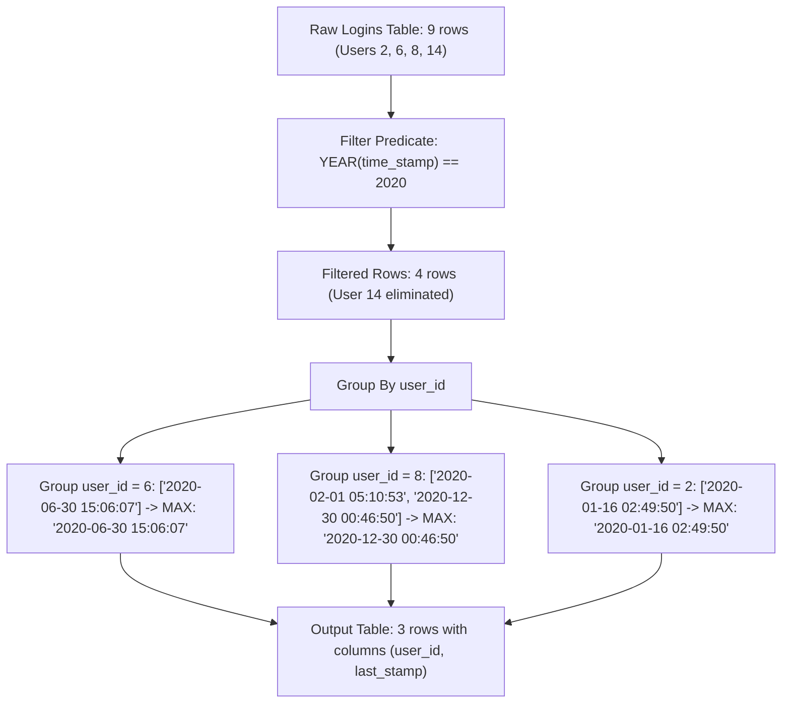

# Guided Example: The Latest Login in 2020

We trace the relational temporal filtering, cohort grouping, and maximum timestamp projection on a representative table of user login events:

- **Input:**
  $$\text{Logins} = \begin{array}{|c|c|}
  \hline
  \textbf{user\_id} & \textbf{time\_stamp} \\
  \hline
  6 & \text{2020-06-30 15:06:07} \\
  6 & \text{2021-04-21 14:06:06} \\
  6 & \text{2019-03-07 00:18:15} \\
  8 & \text{2020-02-01 05:10:53} \\
  8 & \text{2020-12-30 00:46:50} \\
  2 & \text{2020-01-16 02:49:50} \\
  2 & \text{2019-08-25 07:59:08} \\
  14 & \text{2019-07-14 09:00:00} \\
  14 & \text{2021-01-06 11:59:59} \\
  \hline
  \end{array}$$
- **Required Output:**
  $$\begin{array}{|c|c|}
  \hline
  \textbf{user\_id} & \textbf{last\_stamp} \\
  \hline
  6 & \text{2020-06-30 15:06:07} \\
  8 & \text{2020-12-30 00:46:50} \\
  2 & \text{2020-01-16 02:49:50} \\
  \hline
  \end{array}$$

This instance demonstrates restricting login records to the calendar year 2020, partitioning remaining rows by `user_id`, aggregating timestamps with the supremum operator (`MAX`), and naturally omitting users who logged in during other years but had no active session in 2020.

---

## 1. Instance & Teaching Goal

We are given a relational table `Logins` containing `user_id` and `time_stamp`. We must find the latest login timestamp in the year 2020 for every user who logged in during 2020, omitting any user without a 2020 login.

Examining our dataset:
- User 6: Logins in 2019, 2020, and 2021.
  - In 2020: `2020-06-30 15:06:07`. Latest 2020 login: `2020-06-30 15:06:07`.
- User 8: Logins in February 2020 and December 2020.
  - Both fall in 2020. Latest is `2020-12-30 00:46:50`.
- User 2: Logins in 2019 and 2020.
  - In 2020: `2020-01-16 02:49:50`. Latest 2020 login: `2020-01-16 02:49:50`.
- User 14: Logins in 2019 and 2021.
  - No records fall within 2020. User 14 must be completely omitted from the result.

The teaching goal is to understand **relational aggregation with temporal domain restrictions**:
1. Applying a row-level `WHERE` filter before aggregation to isolate the 2020 temporal window.
2. Grouping the filtered rows by `user_id` to form disjoint user equivalence classes.
3. Extracting the maximum timestamp (`MAX(time_stamp)`) per group as `last_stamp`.

---

## 2. Conceptual Foundation & Invariants

### Temporal Interval Filtering & Group-Level Supremum Theorem

> **Temporal Interval Filtering & Group-Level Supremum Theorem.**
> 1. *Temporal Domain Restriction:* Let $\mathcal{T}_{2020} = [\text{2020-01-01 00:00:00}, \; \text{2020-12-31 23:59:59}]$ denote the closed calendar interval for the year 2020. The selection predicate filters the raw relation:
>    $$\mathcal{R}_{2020} = \sigma_{t \in \mathcal{T}_{2020}}(\text{Logins}) = \{ (u, t) \in \text{Logins} \mid \text{YEAR}(t) = 2020 \}$$
> 2. *Equivalence Class Partitioning:* For each distinct user $u$, define their 2020 login cohort:
>    $$[u]_{2020} = \{ t \mid (u, t) \in \mathcal{R}_{2020} \}$$
> 3. *Supremum Aggregation:* For every non-empty cohort $[u]_{2020} \neq \emptyset$, the latest login timestamp is:
>    $$\text{last\_stamp}(u) = \max([u]_{2020})$$
> 4. *Null Cohort Elimination:* Any user $v$ whose entire activity lies outside 2020 yields $[v]_{2020} = \emptyset$. Relational `GROUP BY` operates strictly over rows in $\mathcal{R}_{2020}$, naturally excluding empty cohorts without requiring an extra `HAVING` clause.
> 5. *Complexity:* Filtering and grouping take $\mathcal{O}(N)$ time with hash-based aggregation, or $\mathcal{O}(N \log N)$ with index-based sorting, where $N$ is the number of rows in `Logins`. Auxiliary space is $\mathcal{O}(U)$, where $U$ is the number of distinct qualifying users.

---

## 3. Step-by-Step Worked Execution

We trace the relational algebra pipeline across the 9 source records:

---

### Step 1: Evaluate Selection Predicate on Each Row
Filter rows by testing whether `time_stamp` falls within calendar year 2020:
- Row 1: `(6, 2020-06-30 15:06:07)` $\implies$ Year is $2020$ (**Retained**)
- Row 2: `(6, 2021-04-21 14:06:06)` $\implies$ Year is $2021$ (*Discarded*)
- Row 3: `(6, 2019-03-07 00:18:15)` $\implies$ Year is $2019$ (*Discarded*)
- Row 4: `(8, 2020-02-01 05:10:53)` $\implies$ Year is $2020$ (**Retained**)
- Row 5: `(8, 2020-12-30 00:46:50)` $\implies$ Year is $2020$ (**Retained**)
- Row 6: `(2, 2020-01-16 02:49:50)` $\implies$ Year is $2020$ (**Retained**)
- Row 7: `(2, 2019-08-25 07:59:08)` $\implies$ Year is $2019$ (*Discarded*)
- Row 8: `(14, 2019-07-14 09:00:00)` $\implies$ Year is $2019$ (*Discarded*)
- Row 9: `(14, 2021-01-06 11:59:59)` $\implies$ Year is $2021$ (*Discarded*)

Filtered intermediate dataset $\mathcal{R}_{2020}$ contains 4 records:
- `(6, 2020-06-30 15:06:07)`
- `(8, 2020-02-01 05:10:53)`
- `(8, 2020-12-30 00:46:50)`
- `(2, 2020-01-16 02:49:50)`

---

### Step 2: Partition by `user_id` and Compute Maximum
For each cohort $[u]_{2020}$:
- **Cohort `user_id = 6`:**
  - Timestamps: `['2020-06-30 15:06:07']`
  - $\max = \text{'2020-06-30 15:06:07'}$
- **Cohort `user_id = 8`:**
  - Timestamps: `['2020-02-01 05:10:53', '2020-12-30 00:46:50']`
  - Comparing: `'2020-12-30 00:46:50' > '2020-02-01 05:10:53'`
  - $\max = \text{'2020-12-30 00:46:50'}$
- **Cohort `user_id = 2`:**
  - Timestamps: `['2020-01-16 02:49:50']`
  - $\max = \text{'2020-01-16 02:49:50'}$
- **User 14:**
  - No rows in $\mathcal{R}_{2020} \implies$ omitted.

---

### Step 3: Project Final Relation
Construct output columns `user_id` and `last_stamp`:
$$\begin{pmatrix} 6 & \text{'2020-06-30 15:06:07'} \\ 8 & \text{'2020-12-30 00:46:50'} \\ 2 & \text{'2020-01-16 02:49:50'} \end{pmatrix}$$

---

## 4. Complete Execution Trace

| `user_id` | Timestamp Tested | Year | Included in $\mathcal{R}_{2020}$? | User 2020 Timestamps | Group Maximum (`last_stamp`) | Final Inclusion |
|:---:|:---:|:---:|:---:|:---:|:---:|:---:|
| 6 | 2020-06-30 15:06:07 | 2020 | **Yes** | `['2020-06-30 15:06:07']` | `2020-06-30 15:06:07` | **Included** |
| 6 | 2021-04-21 14:06:06 | 2021 | No | - | - | - |
| 6 | 2019-03-07 00:18:15 | 2019 | No | - | - | - |
| 8 | 2020-02-01 05:10:53 | 2020 | **Yes** | `['2020-02-01 ...',` | - | - |
| 8 | 2020-12-30 00:46:50 | 2020 | **Yes** | `'2020-12-30 ...']` | `2020-12-30 00:46:50` | **Included** |
| 2 | 2020-01-16 02:49:50 | 2020 | **Yes** | `['2020-01-16 02:49:50']` | `2020-01-16 02:49:50` | **Included** |
| 2 | 2019-08-25 07:59:08 | 2019 | No | - | - | - |
| 14 | 2019-07-14 09:00:00 | 2019 | No | Empty $\emptyset$ | None | **Excluded** |
| 14 | 2021-01-06 11:59:59 | 2021 | No | Empty $\emptyset$ | None | **Excluded** |

---

## 5. Algorithmic Correctness

**Soundness.** Applying the filter predicate `YEAR(time_stamp) = 2020` guarantees that no timestamp from 2019, 2021, or any other year can enter the aggregation. Computing `MAX` across each partition strictly extracts the chronologically latest timestamp in that partition.

**Completeness.** Grouping by `user_id` processes every user who has at least one valid row in $\mathcal{R}_{2020}$. Users without a 2020 login have zero qualifying rows and are naturally omitted from the group relation.

---

## 6. Traps This Instance Exposes

- **Grouping Before Filtering (`HAVING` vs `WHERE`):** Computing `MAX(time_stamp)` for all users first and then filtering by `YEAR(max_stamp) = 2020` fails if a user logged in during 2020 and also in 2021 (such as User 6). User 6's overall maximum timestamp would be in 2021 (`2021-04-21`), causing User 6 to be erroneously excluded even though they had a valid 2020 login! The filter on year 2020 must precede the aggregation.
- **Timestamp Formatting:** ISO 8601 string formatting `YYYY-MM-DD HH:MM:SS` satisfies lexicographical sorting equivalence: $t_a > t_b \iff \text{lex}(t_a) > \text{lex}(t_b)$.
- **Column Alias Naming:** The problem requires the output column to be named `last_stamp`, not `time_stamp` or `max_time`.

---

## 7. Complexity Derivation

- **Time Complexity:** $\mathcal{O}(N)$ where $N$ is the number of rows in `Logins`. Scanning and filtering takes $\mathcal{O}(N)$, and hash-based grouping aggregates maximums in $\mathcal{O}(N)$ expected time.
- **Auxiliary Space Complexity:** $\mathcal{O}(U)$ where $U$ is the number of unique qualifying users, required to store the grouped output.
