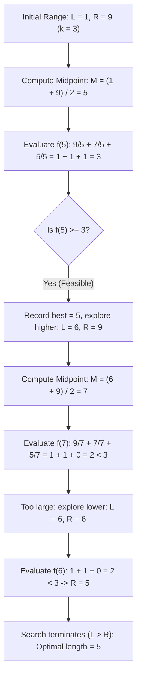

# Guided Example: Cutting Ribbons

We trace binary search over candidate ribbon segment lengths and monotonic floor quotient evaluation on a representative ribbon instance:

- **Input:** `ribbons = [9, 7, 5]`, `k = 3` (alongside `k = 4`)
- **Required Output:** `5` (and `4` for `k = 4`)

This instance demonstrates establishing the search boundaries $[1, \max(\text{ribbons})]$, evaluating the piece count function $f(x) = \sum \lfloor r_i / x \rfloor$, proving its monotonic non-increasing property, and converging via binary search to the maximum feasible length.

---

## 1. Instance & Teaching Goal

We are given an array of ribbon lengths `ribbons` and an integer $k$. We can cut ribbons into pieces of any positive integer length $x$.
- We want to obtain at least $k$ ribbons, all of identical integer length $x$.
- We must find the maximum possible value of $x$, or return $0$ if we cannot obtain even $k$ ribbons of length $1$.

For `ribbons = [9, 7, 5]` and $k = 3$:
- The sum of ribbons is $9 + 7 + 5 = 21 \ge 3$, so a solution exists.
- The longest single ribbon is $9$, so $x \in [1, 9]$.
- Testing $x = 5$:
  - Ribbon of 9 yields $\lfloor 9 / 5 \rfloor = 1$ piece (with 4 units left over).
  - Ribbon of 7 yields $\lfloor 7 / 5 \rfloor = 1$ piece (with 2 units left over).
  - Ribbon of 5 yields $\lfloor 5 / 5 \rfloor = 1$ piece (with 0 units left over).
  - Total pieces of length 5: $1 + 1 + 1 = 3 \ge 3$ (Feasible!).
- Testing $x = 6$:
  - Ribbon of 9 yields $\lfloor 9 / 6 \rfloor = 1$ piece.
  - Ribbon of 7 yields $\lfloor 7 / 6 \rfloor = 1$ piece.
  - Ribbon of 5 yields $\lfloor 5 / 6 \rfloor = 0$ pieces.
  - Total pieces of length 6: $1 + 1 + 0 = 2 < 3$ (Infeasible!).
- The maximum achievable length is $5$.

The teaching goal is to understand **binary search on continuous-to-discrete monotonicity**:
1. Formulating the count function $f(x) = \sum_{i} \lfloor ribbons[i] / x \rfloor$.
2. Observing that as segment size $x$ increases, the number of obtainable pieces $f(x)$ strictly decreases or stays the same.
3. Applying bisection over the answer space $[1, \max(\text{ribbons})]$ in $\mathcal{O}(n \log(\max r))$ time.

---

## 2. Conceptual Foundation & Invariants

### Monotonic Floor Quotient Sum & Bisection Supremum Theorem

> **Monotonic Floor Quotient Sum & Bisection Supremum Theorem.**
> 1. *Piece Count Function:* For any candidate integer segment length $x \ge 1$, the total number of segments of length $x$ obtainable from array `ribbons` is:
>    $$f(x) = \sum_{i=0}^{n-1} \left\lfloor \frac{ribbons[i]}{x} \right\rfloor$$
> 2. *Monotonicity Invariant:* For any positive integers $x_1 < x_2$, the floor division property implies:
>    $$\left\lfloor \frac{ribbons[i]}{x_1} \right\rfloor \ge \left\lfloor \frac{ribbons[i]}{x_2} \right\rfloor \implies f(x_1) \ge f(x_2)$$
>    Hence, $f(x)$ is monotonically non-increasing over the domain $\mathbb{Z}^+$.
> 3. *Supremum Bisection:* The feasibility predicate $P(x) \iff f(x) \ge k$ exhibits step-function behavior:
>    $$P(x) = \begin{cases} \text{True}, & \text{for } 1 \le x \le x^* \\ \text{False}, & \text{for } x > x^* \end{cases}$$
>    The optimal answer $x^*$ is the supremum of the truth set:
>    $$x^* = \max \{ x \in [1, \max_i ribbons[i]] \mid f(x) \ge k \}$$
>    If $\sum ribbons[i] < k$, then $P(1) = \text{False}$, yielding $x^* = 0$.
> 4. *Complexity:* Each evaluation of $f(x)$ takes $\mathcal{O}(n)$ time. The search interval $[1, M]$ where $M = \max_i ribbons[i]$ requires $\lfloor \log_2 M \rfloor + 1$ evaluations. Total time is $\mathcal{O}(n \log M)$ with $\mathcal{O}(1)$ auxiliary space.

---

## 3. Step-by-Step Worked Execution

We trace the binary search for `ribbons = [9, 7, 5]` with $k = 3$:
- Maximum ribbon: $M = 9$.
- Feasibility check: $\sum ribbons = 9 + 7 + 5 = 21 \ge 3$ (Solution exists).
- Search boundaries: $L = 1$, $R = 9$.
- Optimal length tracking: $\text{best} = 0$.

---

### Step 1: Iteration 1 ($L = 1, R = 9$)
- Midpoint candidate:
  $$M = \left\lfloor \frac{1 + 9}{2} \right\rfloor = 5$$
- Evaluate piece count $f(5)$:
  $$\left\lfloor \frac{9}{5} \right\rfloor + \left\lfloor \frac{7}{5} \right\rfloor + \left\lfloor \frac{5}{5} \right\rfloor = 1 + 1 + 1 = 3$$
- Comparison: $f(5) = 3 \ge k = 3$ (Feasible!).
- Update record: $\text{best} = 5$.
- Narrow search to higher values: $L = M + 1 = 6$.

---

### Step 2: Iteration 2 ($L = 6, R = 9$)
- Midpoint candidate:
  $$M = \left\lfloor \frac{6 + 9}{2} \right\rfloor = 7$$
- Evaluate piece count $f(7)$:
  $$\left\lfloor \frac{9}{7} \right\rfloor + \left\lfloor \frac{7}{7} \right\rfloor + \left\lfloor \frac{5}{7} \right\rfloor = 1 + 1 + 0 = 2$$
- Comparison: $f(7) = 2 < k = 3$ (Infeasible!). Length 7 is too large.
- Narrow search to lower values: $R = M - 1 = 6$.

---

### Step 3: Iteration 3 ($L = 6, R = 6$)
- Midpoint candidate:
  $$M = \left\lfloor \frac{6 + 6}{2} \right\rfloor = 6$$
- Evaluate piece count $f(6)$:
  $$\left\lfloor \frac{9}{6} \right\rfloor + \left\lfloor \frac{7}{6} \right\rfloor + \left\lfloor \frac{5}{6} \right\rfloor = 1 + 1 + 0 = 2$$
- Comparison: $f(6) = 2 < k = 3$ (Infeasible!). Length 6 is too large.
- Narrow search to lower values: $R = M - 1 = 5$.

---

### Step 4: Termination
- Left and right pointers cross: $L = 6 > R = 5$.
- The binary search terminates.
- Final maximum length: $\text{best} = 5$.

---

## 4. Complete Execution Trace

| Iteration | Search Range $[L, R]$ | Midpoint $M$ | Pieces from 9 | Pieces from 7 | Pieces from 5 | Total Pieces $f(M)$ | Feasible? ($f(M) \ge 3$) | Best So Far | Next Interval |
|:---:|:---:|:---:|:---:|:---:|:---:|:---:|:---:|:---:|:---:|
| 1 | $[1, 9]$ | 5 | 1 | 1 | 1 | 3 | **Yes** | 5 | $[6, 9]$ |
| 2 | $[6, 9]$ | 7 | 1 | 1 | 0 | 2 | No | 5 | $[6, 6]$ |
| 3 | $[6, 6]$ | 6 | 1 | 1 | 0 | 2 | No | 5 | $[6, 5]$ |
| **End** | $6 > 5$ | - | - | - | - | - | - | **5** | Terminate |

---

## 5. Algorithmic Correctness

**Soundness.** For any test length $x$, each ribbon $r_i$ produces exactly $\lfloor r_i / x \rfloor$ intact segments of length $x$ without joining pieces across different ribbons. The total sum $f(x)$ accurately computes the total segments available.

**Completeness.** Because $f(x)$ is monotonically non-increasing, if $x$ is feasible, all smaller lengths $x' < x$ are guaranteed feasible, and if $x$ is infeasible, all larger lengths $x'' > x$ are guaranteed infeasible. Binary search therefore eliminates entire sub-intervals without discarding the global maximum.

---

## 6. Traps This Instance Exposes

- **Joining Leftover Pieces:** Pieces cut from different ribbons cannot be glued together. A ribbon of length 7 and a ribbon of length 5 cannot combine their remainders ($2 + 0 = 2$) into another piece. Each ribbon contributes integer multiples independently via floor division.
- **Zero Result Impossibility:** If $\sum ribbons < k$, not even $k$ ribbons of length 1 can be cut. Testing the initial sum prevents infinite loops or division-by-zero errors.
- **Division by Zero:** The search range must be strictly positive ($L \ge 1$). A candidate length of $M = 0$ is invalid and triggers division by zero.

---

## 7. Complexity Derivation

- **Time Complexity:** $\mathcal{O}(n \log M)$, where $n$ is the length of `ribbons` and $M = \max_i ribbons[i]$. The binary search executes $\mathcal{O}(\log M)$ iterations, and each iteration sums floor quotients across $n$ ribbons.
- **Auxiliary Space Complexity:** $\mathcal{O}(1)$, requiring only scalar variables for bounds and accumulators.