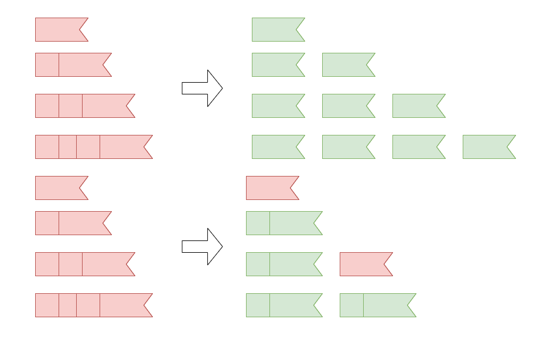

[TOC]

## Solution

---

### Overview

We are given an array `ribbons`, where each element represents the length of a ribbon, and an integer `k`. Our task is to determine if it is possible to cut the ribbons into at least `k` pieces, where all pieces have the same length. If possible, we need to find the longest possible length of these pieces.

###### Example

Let $ribbons = [1, 2, 3, 4]$ and $k = 3$.

-   **Option 1**: Cut ribbons into smaller ribbons, each of length 1. We can create 10 such ribbons. Since 10 is greater than 3, this cut is valid.
-   **Option 2**: Cut ribbons into pieces of length 2. We can form 4 ($\geq$ 3) such ribbons, so 2 is valid length as well. Note that we can entirely ignore any leftover portions of the ribbons (e.g., the leftover from cutting the first and third ribbons).



Since our goal is to find the longest possible length we can achieve with `k` ribbons, our answer for this example is `2`.

---

### Approach: Binary Search on The Answer

#### Intuition

The idea is to cut the ribbons into pieces of a certain length, making sure that the total number of pieces is at least `k`. The longest possible piece we can cut is limited by the longest ribbon we have, as no piece can be longer than the length of the longest ribbon in the array.

Now, imagine you start by trying to cut the ribbons into pieces of a very large length (like the longest ribbon). This will give you fewer pieces. If that doesn't give you enough pieces, you try a smaller length, and you get more pieces. As the length of the pieces decreases, the number of pieces increases.

Now that we've determined that approach won't work, how can we more efficiently check the possible lengths? Let's make another simple observation: the longer the pieces of ribbon are, the fewer pieces we can make. The shorter the pieces of ribbon are, the more pieces we can make. This means that the relationship between the ribbon length and the number of pieces is monotonic, meaning it consistently moves in a predictable direction: as the ribbon length increases, the number of pieces decreases, and vice versa.

Instead of trying every possible piece length one by one (which would take too long and result in a TLE), binary search helps us narrow down the range of possible lengths in logarithmic time. We start with the largest possible piece length and gradually reduce it, checking whether we can still obtain at least `k` pieces. If we can, we attempt even smaller lengths; if we can't, we increase the piece length.

!?!../Documents/1891/1891_slideshow.json:960,540!?!

<br/>

###### When to Use Upper vs. Lower Middle in Binary Search

When a cut is possible for a candidate $x$, we move the left bound of the binary search to the value of $x$ (i.e., set $left = middle$) to search the higher range. To avoid an infinite loop when `left` is updated to `middle`, we must ensure that `middle` is distinct from `left` in subsequent iterations. Using the upper middle, i.e., $middle = (left + right + 1) / 2$, ensures progress.

**Example**: Suppose $left = 3$ and $right = 4$:

-   Using the upper middle, $middle = (3 + 4 + 1) / 2 = 4$.
    If it is possible to get `k` ribbons of length `middle`, we set $left = middle$, and `left` becomes 4.
    The loop ends correctly since now $left = right$.
-   If we used the lower middle here, $middle = (3 + 4) / 2 = 3$, and updating $left = middle = 3$ would result in an infinite loop.

> If you are new to binary search, check out the [Binary Search Explore Card 🔗](https://leetcode.com/explore/learn/card/binary-search/). This resource offers an in-depth look at binary search, explaining its key concepts and applications with a variety of problems to solidify understanding of the pattern.

#### Algorithm

-   Define a function `isPossible` that takes an integer `x`, the `ribbons` array, and `k` as parameters. This function returns a boolean indicating whether it’s possible to cut the ribbons to obtain at least `k` new ribbons, each of length `x`.
-   Initialize $totalRibbons = 0$.
-   Loop through the `ribbons` array:
-   For each ribbon, calculate the number of pieces it can contribute: $pieces = floor(\text{ribbons}[i] / x)$.
-   Add `pieces` to `totalRibbons`.
-   If $totalRibbons \ge k$, return `true` as a valid cut is possible.
-   If the loop completes without reaching `k`, return `false`.
-   In the `maxLength` main function:

-   Initialize the boundaries of the binary search: $left = 0$ and $right = max(\text{ribbons}[i])$.
-   While `left < right`:
-   Set $middle = (left + right + 1) / 2$.
-   Use the `isPossible` function to check if it’s possible to cut the ribbons to obtain at least `k` ribbons of length `middle`.
-   If `isPossible(middle)` returns `true`, set $left = middle$.
-   Otherwise, set $right = middle - 1$.
-   When the loop ends, $left = right$, so return `left`.

#### Implementation

```python
class Solution:
    def maxLength(self, ribbons: list[int], k: int) -> int:
        # Binary search bounds
        left = 0
        right = max(ribbons)

        # Perform binary search on the ribbon length
        while left < right:
            middle = (
                left + right + 1
            ) // 2  # Use upper mid to prevent infinite loops
            if self._is_possible(middle, ribbons, k):
                # If it's possible to make `k` pieces of length `middle`, search the higher range
                left = middle
            else:
                # Otherwise, search the lower range
                right = middle - 1

        return left

    def _is_possible(self, x: int, ribbons: list[int], k: int) -> bool:
        total_ribbons = 0
        for ribbon in ribbons:
            # Number of pieces the current ribbon can contribute
            total_ribbons += ribbon // x
            # If the total reaches or exceeds `k`, we can stop early
            if total_ribbons >= k:
                return True
        # It's not possible to make the cut
        return False
```

#### Complexity Analysis

Let $n$ be the length and $m$ be the maximum value in the `ribbons` array.

-   Time complexity: $O(n \log m)$

    The process of looping through the `ribbons` array to determine if a cut resulting in `k` ribbons of a given length is possible, using the `isPossible` function, takes $O(n)$ time. Within the binary search function, we initialize the search space as $[0, m]$ and halve it with each iteration, resulting in a time complexity of $O(\log m)$. Consequently, the overall time complexity of the solution is $O(n \log m)$.

-   Space complexity: $O(1)$

    We only use a fixed number of integer variables, which doesn't depend on the input size.

---