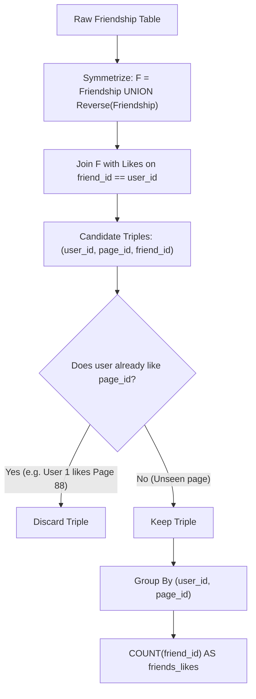

# Guided Example: Page Recommendations II

We trace the symmetric friendship expansion, friend preference join, self-like exclusion, and frequency aggregation on a representative social network instance:

- **Input:**
  $$\text{Friendship} = \begin{array}{|c|c|}
  \hline
  \textbf{user1\_id} & \textbf{user2\_id} \\
  \hline
  1 & 2 \\
  1 & 3 \\
  1 & 4 \\
  2 & 3 \\
  2 & 4 \\
  2 & 5 \\
  6 & 1 \\
  \hline
  \end{array}, \quad
  \text{Likes} = \begin{array}{|c|c|}
  \hline
  \textbf{user\_id} & \textbf{page\_id} \\
  \hline
  1 & 88 \\
  2 & 23 \\
  3 & 24 \\
  4 & 56 \\
  5 & 11 \\
  6 & 33 \\
  2 & 77 \\
  3 & 77 \\
  6 & 88 \\
  \hline
  \end{array}$$
- **Required Output (Focusing on User 1):**
  $$\begin{array}{|c|c|c|}
  \hline
  \textbf{user\_id} & \textbf{page\_id} & \textbf{friends\_likes} \\
  \hline
  1 & 77 & 2 \\
  1 & 23 & 1 \\
  1 & 24 & 1 \\
  1 & 56 & 1 \\
  1 & 33 & 1 \\
  \hline
  \end{array}$$

This instance demonstrates symmetrizing bidirectional friendships ($u_1 \leftrightarrow u_2$), joining each user's friends with the `Likes` table, pruning pages the user already likes via an anti-join, and grouping by $(u, \text{page})$ to count distinct endorsing friends.

---

## 1. Instance & Teaching Goal

We are given a friendship network where edges are stored once in either direction, and a table of user page likes.
- We recommend a page to user $u$ if:
  1. At least one friend of $u$ likes the page.
  2. User $u$ does **not** already like the page.
- For each recommendation, we output the count of distinct friends who like that page (`friends_likes`).

For User 1 in the sample:
- Direct friendship records involving User 1:
  - `(1, 2)` $\implies 2$ is a friend of $1$.
  - `(1, 3)` $\implies 3$ is a friend of $1$.
  - `(1, 4)` $\implies 4$ is a friend of $1$.
  - `(6, 1)` $\implies 6$ is a friend of $1$ (symmetrized direction).
- Friends of User 1: $\{2, 3, 4, 6\}$.
- Pages liked by User 1 directly: $\{88\}$.
- Pages liked by friends of User 1:
  - Friend 2 likes: $23, 77$.
  - Friend 3 likes: $24, 77$.
  - Friend 4 likes: $56$.
  - Friend 6 likes: $33, 88$.
- Exclude page 88 because User 1 already likes it!
- Aggregating remaining candidates:
  - Page 77: liked by Friend 2 and Friend 3 $\implies 2$ likes.
  - Page 23: liked by Friend 2 $\implies 1$ like.
  - Page 24: liked by Friend 3 $\implies 1$ like.
  - Page 56: liked by Friend 4 $\implies 1$ like.
  - Page 33: liked by Friend 6 $\implies 1$ like.

The teaching goal is to understand **relational collaborative filtering**:
1. Symmetrizing undirected graph edges via `UNION` to form full bidirectional adjacency.
2. Performing a multi-table relational join from user $\to$ friend $\to$ page.
3. Filtering out existing user preferences using `LEFT JOIN ... WHERE ... IS NULL` or `NOT IN`.
4. Grouping by `(user_id, page_id)` and computing `COUNT(DISTINCT friend_id)`.

---

## 2. Conceptual Foundation & Invariants

### Symmetric Friendship Closure & Unshared Preference Aggregation Theorem

> **Symmetric Friendship Closure & Unshared Preference Aggregation Theorem.**
> 1. *Undirected Adjacency Closure:* Because friendship is symmetric, the full relation of directed friendships $\mathcal{F}$ is:
>    $$\mathcal{F} = \{ (u, v) \mid (u, v) \in \text{Friendship} \} \cup \{ (v, u) \mid (u, v) \in \text{Friendship} \}$$
> 2. *Friend-Endorsed Candidate Generation:* Joining users with their friends' likes produces candidate triples:
>    $$\mathcal{C} = \{ (u, p, v) \mid (u, v) \in \mathcal{F} \land (v, p) \in \text{Likes} \}$$
> 3. *Self-Preference Anti-Join:* The set of valid recommendations excludes any page already in user $u$'s personal likes:
>    $$\mathcal{R} = \{ (u, p, v) \in \mathcal{C} \mid (u, p) \notin \text{Likes} \}$$
> 4. *Equivalence Class Aggregation:* For each pair $(u, p)$ present in $\mathcal{R}$, the number of endorsing friends is:
>    $$\text{friends\_likes}(u, p) = \big| \{ v \mid (u, p, v) \in \mathcal{R} \} \big|$$
> 5. *Complexity:* Constructing $\mathcal{F}$ takes $\mathcal{O}(|F|)$. Joining with $\text{Likes}$ takes $\mathcal{O}(|\mathcal{F}| \cdot d)$ where $d$ is average degree. Anti-join and hash aggregation take $\mathcal{O}(|\mathcal{R}|)$. Total time is $\mathcal{O}(|F| + |\text{Likes}| + |\mathcal{R}|)$ using hash indices.

---

## 3. Step-by-Step Worked Execution

We trace the candidate recommendation pipeline for User 1:

---

### Step 1: Symmetrize Friendship Edges for User 1
- `(1, 2)` gives $(1, 2)$.
- `(1, 3)` gives $(1, 3)$.
- `(1, 4)` gives $(1, 4)$.
- `(6, 1)` gives $(1, 6)$.
- Friends of User 1: $\mathcal{N}(1) = \{2, 3, 4, 6\}$.

---

### Step 2: Join Friends with `Likes`
Retrieve all pages liked by any friend in $\mathcal{N}(1)$:
- Friend 2 likes: Page 23, Page 77.
  - Triples: $(1, 23, \text{friend } 2)$, $(1, 77, \text{friend } 2)$.
- Friend 3 likes: Page 24, Page 77.
  - Triples: $(1, 24, \text{friend } 3)$, $(1, 77, \text{friend } 3)$.
- Friend 4 likes: Page 56.
  - Triple: $(1, 56, \text{friend } 4)$.
- Friend 6 likes: Page 33, Page 88.
  - Triples: $(1, 33, \text{friend } 6)$, $(1, 88, \text{friend } 6)$.

---

### Step 3: Apply Anti-Join Against User 1's Own Likes
- User 1's personal likes: $\{88\}$.
- Evaluate each candidate page:
  - Page 23: $23 \notin \{88\}$ (**Retained**)
  - Page 77: $77 \notin \{88\}$ (**Retained**)
  - Page 24: $24 \notin \{88\}$ (**Retained**)
  - Page 56: $56 \notin \{88\}$ (**Retained**)
  - Page 33: $33 \notin \{88\}$ (**Retained**)
  - Page 88: $88 \in \{88\}$ (*Pruned! User 1 already likes Page 88*)

---

### Step 4: Group and Count Endorsements for User 1
Aggregate distinct friend contributors for each surviving page:
- **Page 77:** Endorsed by Friend 2 and Friend 3 $\implies \text{friends\_likes} = 2$.
- **Page 23:** Endorsed by Friend 2 $\implies \text{friends\_likes} = 1$.
- **Page 24:** Endorsed by Friend 3 $\implies \text{friends\_likes} = 1$.
- **Page 56:** Endorsed by Friend 4 $\implies \text{friends\_likes} = 1$.
- **Page 33:** Endorsed by Friend 6 $\implies \text{friends\_likes} = 1$.

---

## 4. Complete Execution Trace

| User ID | Friend ID | Page Liked by Friend | Liked by User Directly? | Status | Contributes to Group |
|:---:|:---:|:---:|:---:|:---:|:---:|
| 1 | 2 | 23 | No ($23 \neq 88$) | **Retained** | $(1, 23) \to 1$ |
| 1 | 2 | 77 | No ($77 \neq 88$) | **Retained** | $(1, 77) \to 1$ |
| 1 | 3 | 24 | No ($24 \neq 88$) | **Retained** | $(1, 24) \to 1$ |
| 1 | 3 | 77 | No ($77 \neq 88$) | **Retained** | $(1, 77) \to 2$ |
| 1 | 4 | 56 | No ($56 \neq 88$) | **Retained** | $(1, 56) \to 1$ |
| 1 | 6 | 33 | No ($33 \neq 88$) | **Retained** | $(1, 33) \to 1$ |
| 1 | 6 | 88 | **Yes** ($88 == 88$) | *Excluded* | None |

---

## 5. Algorithmic Correctness

**Soundness.** Every output row $(u, p, c)$ satisfies both criteria: page $p$ is liked by at least one friend of $u$, and page $p$ is not liked by $u$. The aggregation $c$ is the exact count of friends liking $p$.

**Completeness.** Symmetrizing the friendship table guarantees that relationships recorded as $(v, u)$ with $v > u$ (such as `(6, 1)`) are preserved in both directions. No friend or recommendation is omitted due to edge orientation.

---

## 6. Traps This Instance Exposes

- **Asymmetric Friendship Storage:** The table stores `user1_id < user2_id`. Treating `Friendship` as a directed table from `user1_id` to `user2_id` misses half the friendships (e.g. missing friend 6 for User 1). A bidirectional union is required.
- **Recommending Existing Likes:** Failing to anti-join against the user's personal likes would erroneously recommend Page 88 to User 1 with `friends_likes = 1`.
- **Counting the Same Friend Twice:** A friend cannot like the same page twice due to the primary key `(user_id, page_id)`, but when joining across complex relationship paths, using `COUNT(DISTINCT friend_id)` safeguards against duplicate counts.

---

## 7. Complexity Derivation

- **Time Complexity:** $\mathcal{O}(|F| + |\text{Likes}| + |\mathcal{C}|)$, where $|F|$ is the number of friendship pairs, $|\text{Likes}|$ is the number of like records, and $|\mathcal{C}|$ is the candidate join size. Hash joins and hash set lookups execute in linear expected time.
- **Auxiliary Space Complexity:** $\mathcal{O}(|F| + |\text{Likes}|)$ to store the symmetrized friendship graph and the hash set of user likes.
