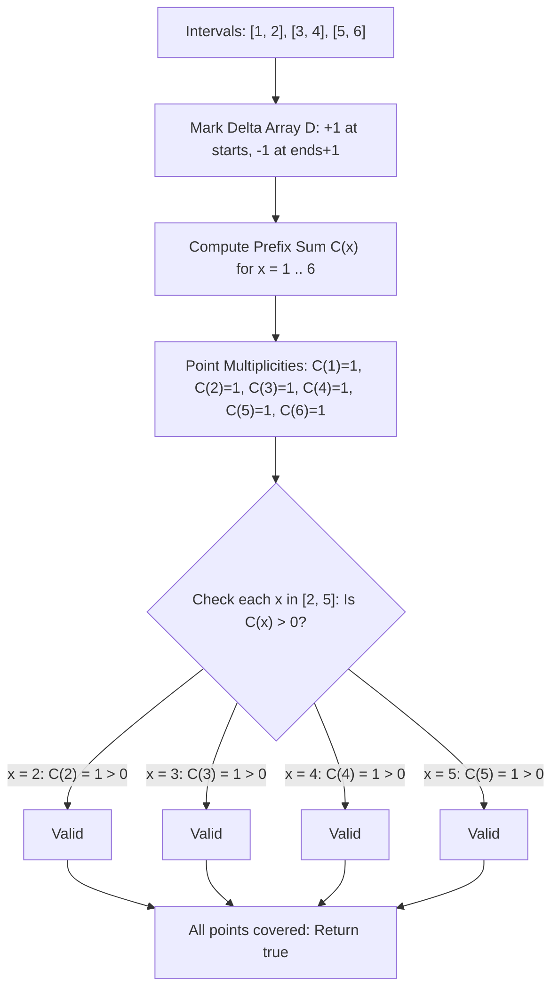

# Guided Example: Check if All the Integers in a Range Are Covered

We trace discrete point-interval coverage testing and difference-array accumulation on representative interval sets:

- **Input:** `ranges = [[1, 2], [3, 4], [5, 6]]`, `left = 2`, `right = 5` (alongside `ranges = [[1, 10], [10, 20]]`, `left = 21`, `right = 21`)
- **Required Output:** `true` (and `false` for the counterexample)

This instance demonstrates modeling 1D coordinate intervals with a difference array, accumulating point-wise coverage counts via a prefix sweep, and verifying that every integer in $[left, right]$ possesses a strictly positive coverage multiplicity.

---

## 1. Instance & Teaching Goal

We are given a list of inclusive integer intervals `ranges` where each `ranges[i] = [start_i, end_i]`, and a target inclusive interval $[left, right]$. We must return `true` if and only if every integer $x$ satisfying $left \le x \le right$ belongs to at least one interval in `ranges`.

For `ranges = [[1, 2], [3, 4], [5, 6]]` with $left = 2$ and $right = 5$:
- Target integer set: $\{2, 3, 4, 5\}$.
- Test $x = 2$: Covered by $[1, 2]$ because $1 \le 2 \le 2$. (Covered)
- Test $x = 3$: Covered by $[3, 4]$ because $3 \le 3 \le 4$. (Covered)
- Test $x = 4$: Covered by $[3, 4]$ because $3 \le 4 \le 4$. (Covered)
- Test $x = 5$: Covered by $[5, 6]$ because $5 \le 5 \le 6$. (Covered)
- Every element in $\{2, 3, 4, 5\}$ is covered $\implies$ Output is `true`.

For `ranges = [[1, 10], [10, 20]]` with $left = 21$ and $right = 21$:
- Target integer set: $\{21\}$.
- Point $21$ exceeds the upper bound of all provided intervals ($21 > 10$ and $21 > 20$).
- Coverage count at $21$ is $0 \implies$ Output is `false`.

The teaching goal is to understand **discrete interval coverage**:
1. How a difference array $D$ records interval arrivals ($+1$ at $start$) and departures ($-1$ at $end + 1$).
2. How the running prefix sum computes the exact number of active covering intervals at every discrete coordinate in $\mathcal{O}(1)$ time per coordinate.
3. How to verify the universal quantifier $\forall x \in [left, right], C(x) \ge 1$.

---

## 2. Conceptual Foundation & Invariants

### Discrete Interval Sweep & Point-Wise Coverage Invariant Theorem

> **Discrete Interval Sweep & Point-Wise Coverage Invariant Theorem.**
> 1. *Characteristic Multiplicity Function:* For any integer coordinate $x$, define its coverage multiplicity as the number of intervals containing $x$:
>    $$C(x) = \sum_{i=0}^{m-1} \mathbb{I}(start_i \le x \le end_i)$$
> 2. *Difference Array Representation:* Initialize a difference array $D[0 \dots K + 1] = 0$, where $K = 50$. For each interval $[s, e] \in \text{ranges}$:
>    $$D[s] \leftarrow D[s] + 1, \quad D[e + 1] \leftarrow D[e + 1] - 1$$
> 3. *Prefix Accumulation Invariant:* The running prefix sum recreates the exact multiplicity function:
>    $$C(x) = \sum_{k=1}^x D[k] = C(x - 1) + D[x]$$
> 4. *Universal Coverage Predicate:* The target interval $[left, right]$ is fully covered if and only if no point within the target has multiplicity zero:
>    $$\forall x \in [left, right], \quad C(x) > 0$$
> 5. *Complexity:* Constructing the difference array takes $\mathcal{O}(m)$ time for $m$ intervals. Accumulating prefix sums across the coordinate range $[1, K]$ takes $\mathcal{O}(K)$ time. Total time is $\mathcal{O}(m + K)$ with $\mathcal{O}(K)$ auxiliary space.

---

## 3. Step-by-Step Worked Execution

We trace the difference array sweep on `ranges = [[1, 2], [3, 4], [5, 6]]` with $left = 2, right = 5$:

---

### Step 1: Initialize Difference Array
Let the coordinate universe span $1 \dots 7$.
Initialize $D[0 \dots 7] = 0$.

---

### Step 2: Apply Range Deltas
1. Interval $[1, 2]$:
   - $D[1] \leftarrow D[1] + 1 = 1$
   - $D[2 + 1] = D[3] \leftarrow D[3] - 1 = -1$
2. Interval $[3, 4]$:
   - $D[3] \leftarrow D[3] + 1 = -1 + 1 = 0$
   - $D[4 + 1] = D[5] \leftarrow D[5] - 1 = -1$
3. Interval $[5, 6]$:
   - $D[5] \leftarrow D[5] + 1 = -1 + 1 = 0$
   - $D[6 + 1] = D[7] \leftarrow D[7] - 1 = -1$

Resulting difference array $D$:
$$D = [0, \; +1, \; 0, \; 0, \; 0, \; 0, \; 0, \; -1]$$

---

### Step 3: Compute Running Prefix Sums $C(x)$
- $x = 1$: $C(1) = 0 + D[1] = 1$
- $x = 2$: $C(2) = 1 + D[2] = 1 + 0 = 1$
- $x = 3$: $C(3) = 1 + D[3] = 1 + 0 = 1$
- $x = 4$: $C(4) = 1 + D[4] = 1 + 0 = 1$
- $x = 5$: $C(5) = 1 + D[5] = 1 + 0 = 1$
- $x = 6$: $C(6) = 1 + D[6] = 1 + 0 = 1$
- $x = 7$: $C(7) = 1 + D[7] = 1 - 1 = 0$

---

### Step 4: Validate Target Range $[2, 5]$
Inspect $C(x)$ for each $x \in [2, 5]$:
- Coordinate 2: $C(2) = 1 > 0$ (**Covered**)
- Coordinate 3: $C(3) = 1 > 0$ (**Covered**)
- Coordinate 4: $C(4) = 1 > 0$ (**Covered**)
- Coordinate 5: $C(5) = 1 > 0$ (**Covered**)

All integers in $[2, 5]$ have coverage multiplicity $C(x) \ge 1$.
The function returns `true`.

---

## 4. Complete Execution Trace

| Coordinate $x$ | Delta Value $D[x]$ | Running Coverage $C(x)$ | In Target $[2, 5]$? | Multiplicity $> 0$? | Status |
|:---:|:---:|:---:|:---:|:---:|:---:|
| 1 | $+1$ | 1 | No | - | - |
| 2 | $0$ | 1 | **Yes** | **Yes** ($1 > 0$) | **Covered** |
| 3 | $0$ | 1 | **Yes** | **Yes** ($1 > 0$) | **Covered** |
| 4 | $0$ | 1 | **Yes** | **Yes** ($1 > 0$) | **Covered** |
| 5 | $0$ | 1 | **Yes** | **Yes** ($1 > 0$) | **Covered** |
| 6 | $0$ | 1 | No | - | - |
| 7 | $-1$ | 0 | No | - | - |

---

## 5. Algorithmic Correctness

**Soundness.** Marking $+1$ at interval starts and $-1$ at $end + 1$ guarantees that the prefix sum at coordinate $x$ equals the exact number of intervals satisfying $start \le x \le end$. If every coordinate in $[left, right]$ has prefix sum $> 0$, then each coordinate is contained in at least one interval.

**Completeness.** Checking every integer between $left$ and $right$ tests the entire discrete query interval. If any coordinate $x^*$ has $C(x^*) = 0$, that coordinate is uncovered, correctly triggering a return value of `false`.

---

## 6. Traps This Instance Exposes

- **Inclusive End Boundaries:** In continuous geometry, intervals are often half-open $[s, e)$. Here intervals are strictly inclusive $[s, e]$. The decremental boundary must be placed at coordinate $e + 1$, not $e$.
- **Disjoint Adjacent Intervals:** Intervals $[1, 2]$ and $[3, 4]$ leave no gap between integers because $2$ and $3$ are adjacent integers in $\mathbb{Z}$. The $+1$ at $3$ cancels the $-1$ at $2+1=3$, keeping the net change at zero while coverage remains continuous.
- **Overlapping Redundancy:** Multiple intervals may cover the same integer (e.g. $[1, 5]$ and $[2, 4]$ both cover 3). The difference array correctly adds multiplicities ($C(3) = 2$), which safely satisfies the condition $C(x) \ge 1$.

---

## 7. Complexity Derivation

- **Time Complexity:** $\mathcal{O}(m + K)$, where $m$ is the number of intervals in `ranges` and $K = 50$ is the maximum coordinate value. We apply $m$ delta updates, sweep through at most 52 coordinates, and check at most 50 query integers.
- **Auxiliary Space Complexity:** $\mathcal{O}(K)$ to store the fixed-size difference array of size 52.
