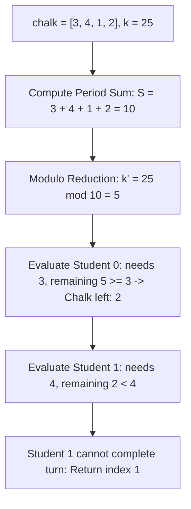

# Guided Example: Find the Student that Will Replace the Chalk

We trace the cyclic sum reduction and single-pass remainder depletion on representative chalk distribution instances:

- **Input:** `chalk = [3, 4, 1, 2]`, `k = 25` (alongside `chalk = [5, 1, 5]`, `k = 22`)
- **Required Output:** `1` (and `0` for the second instance)

This instance demonstrates summing the total chalk requirement for one complete round, skipping complete cycles via modulo arithmetic $k' = k \pmod S$, and identifying the first student whose requirement strictly exceeds the remaining chalk.

---

## 1. Instance & Teaching Goal

We are given an array `chalk` of length $n$ and an initial chalk supply $k$. In each round:
- Student $0$ uses `chalk[0]` pieces.
- Student $1$ uses `chalk[1]` pieces.
- $\dots$
- Student $n-1$ uses `chalk[n-1]` pieces.
The process repeats cyclically. If a student needs strictly more chalk than is currently available, they must replace the chalk. We must identify this student's index.

Consider `chalk = [3, 4, 1, 2]` with $k = 25$:
- Total chalk consumed in one complete pass:
  $$S = 3 + 4 + 1 + 2 = 10$$
- In Round 1, students consume $10$ chalk, leaving $25 - 10 = 15$.
- In Round 2, students consume $10$ chalk, leaving $15 - 10 = 5$.
- Round 3 begins with $5$ chalk remaining ($25 \pmod{10} = 5$):
  - Student $0$ needs $3$ chalk. $5 \ge 3 \implies$ Remaining chalk: $5 - 3 = 2$.
  - Student $1$ needs $4$ chalk. But only $2$ pieces remain ($2 < 4$).
  - Student $1$ cannot proceed and must replace the chalk!
- The answer is `1`.

The teaching goal is to understand **periodic modular reduction**:
1. Why simulating round-by-round causes a time limit error when $k \le 10^9$.
2. How computing the period sum $S = \sum chalk[i]$ eliminates all full cycles in $\mathcal{O}(1)$ via $k' = k \pmod S$.
3. How a single final linear sweep or binary search over prefix sums locates the depletion point in $\mathcal{O}(n)$ or $\mathcal{O}(\log n)$ time.

---

## 2. Conceptual Foundation & Invariants

### Modular Periodicity & Monotonic Prefix Bisection Theorem

> **Modular Periodicity & Monotonic Prefix Bisection Theorem.**
> 1. *Round-Trip Sum Invariant:* Let $n$ students consume chalk according to sequence $c_0, c_1, \dots, c_{n-1}$. The total chalk consumed in any full round is:
>    $$S = \sum_{i=0}^{n-1} c_i$$
> 2. *Cycle Reduction Invariant:* After $\lfloor k / S \rfloor$ complete rounds, the chalk remaining before the first incomplete round is:
>    $$k' = k \pmod S$$
>    Since $k' < S$, the process is guaranteed to terminate within at most one additional cycle (indices $0 \dots n - 1$).
> 3. *Prefix Sum Threshold:* Let $P[i] = \sum_{j=0}^i c_j$ be the 1-indexed prefix sums. The student who must replace the chalk is the unique smallest index $i$ satisfying:
>    $$P[i] > k' \iff k' < c_i \quad (\text{after subtracting prior } c_j)$$
> 4. *Complexity:* Computing the total sum $S$ takes $\mathcal{O}(n)$ time. The modulo operation takes $\mathcal{O}(1)$. The final pass takes $\mathcal{O}(n)$ linearly, or $\mathcal{O}(\log n)$ using binary search on precomputed prefix sums. Auxiliary space is $\mathcal{O}(1)$.

---

## 3. Step-by-Step Worked Execution

We trace `chalk = [3, 4, 1, 2]` with $k = 25$:

---

### Step 1: Compute Full Round Sum $S$
- Student 0 needs: $3$
- Student 1 needs: $4$
- Student 2 needs: $1$
- Student 3 needs: $2$
- Sum of complete cycle:
  $$S = 3 + 4 + 1 + 2 = 10$$

---

### Step 2: Modulo Reduction
Calculate remaining chalk after all full rounds:
$$k' = 25 \pmod{10} = 5$$
Number of completed rounds skipped: $\lfloor 25 / 10 \rfloor = 2$.

---

### Step 3: Simulate Final Incomplete Round
We iterate through students $i = 0, 1, 2, 3$ with $k' = 5$:

#### Student 0:
- Required: `chalk[0] = 3`.
- Available: $k' = 5$.
- Check: $5 \ge 3$ (Can complete).
- Update remaining chalk:
  $$k' \leftarrow 5 - 3 = 2$$

#### Student 1:
- Required: `chalk[1] = 4`.
- Available: $k' = 2$.
- Check: $2 < 4$ (Cannot complete!).
- Student 1 must replace the chalk.
- Terminate and return index `1`.

---

## 4. Complete Execution Trace

| Step / Student | Required Chalk | Available Chalk $k'$ | Can Student Proceed? | New Remaining $k'$ | Status |
|:---:|:---:|:---:|:---:|:---:|:---:|
| Full Cycle Sum | - | $k = 25$ | - | $25 \pmod{10} = 5$ | Modulo applied |
| Student 0 | 3 | 5 | **Yes** ($5 \ge 3$) | $5 - 3 = 2$ | Advanced |
| Student 1 | 4 | 2 | **No** ($2 < 4$) | 2 | **Must Replace (Output 1)** |
| Student 2 | 1 | - | - | - | Unreached |
| Student 3 | 2 | - | - | - | Unreached |

---

## 5. Algorithmic Correctness

**Soundness.** Every complete round consumes exactly $S$ chalk. Skipping full cycles preserves the exact relative sequence of chalk deductions in the final round because modular arithmetic preserves equivalence: $k - m \cdot S \equiv k \pmod S$.

**Completeness.** Since $k' = k \pmod S < S$, the remaining chalk $k'$ cannot satisfy all $n$ students in the final round. Therefore, there exists at least one student in $0 \dots n - 1$ who encounters insufficient chalk, guaranteeing that the search terminates within the first pass.

---

## 6. Traps This Instance Exposes

- **Integer Overflow in Summation:** When $n = 10^5$ and each element is $10^5$, the sum $S$ can reach $10^{10}$, which exceeds standard 32-bit signed integer limits ($2^{31} - 1 \approx 2 \times 10^9$). The sum $S$ and initial $k$ must be stored in 64-bit integer types.
- **Exact Divisibility ($k \pmod S == 0$):** If $k$ is an exact multiple of $S$ (such as $k = 22, S = 11 \implies k' = 0$), Student 0 needs `chalk[0] > 0` and immediately faces 0 available chalk, correctly replacing the chalk at index 0 without running any full round in the final pass.
- **Simulation Without Modulo:** Simulating subtractions $k \leftarrow k - chalk[i]$ one-by-one requires $\mathcal{O}(k / \text{avg})$ operations. For $k = 10^9$ and small chalk values, this performs up to $10^9$ loop iterations and results in Time Limit Exceeded.

---

## 7. Complexity Derivation

- **Time Complexity:** $\mathcal{O}(n)$, where $n$ is the number of students. Computing the sum takes $\mathcal{O}(n)$ time, and the final linear scan takes at most $n$ iterations. (Alternatively $\mathcal{O}(\log n)$ for the second step via binary search on prefix sums).
- **Auxiliary Space Complexity:** $\mathcal{O}(1)$ auxiliary space, needing only accumulator variables.
