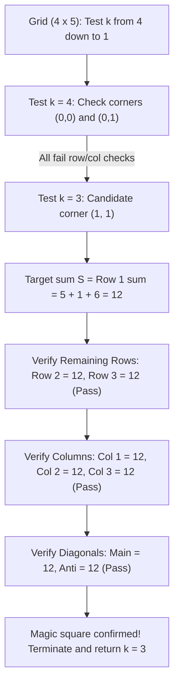

# Guided Example: Largest Magic Square

We trace descending size enumeration, 2D prefix sum querying, and full row-column-diagonal congruence testing on a representative grid instance:

- **Input:**
  $$\text{grid} = \begin{pmatrix}
  7 & 1 & 4 & 5 & 6 \\
  2 & 5 & 1 & 6 & 4 \\
  1 & 5 & 4 & 3 & 2 \\
  1 & 2 & 7 & 3 & 4
  \end{pmatrix}$$
- **Required Output:** `3`

This instance demonstrates searching subgrid side lengths $k$ in strictly descending order from $\min(m, n)$ down to $1$, testing candidate top-left coordinates $(r, c)$, using prefix sums to verify that all $k$ rows, all $k$ columns, and both diagonals share an identical target sum, and returning the first valid size found.

---

## 1. Instance & Teaching Goal

We are given an $m \times n$ integer grid ($m = 4, n = 5$). A $k \times k$ subgrid is a **magic square** if:
1. Every row sum is equal.
2. Every column sum is equal.
3. The main diagonal sum and anti-diagonal sum are equal.
4. All of these sums share the same common value $S$.

We seek the largest integer $k \ge 1$ admitting a $k \times k$ magic square.

For the given $4 \times 5$ matrix:
- Maximum possible side length is $\min(4, 5) = 4$.
- Candidate $k = 4$: Neither of the two possible $4 \times 4$ subgrids is magic (row sums differ).
- Candidate $k = 3$:
  - Consider the subgrid at top-left corner $(r = 1, c = 1)$ spanning rows $1 \dots 3$ and columns $1 \dots 3$:
    $$\begin{pmatrix} 5 & 1 & 6 \\ 5 & 4 & 3 \\ 2 & 7 & 3 \end{pmatrix}$$
  - Row sums:
    - Row 1: $5 + 1 + 6 = 12$
    - Row 2: $5 + 4 + 3 = 12$
    - Row 3: $2 + 7 + 3 = 12$
  - Column sums:
    - Column 1: $5 + 5 + 2 = 12$
    - Column 2: $1 + 4 + 7 = 12$
    - Column 3: $6 + 3 + 3 = 12$
  - Diagonal sums:
    - Main diagonal: $5 + 4 + 3 = 12$
    - Anti-diagonal: $6 + 4 + 2 = 12$
  - All $3 + 3 + 2 = 8$ line sums equal $12$!
- Because $k$ is evaluated descending, the first valid size $k = 3$ is guaranteed to be maximal.

The teaching goal is to understand **2D spatial prefix aggregation and early-exit descending search**:
1. Why iterating $k$ from $\min(m, n)$ downward allows immediate termination upon the first valid square.
2. How 1D row prefix sums and column prefix sums evaluate any row or column segment in $\mathcal{O}(1)$ time.
3. How to structure the $2k + 2$ congruence checks to prune invalid subgrids as early as the first mismatched line.

---

## 2. Conceptual Foundation & Invariants

### Subgrid Prefix Aggregation & Magic Congruence Verification Theorem

> **Subgrid Prefix Aggregation & Magic Congruence Verification Theorem.**
> 1. *Magic Square Line Invariance:* A $k \times k$ subgrid with top-left corner $(r, c)$ is magic if and only if there exists an integer $S$ such that:
>    $$\sum_{j=0}^{k-1} M[r + i][c + j] = S \quad (\forall i \in [0, k-1])$$
>    $$\sum_{i=0}^{k-1} M[r + i][c + j] = S \quad (\forall j \in [0, k-1])$$
>    $$\sum_{d=0}^{k-1} M[r + d][c + d] = S \quad \text{and} \quad \sum_{d=0}^{k-1} M[r + d][c + k - 1 - d] = S$$
> 2. *Prefix Sum Constant-Time Queries:* Precompute row prefix sums $R[i][j] = \sum_{t=0}^{j-1} M[i][t]$ and column prefix sums $C[i][j] = \sum_{t=0}^{i-1} M[t][j]$. Any row segment sum is $R[i][c + k] - R[i][c]$ and any column segment sum is $C[r + k][j] - C[r][j]$ in $\mathcal{O}(1)$ time.
> 3. *Monotonic Size Search:* Checking $k \in [\min(m, n), \dots, 1]$ descending ensures that the first discovered magic square has maximal side length $k^*$, eliminating the need to explore smaller values of $k$.
> 4. *Complexity:* Precomputing prefix sums takes $\mathcal{O}(m \cdot n)$ time. For each size $k$, there are $(m - k + 1)(n - k + 1)$ candidate corners, each requiring $\mathcal{O}(k)$ checks. Total time is at most $\mathcal{O}(\min(m, n) \cdot m \cdot n)$ and auxiliary space is $\mathcal{O}(m \cdot n)$.

---

## 3. Step-by-Step Worked Execution

We trace the validation of candidate subgrids for the $4 \times 5$ matrix:

---

### Step 1: Precompute Prefix Arrays
- Row prefix sums $R[i][j]$ for each row $i \in [0, 3]$.
- Column prefix sums $C[i][j]$ for each column $j \in [0, 4]$.

---

### Step 2: Test Size $k = 4$
- Possible top-left corners: $(0, 0)$ and $(0, 1)$.
- Corner $(0, 0)$:
  - Row 0 sum: $7 + 1 + 4 + 5 = 17$.
  - Row 1 sum: $2 + 5 + 1 + 6 = 14 \neq 17$ (Mismatch $\implies$ Not magic).
- Corner $(0, 1)$:
  - Row 0 sum: $1 + 4 + 5 + 6 = 16$.
  - Row 1 sum: $5 + 1 + 6 + 4 = 16$.
  - Row 2 sum: $5 + 4 + 3 + 2 = 14 \neq 16$ (Mismatch $\implies$ Not magic).
- No magic square of size $4$ exists.

---

### Step 3: Test Size $k = 3$ at Corner $(r = 1, c = 1)$
Extract subgrid across rows $1 \dots 3$ and columns $1 \dots 3$:
$$\begin{pmatrix} 5 & 1 & 6 \\ 5 & 4 & 3 \\ 2 & 7 & 3 \end{pmatrix}$$

#### Check 1: Target Sum from First Row
- Row 1: $\text{grid}[1][1] + \text{grid}[1][2] + \text{grid}[1][3] = 5 + 1 + 6 = 12$.
- Benchmark target sum: $S = 12$.

#### Check 2: Remaining Rows
- Row 2: $\text{grid}[2][1] + \text{grid}[2][2] + \text{grid}[2][3] = 5 + 4 + 3 = 12 == S$ (**Pass**).
- Row 3: $\text{grid}[3][1] + \text{grid}[3][2] + \text{grid}[3][3] = 2 + 7 + 3 = 12 == S$ (**Pass**).

#### Check 3: All Columns
- Col 1: $\text{grid}[1][1] + \text{grid}[2][1] + \text{grid}[3][1] = 5 + 5 + 2 = 12 == S$ (**Pass**).
- Col 2: $\text{grid}[1][2] + \text{grid}[2][2] + \text{grid}[3][2] = 1 + 4 + 7 = 12 == S$ (**Pass**).
- Col 3: $\text{grid}[1][3] + \text{grid}[2][3] + \text{grid}[3][3] = 6 + 3 + 3 = 12 == S$ (**Pass**).

#### Check 4: Both Diagonals
- Main diagonal (top-left to bottom-right):
  $$\text{grid}[1][1] + \text{grid}[2][2] + \text{grid}[3][3] = 5 + 4 + 3 = 12 == S \quad (\textbf{Pass})$$
- Anti-diagonal (top-right to bottom-left):
  $$\text{grid}[1][3] + \text{grid}[2][2] + \text{grid}[3][1] = 6 + 4 + 2 = 12 == S \quad (\textbf{Pass})$$

All $2 \times 3 + 2 = 8$ line sums match $12$.
A magic square of size $3$ is confirmed!

---

### Step 4: Early Termination
- Because we searched $k$ in descending order starting from the geometric upper bound $\min(4, 5) = 4$, finding a valid square at $k = 3$ guarantees that $3$ is the global maximum.
- Terminate immediately and return `3`.

---

## 4. Complete Execution Trace

| Size $k$ | Corner $(r, c)$ | Target Sum $S$ | Rows Verified? | Columns Verified? | Diagonals Verified? | Magic Square Found? | Next Action |
|:---:|:---:|:---:|:---:|:---:|:---:|:---:|:---:|
| 4 | $(0, 0)$ | 17 | No (Row 1 is 14) | - | - | No | Try $(0, 1)$ |
| 4 | $(0, 1)$ | 16 | No (Row 2 is 14) | - | - | No | Try $k = 3$ |
| 3 | $(0, 0)$ | 12 | No (Row 1 is 8) | - | - | No | Try next corner |
| $\dots$ | $\dots$ | $\dots$ | $\dots$ | $\dots$ | $\dots$ | No | Continue search |
| 3 | $(1, 1)$ | **12** | **Yes** (12, 12, 12) | **Yes** (12, 12, 12) | **Yes** (12, 12) | **Yes** | **Return 3** |

---

## 5. Algorithmic Correctness

**Soundness.** A subgrid is accepted only after explicitly verifying all $k$ horizontal rows, all $k$ vertical columns, the main diagonal, and the anti-diagonal against the exact same benchmark target sum $S$.

**Completeness.** Iterating over all valid top-left coordinates $(r, c)$ for each candidate size ensures no potential magic square is skipped. Searching $k$ descending guarantees that the first detected magic square is the largest.

---

## 6. Traps This Instance Exposes

- **Base Case $k = 1$:** Any individual cell is trivially a magic square (its sole row, column, and diagonal sums are all equal to the cell value). If no larger square exists, the algorithm must safely return $1$.
- **Early Exit During Verification:** Checking all rows, columns, and diagonals when the second row already fails is wasteful. Pruning candidate corners on the first mismatched line accelerates execution dramatically.
- **Diagonal Indexing Offsets:** The anti-diagonal coordinates at step $d \in [0, k-1]$ are $(r + d, c + k - 1 - d)$. Inverting or misaligning the column index $c + k - 1 - d$ distorts diagonal summation.

---

## 7. Complexity Derivation

- **Time Complexity:** $\mathcal{O}(\min(m, n) \cdot m \cdot n)$, where the grid is $m \times n$. Precomputing 2D prefix sums takes $\mathcal{O}(m \cdot n)$ time. For each size $k \le \min(m, n)$, testing each of the $\mathcal{O}(m \cdot n)$ positions takes $\mathcal{O}(k)$ time. For $m, n \le 50$, total operations are well within $50^4 / 4 \approx 1.5 \times 10^6$, executing in milliseconds.
- **Auxiliary Space Complexity:** $\mathcal{O}(m \cdot n)$ to store the 2D row and column prefix sum tables.
